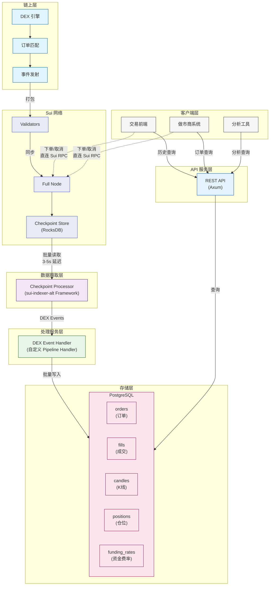
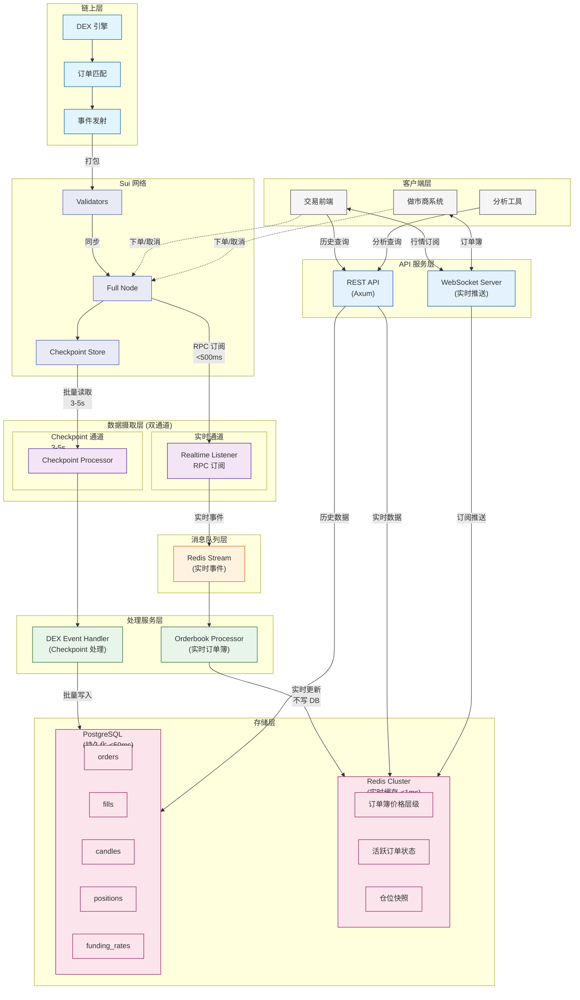

# Sui DEX Indexer 架构 v3 (分阶段实施)

> 分阶段实施策略：Phase 1 功能验证，Phase 2 体验优化

## 版本说明

| 版本 | 存储层 | 数据摄取 | 延迟 | 适用场景 |
|------|--------|---------|------|---------|
| v2 | Redis + PostgreSQL | 双通道 | <500ms | 完整方案 |
| **v3 Phase 1** | **仅 PostgreSQL** | **仅 Checkpoint** | **3-5s** | **MVP 验证** |
| v3 Phase 2 | Redis + PostgreSQL | 双通道 | <500ms | 生产部署 |

## 设计理念

### 分阶段实施的优势

1. **Phase 1 快速验证**：与 sui-indexer-alt 架构一致，复用成熟方案
2. **Phase 2 按需扩展**：根据实际需求添加实时层
3. **渐进式复杂度**：避免过早优化

### 核心决策

| 决策点 | Phase 1 | Phase 2 | 理由 |
|--------|---------|---------|------|
| 实时缓存 | ❌ 不用 | ✅ Redis | Phase 1 功能优先 |
| 消息队列 | ❌ 不用 | ✅ Redis Stream | Phase 1 直接写 DB |
| WebSocket | ❌ 不用 | ✅ 实时推送 | Phase 1 仅 REST |
| 订单簿聚合 | ❌ 不用 | ✅ 内存聚合 | Phase 1 查询聚合 |

---

# Phase 1: Checkpoint-Only 架构

> 目标：最小可行架构，功能完整，与 sui-indexer-alt 保持一致

## Phase 1 架构全景图



## Phase 1 关键数据流

```
┌─────────────────────────────────────────────────────────────────────┐
│                    Phase 1 数据流 (单通道)                           │
├─────────────────────────────────────────────────────────────────────┤
│                                                                      │
│  Sui Full Node                                                       │
│       │                                                              │
│       │ 同步 Checkpoint                                              │
│       ▼                                                              │
│  Checkpoint Store (RocksDB)                                          │
│       │                                                              │
│       │ 批量读取 (每 Checkpoint)                                     │
│       ▼                                                              │
│  ┌─────────────────────────────────────────┐                        │
│  │  Checkpoint Processor                    │                        │
│  │  (sui-indexer-alt Framework)            │                        │
│  │                                          │                        │
│  │  - 解析 Checkpoint 数据                  │                        │
│  │  - 提取 DEX 相关事件                     │                        │
│  │  - 调用 DEX Handler                      │                        │
│  └─────────────────┬───────────────────────┘                        │
│                    │                                                  │
│                    │ DEX Events                                       │
│                    ▼                                                  │
│  ┌─────────────────────────────────────────┐                        │
│  │  DEX Event Handler                       │                        │
│  │  (自定义 Pipeline Handler)              │                        │
│  │                                          │                        │
│  │  - OrderPlaced → orders 表               │                        │
│  │  - OrderMatched → fills 表 + K线更新     │                        │
│  │  - OrderCanceled → orders 状态更新       │                        │
│  │  - PositionChanged → positions 表        │                        │
│  │  - FundingPaid → funding_rates 表        │                        │
│  └─────────────────┬───────────────────────┘                        │
│                    │                                                  │
│                    │ 批量写入 (COPY/Batch INSERT)                    │
│                    ▼                                                  │
│  ┌─────────────────────────────────────────┐                        │
│  │  PostgreSQL                              │                        │
│  │                                          │                        │
│  │  延迟: ~3-5s (从链上事件到可查询)        │                        │
│  └─────────────────────────────────────────┘                        │
│                                                                      │
└─────────────────────────────────────────────────────────────────────┘
```

## Phase 1 组件说明

### 1. Checkpoint Processor

**复用 sui-indexer-alt Framework**，实现自定义 DEX Handler。

```rust
// 伪代码: DEX Handler 实现
pub struct DexHandler {
    pg_pool: PgPool,
}

#[async_trait]
impl Handler for DexHandler {
    type Value = DexEvent;

    fn name(&self) -> &str {
        "dex_events"
    }

    async fn process(&mut self, checkpoint: &CheckpointData) -> Result<Vec<DexEvent>> {
        let mut events = Vec::new();

        for tx in &checkpoint.transactions {
            for event in &tx.events {
                if let Some(dex_event) = self.parse_dex_event(event)? {
                    events.push(dex_event);
                }
            }
        }

        Ok(events)
    }

    async fn commit(&mut self, events: Vec<DexEvent>) -> Result<()> {
        // 批量写入 PostgreSQL
        self.batch_insert_events(&events).await
    }
}
```

### 2. DEX Event Types

```rust
pub enum DexEvent {
    OrderPlaced {
        order_id: String,
        market_id: String,
        owner: String,
        side: Side,
        price: Decimal,
        quantity: Decimal,
        order_type: OrderType,
        tx_digest: String,
        checkpoint_seq: u64,
        timestamp: DateTime<Utc>,
    },
    OrderMatched {
        fill_id: u64,
        market_id: String,
        maker_order_id: String,
        taker_order_id: String,
        price: Decimal,
        quantity: Decimal,
        tx_digest: String,
        checkpoint_seq: u64,
        timestamp: DateTime<Utc>,
    },
    OrderCanceled {
        order_id: String,
        reason: CancelReason,
        tx_digest: String,
        checkpoint_seq: u64,
        timestamp: DateTime<Utc>,
    },
    PositionChanged {
        owner: String,
        market_id: String,
        size: Decimal,
        entry_price: Decimal,
        margin: Decimal,
        tx_digest: String,
        checkpoint_seq: u64,
        timestamp: DateTime<Utc>,
    },
    FundingPaid {
        market_id: String,
        rate: Decimal,
        mark_price: Decimal,
        index_price: Decimal,
        checkpoint_seq: u64,
        timestamp: DateTime<Utc>,
    },
}
```

## Phase 1 数据模型

### 订单表 (orders)

```sql
CREATE TABLE orders (
    id TEXT PRIMARY KEY,
    market_id TEXT NOT NULL,
    owner TEXT NOT NULL,
    side TEXT NOT NULL,
    order_type TEXT NOT NULL,
    time_in_force TEXT NOT NULL DEFAULT 'GTC',
    price NUMERIC(38, 18) NOT NULL,
    quantity NUMERIC(38, 18) NOT NULL,
    filled_quantity NUMERIC(38, 18) NOT NULL DEFAULT 0,
    status TEXT NOT NULL,
    reduce_only BOOLEAN NOT NULL DEFAULT FALSE,
    tx_digest TEXT NOT NULL,
    checkpoint_sequence BIGINT NOT NULL,
    created_at TIMESTAMPTZ NOT NULL,
    updated_at TIMESTAMPTZ NOT NULL
);

CREATE INDEX idx_orders_owner_status ON orders (owner, status, created_at DESC);
CREATE INDEX idx_orders_market_status ON orders (market_id, status);
CREATE INDEX idx_orders_checkpoint ON orders (checkpoint_sequence);
```

### 成交表 (fills) - 按天分区

```sql
CREATE TABLE fills (
    id BIGSERIAL,
    market_id TEXT NOT NULL,
    tx_digest TEXT NOT NULL,
    maker_order_id TEXT NOT NULL,
    taker_order_id TEXT NOT NULL,
    maker_address TEXT NOT NULL,
    taker_address TEXT NOT NULL,
    side TEXT NOT NULL,
    price NUMERIC(38, 18) NOT NULL,
    quantity NUMERIC(38, 18) NOT NULL,
    quote_quantity NUMERIC(38, 18) NOT NULL,
    maker_fee NUMERIC(38, 18) NOT NULL,
    taker_fee NUMERIC(38, 18) NOT NULL,
    checkpoint_sequence BIGINT NOT NULL,
    created_at TIMESTAMPTZ NOT NULL,
    PRIMARY KEY (id, created_at)
) PARTITION BY RANGE (created_at);

-- 索引
CREATE INDEX idx_fills_market ON fills (market_id, created_at DESC);
CREATE INDEX idx_fills_maker ON fills (maker_address, created_at DESC);
CREATE INDEX idx_fills_taker ON fills (taker_address, created_at DESC);
```

### K线表 (candles) - 按月分区

```sql
CREATE TABLE candles (
    market_id TEXT NOT NULL,
    resolution TEXT NOT NULL,
    bucket TIMESTAMPTZ NOT NULL,
    open NUMERIC(38, 18) NOT NULL,
    high NUMERIC(38, 18) NOT NULL,
    low NUMERIC(38, 18) NOT NULL,
    close NUMERIC(38, 18) NOT NULL,
    volume NUMERIC(38, 18) NOT NULL,
    quote_volume NUMERIC(38, 18) NOT NULL,
    trade_count INTEGER NOT NULL,
    PRIMARY KEY (market_id, resolution, bucket)
) PARTITION BY RANGE (bucket);

CREATE INDEX idx_candles_bucket_brin ON candles USING BRIN (bucket);
```

### 仓位表 (positions)

```sql
CREATE TABLE perpetual_positions (
    id TEXT PRIMARY KEY,
    owner TEXT NOT NULL,
    market_id TEXT NOT NULL,
    side TEXT NOT NULL,
    status TEXT NOT NULL,
    size NUMERIC(38, 18) NOT NULL,
    entry_price NUMERIC(38, 18) NOT NULL,
    margin NUMERIC(38, 18) NOT NULL,
    leverage NUMERIC(10, 2) NOT NULL,
    unrealized_pnl NUMERIC(38, 18),
    realized_pnl NUMERIC(38, 18) NOT NULL DEFAULT 0,
    liquidation_price NUMERIC(38, 18),
    checkpoint_sequence BIGINT NOT NULL,
    created_at TIMESTAMPTZ NOT NULL,
    updated_at TIMESTAMPTZ NOT NULL,
    closed_at TIMESTAMPTZ
);

CREATE INDEX idx_positions_owner ON perpetual_positions (owner, market_id, status);
```

### 资金费率表 (funding_rates)

```sql
CREATE TABLE funding_rates (
    market_id TEXT NOT NULL,
    rate NUMERIC(38, 18) NOT NULL,
    mark_price NUMERIC(38, 18) NOT NULL,
    index_price NUMERIC(38, 18) NOT NULL,
    checkpoint_sequence BIGINT NOT NULL,
    timestamp TIMESTAMPTZ NOT NULL,
    PRIMARY KEY (market_id, timestamp)
) PARTITION BY RANGE (timestamp);
```

## Phase 1 REST API 端点

| 端点 | 方法 | 数据来源 | 说明 |
|-----|------|---------|------|
| `/v1/markets` | GET | PostgreSQL | 获取市场列表 |
| `/v1/orderbook/{market_id}` | GET | PostgreSQL | **聚合查询**订单簿 |
| `/v1/trades/{market_id}` | GET | PostgreSQL | 获取最近成交 |
| `/v1/candles/{market_id}` | GET | PostgreSQL | 获取K线数据 |
| `/v1/orders` | GET | PostgreSQL | 获取用户订单 |
| `/v1/positions/{address}` | GET | PostgreSQL | 获取用户仓位 |
| `/v1/funding-rates/{market_id}` | GET | PostgreSQL | 获取资金费率历史 |
| `/v1/ticker/{market_id}` | GET | PostgreSQL | 24小时行情统计 |

### 订单簿聚合查询示例

```sql
-- Phase 1: 从 orders 表聚合订单簿 (延迟较高但功能完整)
WITH active_orders AS (
    SELECT
        side,
        price,
        SUM(quantity - filled_quantity) as total_quantity
    FROM orders
    WHERE market_id = $1
      AND status = 'OPEN'
      AND quantity > filled_quantity
    GROUP BY side, price
)
SELECT
    side,
    price,
    total_quantity
FROM active_orders
ORDER BY
    CASE WHEN side = 'BUY' THEN price END DESC,
    CASE WHEN side = 'SELL' THEN price END ASC
LIMIT 100;
```

## Phase 1 功能完整性

| 功能 | 支持 | 延迟 | 说明 |
|------|------|------|------|
| K线查询 | ✅ | 3-5s | 分钟级 K 线完全可接受 |
| 成交历史 | ✅ | 3-5s | 历史查询无延迟要求 |
| 订单历史 | ✅ | 3-5s | 历史查询无延迟要求 |
| 仓位查询 | ✅ | 3-5s | 用户体验可接受 |
| 订单簿 | ✅ | 3-5s | **聚合查询实现** |
| 资金费率 | ✅ | 3-5s | 周期性数据无延迟要求 |
| 实时推送 | ❌ | - | Phase 2 实现 |

---

# Phase 2: 双通道扩展

> 目标：添加实时层，优化用户体验，保持 Phase 1 架构不变

## Phase 2 架构全景图



## Phase 2 新增组件

### 1. Realtime Listener

订阅 Sui Full Node RPC，获取实时交易事件。

```rust
pub struct RealtimeListener {
    sui_client: SuiClient,
    redis_stream: RedisConnection,
}

impl RealtimeListener {
    pub async fn subscribe(&self) -> Result<()> {
        // 订阅 DEX 包的事件
        let filter = EventFilter::Package(DEX_PACKAGE_ID);

        let mut stream = self.sui_client
            .event_api()
            .subscribe_event(filter)
            .await?;

        while let Some(event) = stream.next().await {
            let dex_event = self.parse_event(&event)?;

            // 发送到 Redis Stream
            self.redis_stream.xadd(
                "dex:realtime:events",
                &dex_event,
            ).await?;
        }

        Ok(())
    }
}
```

### 2. Redis 数据结构

```
# 买单价格层级 (Sorted Set)
Key: dex:orderbook:{market_id}:bids
Score: price
Value: total_quantity

# 卖单价格层级 (Sorted Set)
Key: dex:orderbook:{market_id}:asks
Score: price
Value: total_quantity

# 活跃订单 (Hash)
Key: dex:orders:{order_id}
Fields: market_id, owner, side, price, quantity, filled_quantity, status

# 用户订单索引 (Set)
Key: dex:user_orders:{address}
Value: [order_id, ...]

# 仓位快照 (Hash)
Key: dex:positions:{address}:{market_id}
Fields: size, entry_price, margin, unrealized_pnl
```

### 3. WebSocket 推送

| 频道 | 数据来源 | 推送内容 |
|------|---------|---------|
| `orderbook:{market_id}` | Redis | 订单簿增量更新 |
| `trades:{market_id}` | Redis Stream | 实时成交 |
| `orders:{address}` | Redis | 用户订单状态 |
| `positions:{address}` | Redis | 仓位变更 |

## Phase 2 数据存储职责

| 数据类型 | 实时数据 (Redis) | 持久化 (PostgreSQL) |
|---------|-----------------|-------------------|
| 订单簿价格层级 | ✅ 实时聚合 | ❌ |
| 活跃订单状态 | ✅ 实时更新 | ✅ Checkpoint 写入 |
| 仓位快照 | ✅ 实时计算 | ✅ Checkpoint 写入 |
| K线数据 | ❌ | ✅ Checkpoint 聚合 |
| 成交记录 | ❌ | ✅ Checkpoint 写入 |
| 资金费率 | ❌ | ✅ Checkpoint 写入 |
| 历史订单 | ❌ | ✅ 长期存储 |

**关键设计**：
- **Redis 数据可重建**：实时数据丢失后可从 PostgreSQL 重建
- **PostgreSQL 为权威数据源**：所有持久化数据来自 Checkpoint
- **实时数据不写 DB**：避免重复写入和一致性问题

---

# 迁移路径

## Phase 1 → Phase 2 迁移步骤

```
┌─────────────────────────────────────────────────────────────────────┐
│                      Phase 1 → Phase 2 迁移                         │
├─────────────────────────────────────────────────────────────────────┤
│                                                                      │
│  Step 1: 部署 Redis Cluster                                         │
│          └─ 配置高可用，设置内存限制                                 │
│                                                                      │
│  Step 2: 部署 Realtime Listener                                     │
│          └─ 订阅 Sui RPC 事件流                                      │
│          └─ 写入 Redis Stream                                       │
│                                                                      │
│  Step 3: 部署 Orderbook Processor                                   │
│          └─ 消费 Redis Stream                                        │
│          └─ 维护 Redis 订单簿                                        │
│                                                                      │
│  Step 4: 部署 WebSocket Server                                      │
│          └─ 订阅 Redis 变更                                          │
│          └─ 推送给客户端                                             │
│                                                                      │
│  Step 5: 更新 REST API                                              │
│          └─ 实时数据路由到 Redis                                     │
│          └─ 历史数据路由到 PostgreSQL                                │
│                                                                      │
│  ✅ Phase 1 组件保持不变                                            │
│     - Checkpoint Processor 继续运行                                 │
│     - PostgreSQL 继续作为权威数据源                                  │
│                                                                      │
└─────────────────────────────────────────────────────────────────────┘
```

## 向后兼容性

| API 端点 | Phase 1 | Phase 2 | 变化 |
|---------|---------|---------|------|
| `/v1/orderbook` | PostgreSQL 聚合 | Redis 实时 | 数据源切换，接口不变 |
| `/v1/trades` | PostgreSQL | PostgreSQL | 不变 |
| `/v1/candles` | PostgreSQL | PostgreSQL | 不变 |
| `/v1/orders` | PostgreSQL | Redis (活跃) + PG (历史) | 智能路由 |
| `/v1/positions` | PostgreSQL | Redis (实时) | 数据源切换 |

---

# 技术选型对比

| 组件 | v2 双通道 | v3 Phase 1 | v3 Phase 2 |
|-----|----------|------------|------------|
| 数据摄取 | Realtime + Checkpoint | Checkpoint only | Realtime + Checkpoint |
| 消息队列 | Redis Stream + Kafka | 无 (直接写 DB) | Redis Stream |
| 实时缓存 | Redis Cluster | 无 | Redis Cluster |
| 持久化 | PostgreSQL | PostgreSQL | PostgreSQL |
| API 框架 | Axum | Axum | Axum |
| WebSocket | tokio-tungstenite | 无 | tokio-tungstenite |
| **延迟** | <500ms | 3-5s | <500ms |
| **复杂度** | 高 | **低** | 高 |
| **适用场景** | 生产环境 | **MVP 验证** | 生产环境 |

---

# 总结

## 实施建议

1. **Phase 1 优先**：快速验证业务逻辑，3-5s 延迟对 MVP 可接受
2. **监控延迟敏感用户反馈**：根据实际需求决定 Phase 2 时机
3. **Phase 2 增量部署**：不影响 Phase 1 已有服务

## 风险与缓解

| 风险 | Phase 1 | Phase 2 缓解 |
|------|---------|-------------|
| 订单簿延迟影响做市商 | 3-5s 延迟 | Redis 实时聚合 |
| 用户下单后状态延迟 | 3-5s 可见 | WebSocket 推送 |
| 仓位计算延迟 | 3-5s 更新 | Redis 实时计算 |
