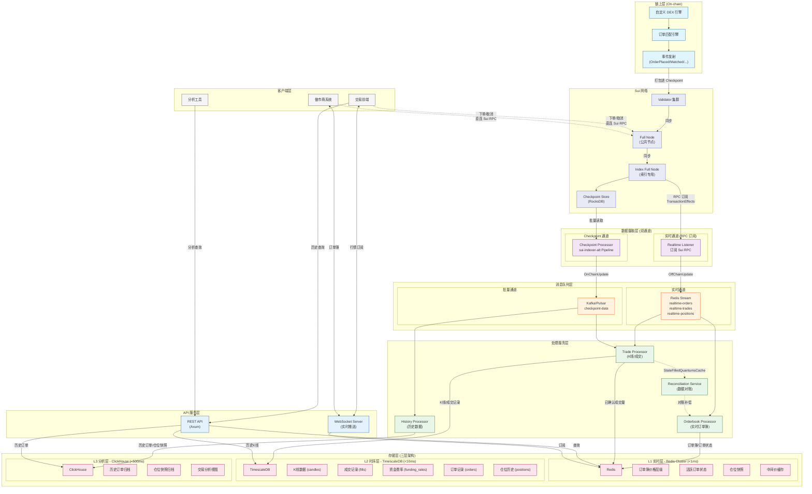

# Sui DEX Indexer 架构结构图

> 基于 `dex-indexer-analyst.md` 文档生成的完整架构图

## 架构全景图



## 图例说明

| 颜色 | 层级 | 说明 |
|------|------|------|
| 浅蓝 (#e1f5fe) | 链上层 | 自定义 DEX 引擎及事件发射 |
| 浅靛 (#e8eaf6) | Sui 网络层 | Validator/Full Node/Index Node/Checkpoint Store |
| 浅紫 | 数据摄取层 | 双通道数据摄取 (实时 RPC 订阅 + Checkpoint) |
| 浅橙 | 消息队列层 | Redis Stream (实时) + Kafka (批量) |
| 浅绿 | 处理服务层 | 各类 Processor 业务处理 |
| 浅粉 | 存储层 | 三层数据库 (Redis/TimescaleDB/ClickHouse) |
| 浅蓝 (#e3f2fd) | API 层 | REST + WebSocket |
| 灰色 | 客户端 | 交易前端/做市商/分析工具 |

## 关键数据流

### 实时通道 (RPC 订阅)
```
Sui RPC → Realtime Listener → Redis Stream → Orderbook Processor → Redis
延迟: <500ms
用途: 订单簿实时更新、活跃订单状态
```

### 批量通道 (Checkpoint)
```
Checkpoint Store → sui-indexer-alt → Kafka → Trade/History Processor → TimescaleDB/ClickHouse
延迟: 3-5s
用途: K线聚合、成交持久化、历史数据
```

### 客户端连接
| 操作 | 连接目标 | 协议 |
|------|----------|------|
| 订阅行情/订单簿 | Indexer WebSocket | WS |
| 查询历史数据 | Indexer REST API | HTTP |
| **下单/取消** | **Sui Full Node RPC** | **HTTP/WS** |

## 数据存储映射

| 数据类型 | 来源通道 | 存储目标 | 用途 |
|---------|---------|---------|------|
| 订单簿价格层级 | 实时通道 | Redis | 实时行情展示 |
| 活跃订单状态 | 实时通道 | Redis | 用户订单查询 |
| 仓位快照 | 实时通道 | Redis | 实时仓位展示 |
| 中间价缓存 | 实时通道 | Redis | 快速价格查询 |
| K线数据 (candles) | Checkpoint | TimescaleDB | 历史K线查询 |
| 成交记录 (fills) | Checkpoint | TimescaleDB | 成交历史 |
| 资金费率 (funding_rates) | Checkpoint | TimescaleDB | 资金费率历史 |
| 订单记录 (orders) | Checkpoint | TimescaleDB | 订单历史 |
| 仓位历史 (positions) | Checkpoint | TimescaleDB | 仓位变更记录 |
| 历史订单归档 | Checkpoint | ClickHouse | 长期存储/分析 |
| 仓位快照归档 | Checkpoint | ClickHouse | 长期存储/分析 |
| 交易分析视图 | Checkpoint | ClickHouse | OLAP 分析 |

## 网络节点说明

| 节点类型 | 用途 | 连接方 |
|---------|------|--------|
| **Full Node (公共节点)** | 接收客户端交易请求 | 交易前端、做市商 |
| **Index Full Node (索引专用)** | 为索引器提供数据 | Realtime Listener |
| **Checkpoint Store** | 存储 Checkpoint 数据 | Checkpoint Processor |
