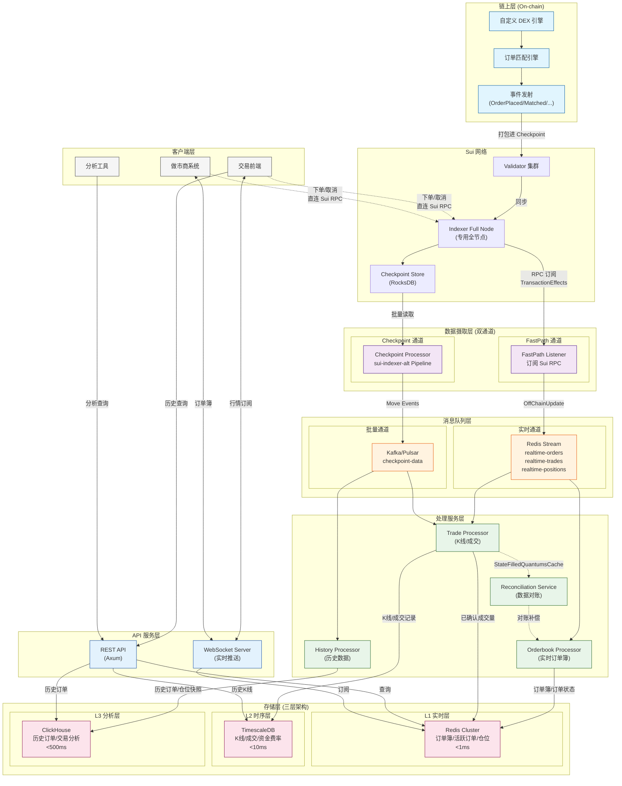

# Sui DEX Indexer 架构结构图

> 基于 `dex-indexer-analyst.md` 文档生成的完整架构图

## 架构全景图



## 图例说明

| 颜色 | 层级 | 说明 |
|------|------|------|
| 浅蓝 | 链上层 | 自定义 DEX 引擎及事件发射 |
| 浅紫 | 数据摄取层 | 双通道数据摄取 (FastPath + Checkpoint) |
| 浅橙 | 消息队列层 | Redis Stream (实时) + Kafka (批量) |
| 浅绿 | 处理服务层 | 各类 Processor 业务处理 |
| 浅粉 | 存储层 | 三层数据库 (Redis/TimescaleDB/ClickHouse) |
| 浅蓝 | API 层 | REST + WebSocket |
| 灰色 | 客户端 | 交易前端/做市商/分析工具 |

## 关键数据流

### 实时通道 (FastPath)
```
Sui RPC → FastPath Listener → Redis Stream → Orderbook Processor → Redis
延迟: <500ms
用途: 订单簿实时更新、活跃订单状态
```

### 批量通道 (Checkpoint)
```
Checkpoint Store → sui-indexer-alt → Kafka → Trade/History Processor → TimescaleDB/ClickHouse
延迟: 3-5s
用途: K线聚合、成交持久化、历史数据
```

### 客户端连接
| 操作 | 连接目标 | 协议 |
|------|----------|------|
| 订阅行情/订单簿 | Indexer WebSocket | WS |
| 查询历史数据 | Indexer REST API | HTTP |
| **下单/取消** | **Sui Full Node RPC** | **HTTP/WS** |
