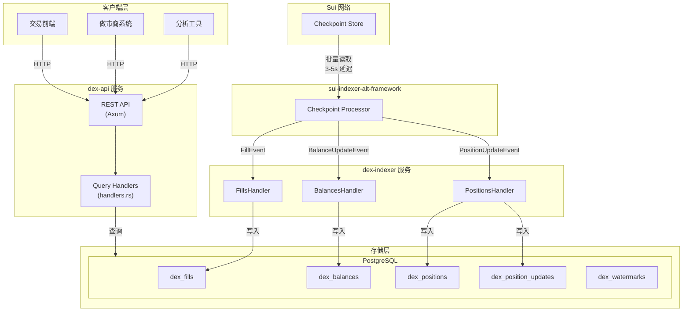
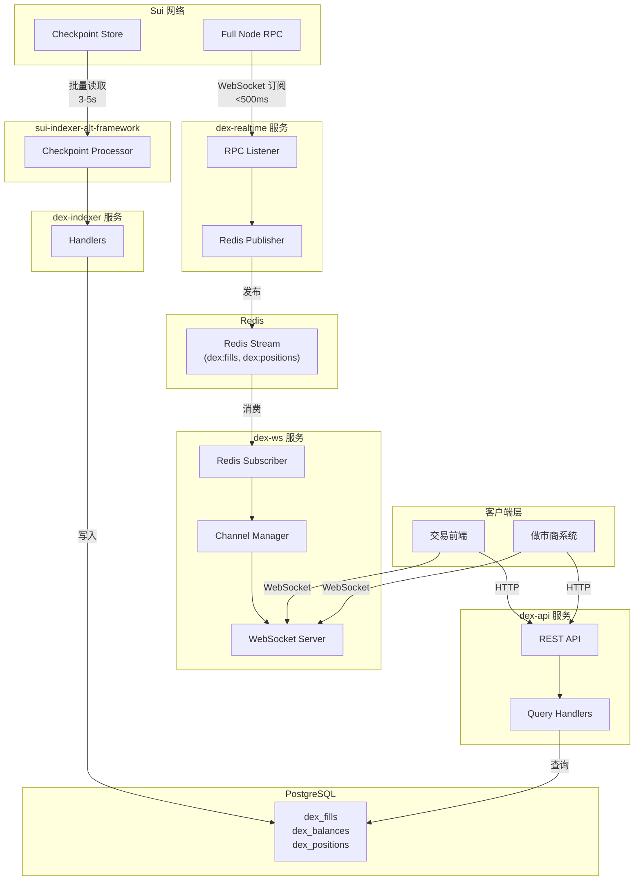

# Sui DEX Indexer 架构 v4 (模块分离)

> 基于 V3 架构 + 模块分离设计
> 创建日期: 2026-02-03

## 版本说明

| 版本 | 模块结构 | 存储层 | 数据摄取 | 延迟 |
|------|----------|--------|---------|------|
| v3 | 单一 crate | PostgreSQL | Checkpoint | 3-5s |
| **v4 Phase 1** | **dex-indexer + dex-api** | **PostgreSQL** | **Checkpoint** | **3-5s** |
| v4 Phase 2 | + dex-realtime + dex-ws | + Redis | 双通道 | <500ms |

## 设计理念

### 模块分离的优势

1. **职责单一**：每个服务专注一件事
2. **独立部署**：可按需扩展各服务
3. **故障隔离**：一个服务异常不影响其他
4. **技术栈独立**：各服务可选用最适合的技术

### 核心决策

| 决策点 | 选择 | 理由 |
|--------|------|------|
| REST + WS | 拆分两个 crate | 避免长连接/短连接资源竞争 |
| handlers + realtime | 拆分两个 crate | 故障隔离，独立扩展 |
| 共享类型 | 不创建 dex-types | 事件在 sui-types，API 类型各自定义 |
| schema 位置 | 保留在 dex-indexer | dex-api 依赖 dex-indexer |

---

# Phase 1: 双模块架构

> 目标：分离 indexer 和 api，保持功能不变

## Phase 1 模块结构

```
dex-sui/crates/
├── dex-indexer/         # Checkpoint 索引服务
│   └── src/
│       ├── lib.rs
│       ├── main.rs      # dex-indexer 二进制
│       ├── schema/      # 数据库定义
│       │   ├── mod.rs
│       │   └── stored_types.rs
│       └── handlers/    # 事件处理
│           ├── mod.rs
│           ├── fills.rs
│           ├── balances.rs
│           └── positions.rs
│
└── dex-api/             # REST API 服务
    └── src/
        ├── lib.rs
        ├── main.rs      # dex-api 二进制
        ├── types.rs     # API 类型
        ├── server.rs    # Axum 服务器
        └── handlers.rs  # 查询处理
```

## Phase 1 架构图



## Phase 1 依赖关系

```
    sui-types
        │
    dex-indexer
        │
    dex-api
```

## Phase 1 数据流

```
Sui Checkpoint ──► dex-indexer ──► PostgreSQL ──► dex-api
                                                     │
                                                REST 客户端
```

---

# Phase 2: 四模块架构

> 目标：添加实时通道，支持 WebSocket 推送

## Phase 2 模块结构

```
dex-sui/crates/
├── dex-indexer/         # (不变)
├── dex-api/             # REST API (不变)
│
├── dex-realtime/        # 实时事件采集
│   └── src/
│       ├── lib.rs
│       ├── main.rs
│       ├── listener.rs  # Sui RPC 订阅
│       └── publisher.rs # Redis Stream 发布
│
└── dex-ws/              # WebSocket 推送服务
    └── src/
        ├── lib.rs
        ├── main.rs
        ├── types.rs     # 订阅/消息类型
        ├── server.rs    # WebSocket 服务器
        ├── channels.rs  # 订阅频道管理
        └── subscriber.rs # Redis 订阅消费
```

## Phase 2 架构图



## Phase 2 依赖关系

```
    sui-types
        │
        ├─────────────────────┐
        │                     │
    dex-indexer           dex-realtime
        │                     │
        │                Redis Stream
        │                     │
        ├─────────────────────┤
        │                     │
    dex-api               dex-ws
  (PostgreSQL)           (Redis)
```

## Phase 2 数据流

```
Sui Node
    │
    ├── RPC 订阅 ──► dex-realtime ──► Redis Stream ──► dex-ws
    │   (<500ms)                                         │
    │                                              WebSocket 客户端
    │
    └── Checkpoint ──► dex-indexer ──► PostgreSQL ──► dex-api
        (3-5s)                                           │
                                                    REST 客户端
```

---

# Phase 3: 缓存优化

> 目标：dex-api 支持 Redis 缓存

## Phase 3 模块结构

```
dex-api/
└── src/
    ├── ...
    └── cache/           # 新增
        ├── mod.rs
        ├── client.rs    # Redis 客户端
        └── queries.rs   # 缓存查询
```

## Phase 3 数据流

```
dex-realtime ──► Redis Stream
                      │
              ┌───────┴───────┐
              │               │
          dex-ws         dex-api/cache
                              │
                          dex-api
                              │
              ┌───────────────┴───────────────┐
              │                               │
         Redis (热数据)               PostgreSQL (历史数据)
```

## 缓存策略

| 数据类型 | 优先数据源 | 回退数据源 | 说明 |
|---------|-----------|-----------|------|
| 订单簿 | Redis | PostgreSQL 聚合 | 实时要求高 |
| 活跃订单 | Redis | PostgreSQL | 状态频繁变化 |
| 仓位快照 | Redis | PostgreSQL | 实时计算 |
| 成交历史 | PostgreSQL | - | 历史数据 |
| K线数据 | PostgreSQL | - | 批量聚合 |

---

## 各模块职责总结

| 模块 | 职责 | 阶段 | 依赖 |
|------|------|------|------|
| **dex-indexer** | Checkpoint 处理 → PostgreSQL | P1 | sui-indexer-alt-framework |
| **dex-api** | REST API、DB 查询 | P1 | dex-indexer (schema) |
| **dex-realtime** | RPC 监听 → Redis | P2 | sui-sdk, redis |
| **dex-ws** | WebSocket 推送 | P2 | tokio-tungstenite, redis |

---

## 部署架构

### Phase 1 部署

```
┌─────────────────────────────────────────────────────────┐
│                    Kubernetes Cluster                    │
├─────────────────────────────────────────────────────────┤
│                                                          │
│  ┌─────────────┐         ┌─────────────────────────┐    │
│  │ dex-indexer │ ──────► │      PostgreSQL         │    │
│  │  (1 replica)│         │    (Primary + Replica)  │    │
│  └─────────────┘         └───────────┬─────────────┘    │
│                                      │                   │
│  ┌─────────────┐                     │                   │
│  │   dex-api   │ ◄───────────────────┘                   │
│  │(N replicas) │                                         │
│  └──────┬──────┘                                         │
│         │                                                │
│  ┌──────▼──────┐                                         │
│  │   Ingress   │                                         │
│  └─────────────┘                                         │
│                                                          │
└─────────────────────────────────────────────────────────┘
```

### Phase 2 部署

```
┌─────────────────────────────────────────────────────────┐
│                    Kubernetes Cluster                    │
├─────────────────────────────────────────────────────────┤
│                                                          │
│  ┌─────────────┐         ┌─────────────────────────┐    │
│  │ dex-indexer │ ──────► │      PostgreSQL         │    │
│  └─────────────┘         └───────────┬─────────────┘    │
│                                      │                   │
│  ┌──────────────┐        ┌───────────▼─────────────┐    │
│  │ dex-realtime │ ─────► │        Redis            │    │
│  └──────────────┘        │    (Cluster Mode)       │    │
│                          └───────────┬─────────────┘    │
│  ┌─────────────┐                     │                   │
│  │   dex-api   │ ◄───────────────────┤                   │
│  │(N replicas) │                     │                   │
│  └──────┬──────┘                     │                   │
│         │                            │                   │
│  ┌──────┴──────┐         ┌───────────▼─────────────┐    │
│  │   dex-ws    │ ◄───────│     Redis Stream        │    │
│  │(M replicas) │         └─────────────────────────┘    │
│  └──────┬──────┘                                         │
│         │                                                │
│  ┌──────▼──────┐                                         │
│  │   Ingress   │                                         │
│  │ (HTTP + WS) │                                         │
│  └─────────────┘                                         │
│                                                          │
└─────────────────────────────────────────────────────────┘
```
