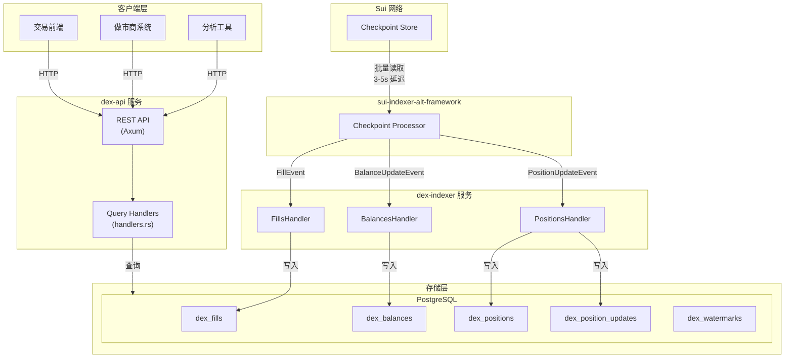
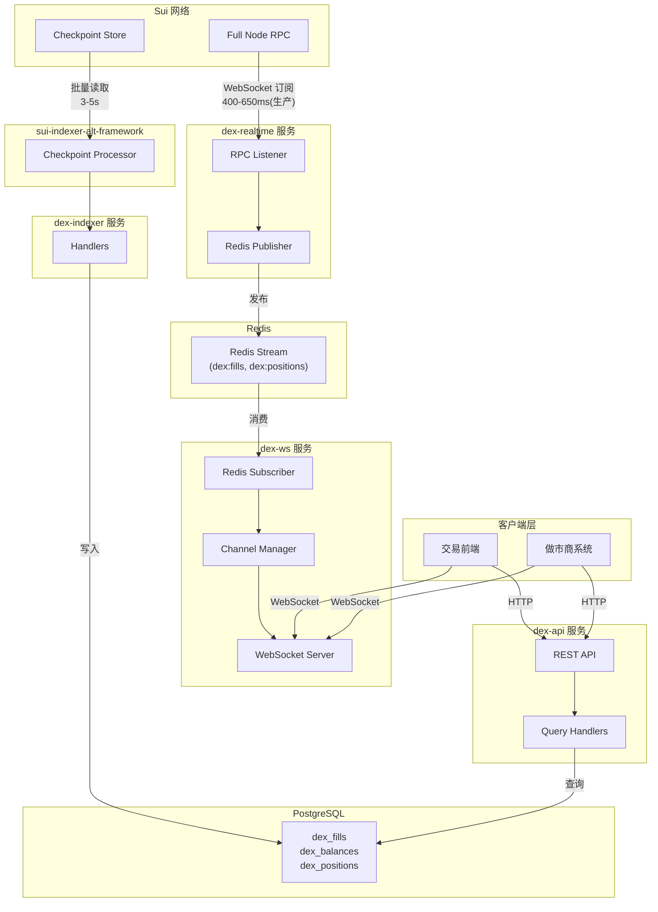

# Sui DEX Indexer 架构 v4 (模块分离)

> 基于 V3 架构 + 模块分离设计
> 创建日期: 2026-02-03
> 更新日期: 2026-02-05 (链上订单簿快照推送方案)

## 参考文档

| 文档 | 路径 | 说明 |
|------|------|------|
| Phase 2 分析总结 | `sui/mynotes/dex/analyst/phase2_realtime/01-phase2-analysis-summary.md` | 缺失项分析、方案总结 |
| Sui RPC 订阅指南 | `sui/mynotes/dex/analyst/phase2_realtime/02-sui-rpc-subscription-guide.md` | 订阅 API、代码示例 |
| dYdX 参考分析 | `sui/mynotes/dex/analyst/phase2_realtime/03-dydx-streaming-reference.md` | MemClob、快照机制 |
| 设计决策记录 | `sui/mynotes/dex/analyst/phase2_realtime/04-design-decisions.md` | 技术选型理由 |
| 事件定义规范 | `sui/mynotes/dex/analyst/phase2_realtime/05-event-definitions.md` | 事件结构详解 |
| 实施清单 | `sui/mynotes/dex/analyst/phase2_realtime/06-implementation-checklist.md` | 文件清单、测试清单 |

## 版本说明

| 版本 | 模块结构 | 存储层 | 数据摄取 | 延迟 |
|------|----------|--------|---------|------|
| v3 | 单一 crate | PostgreSQL | Checkpoint | 3-5s |
| **v4 Phase 1** | **dex-indexer + dex-api** | **PostgreSQL** | **Checkpoint** | **3-5s** |
| v4 Phase 2 | + dex-realtime + dex-ws | + Redis | 双通道 | 400-650ms (生产) |

## 设计理念

### 模块分离的优势

1. **职责单一**：每个服务专注一件事
2. **独立部署**：可按需扩展各服务
3. **故障隔离**：一个服务异常不影响其他
4. **技术栈独立**：各服务可选用最适合的技术

### 核心决策

| 决策点 | 选择 | 理由 |
|--------|------|------|
| REST + WS | 拆分两个 crate | 避免长连接/短连接资源竞争 |
| handlers + realtime | 拆分两个 crate | 故障隔离，独立扩展 |
| 共享类型 | **dex-types crate** | API 类型、子账户工具共享，便于测试验证 |
| schema 位置 | 保留在 dex-indexer | dex-api 依赖 dex-indexer |

---

# Phase 1: 双模块架构

> 目标：分离 indexer 和 api，保持功能不变

## Phase 1 模块结构

```
dex-sui/crates/
├── dex-types/           # [新增] 共享类型定义
│   └── src/
│       ├── lib.rs
│       ├── common/
│       │   └── subaccount.rs   # 子账户解析工具
│       └── api/
│           ├── requests.rs     # API 请求类型
│           └── responses.rs    # API 响应类型
│
├── dex-indexer/         # Checkpoint 索引服务
│   └── src/
│       ├── lib.rs
│       ├── main.rs      # dex-indexer 二进制
│       ├── schema/      # 数据库定义
│       │   ├── mod.rs
│       │   └── stored_types.rs
│       └── handlers/    # 事件处理
│           ├── mod.rs
│           ├── fills.rs
│           ├── balances.rs
│           └── positions.rs
│
├── dex-api/             # REST API 服务
│   └── src/
│       ├── lib.rs
│       ├── main.rs      # dex-api 二进制
│       ├── types.rs     # 重导出 dex-types
│       ├── server.rs    # Axum 服务器
│       └── handlers.rs  # 查询处理
│
└── dex-node-test/       # [扩展] 节点测试工具
    └── src/
        ├── lib.rs
        ├── client.rs        # DEX 客户端
        ├── config.rs        # 配置（包含 api_url）
        └── api_client.rs    # [新增] API 验证客户端
```

## Phase 1 架构图



## Phase 1 依赖关系

```
    sui-types         dex-types
        │                 │
        │    ┌────────────┼────────────┐
        │    │            │            │
        ▼    ▼            ▼            ▼
    dex-indexer      dex-api     dex-node-test
        │
        └──────► dex-api (schema)
```

**dex-types 职责**：
- 子账户解析工具（ParsedSubaccount, parse_subaccount, build_subaccount）
- API 请求/响应类型（InfoRequest, FillResponse, BalanceResponse 等）
- 轻量依赖（仅 serde, hex, tracing）

## Phase 1 数据流

```
Sui Checkpoint ──► dex-indexer ──► PostgreSQL ──► dex-api
                                                     │
                                                REST 客户端
```

---

# Phase 2: 四模块架构

> 目标：添加实时通道，支持 WebSocket 推送

## Phase 2 模块结构

```
dex-sui/crates/
├── dex-indexer/         # (扩展：新增 Orders Handler)
│   └── src/handlers/
│       └── orders.rs    # [新增] 处理 OrderPlaced/Removed 事件
│
├── dex-api/             # REST API (扩展：新增查询接口)
│
├── dex-realtime/        # [新增] 实时事件采集与聚合
│   └── src/
│       ├── lib.rs
│       ├── main.rs
│       ├── config.rs       # 配置（RPC、Redis、重连策略）
│       ├── listener.rs     # Sui RPC 事件订阅
│       ├── publisher.rs    # Redis Stream/Hash 发布
│       ├── candles.rs      # K 线聚合（多周期）
│       └── market_stats.rs # 市场统计（24h 成交量等）
│       # 注：orderbook.rs 和 recovery.rs 已删除
│       # 订单簿快照直接从链上 OrderbookSnapshotEvent 获取
│
└── dex-ws/              # [新增] WebSocket 推送服务
    └── src/
        ├── lib.rs
        ├── main.rs
        ├── config.rs       # 配置
        ├── types.rs        # 订阅/消息类型
        ├── server.rs       # WebSocket 服务器
        ├── channels.rs     # 订阅频道管理
        └── subscriber.rs   # Redis Stream 消费
```

### dex-realtime 核心职责

| 模块 | 职责 |
|------|------|
| listener.rs | 订阅 sui_subscribeEvent，接收 *EventV1 事件 |
| publisher.rs | 将事件发布到 Redis Stream，订单簿快照直接写入 Redis Hash |
| candles.rs | 基于 FillEventV1 聚合 K 线（1m/5m/15m/1h/4h/1d） |
| market_stats.rs | 计算中间价、24h 成交量、未平仓量等 |

> **架构简化说明**：订单簿数据采用「链上内存订单簿快照推送」方案，dex-realtime 直接消费链上 `OrderbookSnapshotEvent`，无需本地维护订单簿状态，也无需启动恢复逻辑。详见 [设计决策文档](../../../sui/mynotes/dex/analyst/phase2_realtime/04-design-decisions.md)。

## Phase 2 架构图



## Phase 2 依赖关系

```
    sui-types
        │
        ├─────────────────────┐
        │                     │
    dex-indexer           dex-realtime
        │                     │
        │                Redis Stream
        │                     │
        ├─────────────────────┤
        │                     │
    dex-api               dex-ws
  (PostgreSQL)           (Redis)
```

## Phase 2 数据流

```
Sui Node
    │
    ├── RPC 订阅 ──► dex-realtime ──► Redis Stream ──► dex-ws
    │  (400-650ms)       │                               │
    │                    ├─► OrderbookSnapshotEvent ──► Redis Hash (直接写入)
    │                    ├─► K 线聚合 ──► Redis         │
    │                    └─► 市场统计 ──► Redis    WebSocket 客户端
    │
    └── Checkpoint ──► dex-indexer ──► PostgreSQL ──► dex-api
        (3-5s)                                           │
                                                    REST 客户端
```

> **订单簿数据流说明**：链上 PerpetualState 内存订单簿每 250ms 发射 `OrderbookSnapshotEvent`，dex-realtime 直接将快照写入 Redis Hash，无需本地构建或维护订单簿状态。

## Phase 2 Redis 存储结构

### Stream（事件流）

| Key | 消息类型 | TTL | 说明 |
|-----|----------|-----|------|
| `dex:stream:fills` | FillEventV1 | 1h | 成交事件流 |
| `dex:stream:orders` | OrderPlaced/RemovedEventV1 | 1h | 订单变化流 |
| `dex:stream:positions` | PositionUpdateEventV1 | 1h | 持仓变化流 |
| `dex:stream:liquidations` | LiquidationEventV1 | 1h | 清算事件流 |

### Hash（状态数据）

| Key | Fields | 说明 |
|-----|--------|------|
| `dex:orderbook:{perpetual_id}` | bids, asks, best_bid, best_ask, stats, sequence_number, updated_at | 链上订单簿快照（来自 OrderbookSnapshotEvent） |
| `dex:market:{perpetual_id}` | mid_px, best_bid, best_ask, volume_24h, open_interest | 市场统计 |
| `dex:candle:{perpetual_id}:{interval}` | current, updated_at | 当前 K 线 |

> **订单簿快照来源**：`dex:orderbook:{perpetual_id}` 数据直接来自链上 `OrderbookSnapshotEvent`（每 250ms 发射），dex-realtime 仅做格式转换后写入 Redis，不进行本地构建。

### Sorted Set（排序数据）

| Key | Score | 说明 |
|-----|-------|------|
| `dex:trades:{perpetual_id}` | timestamp | 最近成交（保留 1000 条） |
| `dex:candles:{perpetual_id}:{interval}` | timestamp | K 线历史（保留 500 条） |

---

# Phase 3: 缓存优化

> 目标：dex-api 支持 Redis 缓存

## Phase 3 模块结构

```
dex-api/
└── src/
    ├── ...
    └── cache/           # 新增
        ├── mod.rs
        ├── client.rs    # Redis 客户端
        └── queries.rs   # 缓存查询
```

## Phase 3 数据流

```
dex-realtime ──► Redis Stream
                      │
              ┌───────┴───────┐
              │               │
          dex-ws         dex-api/cache
                              │
                          dex-api
                              │
              ┌───────────────┴───────────────┐
              │                               │
         Redis (热数据)               PostgreSQL (历史数据)
```

## 缓存策略

### 数据源分类

| 分类 | 数据类型 | 数据源 | 合并 | 说明 |
|------|---------|--------|:----:|------|
| **仅 Redis** | 订单簿快照 | Redis | ❌ | 实时状态，历史无意义 |
| | 中间价/BBO | Redis | ❌ | 实时行情 |
| | 市场统计 | Redis | ❌ | 24h 成交量等聚合值 |
| **仅 PostgreSQL** | 用户成交历史 | PostgreSQL | ❌ | 完整性优先 |
| | 余额/转账历史 | PostgreSQL | ❌ | 完整性优先 |
| **需合并** | 最近成交 | Redis + PG | ✅ | 实时 + 历史补充 |
| | K 线数据 | Redis + PG | ✅ | 当前周期 + 历史 |
| | 用户持仓 | Redis 优先 | ⚠️ | 回退到 PostgreSQL |

### 合并策略

**数据来源差异**：
- **Redis**：dex-realtime RPC 实时订阅（延迟 ~200ms）
- **PostgreSQL**：dex-indexer Checkpoint（延迟 ~2-3s）

**合并逻辑**：

| 数据类型 | 合并策略 |
|----------|----------|
| 最近成交 | Redis 取最新 N 条 → 不足时 PostgreSQL 补充 → 按时间排序去重 |
| K 线 | 历史（已完结周期）从 PG + 当前周期从 Redis → 按时间边界合并 |
| 用户持仓 | Redis 优先 → 用 cp_sequence_number 判断新鲜度 → 过期回退 PG |

**一致性保障**：
- 时间戳边界（updated_at）
- Checkpoint 序列号（cp_sequence_number）
- TTL 过期机制
- tx_digest 去重

> 详细实现见 `plan/dex-indexer-implementation-plan-latest.md` Phase 3

---

## 各模块职责总结

| 模块 | 职责 | 阶段 | 依赖 |
|------|------|------|------|
| **dex-indexer** | Checkpoint 处理 → PostgreSQL | P1 | sui-indexer-alt-framework |
| **dex-api** | REST API、DB 查询 | P1 | dex-indexer (schema) |
| **dex-realtime** | RPC 监听 + 订单簿维护 + K线聚合 → Redis | P2 | sui-sdk, redis, diesel |
| **dex-ws** | WebSocket 推送 | P2 | tokio-tungstenite, redis |

### Phase 2 技术选型

| 决策项 | 选择 | 理由 |
|--------|------|------|
| 订阅 API | sui_subscribeEvent | 细粒度事件过滤，数据量小 |
| 消息队列 | Redis Stream | 轻量，支持持久化和消费者组，与缓存复用 |
| 节点连接（MVP） | Full Node 标准订阅 | 快速验证，延迟 2-4s |
| 节点连接（生产） | **Validator + 同机器索引节点** | 延迟 400-650ms，安全性高 |
| 订单簿维护 | **链上内存订单簿快照推送（方案 A - 复用 Sui Event）** | 链下逻辑极简，状态绝对一致，无需启动恢复 |
| 事件命名 | 统一 *EventV1 格式 | 同一事件服务双通道，简化维护 |

> 节点连接策略详见 `sui/mynotes/dex/analyst/phase2_realtime/08-realtime-latency-analysis.md`

### Phase 2 新增事件

| 事件 | 用途 | 双通道 |
|------|------|--------|
| OrderPlacedEventV1 | 订单进入订单簿 | dex-indexer + dex-realtime |
| OrderRemovedEventV1 | 订单移除（取消/成交/清算） | dex-indexer + dex-realtime |
| **OrderbookSnapshotEvent** | 链上订单簿全量快照（每 250ms） | dex-realtime only |

> **OrderbookSnapshotEvent 说明**：链上 PerpetualState 内存订单簿每 250ms 发射一次全量快照，包含 100 档买卖盘、最佳价格、统计信息等。dex-realtime 直接消费并写入 Redis，无需本地构建订单簿。
>
> 详细事件定义见 `sui/mynotes/dex/analyst/phase2_realtime/05-event-definitions.md`

---

## 部署架构

### Phase 1 部署

```
┌─────────────────────────────────────────────────────────┐
│                    Kubernetes Cluster                    │
├─────────────────────────────────────────────────────────┤
│                                                          │
│  ┌─────────────┐         ┌─────────────────────────┐    │
│  │ dex-indexer │ ──────► │      PostgreSQL         │    │
│  │  (1 replica)│         │    (Primary + Replica)  │    │
│  └─────────────┘         └───────────┬─────────────┘    │
│                                      │                   │
│  ┌─────────────┐                     │                   │
│  │   dex-api   │ ◄───────────────────┘                   │
│  │(N replicas) │                                         │
│  └──────┬──────┘                                         │
│         │                                                │
│  ┌──────▼──────┐                                         │
│  │   Ingress   │                                         │
│  └─────────────┘                                         │
│                                                          │
└─────────────────────────────────────────────────────────┘
```

### Phase 2 部署

```
┌─────────────────────────────────────────────────────────┐
│                    Kubernetes Cluster                    │
├─────────────────────────────────────────────────────────┤
│                                                          │
│  ┌─────────────┐         ┌─────────────────────────┐    │
│  │ dex-indexer │ ──────► │      PostgreSQL         │    │
│  └─────────────┘         └───────────┬─────────────┘    │
│                                      │                   │
│  ┌──────────────┐        ┌───────────▼─────────────┐    │
│  │ dex-realtime │ ─────► │        Redis            │    │
│  └──────────────┘        │    (Cluster Mode)       │    │
│                          └───────────┬─────────────┘    │
│  ┌─────────────┐                     │                   │
│  │   dex-api   │ ◄───────────────────┤                   │
│  │(N replicas) │                     │                   │
│  └──────┬──────┘                     │                   │
│         │                            │                   │
│  ┌──────┴──────┐         ┌───────────▼─────────────┐    │
│  │   dex-ws    │ ◄───────│     Redis Stream        │    │
│  │(M replicas) │         └─────────────────────────┘    │
│  └──────┬──────┘                                         │
│         │                                                │
│  ┌──────▼──────┐                                         │
│  │   Ingress   │                                         │
│  │ (HTTP + WS) │                                         │
│  └─────────────┘                                         │
│                                                          │
└─────────────────────────────────────────────────────────┘
```
