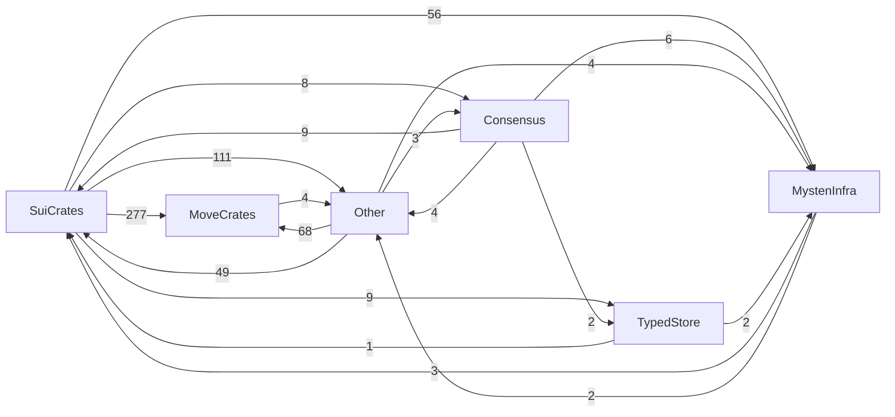
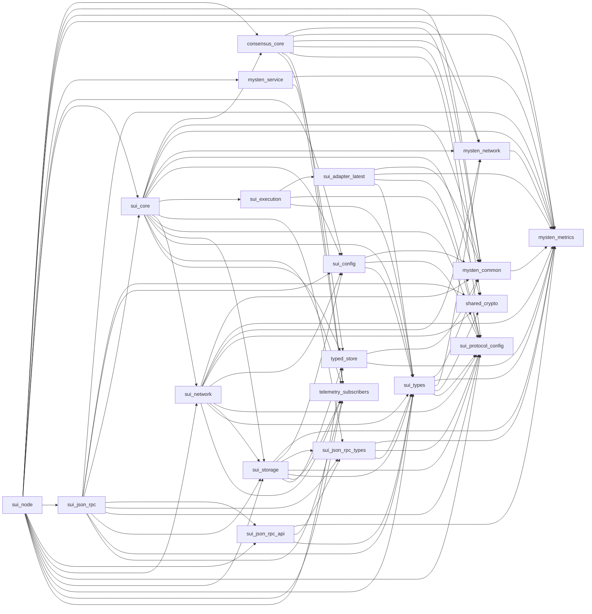
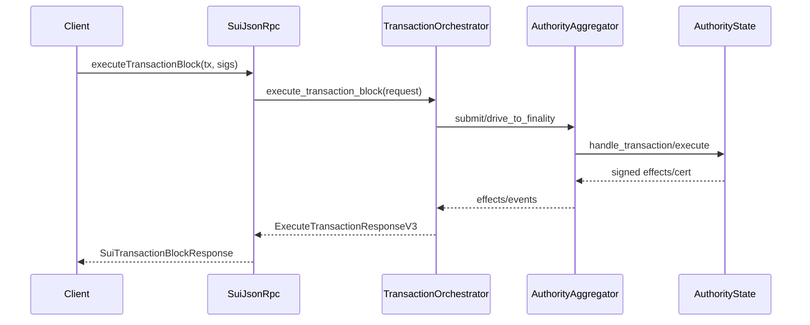
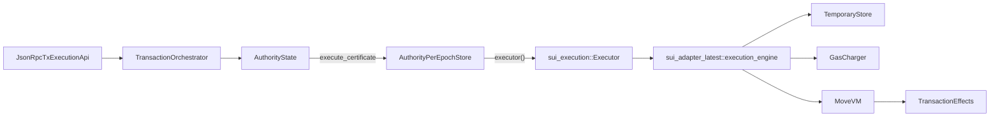
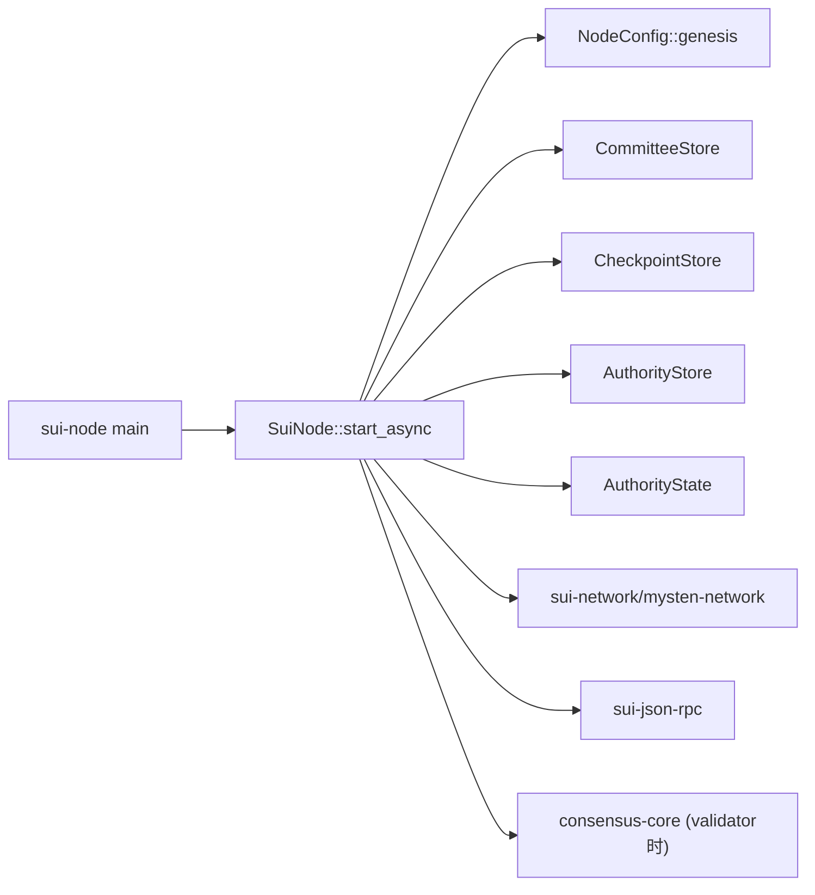

# Sui 模块依赖与调用关系（图解）

> 目标：回答「各模块怎么互相依赖/调用」以及「做 DEX 需要哪些模块」「抽离到能跑节点需要哪些模块」。
>
> 说明：依赖图来自 workspace 内部依赖（crate A 的 `Cargo.toml` 依赖 crate B）。调用关系图来自核心代码路径抽取。

## 1. 分组依赖总览（全仓）

这个图回答：Sui 工程整体依赖主要集中在哪里。数字表示跨组依赖次数（粗粒度统计）。



## 2. 核心模块依赖图（最重要）

覆盖你最关心的链路：`sui-node` / `sui-core` / `sui-types` / `sui-execution` / `sui-storage` / `typed-store` / `consensus-core` / `sui-network` / `sui-json-rpc` 等。



## 3. Sui 家族依赖图（可视化更完整）

为了避免把 Move 生态 70+ crates 一股脑画进来，这里仅展示 `sui-*` / `mysten-*` / `consensus-*` / `typed-store*` 的依赖网络。

```mermaid
flowchart LR
  consensus_config --> mysten_network
  consensus_core --> consensus_config
  consensus_core --> consensus_types
  consensus_core --> mysten_common
  consensus_core --> mysten_metrics
  consensus_core --> mysten_network
  consensus_core --> sui_http
  consensus_core --> sui_macros
  consensus_core --> sui_protocol_config
  consensus_core --> sui_tls
  consensus_core --> typed_store
  consensus_framework --> consensus_config
  consensus_framework --> consensus_core
  consensus_framework --> consensus_types
  consensus_framework --> sui_types
  consensus_simtests --> consensus_config
  consensus_simtests --> consensus_core
  consensus_simtests --> consensus_types
  consensus_simtests --> mysten_metrics
  consensus_simtests --> mysten_network
  consensus_simtests --> sui_config
  consensus_simtests --> sui_macros
  consensus_simtests --> sui_protocol_config
  consensus_simtests --> sui_simulator
  consensus_simtests --> typed_store
  consensus_study --> consensus_config
  consensus_study --> consensus_core
  consensus_study --> consensus_types
  consensus_types --> consensus_config
  mysten_common --> mysten_metrics
  mysten_common --> sui_macros
  mysten_network --> mysten_metrics
  mysten_network --> sui_http
  mysten_network --> sui_tls
  mysten_service --> mysten_metrics
  sui --> mysten_common
  sui --> sui_bridge
  sui --> sui_config
  sui --> sui_data_store
  sui --> sui_execution
  sui --> sui_faucet
  sui --> sui_futures
  sui --> sui_genesis_builder
  sui --> sui_indexer_alt
  sui --> sui_indexer_alt_consistent_store
  sui --> sui_indexer_alt_framework
  sui --> sui_indexer_alt_graphql
  sui --> sui_indexer_alt_reader
  sui --> sui_json
  sui --> sui_json_rpc_types
  sui --> sui_keys
  sui --> sui_macros
  sui --> sui_move
  sui --> sui_move_build
  sui --> sui_package_alt
  sui --> sui_package_management
  sui --> sui_pg_db
  sui --> sui_protocol_config
  sui --> sui_replay_2
  sui --> sui_sdk
  sui --> sui_simulator
  sui --> sui_source_validation
  sui --> sui_swarm
  sui --> sui_swarm_config
  sui --> sui_test_transaction_builder
  sui --> sui_transaction_builder
  sui --> sui_types
  sui_adapter_latest --> mysten_common
  sui_adapter_latest --> mysten_metrics
  sui_adapter_latest --> sui_macros
  sui_adapter_latest --> sui_protocol_config
  sui_adapter_latest --> sui_types
  sui_adapter_transactional_tests --> sui_transactional_test_runner
  sui_adapter_v0 --> sui_macros
  sui_adapter_v0 --> sui_protocol_config
  sui_adapter_v0 --> sui_types
  sui_adapter_v1 --> sui_macros
  sui_adapter_v1 --> sui_protocol_config
  sui_adapter_v1 --> sui_types
  sui_adapter_v2 --> sui_macros
  sui_adapter_v2 --> sui_protocol_config
  sui_adapter_v2 --> sui_types
  sui_analytics_indexer --> mysten_metrics
  sui_analytics_indexer --> sui_analytics_indexer_derive
  sui_analytics_indexer --> sui_futures
  sui_analytics_indexer --> sui_indexer
  sui_analytics_indexer --> sui_indexer_alt_framework
  sui_analytics_indexer --> sui_indexer_alt_framework_store_traits
  sui_analytics_indexer --> sui_indexer_alt_metrics
  sui_analytics_indexer --> sui_indexer_alt_object_store
  sui_analytics_indexer --> sui_json_rpc_types
  sui_analytics_indexer --> sui_package_resolver
  sui_analytics_indexer --> sui_rpc_api
  sui_analytics_indexer --> sui_storage
  sui_analytics_indexer --> sui_types
  sui_analytics_indexer --> typed_store
  sui_authority_aggregation --> mysten_metrics
  sui_authority_aggregation --> sui_types
  sui_aws_orchestrator --> mysten_metrics
  sui_aws_orchestrator --> sui_config
  sui_aws_orchestrator --> sui_swarm_config
  sui_aws_orchestrator --> sui_types
  sui_benchmark --> mysten_metrics
  sui_benchmark --> sui_config
  sui_benchmark --> sui_core
  sui_benchmark --> sui_json_rpc_types
  sui_benchmark --> sui_keys
  sui_benchmark --> sui_move_build
  sui_benchmark --> sui_network
  sui_benchmark --> sui_protocol_config
  sui_benchmark --> sui_sdk
  sui_benchmark --> sui_storage
  sui_benchmark --> sui_surfer
  sui_benchmark --> sui_swarm_config
  sui_benchmark --> sui_test_transaction_builder
  sui_benchmark --> sui_types
  sui_bridge --> mysten_common
  sui_bridge --> mysten_metrics
  sui_bridge --> sui_authority_aggregation
  sui_bridge --> sui_config
  sui_bridge --> sui_json_rpc_api
  sui_bridge --> sui_json_rpc_types
  sui_bridge --> sui_keys
  sui_bridge --> sui_metrics_push_client
  sui_bridge --> sui_sdk
  sui_bridge --> sui_test_transaction_builder
  sui_bridge --> sui_types
  sui_bridge --> typed_store
  sui_bridge_cli --> sui_bridge
  sui_bridge_cli --> sui_config
  sui_bridge_cli --> sui_json_rpc_types
  sui_bridge_cli --> sui_keys
  sui_bridge_cli --> sui_sdk
  sui_bridge_cli --> sui_types
  sui_bridge_indexer --> mysten_metrics
  sui_bridge_indexer --> sui_bridge
  sui_bridge_indexer --> sui_bridge_schema
  sui_bridge_indexer --> sui_config
  sui_bridge_indexer --> sui_data_ingestion_core
  sui_bridge_indexer --> sui_indexer
  sui_bridge_indexer --> sui_indexer_builder
  sui_bridge_indexer --> sui_json_rpc_types
  sui_bridge_indexer --> sui_pg_db
  sui_bridge_indexer --> sui_sdk
  sui_bridge_indexer --> sui_test_transaction_builder
  sui_bridge_indexer --> sui_types
  sui_bridge_indexer_alt --> mysten_metrics
  sui_bridge_indexer_alt --> sui_bridge
  sui_bridge_indexer_alt --> sui_bridge_schema
  sui_bridge_indexer_alt --> sui_indexer_alt_framework
  sui_bridge_indexer_alt --> sui_indexer_alt_metrics
  sui_bridge_schema --> sui_field_count
  sui_bridge_schema --> sui_indexer_builder
  sui_checkpoint_blob_indexer --> sui_config
  sui_checkpoint_blob_indexer --> sui_indexer_alt_framework
  sui_checkpoint_blob_indexer --> sui_indexer_alt_framework_store_traits
  sui_checkpoint_blob_indexer --> sui_indexer_alt_metrics
  sui_checkpoint_blob_indexer --> sui_indexer_alt_object_store
  sui_checkpoint_blob_indexer --> sui_types
  sui_cluster_test --> sui_config
  sui_cluster_test --> sui_core
  sui_cluster_test --> sui_faucet
  sui_cluster_test --> sui_graphql_rpc
  sui_cluster_test --> sui_indexer
  sui_cluster_test --> sui_json
  sui_cluster_test --> sui_json_rpc_types
  sui_cluster_test --> sui_keys
  sui_cluster_test --> sui_move_build
  sui_cluster_test --> sui_pg_db
  sui_cluster_test --> sui_sdk
  sui_cluster_test --> sui_swarm
  sui_cluster_test --> sui_swarm_config
  sui_cluster_test --> sui_test_transaction_builder
  sui_cluster_test --> sui_types
  sui_config --> consensus_config
  sui_config --> mysten_common
  sui_config --> sui_keys
  sui_config --> sui_protocol_config
  sui_config --> sui_types
  sui_core --> consensus_config
  sui_core --> consensus_core
  sui_core --> consensus_types
  sui_core --> mysten_common
  sui_core --> mysten_metrics
  sui_core --> mysten_network
  sui_core --> sui_authority_aggregation
  sui_core --> sui_config
  sui_core --> sui_execution
  sui_core --> sui_framework
  sui_core --> sui_genesis_builder
  sui_core --> sui_json_rpc_types
  sui_core --> sui_macros
  sui_core --> sui_move
  sui_core --> sui_move_build
  sui_core --> sui_network
  sui_core --> sui_protocol_config
  sui_core --> sui_simulator
  sui_core --> sui_storage
  sui_core --> sui_swarm_config
  sui_core --> sui_test_transaction_builder
  sui_core --> sui_tls
  sui_core --> sui_transaction_checks
  sui_core --> sui_types
  sui_core --> typed_store
  sui_cost --> sui_config
  sui_cost --> sui_json_rpc_types
  sui_cost --> sui_move_build
  sui_cost --> sui_swarm_config
  sui_cost --> sui_test_transaction_builder
  sui_cost --> sui_types
  sui_data_ingestion --> mysten_metrics
  sui_data_ingestion --> sui_data_ingestion_core
  sui_data_ingestion --> sui_kvstore
  sui_data_ingestion --> sui_storage
  sui_data_ingestion --> sui_types
  sui_data_ingestion_core --> mysten_metrics
  sui_data_ingestion_core --> sui_protocol_config
  sui_data_ingestion_core --> sui_rpc_api
  sui_data_ingestion_core --> sui_storage
  sui_data_ingestion_core --> sui_types
  sui_data_store --> sui_config
  sui_data_store --> sui_types
  sui_deepbook_indexer --> mysten_metrics
  sui_deepbook_indexer --> sui_config
  sui_deepbook_indexer --> sui_data_ingestion_core
  sui_deepbook_indexer --> sui_indexer_builder
  sui_deepbook_indexer --> sui_json_rpc_types
  sui_deepbook_indexer --> sui_sdk
  sui_deepbook_indexer --> sui_types
  sui_display --> sui_json_rpc_types
  sui_display --> sui_types
  sui_e2e_tests --> mysten_common
  sui_e2e_tests --> mysten_metrics
  sui_e2e_tests --> sui_config
  sui_e2e_tests --> sui_core
  sui_e2e_tests --> sui_framework
  sui_e2e_tests --> sui_framework_snapshot
  sui_e2e_tests --> sui_json_rpc
  sui_e2e_tests --> sui_json_rpc_api
  sui_e2e_tests --> sui_json_rpc_types
  sui_e2e_tests --> sui_keys
  sui_e2e_tests --> sui_light_client
  sui_e2e_tests --> sui_macros
  sui_e2e_tests --> sui_move_build
  sui_e2e_tests --> sui_network
  sui_e2e_tests --> sui_node
  sui_e2e_tests --> sui_protocol_config
  sui_e2e_tests --> sui_rpc_api
  sui_e2e_tests --> sui_sdk
  sui_e2e_tests --> sui_simulator
  sui_e2e_tests --> sui_storage
  sui_e2e_tests --> sui_swarm
  sui_e2e_tests --> sui_swarm_config
  sui_e2e_tests --> sui_test_transaction_builder
  sui_e2e_tests --> sui_tool
  sui_e2e_tests --> sui_types
  sui_execution --> sui_adapter_latest
  sui_execution --> sui_adapter_v0
  sui_execution --> sui_adapter_v1
  sui_execution --> sui_adapter_v2
  sui_execution --> sui_move_natives_latest
  sui_execution --> sui_move_natives_v0
  sui_execution --> sui_move_natives_v1
  sui_execution --> sui_move_natives_v2
  sui_execution --> sui_protocol_config
  sui_execution --> sui_types
  sui_execution --> sui_verifier_latest
  sui_execution --> sui_verifier_v0
  sui_execution --> sui_verifier_v1
  sui_execution --> sui_verifier_v2
  sui_faucet --> sui_config
  sui_faucet --> sui_keys
  sui_faucet --> sui_sdk
  sui_field_count --> sui_field_count_derive
  sui_framework --> sui_config
  sui_framework --> sui_move_build
  sui_framework --> sui_package_alt
  sui_framework --> sui_types
  sui_framework_snapshot --> sui_framework
  sui_framework_snapshot --> sui_move_build
  sui_framework_snapshot --> sui_protocol_config
  sui_framework_snapshot --> sui_types
  sui_framework_tests --> sui_config
  sui_framework_tests --> sui_framework
  sui_framework_tests --> sui_move
  sui_framework_tests --> sui_move_build
  sui_framework_tests --> sui_protocol_config
  sui_framework_tests --> sui_types
  sui_genesis_builder --> sui_config
  sui_genesis_builder --> sui_execution
  sui_genesis_builder --> sui_framework
  sui_genesis_builder --> sui_framework_snapshot
  sui_genesis_builder --> sui_protocol_config
  sui_genesis_builder --> sui_types
  sui_graphql_e2e_tests --> sui_graphql_rpc
  sui_graphql_e2e_tests --> sui_transactional_test_runner
  sui_graphql_rpc --> mysten_metrics
  sui_graphql_rpc --> mysten_network
  sui_graphql_rpc --> sui_default_config
  sui_graphql_rpc --> sui_display
  sui_graphql_rpc --> sui_framework
  sui_graphql_rpc --> sui_graphql_rpc_client
  sui_graphql_rpc --> sui_graphql_rpc_headers
  sui_graphql_rpc --> sui_indexer
  sui_graphql_rpc --> sui_json_rpc
  sui_graphql_rpc --> sui_json_rpc_types
  sui_graphql_rpc --> sui_move_build
  sui_graphql_rpc --> sui_name_service
  sui_graphql_rpc --> sui_package_resolver
  sui_graphql_rpc --> sui_pg_db
  sui_graphql_rpc --> sui_protocol_config
  sui_graphql_rpc --> sui_rpc_api
  sui_graphql_rpc --> sui_sdk
  sui_graphql_rpc --> sui_swarm_config
  sui_graphql_rpc --> sui_test_transaction_builder
  sui_graphql_rpc --> sui_types
  sui_graphql_rpc_client --> sui_graphql_rpc_headers
  sui_indexer --> mysten_metrics
  sui_indexer --> sui_config
  sui_indexer --> sui_core
  sui_indexer --> sui_data_ingestion_core
  sui_indexer --> sui_json
  sui_indexer --> sui_json_rpc
  sui_indexer --> sui_json_rpc_api
  sui_indexer --> sui_json_rpc_types
  sui_indexer --> sui_keys
  sui_indexer --> sui_move_build
  sui_indexer --> sui_name_service
  sui_indexer --> sui_open_rpc
  sui_indexer --> sui_package_resolver
  sui_indexer --> sui_pg_db
  sui_indexer --> sui_protocol_config
  sui_indexer --> sui_rpc_api
  sui_indexer --> sui_sdk
  sui_indexer --> sui_snapshot
  sui_indexer --> sui_storage
  sui_indexer --> sui_swarm_config
  sui_indexer --> sui_test_transaction_builder
  sui_indexer --> sui_transaction_builder
  sui_indexer --> sui_types
  sui_indexer_alt --> sui_default_config
  sui_indexer_alt --> sui_indexer_alt_framework
  sui_indexer_alt --> sui_indexer_alt_metrics
  sui_indexer_alt --> sui_indexer_alt_schema
  sui_indexer_alt --> sui_protocol_config
  sui_indexer_alt --> sui_synthetic_ingestion
  sui_indexer_alt --> sui_types
  sui_indexer_alt_consistent_store --> mysten_network
  sui_indexer_alt_consistent_store --> sui_default_config
  sui_indexer_alt_consistent_store --> sui_futures
  sui_indexer_alt_consistent_store --> sui_indexer_alt_consistent_api
  sui_indexer_alt_consistent_store --> sui_indexer_alt_framework
  sui_indexer_alt_consistent_store --> sui_indexer_alt_metrics
  sui_indexer_alt_consistent_store --> sui_storage
  sui_indexer_alt_e2e_tests --> sui_field_count
  sui_indexer_alt_e2e_tests --> sui_futures
  sui_indexer_alt_e2e_tests --> sui_indexer_alt
  sui_indexer_alt_e2e_tests --> sui_indexer_alt_consistent_api
  sui_indexer_alt_e2e_tests --> sui_indexer_alt_consistent_store
  sui_indexer_alt_e2e_tests --> sui_indexer_alt_framework
  sui_indexer_alt_e2e_tests --> sui_indexer_alt_graphql
  sui_indexer_alt_e2e_tests --> sui_indexer_alt_jsonrpc
  sui_indexer_alt_e2e_tests --> sui_indexer_alt_reader
  sui_indexer_alt_e2e_tests --> sui_indexer_alt_schema
  sui_indexer_alt_e2e_tests --> sui_json_rpc_types
  sui_indexer_alt_e2e_tests --> sui_macros
  sui_indexer_alt_e2e_tests --> sui_move_build
  sui_indexer_alt_e2e_tests --> sui_pg_db
  sui_indexer_alt_e2e_tests --> sui_sdk
  sui_indexer_alt_e2e_tests --> sui_storage
  sui_indexer_alt_e2e_tests --> sui_swarm_config
  sui_indexer_alt_e2e_tests --> sui_test_transaction_builder
  sui_indexer_alt_e2e_tests --> sui_transactional_test_runner
  sui_indexer_alt_e2e_tests --> sui_types
  sui_indexer_alt_framework --> sui_field_count
  sui_indexer_alt_framework --> sui_futures
  sui_indexer_alt_framework --> sui_indexer_alt_framework_store_traits
  sui_indexer_alt_framework --> sui_indexer_alt_metrics
  sui_indexer_alt_framework --> sui_pg_db
  sui_indexer_alt_framework --> sui_rpc_api
  sui_indexer_alt_framework --> sui_storage
  sui_indexer_alt_framework --> sui_synthetic_ingestion
  sui_indexer_alt_framework --> sui_types
  sui_indexer_alt_graphql --> sui_default_config
  sui_indexer_alt_graphql --> sui_display
  sui_indexer_alt_graphql --> sui_futures
  sui_indexer_alt_graphql --> sui_indexer_alt_metrics
  sui_indexer_alt_graphql --> sui_indexer_alt_reader
  sui_indexer_alt_graphql --> sui_indexer_alt_schema
  sui_indexer_alt_graphql --> sui_name_service
  sui_indexer_alt_graphql --> sui_package_resolver
  sui_indexer_alt_graphql --> sui_pg_db
  sui_indexer_alt_graphql --> sui_protocol_config
  sui_indexer_alt_graphql --> sui_rpc_api
  sui_indexer_alt_graphql --> sui_sql_macro
  sui_indexer_alt_graphql --> sui_types
  sui_indexer_alt_jsonrpc --> sui_default_config
  sui_indexer_alt_jsonrpc --> sui_display
  sui_indexer_alt_jsonrpc --> sui_futures
  sui_indexer_alt_jsonrpc --> sui_indexer_alt_metrics
  sui_indexer_alt_jsonrpc --> sui_indexer_alt_reader
  sui_indexer_alt_jsonrpc --> sui_indexer_alt_schema
  sui_indexer_alt_jsonrpc --> sui_json
  sui_indexer_alt_jsonrpc --> sui_json_rpc_api
  sui_indexer_alt_jsonrpc --> sui_json_rpc_types
  sui_indexer_alt_jsonrpc --> sui_name_service
  sui_indexer_alt_jsonrpc --> sui_open_rpc
  sui_indexer_alt_jsonrpc --> sui_open_rpc_macros
  sui_indexer_alt_jsonrpc --> sui_package_resolver
  sui_indexer_alt_jsonrpc --> sui_pg_db
  sui_indexer_alt_jsonrpc --> sui_protocol_config
  sui_indexer_alt_jsonrpc --> sui_sql_macro
  sui_indexer_alt_jsonrpc --> sui_types
  sui_indexer_alt_metrics --> sui_futures
  sui_indexer_alt_metrics --> sui_pg_db
  sui_indexer_alt_object_store --> sui_indexer_alt_framework_store_traits
  sui_indexer_alt_reader --> sui_futures
  sui_indexer_alt_reader --> sui_indexer_alt_consistent_api
  sui_indexer_alt_reader --> sui_indexer_alt_metrics
  sui_indexer_alt_reader --> sui_indexer_alt_schema
  sui_indexer_alt_reader --> sui_kvstore
  sui_indexer_alt_reader --> sui_package_resolver
  sui_indexer_alt_reader --> sui_pg_db
  sui_indexer_alt_reader --> sui_rpc_api
  sui_indexer_alt_reader --> sui_sql_macro
  sui_indexer_alt_reader --> sui_types
  sui_indexer_alt_restorer --> sui_config
  sui_indexer_alt_restorer --> sui_core
  sui_indexer_alt_restorer --> sui_data_ingestion_core
  sui_indexer_alt_restorer --> sui_field_count
  sui_indexer_alt_restorer --> sui_futures
  sui_indexer_alt_restorer --> sui_indexer_alt_schema
  sui_indexer_alt_restorer --> sui_pg_db
  sui_indexer_alt_restorer --> sui_snapshot
  sui_indexer_alt_restorer --> sui_storage
  sui_indexer_alt_restorer --> sui_types
  sui_indexer_alt_schema --> sui_field_count
  sui_indexer_alt_schema --> sui_protocol_config
  sui_indexer_alt_schema --> sui_types
  sui_indexer_builder --> mysten_metrics
  sui_indexer_builder --> sui_data_ingestion_core
  sui_indexer_builder --> sui_indexer_builder
  sui_indexer_builder --> sui_sdk
  sui_indexer_builder --> sui_types
  sui_json --> sui_framework
  sui_json --> sui_move_build
  sui_json --> sui_types
  sui_json_rpc --> mysten_metrics
  sui_json_rpc --> sui_config
  sui_json_rpc --> sui_core
  sui_json_rpc --> sui_display
  sui_json_rpc --> sui_json
  sui_json_rpc --> sui_json_rpc_api
  sui_json_rpc --> sui_json_rpc_types
  sui_json_rpc --> sui_macros
  sui_json_rpc --> sui_name_service
  sui_json_rpc --> sui_open_rpc
  sui_json_rpc --> sui_open_rpc_macros
  sui_json_rpc --> sui_protocol_config
  sui_json_rpc --> sui_storage
  sui_json_rpc --> sui_transaction_builder
  sui_json_rpc --> sui_types
  sui_json_rpc --> typed_store_error
  sui_json_rpc_api --> mysten_metrics
  sui_json_rpc_api --> sui_json
  sui_json_rpc_api --> sui_json_rpc_types
  sui_json_rpc_api --> sui_open_rpc
  sui_json_rpc_api --> sui_open_rpc_macros
  sui_json_rpc_api --> sui_types
  sui_json_rpc_tests --> sui_config
  sui_json_rpc_tests --> sui_core
  sui_json_rpc_tests --> sui_json
  sui_json_rpc_tests --> sui_json_rpc
  sui_json_rpc_tests --> sui_json_rpc_api
  sui_json_rpc_tests --> sui_json_rpc_types
  sui_json_rpc_tests --> sui_keys
  sui_json_rpc_tests --> sui_macros
  sui_json_rpc_tests --> sui_move_build
  sui_json_rpc_tests --> sui_open_rpc
  sui_json_rpc_tests --> sui_open_rpc_macros
  sui_json_rpc_tests --> sui_protocol_config
  sui_json_rpc_tests --> sui_sdk
  sui_json_rpc_tests --> sui_simulator
  sui_json_rpc_tests --> sui_swarm_config
  sui_json_rpc_tests --> sui_test_transaction_builder
  sui_json_rpc_tests --> sui_types
  sui_json_rpc_types --> mysten_metrics
  sui_json_rpc_types --> sui_enum_compat_util
  sui_json_rpc_types --> sui_json
  sui_json_rpc_types --> sui_macros
  sui_json_rpc_types --> sui_package_resolver
  sui_json_rpc_types --> sui_protocol_config
  sui_json_rpc_types --> sui_types
  sui_keys --> sui_types
  sui_kv_rpc --> mysten_metrics
  sui_kv_rpc --> mysten_network
  sui_kv_rpc --> sui_data_ingestion_core
  sui_kv_rpc --> sui_kvstore
  sui_kv_rpc --> sui_protocol_config
  sui_kv_rpc --> sui_rpc_api
  sui_kv_rpc --> sui_types
  sui_kvstore --> sui_data_ingestion_core
  sui_kvstore --> sui_types
  sui_light_client --> sui_config
  sui_light_client --> sui_data_ingestion_core
  sui_light_client --> sui_json_rpc_types
  sui_light_client --> sui_package_resolver
  sui_light_client --> sui_rpc_api
  sui_light_client --> sui_sdk
  sui_light_client --> sui_storage
  sui_light_client --> sui_types
  sui_macros --> sui_proc_macros
  sui_metrics_push_client --> mysten_metrics
  sui_metrics_push_client --> sui_tls
  sui_metrics_push_client --> sui_types
  sui_move --> mysten_metrics
  sui_move --> sui_config
  sui_move --> sui_macros
  sui_move --> sui_move_build
  sui_move --> sui_package_alt
  sui_move --> sui_protocol_config
  sui_move --> sui_sdk
  sui_move --> sui_types
  sui_move_build --> mysten_common
  sui_move_build --> sui_package_alt
  sui_move_build --> sui_protocol_config
  sui_move_build --> sui_types
  sui_move_lsp --> sui_move_build
  sui_move_lsp --> sui_package_alt
  sui_move_lsp --> sui_package_management
  sui_move_natives_latest --> sui_protocol_config
  sui_move_natives_latest --> sui_types
  sui_move_natives_v0 --> sui_protocol_config
  sui_move_natives_v0 --> sui_types
  sui_move_natives_v1 --> sui_protocol_config
  sui_move_natives_v1 --> sui_types
  sui_move_natives_v2 --> sui_protocol_config
  sui_move_natives_v2 --> sui_types
  sui_name_service --> sui_types
  sui_network --> mysten_common
  sui_network --> mysten_metrics
  sui_network --> mysten_network
  sui_network --> sui_config
  sui_network --> sui_data_ingestion_core
  sui_network --> sui_http
  sui_network --> sui_macros
  sui_network --> sui_protocol_config
  sui_network --> sui_simulator
  sui_network --> sui_storage
  sui_network --> sui_swarm_config
  sui_network --> sui_tls
  sui_network --> sui_types
  sui_node --> consensus_core
  sui_node --> mysten_common
  sui_node --> mysten_metrics
  sui_node --> mysten_network
  sui_node --> mysten_service
  sui_node --> sui_config
  sui_node --> sui_core
  sui_node --> sui_http
  sui_node --> sui_json_rpc
  sui_node --> sui_json_rpc_api
  sui_node --> sui_macros
  sui_node --> sui_metrics_push_client
  sui_node --> sui_name_service
  sui_node --> sui_network
  sui_node --> sui_protocol_config
  sui_node --> sui_rpc_api
  sui_node --> sui_snapshot
  sui_node --> sui_storage
  sui_node --> sui_telemetry
  sui_node --> sui_tls
  sui_node --> sui_types
  sui_node --> typed_store
  sui_open_rpc --> sui_json
  sui_open_rpc --> sui_json_rpc
  sui_open_rpc --> sui_json_rpc_api
  sui_open_rpc --> sui_json_rpc_types
  sui_open_rpc --> sui_protocol_config
  sui_open_rpc --> sui_types
  sui_oracle --> mysten_metrics
  sui_oracle --> sui_config
  sui_oracle --> sui_json_rpc_types
  sui_oracle --> sui_keys
  sui_oracle --> sui_move_build
  sui_oracle --> sui_sdk
  sui_oracle --> sui_types
  sui_package_alt --> sui_config
  sui_package_alt --> sui_json_rpc_types
  sui_package_alt --> sui_keys
  sui_package_alt --> sui_package_management
  sui_package_alt --> sui_sdk
  sui_package_dump --> sui_types
  sui_package_management --> sui_framework_snapshot
  sui_package_management --> sui_json_rpc_types
  sui_package_management --> sui_protocol_config
  sui_package_management --> sui_sdk
  sui_package_management --> sui_types
  sui_package_resolver --> sui_move_build
  sui_package_resolver --> sui_types
  sui_pg_db --> sui_field_count
  sui_pg_db --> sui_indexer_alt_framework_store_traits
  sui_pg_db --> sui_sql_macro
  sui_proc_macros --> sui_enum_compat_util
  sui_protocol_config --> sui_protocol_config_macros
  sui_proxy --> mysten_metrics
  sui_proxy --> sui_tls
  sui_proxy --> sui_types
  sui_replay --> sui_config
  sui_replay --> sui_core
  sui_replay --> sui_execution
  sui_replay --> sui_framework
  sui_replay --> sui_json_rpc_api
  sui_replay --> sui_json_rpc_types
  sui_replay --> sui_protocol_config
  sui_replay --> sui_sdk
  sui_replay --> sui_storage
  sui_replay --> sui_transaction_checks
  sui_replay --> sui_types
  sui_replay_2 --> sui_config
  sui_replay_2 --> sui_data_store
  sui_replay_2 --> sui_execution
  sui_replay_2 --> sui_framework
  sui_replay_2 --> sui_json_rpc_types
  sui_replay_2 --> sui_move
  sui_replay_2 --> sui_move_build
  sui_replay_2 --> sui_package_alt
  sui_replay_2 --> sui_package_management
  sui_replay_2 --> sui_types
  sui_rosetta --> mysten_metrics
  sui_rosetta --> sui_config
  sui_rosetta --> sui_keys
  sui_rosetta --> sui_move_build
  sui_rosetta --> sui_sdk
  sui_rosetta --> sui_swarm_config
  sui_rosetta --> sui_test_transaction_builder
  sui_rosetta --> sui_types
  sui_rpc_api --> mysten_network
  sui_rpc_api --> sui_config
  sui_rpc_api --> sui_name_service
  sui_rpc_api --> sui_package_resolver
  sui_rpc_api --> sui_protocol_config
  sui_rpc_api --> sui_types
  sui_rpc_benchmark --> sui_futures
  sui_rpc_loadgen --> sui_json_rpc_types
  sui_rpc_loadgen --> sui_keys
  sui_rpc_loadgen --> sui_sdk
  sui_rpc_loadgen --> sui_types
  sui_rpc_resolver --> sui_package_resolver
  sui_rpc_resolver --> sui_rpc_api
  sui_rpc_resolver --> sui_types
  sui_sdk --> mysten_common
  sui_sdk --> sui_config
  sui_sdk --> sui_json
  sui_sdk --> sui_json_rpc_api
  sui_sdk --> sui_json_rpc_types
  sui_sdk --> sui_keys
  sui_sdk --> sui_macros
  sui_sdk --> sui_protocol_config
  sui_sdk --> sui_simulator
  sui_sdk --> sui_transaction_builder
  sui_sdk --> sui_types
  sui_security_watchdog --> mysten_metrics
  sui_simulator --> mysten_network
  sui_simulator --> sui_framework
  sui_simulator --> sui_move_build
  sui_simulator --> sui_types
  sui_single_node_benchmark --> sui_config
  sui_single_node_benchmark --> sui_core
  sui_single_node_benchmark --> sui_macros
  sui_single_node_benchmark --> sui_move_build
  sui_single_node_benchmark --> sui_protocol_config
  sui_single_node_benchmark --> sui_simulator
  sui_single_node_benchmark --> sui_storage
  sui_single_node_benchmark --> sui_test_transaction_builder
  sui_single_node_benchmark --> sui_transaction_checks
  sui_single_node_benchmark --> sui_types
  sui_snapshot --> sui_config
  sui_snapshot --> sui_core
  sui_snapshot --> sui_futures
  sui_snapshot --> sui_protocol_config
  sui_snapshot --> sui_storage
  sui_snapshot --> sui_types
  sui_source_validation --> sui_config
  sui_source_validation --> sui_json_rpc_types
  sui_source_validation --> sui_move_build
  sui_source_validation --> sui_package_alt
  sui_source_validation --> sui_package_management
  sui_source_validation --> sui_sdk
  sui_source_validation --> sui_test_transaction_builder
  sui_source_validation --> sui_types
  sui_storage --> mysten_metrics
  sui_storage --> sui_config
  sui_storage --> sui_json_rpc_types
  sui_storage --> sui_macros
  sui_storage --> sui_protocol_config
  sui_storage --> sui_simulator
  sui_storage --> sui_test_transaction_builder
  sui_storage --> sui_types
  sui_storage --> typed_store
  sui_surfer --> mysten_common
  sui_surfer --> sui_core
  sui_surfer --> sui_json_rpc_types
  sui_surfer --> sui_macros
  sui_surfer --> sui_move_build
  sui_surfer --> sui_protocol_config
  sui_surfer --> sui_simulator
  sui_surfer --> sui_swarm_config
  sui_surfer --> sui_types
  sui_swarm --> mysten_metrics
  sui_swarm --> mysten_network
  sui_swarm --> sui_config
  sui_swarm --> sui_macros
  sui_swarm --> sui_node
  sui_swarm --> sui_protocol_config
  sui_swarm --> sui_swarm_config
  sui_swarm --> sui_tls
  sui_swarm --> sui_types
  sui_swarm_config --> mysten_common
  sui_swarm_config --> sui_config
  sui_swarm_config --> sui_execution
  sui_swarm_config --> sui_genesis_builder
  sui_swarm_config --> sui_macros
  sui_swarm_config --> sui_protocol_config
  sui_swarm_config --> sui_rpc_api
  sui_swarm_config --> sui_types
  sui_synthetic_ingestion --> sui_storage
  sui_synthetic_ingestion --> sui_test_transaction_builder
  sui_synthetic_ingestion --> sui_types
  sui_telemetry --> sui_core
  sui_test_transaction_builder --> sui_genesis_builder
  sui_test_transaction_builder --> sui_move_build
  sui_test_transaction_builder --> sui_sdk
  sui_test_transaction_builder --> sui_types
  sui_tool --> consensus_core
  sui_tool --> mysten_metrics
  sui_tool --> sui_config
  sui_tool --> sui_core
  sui_tool --> sui_data_ingestion_core
  sui_tool --> sui_network
  sui_tool --> sui_package_dump
  sui_tool --> sui_protocol_config
  sui_tool --> sui_replay
  sui_tool --> sui_sdk
  sui_tool --> sui_snapshot
  sui_tool --> sui_storage
  sui_tool --> sui_tls
  sui_tool --> sui_types
  sui_tool --> typed_store
  sui_transaction_builder --> sui_json
  sui_transaction_builder --> sui_json_rpc_types
  sui_transaction_builder --> sui_protocol_config
  sui_transaction_builder --> sui_types
  sui_transaction_checks --> sui_config
  sui_transaction_checks --> sui_execution
  sui_transaction_checks --> sui_macros
  sui_transaction_checks --> sui_protocol_config
  sui_transaction_checks --> sui_types
  sui_transactional_test_runner --> sui_config
  sui_transactional_test_runner --> sui_core
  sui_transactional_test_runner --> sui_framework
  sui_transactional_test_runner --> sui_framework_snapshot
  sui_transactional_test_runner --> sui_graphql_rpc
  sui_transactional_test_runner --> sui_json_rpc
  sui_transactional_test_runner --> sui_json_rpc_api
  sui_transactional_test_runner --> sui_json_rpc_types
  sui_transactional_test_runner --> sui_protocol_config
  sui_transactional_test_runner --> sui_rpc_api
  sui_transactional_test_runner --> sui_storage
  sui_transactional_test_runner --> sui_swarm_config
  sui_transactional_test_runner --> sui_types
  sui_transactional_test_runner --> typed_store
  sui_types --> consensus_config
  sui_types --> consensus_types
  sui_types --> mysten_common
  sui_types --> mysten_metrics
  sui_types --> mysten_network
  sui_types --> sui_enum_compat_util
  sui_types --> sui_macros
  sui_types --> sui_protocol_config
  sui_types --> typed_store_error
  sui_upgrade_compatibility_transactional_tests --> sui_move_build
  sui_verifier_latest --> sui_protocol_config
  sui_verifier_latest --> sui_types
  sui_verifier_transactional_tests --> sui_transactional_test_runner
  sui_verifier_v0 --> sui_protocol_config
  sui_verifier_v0 --> sui_types
  sui_verifier_v1 --> sui_types
  sui_verifier_v2 --> sui_protocol_config
  sui_verifier_v2 --> sui_types
  typed_store --> mysten_common
  typed_store --> mysten_metrics
  typed_store --> sui_macros
  typed_store --> typed_store_derive
  typed_store --> typed_store_error
  typed_store --> typed_store_workspace_hack
```

## 4. 关键调用关系（交易提交流程）

### 4.1 JSON-RPC → Orchestrator

- **入口**：`crates/sui-json-rpc/src/transaction_execution_api.rs`
- **关键调用**：`TransactionExecutionApi::execute_transaction_block()` 调用 `TransactionOrchestrator::execute_transaction_block()`



### 4.2 AuthorityState → Execution（MoveVM/PTB 执行）

- **入口**：`crates/sui-core/src/authority.rs`
- **关键调用**：`AuthorityState::execute_certificate()` → `epoch_store.executor().execute_transaction_to_effects(...)`
- **执行引擎**：`sui-execution/latest/sui-adapter/src/execution_engine.rs` 的 `execute_transaction_to_effects()`（构造 `TemporaryStore` + `GasCharger` + 调用 `execute_transaction`）



## 5. 节点启动调用关系（启动最小集合的依据）

- **入口**：`crates/sui-node/src/main.rs`（解析配置、初始化 telemetry/metrics，调用 `SuiNode::start_async`）
- **主启动**：`crates/sui-node/src/lib.rs` 的 `SuiNode::start_async`：加载 genesis / 初始化 `CommitteeStore` / `CheckpointStore` / `AuthorityStore` / `AuthorityState` / RPC servers / state-sync 等。


