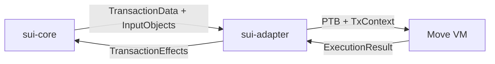

# sui-adapter 深度分析

## 目标

全面分析 `sui-adapter` 作为 Move VM 与 Sui 协议层之间的桥梁，如何协调对象管理、Gas 计量、PTB 执行等核心功能。

## 分析维度

### 1. sui-adapter 的定位与职责

**核心问题**:

- sui-adapter 在 Sui 架构中的位置？
- 它连接了哪些模块？
- 为什么需要这一层适配？

**分析要点**:

- 结合 [架构文档](../architecture/03-TRANSACTION-FLOWS.md) 中的执行层流程
- 对比 sui-execution 多版本机制中 adapter 的角色
- 说明 Move VM 的通用性与 Sui 特定需求之间的桥接

### 2. 输入输出分析

**输入侧**:

- 从 `sui-core` 接收什么数据？
- `TransactionData` / `Certificate` 的结构
- 输入对象的加载与验证

**输出侧**:

- 返回给 `sui-core` 什么结果？
- `TransactionEffects` 的结构
- 对象变更、事件、Gas 使用情况

**数据流图**:




### 3. 调用关系与上下文

**被谁调用**:

- `sui-core/authority.rs` 中的执行入口
- `sui-execution` 多路复用层的调用
- 测试框架中的直接调用

**调用什么**:

- Move VM Runtime (`move-vm-runtime`)
- 对象存储层 (`sui-storage`)
- Gas 计量模块
- 事件发射器

**调用链追踪**:

```javascript
sui-core::execute_certificate()
  → sui-execution::execute_transaction()
    → sui-adapter::execute_transaction_to_effects()
      → move-vm-runtime::execute_function()
        → sui-adapter::Adapter (custom logic)
```


### 4. 核心功能模块

#### 4.1 PTB (Programmable Transaction Block) 执行器

- 如何解析和执行 PTB 中的多个命令
- Command 类型：MoveCall / TransferObjects / SplitCoins / MergeCoins / Publish / MakeMoveVec
- 命令间的数据依赖如何处理

#### 4.2 对象管理

- `TemporaryStore`: 临时存储抽象
- 输入对象加载与版本检查
- 输出对象的 Lamport 版本分配
- 对象所有权变更追踪

#### 4.3 Gas 计量与退款

- Gas 计量点：加载对象、执行 Move、存储变更
- Gas 模型：计算 Gas、存储 Gas、事件 Gas
- Gas 退款机制

#### 4.4 事件与错误处理

- Move 事件的捕获与转换
- 执行错误的分类与处理
- 部分失败的回滚机制

### 5. 关键代码路径分析

**文件结构**:

```javascript
sui-execution/latest/sui-adapter/src/
├── adapter.rs              # 主入口
├── programmable_transactions/
│   ├── context.rs          # PTB 执行上下文
│   └── execution.rs        # PTB 命令执行逻辑
├── temporary_store.rs      # 临时对象存储
├── gas_charger.rs          # Gas 计量
└── type_resolver.rs        # 类型解析
```

**核心接口**:

```rust
pub fn execute_transaction_to_effects(
    shared_object_refs: Vec<ObjectRef>,
    temporary_store: TemporaryStore,
    transaction_data: TransactionData,
    transaction_digest: TransactionDigest,
    // ...
) -> TransactionEffects
```


### 6. 与其他模块的交互

**与 sui-core 的交互**:

- sui-core 负责验证、锁定对象
- adapter 负责执行和生成 effects
- sui-core 负责持久化 effects

**与 Move VM 的交互**:

- adapter 包装 VM 的低级 API
- 提供 Sui 特定的 native functions
- 处理 VM 执行结果并转换为 Sui 格式

**与 sui-types 的交互**:

- 使用 Object、Owner、TransactionData 等类型
- 生成 TransactionEffects
- 发射 Event

### 7. 多版本适配机制

Sui 使用 `sui-execution` 作为多路复用层:

```javascript
sui-execution/
├── latest/ (v3)
│   └── sui-adapter/
├── v2/
│   └── sui-adapter/
├── v1/
│   └── sui-adapter/
└── v0/
    └── sui-adapter/
```

**为什么需要多版本?**

- 协议升级时保持历史兼容
- 不同 Epoch 可能使用不同版本
- 允许渐进式功能迁移

### 8. 对 DEX 开发的启示

**如何扩展 sui-adapter**:

- 添加 Native Functions (DEX 撮合逻辑)
- 自定义 Gas 模型 (降低 DEX 操作成本)
- 优化热点路径 (订单簿访问)

**是否可以绕过 adapter**:

- 理论上可以直接对接 sui-core
- 但会失去对象管理、Gas 计量等功能
- 建议保留 adapter 并在其上扩展

## 输出计划

创建 `mynotes/sui/analysis/sui_adapter_deep_dive.md`，包含：

1. sui-adapter 的架构定位与职责边界
2. 详细的输入输出数据结构分析
3. 完整的调用链追踪与代码路径
4. PTB 执行机制的深入剖析
5. 对象管理与 Gas 计量的实现细节
6. 与其他模块的交互协议
7. 多版本适配机制
8. 针对 DEX 开发的扩展建议

## 实施步骤

1. **搜索关键代码**: 定位 sui-adapter 的主要入口和核心函数
2. **分析数据结构**: 解析输入输出的类型定义
3. **追踪调用链**: 从 sui-core 到 Move VM 的完整路径
4. **研究 PTB 执行**: 深入 programmable_transactions 模块