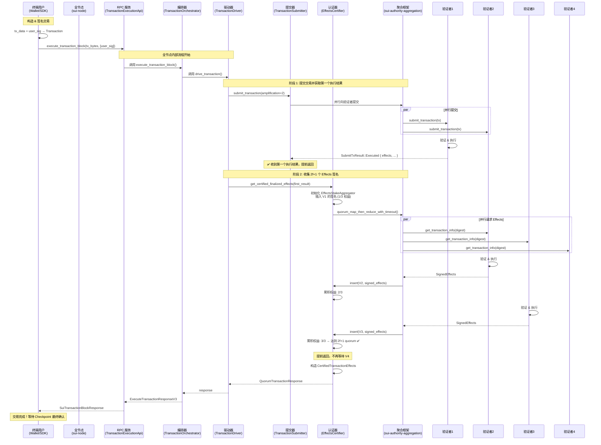

# FastPath 签名收集的真实架构解析

## 问题澄清

在 FastPath 流程中，到底是谁在收集签名和提交证书？
- 客户端（Client）？
- 全节点（Fullnode）？
- `sui-authority-aggregation`？

## 核心结论

**从代码真实部署角度，是"全节点"在收集签名和提交证书，但职责链条包含多个组件：**

```
终端用户
  ↓ (提交已签名交易)
全节点 RPC (sui-json-rpc)
  ↓ (调用)
TransactionOrchestrator (sui-core)
  ↓ (调用)
TransactionDriver (sui-core)
  ↓ (调用)
TransactionSubmitter + EffectsCertifier (sui-core)
  ↓ (使用)
AuthorityAggregator (sui-core)
  ↓ (底层实现)
sui-authority-aggregation (通用签名聚合框架)
  ↓ (并行广播 & 实时聚合)
验证者集群 (Validators)
```

## 三个概念的区分

### 1. "客户端" 的含义混淆

**在序列图中的"客户端"不是终端用户，而是"全节点"！**

- **终端用户**: 使用钱包 / SDK，只负责对交易数据进行签名 (`TransactionData` + 用户私钥 → `Transaction`)
- **全节点（Fullnode）**: 
  - 运行 `sui-node` 进程
  - 提供 RPC/gRPC 服务（`sui-json-rpc`, `sui-graphql-rpc`）
  - **充当"签名聚合客户端"**，代表用户向验证者收集签名、提交证书
  - 在 Sui 文档和代码注释中，全节点被称为 "client" (相对于 validator 而言)

**关键误导来源**: 序列图中的 "Client" 其实是 "Fullnode RPC Server"，而不是真正的终端用户！

### 2. "sui-authority-aggregation" 的角色

`sui-authority-aggregation` 是一个**通用工具库**，提供拜占庭容错的签名聚合框架。

**核心功能**:
```rust
pub async fn quorum_map_then_reduce_with_timeout<...>(
    committee: Arc<C>,                    // 验证者委员会
    authority_clients: Arc<BTreeMap<...>>, // 验证者客户端集合
    initial_state: S,                     // 初始聚合状态（如 StakeAggregator）
    map_each_authority: FMap,             // 对每个验证者执行的操作
    reduce_result: FReduce,               // 如何聚合每个验证者的响应
    initial_timeout: Duration,
) -> Result<...>
```

**它不是一个独立的服务**，而是被 `AuthorityAggregator` 调用的工具函数。

### 3. "全节点" 的真实职责

全节点运行以下关键组件：

#### 代码路径
```
sui-node (main.rs)
 └─ SuiNode::start_async()
     ├─ AuthorityState (本地状态)
     ├─ AuthorityAggregator (验证者通信)
     ├─ TransactionOrchestrator (交易编排)
     │   └─ TransactionDriver (交易驱动)
     │       ├─ TransactionSubmitter (提交交易 & 收集签名)
     │       └─ EffectsCertifier (收集 Effects 签名)
     └─ JsonRpcService (对外 API)
         └─ TransactionExecutionApi::execute_transaction_block()
```

#### 组件职责

**TransactionOrchestrator** (`crates/sui-core/src/transaction_orchestrator.rs`):
```rust
/// Transaction Orchestrator is a Node component that utilizes Transaction Driver to
/// submit transactions to validators for finality. It adds inflight deduplication,
/// waiting for local execution, recovery, early validation, and epoch change handling
/// on top of Transaction Driver.
/// This is used by node RPC service to support transaction submission and finality waiting.
pub struct TransactionOrchestrator<A: Clone> {
    inner: Arc<Inner<A>>,
}
```
- 为 RPC 服务提供交易提交能力
- 处理重复提交、等待本地执行、Epoch 变更等

**TransactionDriver** (`crates/sui-core/src/transaction_driver/mod.rs`):
```rust
pub struct TransactionDriver<A: Clone> {
    authority_aggregator: Arc<ArcSwap<AuthorityAggregator<A>>>,
    state: Mutex<State>,
    metrics: Arc<TransactionDriverMetrics>,
    submitter: TransactionSubmitter,      // ← 提交交易并收集签名
    certifier: EffectsCertifier,          // ← 收集 Effects 签名
    client_monitor: Arc<ValidatorClientMonitor<A>>,
}
```
- **驱动交易到最终确定（finalization）**
- 包含重试逻辑、超时处理、错误分类

**TransactionSubmitter** (`crates/sui-core/src/transaction_driver/transaction_submitter.rs`):
```rust
pub(crate) async fn submit_transaction<A>(
    &self,
    authority_aggregator: &Arc<AuthorityAggregator<A>>,
    client_monitor: &Arc<ValidatorClientMonitor<A>>,
    tx_type: TxType,
    amplification_factor: u64,           // 并发度
    request: SubmitTxRequest,
    options: &SubmitTransactionOptions,
) -> Result<(AuthorityName, SubmitTxResult), TransactionDriverError>
```
- 并行向多个验证者提交交易
- **收集签名直到有一个验证者完成执行**（FastPath 只需要一个执行结果）

**EffectsCertifier** (`crates/sui-core/src/transaction_driver/effects_certifier.rs`):
```rust
pub(crate) async fn get_certified_finalized_effects<A>(
    &self,
    authority_aggregator: &Arc<AuthorityAggregator<A>>,
    client_monitor: &Arc<ValidatorClientMonitor<A>>,
    tx_digest: &TransactionDigest,
    tx_type: TxType,
    first_executed_validator: AuthorityName,
    first_result: SubmitTxResult,
    options: &SubmitTransactionOptions,
) -> Result<QuorumTransactionResponse, TransactionDriverError>
```
- **收集 2f+1 个验证者对 Effects 的签名**
- 使用 `AuthorityAggregator` 和 `StakeAggregator` 进行权益加权聚合

## FastPath 完整流程（代码视角）

### 阶段 1: 用户准备交易

```
终端用户 (Wallet/SDK)
  ↓
1. 构造 TransactionData (PTB, gas, sender, ...)
2. 使用用户私钥签名 → Transaction
3. 调用全节点 RPC: execute_transaction_block(tx_bytes, signatures, ...)
```

**注意**: 用户提交的是**已签名的交易**，不是 Certificate！

### 阶段 2: 全节点收集验证者签名

```rust
// crates/sui-json-rpc/src/transaction_execution_api.rs
impl WriteApiServer for TransactionExecutionApi {
    async fn execute_transaction_block(
        &self,
        tx_bytes: Base64,
        signatures: Vec<Base64>,    // ← 用户签名
        opts: Option<SuiTransactionBlockResponseOptions>,
        request_type: Option<ExecuteTransactionRequestType>,
    ) -> RpcResult<SuiTransactionBlockResponse> {
        // 1. 反序列化交易数据
        let tx_data: TransactionData = self.convert_bytes(tx_bytes)?;
        let txn = Transaction::from_generic_sig_data(tx_data, sigs);
        
        // 2. 构造请求
        let request = ExecuteTransactionRequestV3 {
            transaction: txn.clone(),
            include_events: opts.show_events,
            ...
        };
        
        // 3. 调用 TransactionOrchestrator
        let (response, is_executed_locally) = transaction_orchestrator
            .execute_transaction_block(request, request_type, None)
            .await?;
        
        ...
    }
}
```

```rust
// crates/sui-core/src/transaction_orchestrator.rs
impl<A> TransactionOrchestrator<A> {
    pub async fn execute_transaction_block(
        &self,
        request: ExecuteTransactionRequestV3,
        request_type: ExecuteTransactionRequestType,
        client_addr: Option<SocketAddr>,
    ) -> Result<...> {
        // 调用内部 execute_transaction_with_retry
        let (response, executed_locally) = Inner::<A>::execute_transaction_with_retry(
            inner, request, client_addr
        ).await??;
        
        // 等待本地执行完成（可选）
        if matches!(request_type, ExecuteTransactionRequestType::WaitForLocalExecution) {
            Inner::<A>::wait_for_finalized_tx_executed_locally_with_timeout(...).await;
        }
        
        Ok((response, executed_locally))
    }
}
```

```rust
// crates/sui-core/src/transaction_driver/mod.rs
impl<A> TransactionDriver<A> {
    async fn drive_transaction_once(
        &self,
        amplification_factor: u64,
        request: SubmitTxRequest,
        options: &SubmitTransactionOptions,
    ) -> Result<QuorumTransactionResponse, TransactionDriverError> {
        let auth_agg = self.authority_aggregator.load();
        
        // 步骤 1: 提交交易并获取第一个执行结果
        let (name, submit_txn_result) = self
            .submitter
            .submit_transaction(
                &auth_agg,
                &self.client_monitor,
                tx_type,
                amplification_factor,
                request,
                options,
            )
            .await?;
        
        // 步骤 2: 收集 2f+1 个 Effects 签名
        let result = self
            .certifier
            .get_certified_finalized_effects(
                &auth_agg,
                &self.client_monitor,
                tx_digest,
                tx_type,
                name,
                submit_txn_result,
                options,
            )
            .await;
        
        Ok(result?)
    }
}
```

#### TransactionSubmitter: 并行提交交易

```rust
// crates/sui-core/src/transaction_driver/transaction_submitter.rs
impl TransactionSubmitter {
    pub(crate) async fn submit_transaction<A>(
        &self,
        authority_aggregator: &Arc<AuthorityAggregator<A>>,
        client_monitor: &Arc<ValidatorClientMonitor<A>>,
        tx_type: TxType,
        amplification_factor: u64,           // 并发度（基于 gas price）
        request: SubmitTxRequest,
        options: &SubmitTransactionOptions,
    ) -> Result<(AuthorityName, SubmitTxResult), TransactionDriverError> {
        let mut retrier = RequestRetrier::new(
            authority_aggregator,
            client_monitor,
            tx_type,
            options.allowed_validators.clone(),
            options.blocked_validators.clone(),
        );
        
        let mut request_rpcs = FuturesUnordered::new();
        
        // 并行向多个验证者提交交易
        loop {
            // 填充到 amplification_factor 个并发请求
            while request_rpcs.len() < amplification_factor as usize {
                if let Some((client, validator, display_name)) = retrier.next_validator() {
                    let fut = self.submit_transaction_once(
                        client,
                        &request,
                        options,
                        client_monitor,
                        validator,
                        display_name,
                    );
                    request_rpcs.push(fut.boxed());
                } else {
                    break;
                }
            }
            
            // 等待任意一个成功响应
            if let Some(result) = request_rpcs.next().await {
                match result {
                    Ok((validator, SubmitTxResult::Executed { .. })) => {
                        // ✅ 成功获取执行结果，提前返回
                        return Ok((validator, submit_txn_result));
                    }
                    Ok((validator, SubmitTxResult::Signed { .. })) => {
                        // ✅ 获取签名（但未执行），也返回
                        return Ok((validator, submit_txn_result));
                    }
                    Err(e) if !e.is_retriable() => {
                        // ❌ 致命错误，累积到阈值后返回
                        non_retriable_errors += 1;
                        if non_retriable_errors >= auth_agg.committee.validity_threshold() {
                            return Err(...);
                        }
                    }
                    _ => {
                        // 可重试错误，继续下一个验证者
                    }
                }
            }
        }
    }
}
```

**关键点**:
- **并行广播**: 同时向 `amplification_factor` 个验证者提交交易
- **快速返回**: 只要有一个验证者成功执行（`SubmitTxResult::Executed`）或签名（`SubmitTxResult::Signed`），就提前返回
- **不会等待 2f+1 个签名**，这个职责由 `EffectsCertifier` 完成

#### EffectsCertifier: 收集 2f+1 个 Effects 签名

```rust
// crates/sui-core/src/transaction_driver/effects_certifier.rs
impl EffectsCertifier {
    pub(crate) async fn get_certified_finalized_effects<A>(
        &self,
        authority_aggregator: &Arc<AuthorityAggregator<A>>,
        client_monitor: &Arc<ValidatorClientMonitor<A>>,
        tx_digest: &TransactionDigest,
        tx_type: TxType,
        first_executed_validator: AuthorityName,
        first_result: SubmitTxResult,
        options: &SubmitTransactionOptions,
    ) -> Result<QuorumTransactionResponse, TransactionDriverError> {
        // 初始化 Effects 聚合器
        let mut effects_aggregator = EffectsStakeAggregator::new(
            authority_aggregator.committee.clone(),
        );
        
        // 插入第一个验证者的响应
        if let SubmitTxResult::Executed { effects, .. } = first_result {
            effects_aggregator.insert(first_executed_validator, effects)?;
        }
        
        // 如果已经达到 2f+1，提前返回
        if effects_aggregator.has_quorum() {
            return Ok(effects_aggregator.finalize()?);
        }
        
        // 否则，继续向其他验证者请求 Effects
        let result = authority_aggregator
            .get_effects_from_validators(
                tx_digest,
                &mut effects_aggregator,
                client_monitor,
                options,
            )
            .await?;
        
        Ok(result)
    }
}
```

```rust
// crates/sui-core/src/authority_aggregator.rs
impl<A> AuthorityAggregator<A> {
    pub async fn get_effects_from_validators<S>(
        &self,
        tx_digest: &TransactionDigest,
        aggregator: &mut S,
        client_monitor: &Arc<ValidatorClientMonitor<A>>,
        options: &SubmitTransactionOptions,
    ) -> Result<QuorumTransactionResponse, AggregatorError>
    where
        S: EffectsAggregator,
    {
        let committee = self.committee.clone();
        let clients = self.authority_clients.clone();
        
        // 使用 sui-authority-aggregation 的通用框架
        let result = quorum_map_then_reduce_with_timeout(
            committee.clone(),
            clients,
            aggregator,
            |name, client| {
                Box::pin(async move {
                    // 向单个验证者请求 Effects
                    client.handle_transaction_info_request(
                        TransactionInfoRequest {
                            transaction_digest: *tx_digest,
                        },
                    ).await
                })
            },
            |mut aggregator, name, weight, response| {
                Box::pin(async move {
                    match response {
                        Ok(info) => {
                            // 插入验证者签名到聚合器
                            if let InsertResult::QuorumReached(effects) =
                                aggregator.insert(name, info.signed_effects)?
                            {
                                // ✅ 达到 2f+1 quorum，提前返回
                                return ReduceOutput::Success(effects);
                            }
                        }
                        Err(e) => {
                            // 记录错误，继续等待其他验证者
                        }
                    }
                    ReduceOutput::Continue(aggregator)
                })
            },
            DEFAULT_TIMEOUT,
        ).await?;
        
        Ok(result)
    }
}
```

**关键点**:
- **使用 `quorum_map_then_reduce_with_timeout`**: 这是 `sui-authority-aggregation` 提供的通用框架
- **实时聚合**: 每收到一个验证者的 `SignedEffects`，立即调用 `aggregator.insert()`
- **提前返回**: 一旦 `StakeAggregator` 检测到达到 2f+1 权益，立即返回 `ReduceOutput::Success`
- **形成 `CertifiedTransactionEffects`**: 包含 2f+1 个验证者签名的 Effects

### 阶段 3: 返回结果给用户

```
全节点 RPC
  ↓
返回 SuiTransactionBlockResponse {
    digest: TransactionDigest,
    effects: TransactionEffects,         // ← 已认证的 Effects
    events: Option<TransactionEvents>,
    confirmed_local_execution: bool,
    ...
}
```

## 为什么不是"终端用户"收集签名？

### 技术角度

1. **用户设备不可靠**: 
   - 钱包可能随时关闭
   - 网络可能不稳定
   - 无法承担 24/7 重试逻辑

2. **安全性要求**:
   - 需要验证 Effects 的一致性（拜占庭容错）
   - 需要权益加权计算（需要 Committee 信息）
   - 用户设备不适合承担这些复杂逻辑

3. **性能优化**:
   - 全节点可以并行连接多个验证者
   - 可以使用专业网络设施（低延迟、高带宽）
   - 可以缓存 Committee、Objects 等信息

### 工程角度

4. **协议简化**:
   - 用户只需要对交易数据签名（标准操作）
   - 复杂的签名聚合由全节点处理
   - 降低了客户端 SDK 的复杂度

5. **商业友好**:
   - 全节点可以提供增值服务（优先提交、失败重试等）
   - 用户可以选择信任的全节点服务商
   - 降低了普通用户的技术门槛

## 架构图总结



## 关键术语对照

| 术语（英文） | 术语（中文） | 部署位置 | 职责 |
|------------|------------|---------|-----|
| End User | 终端用户 | 钱包/浏览器 | 对交易数据签名 |
| Fullnode | 全节点 | sui-node 进程 | 提供 RPC 服务，代理签名收集 |
| Client (in docs) | 客户端（文档中） | 实际指全节点 | 容易混淆的术语！ |
| RPC Server | RPC 服务 | sui-json-rpc | 接收用户请求 |
| TransactionOrchestrator | 交易编排器 | sui-core | 管理交易生命周期 |
| TransactionDriver | 交易驱动器 | sui-core | 驱动交易到最终确定 |
| TransactionSubmitter | 交易提交器 | sui-core/transaction_driver | 并行提交交易到验证者 |
| EffectsCertifier | 效果认证器 | sui-core/transaction_driver | 收集 2f+1 Effects 签名 |
| AuthorityAggregator | 验证者聚合器 | sui-core | 管理验证者客户端集合 |
| sui-authority-aggregation | 签名聚合框架 | sui-authority-aggregation | 通用的 BFT 签名聚合工具 |
| StakeAggregator | 权益聚合器 | sui-core | 计算权益并检测 quorum |
| Validator | 验证者 | sui-node (validator mode) | 验证并执行交易 |

## 完整代码调用栈

```
用户调用 RPC
  ↓
crates/sui-json-rpc/src/transaction_execution_api.rs
  TransactionExecutionApi::execute_transaction_block()
    ↓
  crates/sui-core/src/transaction_orchestrator.rs
    TransactionOrchestrator::execute_transaction_block()
      ↓
    Inner::execute_transaction_with_retry()
      ↓
  crates/sui-core/src/transaction_driver/mod.rs
    TransactionDriver::drive_transaction()
      ↓
    TransactionDriver::drive_transaction_once()
      ↓
      ┌─────────────────────┬──────────────────────┐
      │                     │                      │
      ▼                     ▼                      ▼
  TransactionSubmitter  EffectsCertifier    (重试逻辑)
      │                     │
      ▼                     ▼
  submit_transaction()  get_certified_finalized_effects()
      │                     │
      ├─────────────────────┴─────────────────────┐
      │                                           │
      ▼                                           ▼
  crates/sui-core/src/authority_aggregator.rs
    AuthorityAggregator::process_transaction()
    AuthorityAggregator::get_effects_from_validators()
      │
      ▼
  crates/sui-authority-aggregation/src/lib.rs
    quorum_map_then_reduce_with_timeout()
      │
      ├──────────┬──────────┬──────────┐
      ▼          ▼          ▼          ▼
   Validator1 Validator2 Validator3 Validator4
      │          │          │          │
      └──────────┴──────────┴──────────┘
                  │
                  ▼
  crates/sui-core/src/stake_aggregator.rs
    StakeAggregator::insert()
    StakeAggregator::has_quorum() → true (2f+1)
      │
      ▼
    形成 CertifiedTransactionEffects
      │
      ▼
    返回给用户
```

## 总结

### 正确的理解

1. **终端用户**: 只负责对 `TransactionData` 签名，提交给全节点
2. **全节点**: 
   - 运行 `TransactionOrchestrator` + `TransactionDriver`
   - 使用 `AuthorityAggregator` 和 `sui-authority-aggregation`
   - 并行向验证者提交交易
   - 收集 2f+1 个验证者对 Effects 的签名
   - 形成 `CertifiedTransactionEffects`
   - 返回给用户
3. **sui-authority-aggregation**: 
   - 是一个通用工具库（不是独立服务）
   - 提供 `quorum_map_then_reduce_with_timeout` 函数
   - 被 `AuthorityAggregator` 调用
   - 实现并行广播、实时聚合、提前返回等优化

### 序列图的误导

在 `03-TRANSACTION-FLOWS.md` 中的序列图，"Client" 实际指的是 **"Fullnode RPC Server"**，而不是终端用户！

这种术语混淆源于：
- Sui 文档中 "client" 通常是相对于 "validator" 而言的，指"非验证者节点"
- 全节点作为"验证者的客户端"，充当签名聚合者的角色
- 终端用户则是"全节点的客户端"

### 与之前解释的一致性

之前在 `fastpath_client_certificate.md` 中的解释是**从协议角度**的简化描述：
- "客户端收集签名" → 正确（但客户端 = 全节点）
- "客户端提交证书" → 正确（但证书是指 CertifiedEffects）

现在从**代码部署角度**补充了：
- 全节点运行的具体组件是什么
- 签名收集的详细流程是什么
- `sui-authority-aggregation` 扮演什么角色

**两个视角是一致的，只是粒度不同！**

