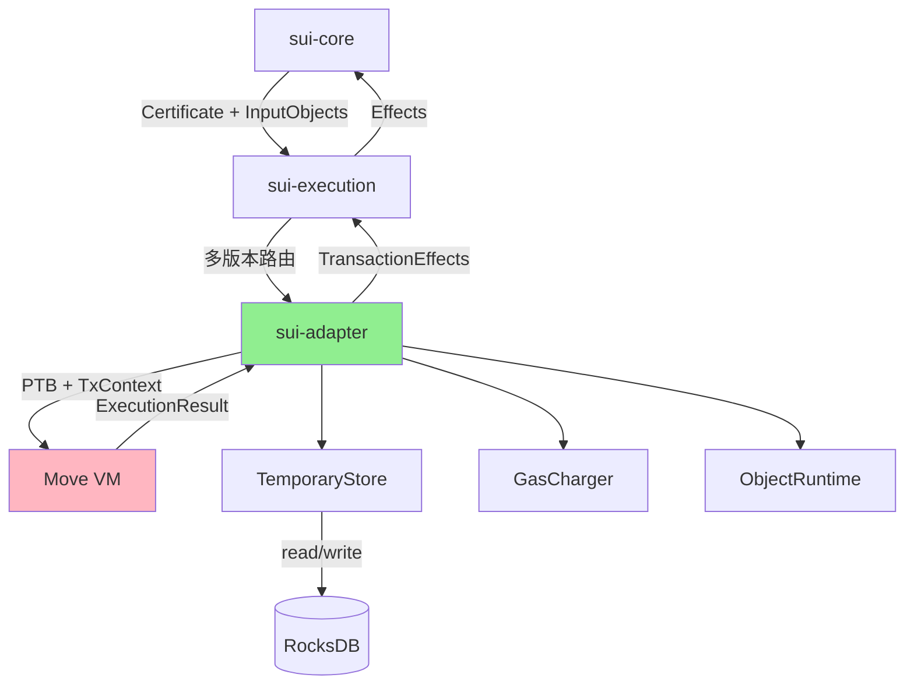
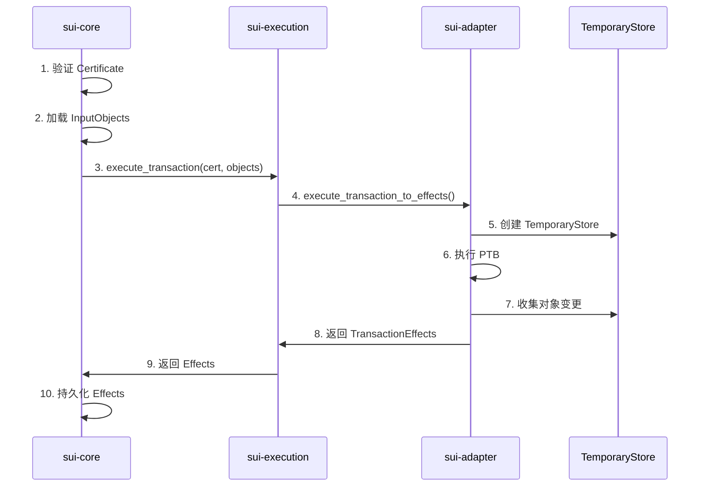

# sui-adapter 深度分析

> **分析目标**: 全面解析 `sui-adapter` 作为 Move VM 与 Sui 协议层之间的桥梁,如何协调对象管理、Gas 计量、PTB 执行等核心功能
>
> **适用场景**: Sui 执行层开发、DEX 定制、性能优化、架构深入理解

---

## 目录

- [核心定位](#核心定位)
- [输入输出分析](#输入输出分析)
- [调用关系与上下文](#调用关系与上下文)
- [核心功能模块](#核心功能模块)
- [PTB 执行机制深入剖析](#ptb-执行机制深入剖析)
- [对象管理详解](#对象管理详解)
- [Gas 计量实现](#gas-计量实现)
- [多版本适配机制](#多版本适配机制)
- [对 DEX 开发的启示](#对-dex-开发的启示)
- [总结](#总结)

---

## 核心定位

### 1. sui-adapter 在架构中的位置



**定位总结**:
- **桥接层**: 连接通用 Move VM 与 Sui 特定协议
- **适配器**: 将 Sui 的对象模型、Gas 机制适配到 Move VM
- **执行协调器**: 协调 PTB 命令的顺序执行和数据流转

---

### 2. 为什么需要这一层适配?

#### Move VM 的通用性

Move VM 是通用的字节码虚拟机:
- 不知道 Sui 的对象模型 (Owner、ObjectID、Version)
- 不知道 Sui 的 Gas 模型 (存储 Gas、计算 Gas、退款)
- 不知道 Sui 的 PTB 机制 (命令链、参数传递)

#### Sui 的特殊需求

Sui 需要:
- **对象所有权管理**: 跟踪对象的创建、修改、删除、转移
- **Lamport 版本分配**: 为输出对象分配全局递增的版本号
- **Gas 精确计量**: 区分计算 Gas、存储 Gas、事件 Gas
- **PTB 命令编排**: 解析和执行 8 种 PTB 命令类型
- **事件发射**: 捕获 Move 事件并转换为 Sui 格式

**sui-adapter 的职责**: 填补 Move VM 通用性与 Sui 特殊性之间的鸿沟

---

## 输入输出分析

### 1. 主入口函数签名

**函数**: `execute_transaction_to_effects` (`sui-execution/latest/sui-adapter/src/execution_engine.rs:89`)

```rust
pub fn execute_transaction_to_effects<Mode: ExecutionMode>(
    // 输入
    store: &dyn BackingStore,                   // 存储层抽象
    input_objects: CheckedInputObjects,         // 已验证的输入对象
    gas_data: GasData,                          // Gas 支付信息
    gas_status: SuiGasStatus,                   // Gas 状态
    transaction_kind: TransactionKind,          // 交易类型(PTB/Genesis/...)
    transaction_signer: SuiAddress,             // 交易签名者
    transaction_digest: TransactionDigest,      // 交易摘要
    move_vm: &Arc<MoveVM>,                      // Move VM 实例
    epoch_id: &EpochId,                         // Epoch ID
    epoch_timestamp_ms: u64,                    // Epoch 时间戳
    protocol_config: &ProtocolConfig,           // 协议配置
    metrics: Arc<LimitsMetrics>,                // 性能指标
    enable_expensive_checks: bool,              // 是否启用昂贵检查
    execution_params: ExecutionOrEarlyError,    // 执行参数或早期错误
    trace_builder_opt: &mut Option<MoveTraceBuilder>,  // 调试追踪
) -> (
    // 输出
    InnerTemporaryStore,                        // 临时存储的内部状态
    SuiGasStatus,                               // 更新后的 Gas 状态
    TransactionEffects,                         // 交易效果
    Vec<ExecutionTiming>,                       // 执行时间统计
    Result<Mode::ExecutionResults, ExecutionError>,  // 执行结果或错误
)
```

---

### 2. 输入数据结构详解

#### (1) CheckedInputObjects

已经过 `sui-core` 验证的输入对象集合:

```rust
pub struct CheckedInputObjects {
    objects: BTreeMap<ObjectID, Object>,
    lamport_version: SequenceNumber,
    mutable_input_refs: BTreeMap<ObjectID, (VersionDigest, Owner)>,
    shared_objects: Vec<SharedInput>,
    // ...
}
```

**包含内容**:
- 所有输入对象的完整数据 (从 RocksDB 加载)
- 可变输入对象的引用 (用于版本检查)
- 共享对象的列表
- Lamport 时间戳 (所有输入对象版本号的最大值)

**已完成的验证**:
- 所有权检查 (sender 是否拥有对象)
- 版本号检查 (防止双花)
- 对象锁定状态检查

#### (2) TransactionKind

交易类型,最常见的是 PTB:

```rust
pub enum TransactionKind {
    ProgrammableTransaction(ProgrammableTransaction),
    Genesis(GenesisTransaction),
    ConsensusCommitPrologue(ConsensusCommitPrologue),
    // ...
}

pub struct ProgrammableTransaction {
    pub inputs: Vec<CallArg>,      // 输入参数
    pub commands: Vec<Command>,    // PTB 命令列表
}
```

**PTB 命令类型**:
```rust
pub enum Command {
    MoveCall(Box<ProgrammableMoveCall>),  // 调用 Move 函数
    TransferObjects(Vec<Argument>, Argument),  // 转移对象
    SplitCoins(Argument, Vec<Argument>),  // 拆分 Coin
    MergeCoins(Argument, Vec<Argument>),  // 合并 Coin
    Publish(Vec<Vec<u8>>, Vec<ObjectID>),  // 发布 Package
    MakeMoveVec(Option<TypeTag>, Vec<Argument>),  // 创建 Move 向量
    Upgrade(Vec<Vec<u8>>, ObjectID, Argument, UpgradePolicy),  // 升级 Package
    // ...
}
```

#### (3) GasData

Gas 支付信息:

```rust
pub struct GasData {
    pub payment: Vec<ObjectRef>,  // Gas 支付对象列表
    pub owner: SuiAddress,        // Gas 支付者
    pub price: u64,               // Gas 价格
    pub budget: u64,              // Gas 预算
}
```

---

### 3. 输出数据结构详解

#### (1) TransactionEffects

交易执行的完整效果:

```rust
pub struct TransactionEffects {
    status: ExecutionStatus,           // 执行状态 (成功/失败)
    executed_epoch: EpochId,           // 执行的 Epoch
    gas_used: GasCostSummary,          // Gas 使用汇总
    transaction_digest: TransactionDigest,
    lamport_version: SequenceNumber,   // 分配的 Lamport 版本
    
    // V2 格式的对象变更
    changed_objects: Vec<ChangedObject>,
    unchanged_shared_objects: Vec<UnchangedSharedObject>,
    
    auxiliary_data_digest: Option<TransactionEventsDigest>,  // 事件摘要
    dependencies: Vec<TransactionDigest>,  // 依赖的交易
}

pub enum ChangedObject {
    Created { object_id, owner, version, digest },
    Mutated { object_id, owner, version, digest, previous_version },
    Deleted { object_id, version },
    Wrapped { object_id, version },
}
```

**Effects 的作用**:
- **持久化**: `sui-core` 根据 effects 持久化对象变更
- **索引**: `sui-indexer` 根据 effects 建立索引
- **查询**: 客户端查询交易结果
- **共识**: 验证者对 effects 达成共识

#### (2) GasCostSummary

Gas 使用的详细分解:

```rust
pub struct GasCostSummary {
    pub computation_cost: u64,     // 计算 Gas
    pub non_refundable_storage_fee: u64,  // 不可退款的存储费
    pub storage_cost: u64,         // 存储 Gas
    pub storage_rebate: u64,       // 存储退款
}
```

**计算公式**:
```
net_gas_usage = computation_cost 
              + storage_cost 
              - storage_rebate
```

#### (3) ExecutionResults

执行模式相关的结果:

```rust
pub trait ExecutionMode {
    type ExecutionResults;
    // ...
}

// 正常模式: 返回命令的返回值
pub struct NormalMode;
impl ExecutionMode for NormalMode {
    type ExecutionResults = Vec<Vec<Value>>;  // 每个命令的返回值列表
}

// 开发模式: 返回详细的执行跟踪
pub struct DevInspectMode;
impl ExecutionMode for DevInspectMode {
    type ExecutionResults = DevInspectResults;
}
```

---

## 调用关系与上下文

### 1. 被谁调用: sui-core 的执行入口

#### 调用路径

```
sui-core/authority.rs::process_certificate()
  ↓
sui-core/authority.rs::execute_certificate()
  ↓
sui-execution/executor.rs::execute_transaction_to_effects()  [多版本路由]
  ↓
sui-execution/{latest|v2|v1|v0}/sui-adapter/src/execution_engine.rs
  ::execute_transaction_to_effects()
```

#### 代码示例 (`sui-core/authority.rs:1997`)

```rust
fn execute_certificate(
    &self,
    _execution_guard: &ExecutionLockReadGuard<'_>,
    certificate: &VerifiedExecutableTransaction,
    input_objects: InputObjects,
    expected_effects_digest: Option<TransactionEffectsDigest>,
    execution_env: ExecutionEnv,
    epoch_store: &Arc<AuthorityPerEpochStore>,
) -> ExecutionOutput<(TransactionOutputs, Vec<ExecutionTiming>, Option<ExecutionError>)> {
    // 1. 验证交易数据
    let tx_data = certificate.data().transaction_data();
    
    // 2. 检查输入对象和 Gas
    let (gas_status, input_objects) = 
        sui_transaction_checks::check_certificate_input(
            certificate,
            input_objects,
            protocol_config,
            gas_price,
        )?;
    
    // 3. 检查对象锁定状态
    let owned_object_refs = input_objects.inner().filter_owned_objects();
    self.check_owned_locks(&owned_object_refs)?;
    
    // 4. 提取交易组成部分
    let (kind, signer, gas_data) = transaction_data.execution_parts();
    
    // 5. 调用 sui-execution (多版本路由)
    let (inner_temp_store, effects, timings, execution_result) = 
        epoch_store
            .executor()
            .execute_transaction_to_effects(
                self.database_for_execution(),
                &execution_env,
                protocol_config,
                epoch_store.metrics().limits_metrics.clone(),
                enable_expensive_checks,
                certificate,
                tx_digest,
                input_objects,
                gas_data,
                gas_status,
                kind,
                signer,
                epoch_id,
            );
    
    // 6. 处理执行结果...
}
```

---

### 2. 调用什么: sui-adapter 的依赖

#### (1) Move VM Runtime

```rust
use move_vm_runtime::{
    move_vm::MoveVM,
    session::Session,
};

// sui-adapter 创建 VM Session
let session = move_vm.new_session(state_view, tx_context);

// 执行 Move 函数
session.execute_function_bypass_visibility(
    &module_id,
    &function_name,
    type_args,
    args,
    gas_status,
)?;
```

**调用的 VM 功能**:
- 函数执行 (`execute_function_bypass_visibility`)
- 模块加载 (`load_module`)
- 类型解析 (`load_type`)
- Gas 计量 (通过 `GasStatus`)

#### (2) 对象存储层

```rust
// TemporaryStore 实现 Storage trait
impl Storage for TemporaryStore<'_> {
    fn read_object(&self, id: &ObjectID) -> Option<&Object>;
    fn record_execution_results(&mut self, results: ExecutionResults);
}

// BackingStore 提供持久化数据
pub trait BackingStore: BackingPackageStore + ParentSync + ChildObjectResolver {
    fn get_object(&self, object_id: &ObjectID) -> Option<Object>;
}
```

**存储操作**:
- 读取输入对象
- 加载 Package 依赖
- 动态加载子对象 (dynamic fields)
- 写入输出对象

#### (3) Native Functions

```rust
// sui-move-natives 提供 Sui 特定的 Native 函数
use sui_move_natives::{
    object_runtime::ObjectRuntime,
    transaction_context::TransactionContext,
};

// 注册到 VM
let mut extensions = NativeContextExtensions::default();
extensions.add(ObjectRuntime::new(...));
extensions.add(TransactionContext::new(tx_context));
```

**Native 函数类型**:
- 对象操作: `transfer`, `freeze_object`, `share_object`
- 事件发射: `emit_event`
- 动态字段: `add_dynamic_field`, `borrow_dynamic_field`
- 类型操作: `type_name`

---

### 3. 完整调用链追踪

```
┌─────────────────────────────────────────┐
│ 1. sui-core::process_certificate       │
│    - 验证 Certificate 签名              │
│    - 加载输入对象                       │
│    - 检查所有权和版本                   │
└─────────────┬───────────────────────────┘
              │
              ↓
┌─────────────────────────────────────────┐
│ 2. sui-execution::execute_tx_to_effects │
│    - 多版本路由 (v0/v1/v2/latest)      │
│    - 选择对应的 sui-adapter            │
└─────────────┬───────────────────────────┘
              │
              ↓
┌─────────────────────────────────────────┐
│ 3. sui-adapter::execute_tx_to_effects   │
│    - 创建 TemporaryStore               │
│    - 创建 GasCharger                   │
│    - 创建 TxContext                    │
└─────────────┬───────────────────────────┘
              │
              ↓
┌─────────────────────────────────────────┐
│ 4. sui-adapter::execute_transaction     │
│    - Gas 预扣款 (输入对象)             │
│    - 根据 TransactionKind 分发         │
└─────────────┬───────────────────────────┘
              │
              ↓
┌─────────────────────────────────────────┐
│ 5. PTB Executor::execute                │
│    - 解析 PTB inputs 和 commands       │
│    - 创建 ExecutionContext             │
└─────────────┬───────────────────────────┘
              │
              ↓
┌─────────────────────────────────────────┐
│ 6. For each Command:                    │
│    - execute_command()                  │
│      ├─ MoveCall → VM::execute_function│
│      ├─ TransferObjects → update owner │
│      ├─ SplitCoins → manipulate balance│
│      └─ ...                             │
└─────────────┬───────────────────────────┘
              │
              ↓
┌─────────────────────────────────────────┐
│ 7. Move VM Execution                    │
│    - 加载 Module 字节码                │
│    - 类型检查和验证                     │
│    - 执行字节码指令                     │
│    - 调用 Native Functions             │
└─────────────┬───────────────────────────┘
              │
              ↓
┌─────────────────────────────────────────┐
│ 8. ObjectRuntime (Native Extension)     │
│    - transfer: 更新对象 owner          │
│    - emit_event: 收集事件              │
│    - dynamic_field: 加载/存储 DF       │
└─────────────┬───────────────────────────┘
              │
              ↓
┌─────────────────────────────────────────┐
│ 9. ExecutionContext::finish()           │
│    - 收集所有对象变更                   │
│    - 验证对象消耗规则                   │
│    - 返回 ExecutionResults             │
└─────────────┬───────────────────────────┘
              │
              ↓
┌─────────────────────────────────────────┐
│ 10. TemporaryStore::into_effects()      │
│    - 分配 Lamport 版本号               │
│    - 计算 Gas 使用                     │
│    - 生成 TransactionEffects          │
└─────────────┬───────────────────────────┘
              │
              ↓
┌─────────────────────────────────────────┐
│ 11. 返回到 sui-core                     │
│    - 持久化 Effects                    │
│    - 更新对象版本                       │
│    - 发布事件                           │
└─────────────────────────────────────────┘
```

---

## 核心功能模块

### 1. 模块文件结构

```
sui-execution/latest/sui-adapter/src/
├── adapter.rs                      # 主入口,VM 配置
├── execution_engine.rs             # 交易执行主引擎
├── execution_mode.rs               # 执行模式抽象
├── execution_value.rs              # 执行时的值类型
├── gas_charger.rs                  # Gas 计量器
├── temporary_store.rs              # 临时对象存储
├── type_resolver.rs                # 类型解析器
│
├── programmable_transactions/      # PTB 执行器 (v1)
│   ├── execution.rs                # PTB 主执行逻辑
│   └── context.rs                  # PTB 执行上下文
│
└── static_programmable_transactions/  # PTB 执行器 (v2, 优化版)
    ├── mod.rs                      # 入口
    ├── execution/
    │   └── interpreter.rs          # 静态解释器
    ├── loading/
    │   └── translate.rs            # 加载和翻译
    └── typing/
        └── translate.rs            # 类型检查和翻译
```

---

### 2. adapter.rs - VM 配置与初始化

#### 核心功能

```rust
// 创建 Move VM 实例
pub fn new_move_vm(
    natives: NativeFunctionTable,
    protocol_config: &ProtocolConfig,
) -> Result<MoveVM, SuiError> {
    MoveVM::new_with_config(
        natives,
        VMConfig {
            verifier: protocol_config.verifier_config(None),
            max_binary_format_version: protocol_config.move_binary_format_version(),
            runtime_limits_config: VMRuntimeLimitsConfig {
                vector_len_max: protocol_config.max_move_vector_len(),
                max_value_nest_depth: protocol_config.max_move_value_depth_as_option(),
                // ...
            },
            // ...
        },
    )
}

// 创建 Native Extensions (注入 Sui 特定功能)
pub fn new_native_extensions<'r>(
    child_resolver: &'r dyn ChildObjectResolver,
    input_objects: BTreeMap<ObjectID, InputObject>,
    is_metered: bool,
    protocol_config: &'r ProtocolConfig,
    metrics: Arc<LimitsMetrics>,
    tx_context: Rc<RefCell<TxContext>>,
) -> NativeContextExtensions<'r> {
    let mut extensions = NativeContextExtensions::default();
    
    // ObjectRuntime: 对象操作 (transfer, share, freeze)
    extensions.add(ObjectRuntime::new(
        child_resolver,
        input_objects,
        is_metered,
        protocol_config,
        metrics,
        tx_context.borrow().epoch(),
    ));
    
    // NativesCostTable: Native 函数的 Gas 成本
    extensions.add(NativesCostTable::from_protocol_config(protocol_config));
    
    // TransactionContext: 交易上下文 (sender, digest, epoch)
    extensions.add(TransactionContext::new(tx_context));
    
    extensions
}
```

**VM 配置项**:
- **verifier**: 字节码验证器配置
- **max_binary_format_version**: 支持的字节码版本
- **runtime_limits**: 运行时限制 (向量长度、嵌套深度)
- **error_execution_state**: 是否在错误中包含执行状态

---

### 3. execution_engine.rs - 执行引擎主控

#### 主流程

```rust
pub fn execute_transaction_to_effects<Mode: ExecutionMode>(...) -> (...) {
    // 1. 创建 TemporaryStore (临时对象存储)
    let mut temporary_store = TemporaryStore::new(
        store,
        input_objects,
        receiving_objects,
        transaction_digest,
        protocol_config,
        epoch_id,
    );
    
    // 2. 创建 GasCharger (Gas 计量器)
    let mut gas_charger = GasCharger::new(
        transaction_digest,
        payment_method,
        gas_status,
        protocol_config,
    );
    
    // 3. 创建 TxContext (交易上下文)
    let tx_ctx = Rc::new(RefCell::new(TxContext::new_from_components(
        &transaction_signer,
        &transaction_digest,
        epoch_id,
        epoch_timestamp_ms,
        protocol_config,
    )));
    
    // 4. 执行交易
    let (gas_cost_summary, execution_result, timings) = execute_transaction::<Mode>(
        store,
        &mut temporary_store,
        transaction_kind,
        &mut gas_charger,
        tx_ctx,
        move_vm,
        protocol_config,
        metrics,
        enable_expensive_checks,
        execution_params,
        trace_builder_opt,
    );
    
    // 5. 计算 Gas 和生成 Effects
    let gas_cost_summary = gas_charger.charge_gas(
        &mut temporary_store,
        &mut execution_result,
    );
    
    let status = if execution_result.is_ok() {
        ExecutionStatus::Success
    } else {
        ExecutionStatus::Failure { /* ... */ }
    };
    
    let (inner, effects) = temporary_store.into_effects(
        shared_object_refs,
        &transaction_digest,
        transaction_dependencies,
        gas_cost_summary,
        status,
        &mut gas_charger,
        epoch_id,
    );
    
    // 6. 返回结果
    (inner, gas_charger.into_gas_status(), effects, timings, execution_result)
}
```

---

## PTB 执行机制深入剖析

### 1. PTB 的两种执行路径

Sui 有两个 PTB 执行器实现:

#### (1) programmable_transactions (v1, 动态解释)

**特点**:
- 运行时解析和执行每个命令
- 灵活,易于理解
- 性能较低

**使用条件**:
```rust
if !protocol_config.enable_ptb_execution_v2() {
    // 使用 v1 执行器
}
```

#### (2) static_programmable_transactions (v2, 静态优化)

**特点**:
- 预先加载和类型检查所有命令
- 构建静态 AST (抽象语法树)
- 优化的解释器执行
- 性能提升 ~20-30%

**使用条件**:
```rust
if protocol_config.enable_ptb_execution_v2() {
    // 使用 v2 执行器
}
```

---

### 2. PTB 执行流程 (v1 实现)

#### 主执行函数 (`programmable_transactions/execution.rs:82`)

```rust
pub fn execute<Mode: ExecutionMode>(
    protocol_config: &ProtocolConfig,
    metrics: Arc<LimitsMetrics>,
    vm: &MoveVM,
    state_view: &mut dyn ExecutionState,
    package_store: &dyn BackingPackageStore,
    tx_context: Rc<RefCell<TxContext>>,
    gas_charger: &mut GasCharger,
    pt: ProgrammableTransaction,  // PTB 输入
    trace_builder_opt: &mut Option<MoveTraceBuilder>,
) -> ResultWithTimings<Mode::ExecutionResults, ExecutionError> {
    let ProgrammableTransaction { inputs, commands } = pt;
    
    // 1. 创建执行上下文
    let mut context = ExecutionContext::new(
        protocol_config,
        metrics,
        vm,
        state_view,
        tx_context,
        gas_charger,
        inputs,  // 解析输入参数
    )?;
    
    // 2. 顺序执行每个命令
    let mut mode_results = Mode::empty_results();
    for (idx, command) in commands.into_iter().enumerate() {
        let start = Instant::now();
        
        // 执行单个命令
        if let Err(err) = execute_command::<Mode>(
            &mut context,
            &mut mode_results,
            command,
            trace_builder_opt,
        ) {
            // 错误处理: 保存已加载的对象,中止执行
            let object_runtime: &ObjectRuntime = context.object_runtime()?;
            let loaded_runtime_objects = object_runtime.loaded_runtime_objects();
            drop(context);
            state_view.save_loaded_runtime_objects(loaded_runtime_objects);
            
            return Err(err.with_command_index(idx));
        };
        
        timings.push(ExecutionTiming::Success(start.elapsed()));
    }
    
    // 3. 完成执行,收集结果
    let object_runtime: &ObjectRuntime = context.object_runtime()?;
    let loaded_runtime_objects = object_runtime.loaded_runtime_objects();
    let wrapped_object_containers = object_runtime.wrapped_object_containers();
    let generated_object_ids = object_runtime.generated_object_ids();
    
    let finished = context.finish::<Mode>();
    state_view.save_loaded_runtime_objects(loaded_runtime_objects);
    state_view.save_wrapped_object_containers(wrapped_object_containers);
    state_view.save_generated_object_ids(generated_object_ids);
    state_view.record_execution_results(finished?)?;
    
    Ok((mode_results, timings))
}
```

---

### 3. PTB 命令执行详解

#### MoveCall 命令

最复杂也最常用的命令:

```rust
Command::MoveCall(Box<ProgrammableMoveCall {
    package: ObjectID,
    module: Identifier,
    function: Identifier,
    type_arguments: Vec<TypeTag>,
    arguments: Vec<Argument>,
}>) => {
    // 1. 解析类型参数
    let type_args = type_arguments.into_iter()
        .map(|t| context.resolve_type_tag(&t))
        .collect()?;
    
    // 2. 加载 Package 和 Module
    let package_object = context.load_package(package)?;
    let module = package_object.module(&module)?;
    
    // 3. 解析函数参数
    let mut args = Vec::new();
    for arg in arguments {
        let value = context.resolve_argument(arg)?;
        args.push(value);
    }
    
    // 4. Gas 计量: 函数调用
    gas_charger.charge_move_call(&module, &function, type_args.len())?;
    
    // 5. 执行 Move 函数
    let session = context.new_session();
    let result = session.execute_function_bypass_visibility(
        module.self_id(),
        &function,
        type_args,
        args,
        gas_charger.move_gas_status(),
    )?;
    
    // 6. 处理返回值
    for value in result {
        context.push_result(value)?;
    }
}
```

#### TransferObjects 命令

转移对象所有权:

```rust
Command::TransferObjects(objects, recipient) => {
    // 1. 解析要转移的对象
    let object_ids: Vec<ObjectID> = objects.into_iter()
        .map(|arg| context.resolve_object_argument(arg))
        .collect()?;
    
    // 2. 解析接收者地址
    let recipient_address = context.resolve_address_argument(recipient)?;
    
    // 3. Gas 计量: 对象转移
    gas_charger.charge_transfer_objects(object_ids.len())?;
    
    // 4. 更新对象所有权
    for object_id in object_ids {
        let mut object = context.take_object(object_id)?;
        object.owner = Owner::AddressOwner(recipient_address);
        context.write_object(object)?;
    }
}
```

#### SplitCoins / MergeCoins 命令

Coin 操作的特殊命令:

```rust
Command::SplitCoins(coin, amounts) => {
    // 1. 解析 Coin 对象
    let coin_id = context.resolve_object_argument(coin)?;
    let mut coin_object = context.borrow_object_mut(coin_id)?;
    let coin_value = coin_object.as_coin_mut()?;
    
    // 2. 解析拆分金额
    let split_amounts: Vec<u64> = amounts.into_iter()
        .map(|arg| context.resolve_u64_argument(arg))
        .collect()?;
    
    // 3. Gas 计量: Coin 操作
    gas_charger.charge_split_coins(split_amounts.len())?;
    
    // 4. 拆分 Coin
    let mut new_coins = Vec::new();
    for amount in split_amounts {
        if coin_value.balance >= amount {
            coin_value.balance -= amount;
            let new_coin = context.create_coin(amount, coin_value.type_)?;
            new_coins.push(new_coin);
        } else {
            return Err(ExecutionError::InsufficientCoinBalance);
        }
    }
    
    // 5. 返回新 Coin 的引用
    for coin in new_coins {
        context.push_result(Value::Object(coin))?;
    }
}
```

---

### 4. PTB 参数传递机制

#### Argument 类型

```rust
pub enum Argument {
    GasCoin,                  // Gas Coin 对象
    Input(u16),               // 输入参数 (inputs[n])
    Result(u16),              // 前面命令的返回值 (commands[n] 的结果)
    NestedResult(u16, u16),   // 前面命令返回值的嵌套 (commands[n] 的第 m 个返回值)
}
```

#### 参数解析

```rust
impl ExecutionContext {
    fn resolve_argument(&mut self, arg: Argument) -> Result<Value, ExecutionError> {
        match arg {
            Argument::GasCoin => {
                // 返回 Gas Coin 对象的引用
                Ok(Value::Object(self.gas_coin_id))
            }
            Argument::Input(idx) => {
                // 从 inputs 数组获取
                self.inputs.get(idx as usize)
                    .cloned()
                    .ok_or(ExecutionError::InvalidArgumentIndex)
            }
            Argument::Result(idx) => {
                // 从命令结果获取
                self.results.get(idx as usize)
                    .and_then(|r| r.first())
                    .cloned()
                    .ok_or(ExecutionError::InvalidResultIndex)
            }
            Argument::NestedResult(cmd_idx, res_idx) => {
                // 从嵌套结果获取
                self.results.get(cmd_idx as usize)
                    .and_then(|r| r.get(res_idx as usize))
                    .cloned()
                    .ok_or(ExecutionError::InvalidNestedResultIndex)
            }
        }
    }
}
```

#### 示例: PTB 数据流

```rust
// PTB 示例
ProgrammableTransaction {
    inputs: vec![
        CallArg::Pure(bcs::to_bytes(&1000u64)),  // Input(0): amount
        CallArg::Object(coin_id),                 // Input(1): coin object
    ],
    commands: vec![
        // Command 0: Split coin into 3 parts
        Command::SplitCoins(
            Argument::Input(1),                   // 使用 Input(1) 的 coin
            vec![
                Argument::Input(0),               // 拆分 1000
                Argument::Input(0),               // 拆分 1000
                Argument::Input(0),               // 拆分 1000
            ]
        ),
        // 返回: Result(0) = [coin_a, coin_b, coin_c]
        
        // Command 1: Transfer first split coin
        Command::TransferObjects(
            vec![Argument::NestedResult(0, 0)],   // 使用 Result(0)[0] = coin_a
            Argument::Input(2),                   // recipient address
        ),
        
        // Command 2: Transfer second split coin
        Command::TransferObjects(
            vec![Argument::NestedResult(0, 1)],   // 使用 Result(0)[1] = coin_b
            Argument::Input(3),                   // another recipient
        ),
        
        // Command 3: Keep third coin (return to sender automatically)
    ],
}
```

**数据流图**:
```
Input(0): 1000 ──┐
Input(1): coin ──┼──→ Command 0: SplitCoins
                 │      ↓
                 │    Result(0): [coin_a, coin_b, coin_c]
                 │      ↓
                 │      ├─→ Command 1: TransferObjects(NestedResult(0,0))
                 │      └─→ Command 2: TransferObjects(NestedResult(0,1))
                 │
Input(2): addr1 ─┴──→ Command 1
Input(3): addr2 ─────→ Command 2
```

---

## 对象管理详解

### 1. TemporaryStore - 临时对象存储

#### 核心数据结构 (`temporary_store.rs:37`)

```rust
pub struct TemporaryStore<'backing> {
    // 后端存储 (RocksDB)
    store: &'backing dyn BackingStore,
    
    // 交易摘要
    tx_digest: TransactionDigest,
    
    // 输入对象 (从 sui-core 传入)
    input_objects: BTreeMap<ObjectID, Object>,
    
    // 可变输入对象的引用 (用于版本检查)
    mutable_input_refs: BTreeMap<ObjectID, (VersionDigest, Owner)>,
    
    // Lamport 时间戳 (分配给输出对象的版本号)
    lamport_timestamp: SequenceNumber,
    
    // 执行结果 (创建、修改、删除的对象)
    execution_results: ExecutionResultsV2,
    
    // 运行时加载的对象 (动态字段、接收对象)
    loaded_runtime_objects: BTreeMap<ObjectID, DynamicallyLoadedObjectMetadata>,
    
    // 从 DB 加载的 Package (用于 Move 模块依赖)
    runtime_packages_loaded_from_db: RwLock<BTreeMap<ObjectID, PackageObject>>,
    
    // 可能接收的对象
    receiving_objects: Vec<ObjectRef>,
    
    // 生成的对象 ID (用于检查)
    generated_runtime_ids: BTreeSet<ObjectID>,
    
    // 协议配置
    protocol_config: &'backing ProtocolConfig,
    
    // 当前 Epoch
    cur_epoch: EpochId,
}
```

---

#### 主要功能

##### (1) 对象读取

```rust
impl TemporaryStore<'_> {
    // 读取对象 (优先从写入缓存,否则从输入对象)
    pub fn read_object(&self, id: &ObjectID) -> Option<&Object> {
        // 1. 先查写入的对象
        if let Some(obj) = self.execution_results.written_objects.get(id) {
            return Some(obj);
        }
        
        // 2. 再查输入对象
        if let Some(obj) = self.input_objects.get(id) {
            return Some(obj);
        }
        
        // 3. 最后查运行时加载的对象
        None
    }
    
    // 从后端存储加载 Package
    fn load_package(&self, package_id: &ObjectID) -> Result<PackageObject> {
        // 1. 先查已写入的 Package
        if let Some(obj) = self.execution_results.written_objects.get(package_id) {
            return Ok(PackageObject::new(obj.clone()));
        }
        
        // 2. 从后端存储加载
        self.store.get_package_object(package_id)
    }
}
```

##### (2) 对象写入

```rust
impl TemporaryStore<'_> {
    // 创建新对象
    pub fn write_object(&mut self, object: Object, written_kind: WriteKind) {
        let id = object.id();
        self.execution_results.written_objects.insert(id, object);
        match written_kind {
            WriteKind::Create => {
                self.execution_results.created.insert(id);
            }
            WriteKind::Mutate => {
                self.execution_results.modified_objects.insert(id);
            }
            WriteKind::Unwrap => {
                self.execution_results.unwrapped.insert(id);
            }
        }
    }
    
    // 删除对象
    pub fn delete_object(&mut self, id: &ObjectID) {
        self.execution_results.deleted.insert(*id);
        self.execution_results.written_objects.remove(id);
    }
}
```

##### (3) Lamport 版本分配

**核心思想**: 所有输出对象的版本 = max(所有输入对象版本) + 1

```rust
impl TemporaryStore<'_> {
    // 构造时计算 Lamport 时间戳
    pub fn new(...) -> Self {
        let lamport_timestamp = input_objects.lamport_timestamp(&receiving_objects);
        Self {
            lamport_timestamp,
            // ...
        }
    }
    
    // 更新所有对象版本
    fn update_object_version_and_prev_tx(&mut self) {
        for (id, obj) in &mut self.execution_results.written_objects {
            // 设置新版本
            obj.data.try_as_move_mut().unwrap()
                .increment_version_to(self.lamport_timestamp);
            
            // 设置 previous_transaction
            obj.previous_transaction = self.tx_digest;
        }
    }
}
```

**为什么这样设计?**
- 保证因果一致性: 如果 Tx2 依赖 Tx1 的输出,Tx2 的版本一定大于 Tx1
- 支持并行执行: 不同输入的交易可以独立分配版本
- 简化冲突检测: 版本号不匹配 = 对象被修改

---

## Gas 计量实现

### 1. GasCharger 架构

#### 核心结构

```rust
pub struct GasCharger {
    tx_digest: TransactionDigest,
    gas_model_version: u64,           // Gas 模型版本
    payment_method: PaymentMethod,    // 支付方式
    smashed_gas_coin: Option<ObjectID>,  // 合并后的 Gas Coin
    gas_status: SuiGasStatus,         // Gas 状态追踪
}

pub enum PaymentMethod {
    Unmetered,                        // 系统交易,不计费
    Coins(Vec<ObjectRef>),            // 使用 Gas Coin 支付
    AddressBalance(SuiAddress),       // 使用地址余额支付 (Sponsored Tx)
}
```

---

### 2. Gas 计费流程

#### 阶段 1: 输入对象加载

```rust
impl GasCharger {
    pub fn charge_input_objects(&mut self, store: &TemporaryStore) -> Result<()> {
        for (id, obj) in store.input_objects() {
            // 按对象大小收费
            let size = obj.object_size_for_gas_metering();
            self.gas_status.charge_storage_read(size)?;
        }
        Ok(())
    }
}
```

**计费点**: 
- 加载输入对象的存储读取费用
- 按对象序列化后的字节大小计费

---

#### 阶段 2: PTB 命令执行

在 PTB 执行过程中,每个命令都会产生 Gas 费用:

```rust
// MoveCall 命令
fn execute_move_call(&mut self, ...) -> Result<()> {
    // 1. 加载 Package (如果未缓存)
    let package = self.load_package(package_id)?;
    gas_charger.charge_publish_package(package.serialized_size())?;
    
    // 2. 执行 Move 函数
    let result = move_vm.execute_function(
        &module_id,
        &function_name,
        type_args,
        args,
        gas_charger.move_gas_status(),  // Move VM 的 Gas Meter
    )?;
    
    Ok(())
}
```

**计费点**:
- Package 加载: 按 Package 大小
- Move 指令执行: 每条字节码指令收费
- 内存分配: Vector/Struct 创建收费

---

#### 阶段 3: 存储变更

```rust
impl GasCharger {
    pub fn track_storage_mutation(
        &mut self,
        object_id: ObjectID,
        new_size: usize,
        storage_rebate: u64,
    ) -> u64 {
        // 计算存储费用
        let storage_cost = self.gas_status.storage_gas_price() * new_size;
        
        // 计算净费用 (新存储 - 旧存储退款)
        let net_cost = storage_cost.saturating_sub(storage_rebate);
        
        self.gas_status.charge_storage_mutation(net_cost);
        storage_cost
    }
}
```

**计费点**:
- 创建对象: 全额收取存储费
- 修改对象: 收取增量存储费,退还旧对象存储费
- 删除对象: 全额退还存储费

---

#### 阶段 4: Gas 结算

```rust
impl GasCharger {
    pub fn charge_gas<T>(
        &mut self,
        temporary_store: &mut TemporaryStore,
        execution_result: &mut Result<T, ExecutionError>,
    ) -> GasCostSummary {
        // 1. 桶化计算费用 (按档位收费,避免微小差异)
        self.gas_status.bucketize_computation()?;
        
        // 2. 如果执行失败,回滚写入
        if execution_result.is_err() {
            self.reset(temporary_store);
        }
        
        // 3. 收集存储费用和退款
        temporary_store.collect_storage_and_rebate(self);
        
        // 4. 从 Gas Coin 扣费
        let net_change = self.gas_status.summary().net_gas_usage();
        let gas_object_id = self.smashed_gas_coin.unwrap();
        let mut gas_object = temporary_store.read_object(&gas_object_id).clone();
        
        deduct_gas(&mut gas_object, net_change);
        temporary_store.mutate_input_object(gas_object);
        
        self.gas_status.summary()
    }
}
```

---

### 3. Gas 模型版本演进

| 版本 | 主要变化 | Protocol Version |
|-----|---------|-----------------|
| v1 | 基础 Gas 模型 | < 12 |
| v2 | 优化存储计费 | 12-20 |
| v3 | 引入 Gas 退款机制 | 21-30 |
| v4 | 桶化计算费用 | 31-40 |
| v5 | Sponsored Tx 支持 | 41-50 |
| v6 | 最新优化 | 51+ |

**向后兼容**: 不同 Epoch 可能使用不同 Gas 模型版本,sui-adapter 通过 `gas_model_version` 字段适配。

---

## 多版本适配机制

### 1. sui-execution 多路复用层

#### 目录结构

```
sui-execution/
├── latest/              # 最新版本 (当前 v3)
│   └── sui-adapter/
├── v2/                  # 历史版本 2
│   └── sui-adapter/
├── v1/                  # 历史版本 1
│   └── sui-adapter/
├── v0/                  # 初始版本
│   └── sui-adapter/
└── cut/                 # 版本切换工具
    └── src/main.rs
```

---

### 2. 版本路由机制

```rust
// sui-execution/src/executor.rs
pub fn execute_transaction_to_effects(
    protocol_version: ProtocolVersion,
    ...
) -> TransactionEffects {
    match protocol_version.as_u64() {
        0..=10 => v0::execute_transaction_to_effects(...),
        11..=20 => v1::execute_transaction_to_effects(...),
        21..=40 => v2::execute_transaction_to_effects(...),
        _ => latest::execute_transaction_to_effects(...),
    }
}
```

**路由依据**: Protocol Config 中的版本号

---

### 3. 为什么需要多版本?

#### (1) 协议升级的向后兼容

```
场景: Epoch N → Epoch N+1 协议升级

问题:
- Epoch N 的交易可能在 Epoch N+1 才被执行 (共识延迟)
- 必须使用 Epoch N 的执行规则,否则 Effects 不一致

解决:
- 保留 Epoch N 的 sui-adapter 版本
- 根据交易的 Epoch 选择对应版本执行
```

#### (2) 渐进式功能迁移

```
v2 → v3 的主要变化:
- 新增 PTB execution v2 (静态类型检查)
- 优化 ObjectRuntime 实现
- 改进 Gas 计量精度

迁移策略:
- v3 发布后,新交易使用 v3
- 旧交易回放时仍用 v2
- 避免"大爆炸"式升级风险
```

#### (3) 历史交易回放

```rust
// 回放 Epoch 100 的交易 (当前 Epoch 200)
let protocol_version = epoch_store.protocol_version_for_epoch(100);
let effects = execute_transaction_to_effects(
    protocol_version,  // 使用 Epoch 100 的版本
    ...
);

// 验证: 必须与历史 Effects 完全一致
assert_eq!(effects.digest(), historical_effects.digest());
```

---

### 4. 版本差异示例

#### v2 vs latest (v3) 的关键差异

| 维度 | v2 | v3 (latest) |
|-----|----|----|
| **PTB 执行** | 动态执行 | 静态类型检查 + 动态执行 |
| **类型验证** | 运行时 | 编译时 + 运行时 |
| **ObjectRuntime** | 简单实现 | 优化的 loaded_runtime_objects |
| **Gas 计量** | 基础模型 | 精细化计量 |
| **错误处理** | 基本错误 | 增强的错误诊断 |

---

## 与其他模块的交互

### 1. 与 sui-core 的交互



**职责分工**:
- **sui-core**: 验证、锁定对象、持久化
- **sui-adapter**: 执行、生成 Effects
- **TemporaryStore**: 临时对象管理

---

### 2. 与 Move VM 的交互

```rust
// sui-adapter 调用 Move VM 的典型流程
impl ExecutionContext<'_> {
    fn execute_move_call(&mut self, call: MoveCall) -> Result<Vec<Value>> {
        // 1. 加载 Module
        let module = self.vm.load_module(&module_id)?;
        
        // 2. 准备参数
        let args: Vec<Vec<u8>> = self.resolve_arguments(&call.arguments)?;
        let type_args: Vec<TypeTag> = call.type_arguments;
        
        // 3. 创建 Move Session
        let mut session = self.vm.new_session(self.state_view);
        
        // 4. 注入 Native Extensions
        session.get_native_extensions_mut().add(ObjectRuntime::new(...));
        session.get_native_extensions_mut().add(TransactionContext::new(...));
        
        // 5. 执行 Move 函数
        let result = session.execute_function_bypass_visibility(
            &module_id,
            &function_name,
            type_args,
            args,
            &mut self.gas_charger.move_gas_status(),  // Gas Meter
        )?;
        
        // 6. 提取返回值
        Ok(result.return_values)
    }
}
```

**关键点**:
- **Native Extensions**: 注入 Sui 特定功能 (ObjectRuntime, TxContext)
- **Gas Metering**: 传递 Gas Meter 给 Move VM
- **Type Arguments**: 泛型实例化

---

### 3. 与 sui-types 的交互

```rust
// sui-adapter 使用的核心类型
use sui_types::{
    // 对象相关
    object::{Object, Owner, Data},
    base_types::{ObjectID, SequenceNumber, SuiAddress},
    
    // 交易相关
    transaction::{
        TransactionData,
        TransactionKind,
        ProgrammableTransaction,
        Command,
    },
    
    // Effects 相关
    effects::{
        TransactionEffects,
        TransactionEffectsV2,
        ObjectChange,
    },
    
    // Gas 相关
    gas::{GasCostSummary, SuiGasStatus},
    
    // 执行相关
    execution::{ExecutionResults, ExecutionError},
};
```

**类型转换流程**:
```
TransactionData (sui-types)
  → ProgrammableTransaction (sui-adapter 解析)
    → ExecutionResults (Move VM 执行)
      → TransactionEffects (sui-types 生成)
```

---

## 对 DEX 开发的启示

### 1. 如何扩展 sui-adapter

#### 方案 A: 添加 Native Functions

**适用场景**: 需要高性能的撮合逻辑

```rust
// 在 sui-move-natives 中添加 DEX 专用 Native 函数
pub fn native_match_orders(
    context: &mut NativeContext,
    ty_args: Vec<Type>,
    mut args: VecDeque<Value>,
) -> PartialVMResult<NativeResult> {
    // 1. 提取参数
    let order_book = pop_arg!(args, StructRef);
    let maker_order = pop_arg!(args, Struct);
    let taker_order = pop_arg!(args, Struct);
    
    // 2. 高性能撮合逻辑 (纯 Rust,绕过 Move VM)
    let result = optimized_matching_engine(order_book, maker_order, taker_order);
    
    // 3. 计量 Gas
    let gas_cost = calculate_matching_gas(result);
    context.charge_gas(gas_cost)?;
    
    // 4. 返回结果
    Ok(NativeResult::ok(gas_cost, smallvec![result]))
}
```

**注册 Native 函数**:
```rust
// 在 sui-adapter/src/adapter.rs
pub fn new_move_vm_with_dex_natives() -> MoveVM {
    let mut natives = sui_move_natives::all_natives();
    
    // 添加 DEX Native 函数
    natives.push((
        account_address::from_str("0xdex").unwrap(),
        Identifier::new("clob").unwrap(),
        Identifier::new("match_orders_native").unwrap(),
        native_match_orders,
    ));
    
    MoveVM::new_with_config(natives, vm_config)
}
```

---

#### 方案 B: 自定义 Gas 模型

**适用场景**: 降低 DEX 操作的 Gas 成本

```rust
// 扩展 GasCharger
impl GasCharger {
    pub fn charge_dex_operation(&mut self, op_type: DexOpType) -> Result<()> {
        let base_cost = match op_type {
            DexOpType::PlaceOrder => 1000,      // 下单便宜
            DexOpType::CancelOrder => 500,      // 撤单更便宜
            DexOpType::MatchOrders => 2000,     // 撮合稍贵
        };
        
        // 应用折扣 (例如批量操作)
        let discounted_cost = apply_volume_discount(base_cost, volume);
        
        self.gas_status.charge(discounted_cost)
    }
}
```

---

#### 方案 C: 优化热点路径

**适用场景**: 订单簿频繁访问

```rust
// 在 TemporaryStore 中添加订单簿缓存
pub struct TemporaryStore<'backing> {
    // 原有字段...
    
    // DEX 专用缓存
    hot_orderbooks: LruCache<ObjectID, Arc<OrderBook>>,
}

impl TemporaryStore<'_> {
    pub fn read_orderbook_cached(&self, id: &ObjectID) -> Option<Arc<OrderBook>> {
        // 1. 先查缓存
        if let Some(book) = self.hot_orderbooks.get(id) {
            return Some(book.clone());
        }
        
        // 2. 从存储加载
        let book = self.read_object(id)?;
        let book = Arc::new(parse_orderbook(book));
        
        // 3. 加入缓存
        self.hot_orderbooks.put(*id, book.clone());
        
        Some(book)
    }
}
```

---

### 2. 是否可以绕过 sui-adapter?

#### 理论可行性

```rust
// 直接对接 sui-core
impl AuthorityState {
    fn execute_certificate_custom(&self, cert: &Certificate) -> TransactionEffects {
        // 1. 手动加载对象
        let objects = self.load_objects(cert.input_objects())?;
        
        // 2. 调用自定义执行引擎
        let result = custom_dex_engine.execute(cert, objects)?;
        
        // 3. 手动生成 Effects
        let effects = self.create_effects(result)?;
        
        // 4. 持久化
        self.persist_effects(effects)?;
        
        Ok(effects)
    }
}
```

#### 会失去的功能

❌ **对象管理**:
- Lamport 版本分配
- 所有权变更追踪
- 动态字段加载

❌ **Gas 计量**:
- 细粒度的 Gas 追踪
- 存储费用计算
- Gas 退款机制

❌ **类型安全**:
- Move 类型检查
- 泛型验证
- 所有权检查

❌ **协议兼容**:
- 多版本适配
- 历史交易回放
- 与 Sui 生态的互操作性

#### 推荐方案

✅ **保留 sui-adapter,在其上扩展**:
- 添加 Native Functions
- 自定义 Gas 模型
- 优化热点路径
- 保持与 Sui 生态的兼容性

---

### 3. 性能优化建议

#### (1) 批量操作优化

```rust
// 批量下单 PTB
ptb = ProgrammableTransaction {
    inputs: vec![orderbook_input, coins_input],
    commands: vec![
        Command::MoveCall {  // 批量下单
            package: dex_package,
            module: "clob",
            function: "batch_place_orders",
            type_args: vec![BASE, QUOTE],
            arguments: vec![
                Argument::Input(0),  // orderbook
                Argument::Input(1),  // coins
                Argument::Input(2),  // orders array
            ],
        },
    ],
};
```

**优势**:
- 单次交易处理多个订单
- 分摊固定成本 (签名验证、对象加载)
- 降低总 Gas 费用

---

#### (2) 对象复用

```rust
// 复用相同的 OrderBook 对象
ptb = ProgrammableTransaction {
    inputs: vec![orderbook_input],
    commands: vec![
        Command::MoveCall {  // 第一笔订单
            function: "place_order",
            arguments: vec![Argument::Input(0), ...],
        },
        Command::MoveCall {  // 第二笔订单,复用同一 orderbook
            function: "place_order",
            arguments: vec![Argument::Result(0), ...],  // 使用前一个结果
        },
    ],
};
```

**优势**:
- 避免重复加载对象
- 减少存储读取 Gas
- 提高执行效率

---

#### (3) Gas 预估

```rust
// 在提交前预估 Gas
pub fn estimate_dex_order_gas(order: &Order) -> u64 {
    let base_gas = 10_000;  // 基础 Gas
    
    // 根据订单复杂度调整
    let complexity_gas = match order.order_type {
        OrderType::Limit => 5_000,
        OrderType::Market => 3_000,
        OrderType::StopLimit => 8_000,
    };
    
    // 考虑成交数量
    let matching_gas = order.expected_matches * 2_000;
    
    base_gas + complexity_gas + matching_gas
}
```

---

## 总结

### 核心要点

#### ✅ sui-adapter 的职责

1. **桥接 Move VM 与 Sui 协议**
   - 适配对象模型
   - 实现 Gas 计量
   - 协调 PTB 执行

2. **对象生命周期管理**
   - TemporaryStore 临时存储
   - Lamport 版本分配
   - 所有权变更追踪

3. **Gas 经济学实现**
   - 多阶段 Gas 计费
   - 存储费用与退款
   - Gas 模型版本适配

4. **PTB 执行引擎**
   - 命令顺序执行
   - 参数依赖解析
   - 结果传递与转换

---

### 输入输出总结

**输入**:
```rust
(
    store: &dyn BackingStore,
    input_objects: CheckedInputObjects,
    gas_data: GasData,
    transaction_kind: TransactionKind,
    transaction_signer: SuiAddress,
    transaction_digest: TransactionDigest,
    move_vm: &Arc<MoveVM>,
    // ...
)
```

**输出**:
```rust
(
    InnerTemporaryStore,       // 对象变更
    SuiGasStatus,              // Gas 使用情况
    TransactionEffects,        // Effects (V1/V2)
    Vec<ExecutionTiming>,      // 性能分析
    Result<ExecutionResults>,  // 执行结果
)
```

---

### 调用链总结

```
sui-core::execute_certificate()
  ↓
sui-execution::execute_transaction_to_effects()
  ↓ (版本路由)
sui-adapter::execute_transaction_to_effects()
  ↓
sui-adapter::execute_transaction()
  ↓
programmable_transactions::execute()
  ↓
execute_command() × N (for each PTB command)
  ↓
move-vm-runtime::execute_function()
  ↓
sui-adapter::Adapter (处理结果)
  ↓
TemporaryStore::into_effects()
  ↓
返回 TransactionEffects
```

---

### 对 DEX 开发的建议

#### 推荐方案: Move + Native 混合

```
资产管理 (Move)
    ↓
业务逻辑 (Native Functions)
    ↓
资产结算 (Move)
```

**优势**:
- ✅ 保留 Move 的安全保证
- ✅ Native 提供高性能
- ✅ 完全兼容 Sui 生态
- ✅ 开发成本可控

**不推荐**: 完全绕过 sui-adapter
- ❌ 失去对象管理
- ❌ 失去 Gas 计量
- ❌ 失去类型安全
- ❌ 维护成本极高

---

**相关文档**:
- [Sui 交易流程分析](../architecture/03-TRANSACTION-FLOWS.md)
- [Object 所有权外部管理分析](./object_ownership_external_management.md)
- [DEX 实现专项](../architecture/05-DEX-IMPLEMENTATION.md)