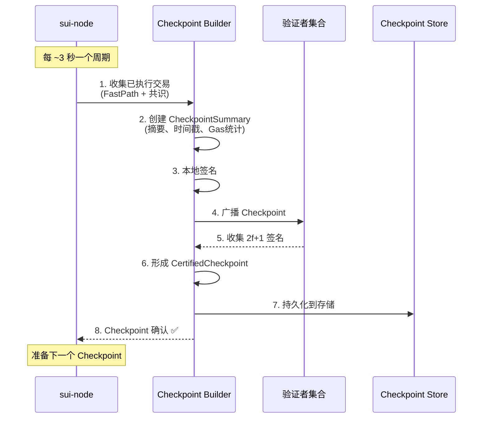
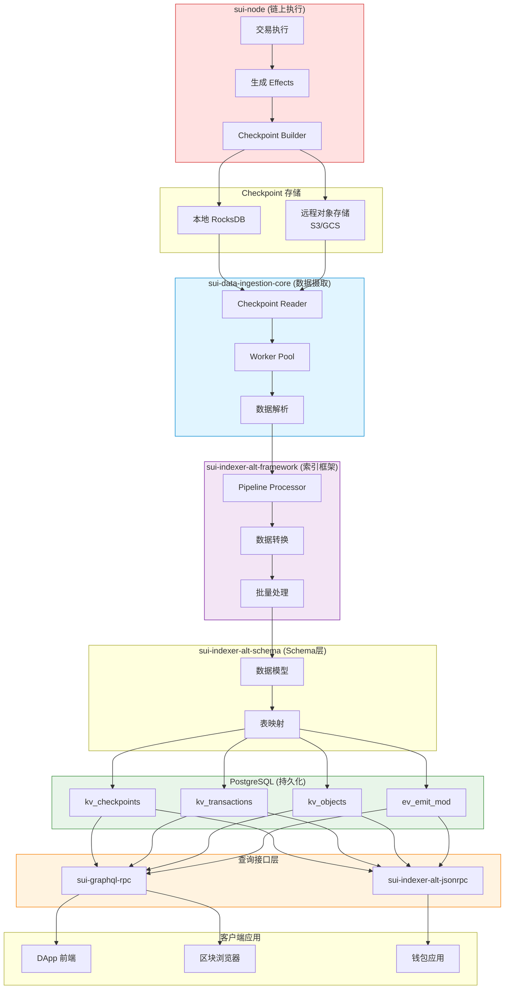
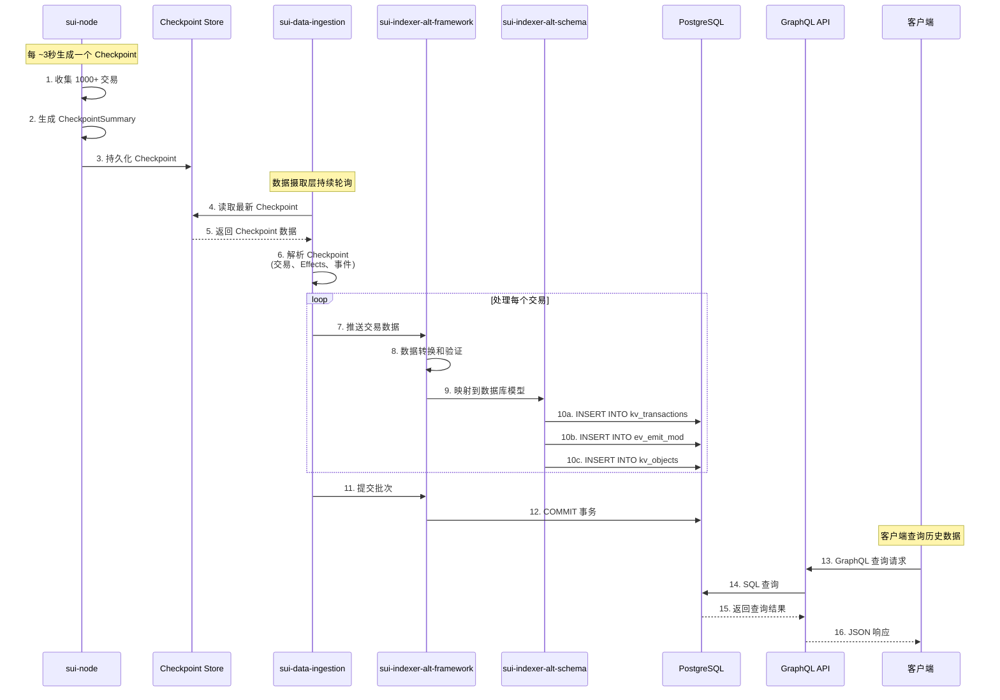
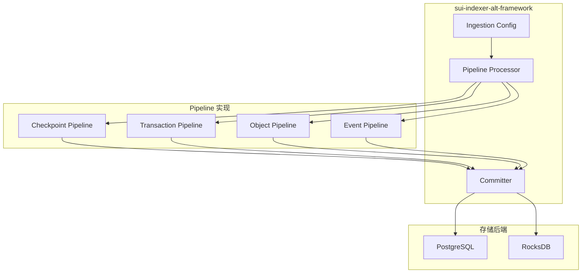
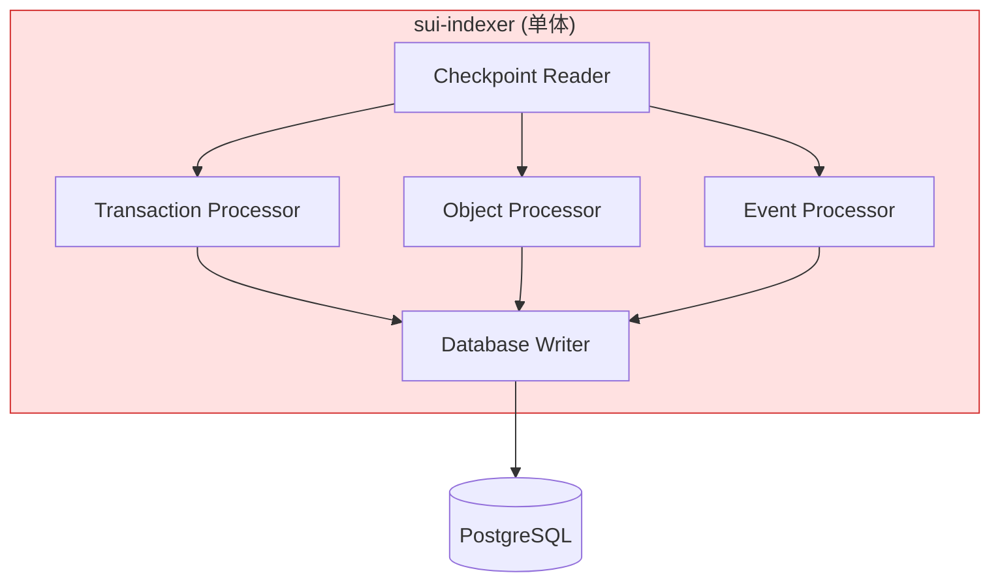
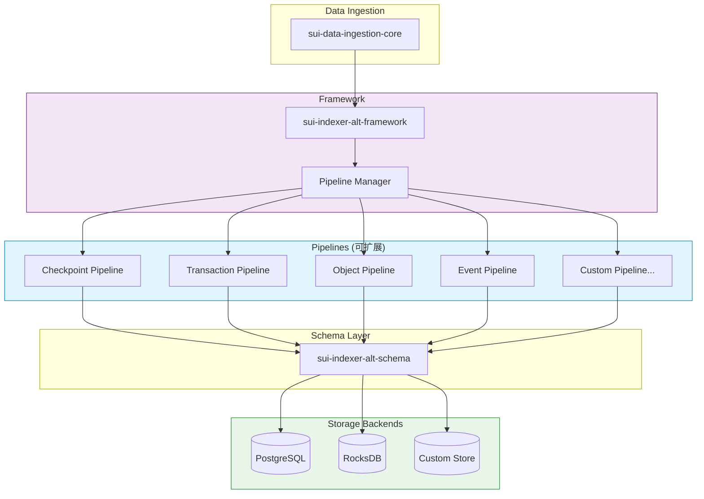

# Sui Indexer 数据流分析

> **文档用途**: 深入理解 sui-indexer 的数据来源、完整数据流向以及索引内容
>
> **预计阅读**: 20-30分钟 | **适合人群**: 开发者、数据工程师、架构师

---

## 目录

- [概述](#概述)
- [数据来源详解](#数据来源详解)
- [完整数据流向](#完整数据流向)
- [架构组件分析](#架构组件分析)
- [索引内容详解](#索引内容详解)
- [性能特性](#性能特性)
- [新旧索引器对比](#新旧索引器对比)

---

## 概述

### sui-indexer 的定位和作用

**sui-indexer** 是 Sui 区块链的离链数据索引服务，负责：

- **数据摄取**: 从 Sui 全节点获取 Checkpoint 数据
- **数据转换**: 解析交易、事件、对象变更等链上数据
- **数据存储**: 将结构化数据持久化到 PostgreSQL
- **数据查询**: 提供 GraphQL 和 JSON-RPC 查询接口

### 核心价值

```
链上数据 (sui-node)
    ↓ 实时生成
Checkpoint (批量快照)
    ↓ 索引器摄取
结构化数据库 (PostgreSQL)
    ↓ 查询接口
应用层快速访问 ✅
```

**解决的问题**:
- ✅ **历史查询**: 链上只保留最新状态，索引器提供完整历史
- ✅ **复杂查询**: 支持多维度筛选、聚合、分页等 SQL 能力
- ✅ **查询性能**: 预处理数据，避免全节点重复计算
- ✅ **数据分析**: 支持链上数据的统计分析和可视化

---

## 数据来源详解

### Checkpoint 是什么？

**Checkpoint** 是 Sui 区块链的状态快照机制，类似于其他区块链的"区块"，但设计更加高效。

### Checkpoint 生成机制



### Checkpoint 包含的内容

#### CheckpointSummary（元数据）

```rust
pub struct CheckpointSummary {
    pub epoch: EpochId,                          // 所属 Epoch
    pub sequence_number: CheckpointSequenceNumber, // 序列号（递增）
    pub network_total_transactions: u64,          // 网络累计交易数
    pub content_digest: CheckpointContentsDigest, // 内容摘要
    pub previous_digest: Option<CheckpointDigest>,// 前一个 Checkpoint 的摘要
    pub epoch_rolling_gas_cost_summary: GasCostSummary, // Epoch 累计 Gas
    pub timestamp_ms: CheckpointTimestamp,        // 时间戳（毫秒）
    pub checkpoint_commitments: Vec<CheckpointCommitment>, // 状态承诺
    // ... 其他字段
}
```

#### CheckpointContents（交易内容）

```rust
pub struct CheckpointContentsV2 {
    transactions: Vec<CheckpointTransactionContents>, // 交易列表
}

pub struct CheckpointTransactionContents {
    pub digest: ExecutionDigests,     // 交易摘要和 Effects 摘要
    pub user_signatures: Vec<...>,    // 用户签名
}
```

**每个 Checkpoint 包含**:
- 📦 **1000+ 交易** (取决于网络活动)
- ⏱️ **时间戳**: 生成时间（毫秒级精度）
- 🔗 **链式结构**: 通过 `previous_digest` 形成链
- 📊 **Gas 统计**: 该 Checkpoint 的 Gas 消耗汇总
- 🔐 **2f+1 签名**: 验证者集合的认证签名

### 生成频率和性能

| 指标 | 数值 | 说明 |
|-----|------|------|
| **生成周期** | ~3 秒 | 固定时间间隔 |
| **交易数量** | 1,000-5,000+ | 取决于网络负载 |
| **生成延迟** | 116-413ms | 收集+签名+广播 |
| **平均延迟** | ~200ms | 正常网络条件 |

**时间线示例**:
```
T0:   开始收集交易
        ↓ (10-50ms)
T1:   创建 Summary
        ↓ (5-10ms)
T2:   本地签名
        ↓ (1-3ms)
T3:   广播到验证者
        ↓ (50-150ms)
T4:   收集 2f+1 签名
        ↓ (50-200ms)
T5:   Checkpoint 最终确认 ✅

总延迟: ~200ms
```

---

## 完整数据流向

### 端到端数据流



### 详细数据流时序图



### 关键路径说明

#### 1. 链上生成阶段 (sui-node)

**输入**: 用户提交的交易  
**处理**:
- FastPath 交易: 收集 2f+1 签名后执行
- 共识路径交易: 经过 Mysticeti 共识后执行
- 生成 TransactionEffects (执行结果)

**输出**: Checkpoint (批量交易快照)

#### 2. 存储阶段 (Checkpoint Store)

**本地存储** (RocksDB):
- 用于验证者和全节点的快速访问
- 支持最近 N 个 Checkpoint 的查询

**远程存储** (S3/GCS):
- 长期归档存储
- 索引器的主要数据源

#### 3. 摄取阶段 (sui-data-ingestion-core)

**职责**:
- 从 Checkpoint Store 读取数据
- 解析 Checkpoint 中的交易、Events、对象变更
- 使用 Worker Pool 并行处理

**关键组件**:
```rust
// crates/sui-data-ingestion-core/src/reader.rs
pub struct CheckpointReader {
    // 从远程存储读取 Checkpoint
    remote_store_url: String,
    // 本地缓存
    cache: LruCache<CheckpointSequenceNumber, Checkpoint>,
}

// crates/sui-data-ingestion-core/src/worker_pool.rs
pub struct WorkerPool {
    // 并行处理 Checkpoint
    workers: Vec<Worker>,
    // 待处理队列
    work_queue: Receiver<Checkpoint>,
}
```

#### 4. 索引框架阶段 (sui-indexer-alt-framework)

**职责**:
- 提供可扩展的 Pipeline 抽象
- 数据转换和验证
- 批量处理优化

**Pipeline 类型**:

**Sequential Pipeline**（顺序管道）:
```rust
// 按 Checkpoint 顺序处理，保证一致性
pub trait SequentialPipeline {
    fn process_checkpoint(&mut self, checkpoint: &Checkpoint) -> Result<()>;
}
```

**Concurrent Pipeline**（并发管道）:
```rust
// 可以并行处理多个 Checkpoint，适合独立的索引
pub trait ConcurrentPipeline {
    fn process_checkpoint(&self, checkpoint: &Checkpoint) -> Result<()>;
}
```

#### 5. Schema 映射阶段 (sui-indexer-alt-schema)

**职责**:
- 定义数据库表结构
- 提供 ORM 映射（Diesel）
- 数据库迁移管理

**核心模块**:
```
sui-indexer-alt-schema/
├── migrations/        # 数据库迁移脚本
├── src/
│   ├── checkpoints.rs # Checkpoint 相关表
│   ├── transactions.rs # 交易相关表
│   ├── objects.rs     # 对象相关表
│   ├── events.rs      # 事件相关表
│   └── schema.rs      # Diesel 生成的 Schema
```

#### 6. 持久化阶段 (PostgreSQL)

**写入策略**:
- 批量插入（1000条/批次）
- 事务保证（ACID）
- 索引优化（按查询模式建立索引）

**性能优化**:
- 使用 `COPY` 命令批量插入
- 异步写入减少阻塞
- 按时间分区表（可选）

#### 7. 查询服务阶段 (GraphQL/JSON-RPC)

**GraphQL** (推荐):
- 灵活的查询语言
- 客户端指定返回字段
- 减少数据过度获取

**JSON-RPC**:
- 兼容旧客户端
- 固定的 API 接口

---

## 架构组件分析

### 1. sui-data-ingestion-core

**路径**: `crates/sui-data-ingestion-core/`

**核心职责**:
- 从远程 Checkpoint Store 读取数据
- 解析 Checkpoint 的原始字节数据
- 提供并发处理能力

**关键模块**:

#### reader.rs (Checkpoint 读取器)
```rust
pub struct CheckpointReader {
    remote_store: RemoteCheckpointStore,
    progress_store: ProgressStore,  // 记录处理进度
}

impl CheckpointReader {
    pub async fn read_checkpoint(
        &self,
        sequence_number: u64,
    ) -> Result<CertifiedCheckpoint> {
        // 1. 从远程存储读取
        let checkpoint_bytes = self.remote_store
            .read(sequence_number)
            .await?;
        
        // 2. 反序列化
        let checkpoint = bcs::from_bytes(&checkpoint_bytes)?;
        
        // 3. 更新进度
        self.progress_store.update(sequence_number)?;
        
        Ok(checkpoint)
    }
}
```

#### worker_pool.rs (并发处理池)
```rust
pub struct WorkerPool {
    workers: Vec<Worker>,
    concurrency: usize,  // 并发度
}

impl WorkerPool {
    pub async fn process_checkpoints(
        &self,
        start: u64,
        end: u64,
    ) -> Result<()> {
        // 并行处理多个 Checkpoint
        let tasks: Vec<_> = (start..end)
            .map(|seq| self.process_checkpoint(seq))
            .collect();
        
        futures::future::try_join_all(tasks).await?;
        Ok(())
    }
}
```

### 2. sui-indexer-alt-framework

**路径**: `crates/sui-indexer-alt-framework/`

**核心职责**:
- 提供索引器框架抽象
- 管理 Pipeline 生命周期
- 数据转换和验证

**架构图**:



**Pipeline 接口**:
```rust
pub trait Pipeline: Send + Sync {
    type Value;
    
    async fn process(
        &self,
        checkpoint: &Checkpoint,
    ) -> Result<Vec<Self::Value>>;
}
```

**示例 Pipeline**:
```rust
pub struct TransactionPipeline;

impl Pipeline for TransactionPipeline {
    type Value = TransactionRow;
    
    async fn process(
        &self,
        checkpoint: &Checkpoint,
    ) -> Result<Vec<TransactionRow>> {
        let mut rows = Vec::new();
        
        for tx in &checkpoint.transactions {
            rows.push(TransactionRow {
                tx_digest: tx.digest().to_vec(),
                cp_sequence_number: checkpoint.sequence_number as i64,
                timestamp_ms: checkpoint.timestamp_ms as i64,
                raw_transaction: bcs::to_bytes(&tx.data)?,
                raw_effects: bcs::to_bytes(&tx.effects)?,
                events: bcs::to_bytes(&tx.events)?,
            });
        }
        
        Ok(rows)
    }
}
```

### 3. sui-indexer-alt-schema

**路径**: `crates/sui-indexer-alt-schema/`

**核心职责**:
- 定义 PostgreSQL 表结构
- 提供 Diesel ORM 映射
- 管理数据库迁移

**Schema 管理**:
```bash
# 生成新的迁移
diesel migration generate add_new_table

# 应用迁移
diesel migration run

# 回滚迁移
diesel migration revert
```

**Diesel Schema 示例**:
```rust
// src/schema.rs (自动生成)
table! {
    kv_transactions (tx_digest) {
        tx_digest -> Bytea,
        cp_sequence_number -> Int8,
        timestamp_ms -> Int8,
        raw_transaction -> Bytea,
        raw_effects -> Bytea,
        events -> Bytea,
    }
}
```

### 4. sui-indexer-alt (主程序)

**路径**: `crates/sui-indexer-alt/`

**核心职责**:
- 集成所有索引器组件
- 配置管理
- 服务启动和生命周期管理

**启动流程**:
```rust
#[tokio::main]
async fn main() -> Result<()> {
    // 1. 加载配置
    let config = load_config()?;
    
    // 2. 初始化数据库连接池
    let db_pool = establish_connection(&config.database_url)?;
    
    // 3. 创建 Pipelines
    let pipelines = vec![
        Box::new(CheckpointPipeline::new(db_pool.clone())),
        Box::new(TransactionPipeline::new(db_pool.clone())),
        Box::new(ObjectPipeline::new(db_pool.clone())),
        Box::new(EventPipeline::new(db_pool.clone())),
    ];
    
    // 4. 启动索引器服务
    let indexer = Indexer::new(config, pipelines);
    indexer.start().await?;
    
    Ok(())
}
```

### 5. sui-graphql-rpc

**路径**: `crates/sui-graphql-rpc/`

**核心职责**:
- 提供 GraphQL 查询接口
- 从 PostgreSQL 读取数据
- 类型转换和序列化

**查询示例**:
```graphql
query {
  checkpoint(id: 1000000) {
    sequenceNumber
    timestamp
    transactions {
      digest
      sender {
        address
      }
      effects {
        status
        gasUsed {
          computationCost
          storageCost
        }
      }
    }
  }
}
```

**GraphQL Resolver**:
```rust
use async_graphql::*;

pub struct QueryRoot;

#[Object]
impl QueryRoot {
    async fn checkpoint(
        &self,
        ctx: &Context<'_>,
        id: u64,
    ) -> Result<Checkpoint> {
        let pool = ctx.data::<PgPool>()?;
        
        let checkpoint = sqlx::query_as!(
            Checkpoint,
            "SELECT * FROM kv_checkpoints WHERE sequence_number = $1",
            id as i64
        )
        .fetch_one(pool)
        .await?;
        
        Ok(checkpoint)
    }
}
```

---

## 索引内容详解

### 数据库 Schema 总览

sui-indexer-alt 将链上数据索引到以下主要表：

| 表名 | 用途 | 记录数量级 |
|-----|------|-----------|
| `kv_checkpoints` | Checkpoint 元数据 | 千万级 |
| `kv_transactions` | 交易数据 | 十亿级 |
| `kv_objects` | 对象状态 | 亿级 |
| `ev_emit_mod` | 事件索引（按模块） | 亿级 |
| `ev_struct_inst` | 事件索引（按类型） | 亿级 |
| `obj_info` | 对象元信息 | 亿级 |
| `tx_affected_objects` | 交易影响的对象 | 十亿级 |
| `tx_balance_changes` | 余额变更记录 | 十亿级 |
| `kv_epochs` | Epoch 元数据 | 千级 |
| `kv_packages` | 已发布的 Package | 十万级 |

### 核心表结构详解

#### 1. kv_checkpoints（Checkpoint 表）

```sql
CREATE TABLE IF NOT EXISTS kv_checkpoints (
    sequence_number                     BIGINT       PRIMARY KEY,
    certified_checkpoint                BYTEA        NOT NULL,
    checkpoint_contents                 BYTEA        NOT NULL
);
```

**字段说明**:
- `sequence_number`: Checkpoint 序列号（主键，递增）
- `certified_checkpoint`: BCS 序列化的 `CertifiedCheckpointSummary`
- `checkpoint_contents`: BCS 序列化的 `CheckpointContents`

**存储内容**:
- Checkpoint 元数据（时间戳、Epoch、Gas 统计）
- 验证者签名（2f+1 个签名）
- 交易摘要列表

**查询示例**:
```sql
-- 查询最新的 Checkpoint
SELECT sequence_number, timestamp_ms 
FROM kv_checkpoints 
ORDER BY sequence_number DESC 
LIMIT 1;

-- 查询特定范围的 Checkpoint
SELECT * FROM kv_checkpoints 
WHERE sequence_number BETWEEN 1000000 AND 1000100;
```

#### 2. kv_transactions（交易表）

```sql
CREATE TABLE IF NOT EXISTS kv_transactions (
    tx_digest                   BYTEA         PRIMARY KEY,
    cp_sequence_number          BIGINT        NOT NULL,
    timestamp_ms                BIGINT        NOT NULL,
    raw_transaction             BYTEA         NOT NULL,  -- BCS: TransactionData
    raw_effects                 BYTEA         NOT NULL,  -- BCS: TransactionEffects
    events                      BYTEA         NOT NULL   -- BCS: Vec<Event>
);

-- 索引：按 Checkpoint 查询
CREATE INDEX IF NOT EXISTS kv_transactions_cp_sequence_number
ON kv_transactions (cp_sequence_number);
```

**字段说明**:
- `tx_digest`: 交易摘要（主键）
- `cp_sequence_number`: 所属 Checkpoint 序列号
- `timestamp_ms`: 交易时间戳
- `raw_transaction`: 原始交易数据（BCS 格式）
- `raw_effects`: 交易执行结果（BCS 格式）
- `events`: 交易触发的事件列表（BCS 格式）

**存储的数据**:

**TransactionData** 包含:
```rust
pub struct TransactionData {
    pub kind: TransactionKind,          // 交易类型
    pub sender: SuiAddress,             // 发送者地址
    pub gas_payment: ObjectRef,         // Gas 支付对象
    pub gas_price: u64,                 // Gas 价格
    pub gas_budget: u64,                // Gas 预算
    pub expiration: TransactionExpiration,
}
```

**TransactionEffects** 包含:
```rust
pub struct TransactionEffects {
    pub status: ExecutionStatus,        // 执行状态（成功/失败）
    pub executed_epoch: EpochId,
    pub gas_used: GasUsed,              // Gas 消耗
    pub modified_at_versions: Vec<...>, // 修改的对象版本
    pub created: Vec<ObjectRef>,        // 创建的对象
    pub mutated: Vec<ObjectRef>,        // 修改的对象
    pub deleted: Vec<ObjectRef>,        // 删除的对象
    pub events: Vec<Event>,             // 事件
}
```

**查询示例**:
```sql
-- 查询特定交易
SELECT * FROM kv_transactions 
WHERE tx_digest = decode('...', 'hex');

-- 查询某个 Checkpoint 的所有交易
SELECT * FROM kv_transactions 
WHERE cp_sequence_number = 1000000;

-- 按时间范围查询
SELECT * FROM kv_transactions 
WHERE timestamp_ms BETWEEN 1700000000000 AND 1700100000000;
```

#### 3. kv_objects（对象版本表）

```sql
CREATE TABLE IF NOT EXISTS kv_objects (
    object_id                   BYTEA         NOT NULL,
    object_version              BIGINT        NOT NULL,
    serialized_object           BYTEA,                   -- NULL 表示已删除
    PRIMARY KEY (object_id, object_version)
);
```

**字段说明**:
- `object_id`: 对象 ID
- `object_version`: 对象版本号
- `serialized_object`: BCS 序列化的对象数据（NULL 表示对象已删除）

**对象版本化存储**:
```
示例：Coin 对象的版本演变
  (object_id=0x123, version=1) → Coin { balance: 1000 }
  (object_id=0x123, version=2) → Coin { balance: 500 }  (转账后)
  (object_id=0x123, version=3) → Coin { balance: 100 }  (再次转账)
```

**存储的 Object 结构**:
```rust
pub struct Object {
    pub data: Data,                 // 对象数据（Move 数据或 Package）
    pub owner: Owner,               // 所有权信息
    pub previous_transaction: TransactionDigest,
    pub storage_rebate: u64,        // 存储退款
}

pub enum Owner {
    AddressOwner(SuiAddress),       // 地址拥有
    ObjectOwner(ObjectID),          // 对象拥有（子对象）
    Shared { ... },                 // 共享对象
    Immutable,                      // 不可变对象
}
```

**查询示例**:
```sql
-- 查询对象的最新版本
SELECT * FROM kv_objects 
WHERE object_id = decode('...', 'hex')
ORDER BY object_version DESC 
LIMIT 1;

-- 查询对象的版本历史
SELECT * FROM kv_objects 
WHERE object_id = decode('...', 'hex')
ORDER BY object_version;

-- 查询特定版本的对象
SELECT * FROM kv_objects 
WHERE object_id = decode('...', 'hex') 
  AND object_version = 10;
```

#### 4. ev_emit_mod（事件索引 - 按模块）

```sql
CREATE TABLE IF NOT EXISTS ev_emit_mod (
    package                     BYTEA         NOT NULL,
    module                      TEXT          NOT NULL,
    tx_sequence_number          BIGINT        NOT NULL,
    sender                      BYTEA         NOT NULL,
    PRIMARY KEY(package, module, tx_sequence_number)
);

-- 索引：按交易序列号查询
CREATE INDEX IF NOT EXISTS ev_emit_mod_tx_sequence_number
ON ev_emit_mod (tx_sequence_number);

-- 索引：按发送者查询
CREATE INDEX IF NOT EXISTS ev_emit_mod_sender
ON ev_emit_mod (sender, package, module, tx_sequence_number);
```

**字段说明**:
- `package`: Package ID（合约包地址）
- `module`: 模块名
- `tx_sequence_number`: 交易序列号（全局唯一递增）
- `sender`: 交易发送者地址

**用途**:
- 查询某个 Package 的所有事件
- 查询某个模块触发的事件
- 按发送者筛选事件

**查询示例**:
```sql
-- 查询某个 Package 的所有事件
SELECT * FROM ev_emit_mod 
WHERE package = decode('...', 'hex')
ORDER BY tx_sequence_number DESC;

-- 查询某个模块的事件
SELECT * FROM ev_emit_mod 
WHERE package = decode('...', 'hex') 
  AND module = 'dex'
ORDER BY tx_sequence_number DESC;

-- 查询某个用户触发的事件
SELECT * FROM ev_emit_mod 
WHERE sender = decode('...', 'hex')
ORDER BY tx_sequence_number DESC;
```

#### 5. ev_struct_inst（事件索引 - 按类型）

```sql
CREATE TABLE IF NOT EXISTS ev_struct_inst (
    package                     BYTEA         NOT NULL,
    module                      TEXT          NOT NULL,
    name                        TEXT          NOT NULL,
    instantiation               BYTEA         NOT NULL,  -- BCS: Vec<TypeTag>
    tx_sequence_number          BIGINT        NOT NULL,
    sender                      BYTEA         NOT NULL,
    PRIMARY KEY(package, module, name, instantiation, tx_sequence_number)
);

-- 多个索引支持不同的查询模式
CREATE INDEX IF NOT EXISTS ev_struct_inst_tx_sequence_number
ON ev_struct_inst (tx_sequence_number);

CREATE INDEX IF NOT EXISTS ev_struct_inst_sender
ON ev_struct_inst (sender, package, module, name, instantiation, tx_sequence_number);
```

**字段说明**:
- `package`: Package ID
- `module`: 模块名
- `name`: 结构体名称（事件类型名）
- `instantiation`: 类型参数（泛型实例化）
- `tx_sequence_number`: 交易序列号
- `sender`: 发送者地址

**用途**:
- 查询特定类型的事件（如 `SwapEvent<SUI, USDC>`）
- 支持泛型事件的查询

**查询示例**:
```sql
-- 查询特定事件类型
SELECT * FROM ev_struct_inst 
WHERE package = decode('...', 'hex') 
  AND module = 'pool' 
  AND name = 'SwapEvent'
ORDER BY tx_sequence_number DESC;

-- 查询带泛型参数的事件
SELECT * FROM ev_struct_inst 
WHERE package = decode('...', 'hex') 
  AND module = 'pool' 
  AND name = 'SwapEvent'
  AND instantiation = decode('...', 'hex')  -- 特定的泛型实例
ORDER BY tx_sequence_number DESC;
```

#### 6. obj_info（对象元信息表）

**用途**: 存储对象的所有权和类型信息，用于快速查询

```sql
CREATE TABLE IF NOT EXISTS obj_info (
    object_id                   BYTEA         PRIMARY KEY,
    cp_sequence_number          BIGINT        NOT NULL,
    owner_kind                  SMALLINT      NOT NULL,  -- 0=Address, 1=Object, 2=Shared, 3=Immutable
    owner_id                    BYTEA,                   -- Owner 地址或父对象 ID
    object_type                 TEXT,                    -- Move 类型字符串
    -- ...
);

-- 索引：按所有者查询
CREATE INDEX IF NOT EXISTS obj_info_owner
ON obj_info (owner_kind, owner_id, cp_sequence_number);

-- 索引：按类型查询
CREATE INDEX IF NOT EXISTS obj_info_type
ON obj_info (object_type, cp_sequence_number);
```

**查询示例**:
```sql
-- 查询某个地址拥有的所有对象
SELECT * FROM obj_info 
WHERE owner_kind = 0  -- AddressOwner
  AND owner_id = decode('...', 'hex');

-- 查询某个类型的所有对象
SELECT * FROM obj_info 
WHERE object_type = '0x2::coin::Coin<0x2::sui::SUI>';

-- 查询所有共享对象
SELECT * FROM obj_info 
WHERE owner_kind = 2  -- Shared
ORDER BY cp_sequence_number DESC;
```

#### 7. tx_affected_objects（交易影响对象表）

```sql
CREATE TABLE IF NOT EXISTS tx_affected_objects (
    tx_sequence_number          BIGINT        NOT NULL,
    affected                    BYTEA         NOT NULL,
    sender                      BYTEA         NOT NULL,
    PRIMARY KEY (affected, tx_sequence_number)
);

-- 索引：按交易查询
CREATE INDEX IF NOT EXISTS tx_affected_objects_tx
ON tx_affected_objects (tx_sequence_number);

-- 索引：按发送者查询
CREATE INDEX IF NOT EXISTS tx_affected_objects_sender
ON tx_affected_objects (sender, affected, tx_sequence_number);
```

**用途**:
- 查询某个对象的交易历史
- 查询某个用户操作过的对象

**查询示例**:
```sql
-- 查询某个对象的所有交易
SELECT * FROM tx_affected_objects 
WHERE affected = decode('...', 'hex')
ORDER BY tx_sequence_number DESC;

-- 查询某个用户的交易历史
SELECT * FROM tx_affected_objects 
WHERE sender = decode('...', 'hex')
ORDER BY tx_sequence_number DESC 
LIMIT 100;
```

#### 8. tx_balance_changes（余额变更表）

```sql
CREATE TABLE IF NOT EXISTS tx_balance_changes (
    tx_sequence_number          BIGINT        NOT NULL,
    owner                       BYTEA         NOT NULL,
    coin_type                   TEXT          NOT NULL,
    amount                      BIGINT        NOT NULL,  -- 正数=增加，负数=减少
    PRIMARY KEY (owner, coin_type, tx_sequence_number)
);

-- 索引：按交易查询
CREATE INDEX IF NOT EXISTS tx_balance_changes_tx
ON tx_balance_changes (tx_sequence_number);
```

**用途**:
- 查询地址的余额变更历史
- 统计某种代币的流动情况

**查询示例**:
```sql
-- 查询某个地址的 SUI 余额变更
SELECT * FROM tx_balance_changes 
WHERE owner = decode('...', 'hex') 
  AND coin_type = '0x2::sui::SUI'
ORDER BY tx_sequence_number DESC;

-- 计算地址的总余额变化
SELECT SUM(amount) as total_change
FROM tx_balance_changes 
WHERE owner = decode('...', 'hex') 
  AND coin_type = '0x2::sui::SUI';
```

#### 9. kv_epochs（Epoch 表）

```sql
CREATE TABLE IF NOT EXISTS kv_epochs (
    epoch                       BIGINT        PRIMARY KEY,
    first_checkpoint            BIGINT        NOT NULL,
    last_checkpoint             BIGINT,                  -- NULL 表示当前 Epoch
    epoch_start_timestamp       BIGINT        NOT NULL,
    epoch_end_timestamp         BIGINT,
    -- ...
);
```

**字段说明**:
- `epoch`: Epoch 编号
- `first_checkpoint`: 第一个 Checkpoint 序列号
- `last_checkpoint`: 最后一个 Checkpoint 序列号
- `epoch_start_timestamp`: Epoch 开始时间
- `epoch_end_timestamp`: Epoch 结束时间

**查询示例**:
```sql
-- 查询当前 Epoch
SELECT * FROM kv_epochs 
WHERE last_checkpoint IS NULL;

-- 查询 Epoch 的统计信息
SELECT 
    epoch,
    last_checkpoint - first_checkpoint + 1 as checkpoint_count,
    epoch_end_timestamp - epoch_start_timestamp as duration_ms
FROM kv_epochs 
WHERE last_checkpoint IS NOT NULL
ORDER BY epoch DESC;
```

#### 10. kv_packages（Package 表）

```sql
CREATE TABLE IF NOT EXISTS kv_packages (
    package_id                  BYTEA         NOT NULL,
    package_version             BIGINT        NOT NULL,
    original_id                 BYTEA         NOT NULL,
    is_system_package           BOOLEAN       NOT NULL,
    serialized_object           BYTEA         NOT NULL,
    cp_sequence_number          BIGINT        NOT NULL,
    PRIMARY KEY (package_id, package_version)
);

-- 索引：按原始 ID 查询（支持 Package 升级链）
CREATE INDEX IF NOT EXISTS kv_packages_original_id
ON kv_packages (original_id, package_version);
```

**用途**:
- 存储已发布的 Move Package
- 支持 Package 版本管理和升级

**查询示例**:
```sql
-- 查询某个 Package 的最新版本
SELECT * FROM kv_packages 
WHERE original_id = decode('...', 'hex')
ORDER BY package_version DESC 
LIMIT 1;

-- 查询所有系统 Package
SELECT * FROM kv_packages 
WHERE is_system_package = true;
```

### 索引策略总结

#### 主键索引

| 表 | 主键 | 说明 |
|---|-----|------|
| `kv_checkpoints` | `sequence_number` | 自然递增 |
| `kv_transactions` | `tx_digest` | 唯一标识 |
| `kv_objects` | `(object_id, object_version)` | 复合主键，支持版本查询 |
| `ev_emit_mod` | `(package, module, tx_sequence_number)` | 复合主键 |
| `ev_struct_inst` | `(package, module, name, instantiation, tx_sequence_number)` | 复合主键 |

#### 二级索引

**按时间查询**:
- `kv_transactions.timestamp_ms`
- `kv_checkpoints.timestamp_ms`

**按所有者查询**:
- `obj_info(owner_kind, owner_id)`
- `tx_balance_changes(owner, coin_type)`

**按 Checkpoint 查询**:
- `kv_transactions.cp_sequence_number`
- `obj_info.cp_sequence_number`

**按事件查询**:
- `ev_emit_mod(tx_sequence_number)`
- `ev_emit_mod(sender)`
- `ev_struct_inst(tx_sequence_number)`

---

## 性能特性

### 吞吐量和延迟

| 指标 | 数值 | 说明 |
|-----|------|------|
| **Checkpoint 生成** | ~3 秒/个 | sui-node 生成频率 |
| **索引器处理速度** | 1,000-5,000 TPS | 取决于硬件和网络 |
| **索引延迟** | 1-5 秒 | 相对链上的延迟 |
| **查询延迟** | 10-100ms | GraphQL 查询 |
| **批量插入** | 1,000条/批次 | PostgreSQL 写入 |

### 性能瓶颈分析

#### 1. 网络带宽

**问题**: 从远程 Checkpoint Store 下载数据

**优化**:
- 使用 CDN 加速
- 本地缓存热点 Checkpoint
- 并发下载多个 Checkpoint

#### 2. 数据解析

**问题**: BCS 反序列化 CPU 密集

**优化**:
- 使用 Worker Pool 并行解析
- 优化 BCS 解码性能
- 缓存解析结果

#### 3. 数据库写入

**问题**: PostgreSQL 写入瓶颈

**优化**:
```sql
-- 使用 COPY 命令批量插入
COPY kv_transactions FROM STDIN WITH (FORMAT binary);

-- 异步提交
BEGIN;
INSERT INTO ...;
COMMIT ASYNC;

-- 分区表（按时间）
CREATE TABLE kv_transactions_2024_01 PARTITION OF kv_transactions
FOR VALUES FROM ('2024-01-01') TO ('2024-02-01');
```

#### 4. 索引维护

**问题**: 大量索引影响写入性能

**优化**:
- 只创建必要的索引
- 使用部分索引（WHERE 子句）
- 定期 VACUUM 和 ANALYZE

```sql
-- 部分索引示例
CREATE INDEX idx_active_objects 
ON obj_info (object_id) 
WHERE owner_kind != 3;  -- 排除 Immutable 对象
```

### 扩展性优化

#### 水平分片

**按 Checkpoint 范围分片**:
```
索引器1: Checkpoint 0 - 1,000,000
索引器2: Checkpoint 1,000,001 - 2,000,000
索引器3: Checkpoint 2,000,001 - 3,000,000
```

**按数据类型分片**:
```
索引器1: 处理 Checkpoints + Transactions
索引器2: 处理 Objects
索引器3: 处理 Events
```

#### 读写分离

```
主库（写入）: PostgreSQL Primary
从库1（查询）: PostgreSQL Replica 1
从库2（查询）: PostgreSQL Replica 2
```

#### 缓存层

```
Redis 缓存:
  - 热点对象
  - 最近的 Checkpoint
  - 常用查询结果

TTL 策略:
  - 对象: 60 秒
  - Checkpoint: 永久（不可变）
  - 查询结果: 30 秒
```

### 监控指标

**索引器健康度**:
- 处理延迟: `latest_checkpoint - indexed_checkpoint`
- 处理速度: `checkpoints_per_second`
- 错误率: `failed_checkpoints / total_checkpoints`

**数据库性能**:
- 连接数: `active_connections`
- 查询延迟: `avg_query_time`
- 磁盘使用: `disk_usage_gb`
- 索引命中率: `index_hit_rate`

**系统资源**:
- CPU 使用率: `cpu_percent`
- 内存使用: `memory_mb`
- 网络带宽: `network_mbps`
- 磁盘 I/O: `disk_iops`

---

## 新旧索引器对比

### sui-indexer vs sui-indexer-alt

| 特性 | sui-indexer (旧) | sui-indexer-alt (新) |
|-----|-----------------|---------------------|
| **架构** | 单体架构 | 模块化架构（13+ crates） |
| **Pipeline** | 固定 Pipeline | 可扩展 Pipeline |
| **并发处理** | 有限支持 | Sequential + Concurrent |
| **存储后端** | 仅 PostgreSQL | PostgreSQL + RocksDB |
| **查询接口** | JSON-RPC | GraphQL + JSON-RPC |
| **性能** | 1,000-2,000 TPS | 3,000-5,000 TPS |
| **一致性** | 最终一致 | 强一致（可选） |
| **扩展性** | 困难 | 容易（Plugin 机制） |
| **维护性** | 代码耦合 | 清晰的模块边界 |

### 架构对比图

#### 旧架构 (sui-indexer)



#### 新架构 (sui-indexer-alt)



### 迁移建议

如果你正在使用旧的 `sui-indexer`，建议迁移到 `sui-indexer-alt`：

**优势**:
- ✅ 更好的性能（2-3倍提升）
- ✅ 更灵活的架构（可自定义 Pipeline）
- ✅ 更好的可维护性（模块化设计）
- ✅ GraphQL 支持（更强大的查询能力）

**迁移步骤**:
1. 部署新的 `sui-indexer-alt` 实例
2. 同步历史数据（从 Checkpoint 0 开始）
3. 验证数据一致性
4. 切换应用到新的 GraphQL API
5. 停用旧的索引器

---

## 总结

### 关键要点

**数据来源**:
- 📦 **Checkpoint**: Sui 的状态快照机制
- ⏱️ **生成频率**: 每 ~3 秒一个
- 📊 **包含内容**: 1000+ 交易 + Effects + 签名

**数据流向**:
```
sui-node 
  → Checkpoint Store 
  → sui-data-ingestion-core 
  → sui-indexer-alt-framework 
  → sui-indexer-alt-schema 
  → PostgreSQL 
  → GraphQL/JSON-RPC 
  → 客户端
```

**索引内容**:
- ✅ **Checkpoints**: 完整的 Checkpoint 数据
- ✅ **Transactions**: 交易数据 + Effects + Events
- ✅ **Objects**: 对象版本化存储
- ✅ **Events**: 多维度事件索引
- ✅ **Balances**: 余额变更追踪

**性能特性**:
- 🚀 **吞吐量**: 3,000-5,000 TPS
- ⚡ **延迟**: 1-5 秒（相对链上）
- 📈 **扩展性**: 水平分片 + 读写分离

### 下一步

**深入学习**:
- [交易流程分析](../architecture/03-TRANSACTION-FLOWS.md)
- [关键模块详解](../architecture/02-KEY-MODULES.md)
- [架构概览](../architecture/00-ARCHITECTURE-OVERVIEW.md)

**实践操作**:
- 部署自己的索引器实例
- 使用 GraphQL API 查询链上数据
- 开发自定义 Pipeline 索引特定数据

**相关资源**:
- [Sui Indexer 官方文档](https://docs.sui.io/guides/operator/indexer-stack-setup)
- [Custom Indexing Framework](https://docs.sui.io/concepts/data-access/custom-indexing-framework)
- [GraphQL API 参考](https://docs.sui.io/concepts/data-access/graphql-indexer)

---

**相关文档**:
- [← 交易流程分析](../architecture/03-TRANSACTION-FLOWS.md)
- [← 关键模块详解](../architecture/02-KEY-MODULES.md)
- [→ FastPath 客户端证书分析](fastpath_client_certificate.md)
