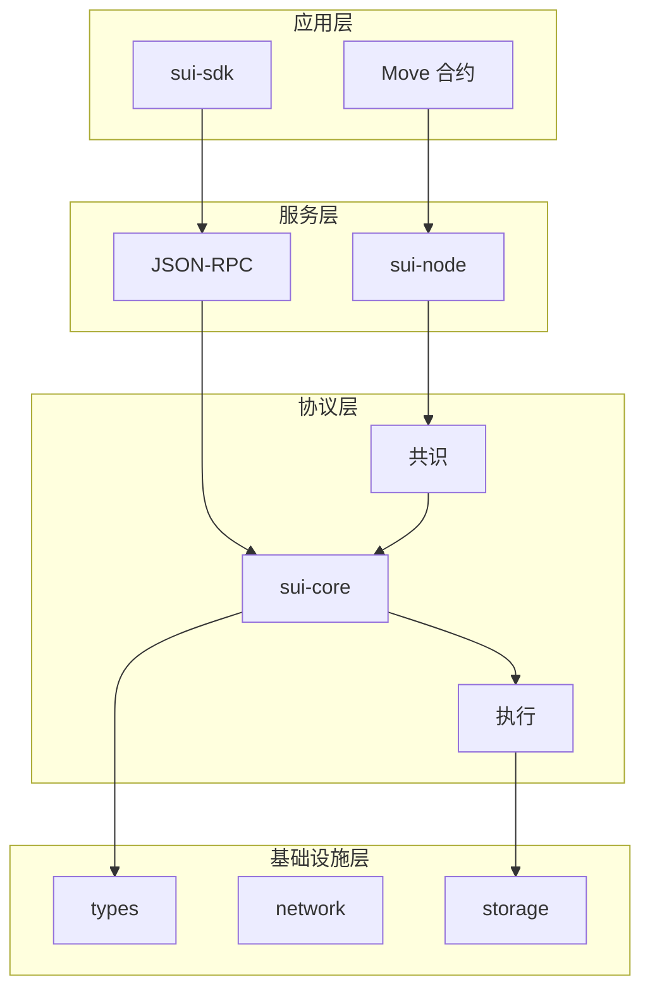

# Sui 架构概览

> **文档用途**: 10分钟快速理解 Sui 区块链的整体架构和核心设计
> 
> **适合人群**: 架构师、新人、技术决策者

---

## 目录

- [核心设计理念](#核心设计理念)
- [整体架构](#整体架构)
- [与其他区块链对比](#与其他区块链对比)
- [性能指标](#性能指标)
- [技术亮点](#技术亮点)
- [快速导航](#快速导航)

---

## 核心设计理念

### 1. 对象中心模型 vs 账户模型

**传统区块链 (Ethereum/Solana)**:
```
账户模型: Account → Balance
更新: balance[Alice] -= 100, balance[Bob] += 100
问题: 全局状态,难以并行
```

**Sui 的对象模型**:
```
对象模型: Object(ID, Version, Owner, Data)
更新: Coin(v1, Alice) → Coin(v2, Bob)
优势: 对象级并行,无全局锁
```

**关键特性**:
- 每个对象有唯一 ID 和版本号
- 所有权明确: Owned, Shared, Immutable
- 对象版本化存储 (ObjectID, Version) → Data

### 2. 因果顺序 vs 全序

**Sui 的创新**:
- **拥有对象 (Owned Objects)**: 仅需因果顺序,无需共识
- **共享对象 (Shared Objects)**: 需要全序,必须共识

**影响**:
```
FastPath (拥有对象):
  客户端 → 验证者签名 (2f+1) → 执行 → 完成
  延迟: ~200ms (2个网络往返)

共识路径 (共享对象):
  客户端 → 共识排序 → 执行 → 完成
  延迟: ~400-500ms (Mysticeti 共识 + 执行)
```

### 3. FastPath 机制

**原理**:
1. 拥有对象交易不涉及冲突
2. 验证者独立验证和签名
3. 收集 2f+1 签名即可执行
4. **跳过共识,直接执行**

**适用场景**:
- 转账 (Owned Coin)
- NFT 交易
- 单用户操作

### 4. 并行执行

**Sui 的优势**:
```
对象级并行:
  Tx1: Alice → Bob  (Coin_1)
  Tx2: Carol → Dave (Coin_2)
  → 可完全并行,无冲突
```

**Execution Scheduler**:
- 自动构建依赖图
- Barrier 机制检测冲突
- 非独占写可并行
- 独占写需等待

---

## 整体架构

### 4层架构设计

```
┌─────────────────────────────────────────────────────────────┐
│                     应用层 Application Layer                 │
│  - sui-sdk (Rust SDK)                                       │
│  - sui-framework (Move 合约: coin, transfer, object)        │
│  - Frontend Applications                                    │
└────────────────────────────┬────────────────────────────────┘
                             │
┌────────────────────────────┴────────────────────────────────┐
│                     服务层 Service Layer                     │
│  - sui-node (验证者/全节点主程序)                            │
│  - sui-json-rpc (JSON-RPC API)                              │
│  - sui-graphql-rpc (GraphQL API)                            │
│  - sui-indexer-alt (数据索引器)                             │
└────────────────────────────┬────────────────────────────────┘
                             │
┌────────────────────────────┴────────────────────────────────┐
│                   核心协议层 Protocol Layer                  │
│  - consensus-core (Mysticeti 共识, DAG-based BFT)           │
│  - sui-core (交易验证, 执行调度, Authority 逻辑)             │
│  - sui-execution (Move VM 集成, Gas 计量)                   │
│  - sui-storage (存储抽象, 对象缓存)                          │
└────────────────────────────┬────────────────────────────────┘
                             │
┌────────────────────────────┴────────────────────────────────┐
│                 基础设施层 Infrastructure Layer              │
│  - sui-types (ObjectID, TransactionDigest, 核心类型)        │
│  - mysten-network (P2P 网络, Anemo框架)                     │
│  - typed-store (RocksDB 封装, 类型安全 KV)                  │
│  - sui-crypto (Ed25519, BLS, zkLogin)                       │
└─────────────────────────────────────────────────────────────┘
```

### 数据流向

**写入路径 (交易提交)**:
```
1. 客户端 (sui-sdk)
   ↓ 构建交易
2. RPC 服务 (sui-json-rpc)
   ↓ 转发到验证者
3. sui-core (Authority)
   ↓ 验证 + 签名
4. consensus-core (如果是共享对象)
   ↓ 达成排序
5. sui-execution (Move VM)
   ↓ 执行合约
6. sui-storage (RocksDB)
   ↓ 持久化
7. 返回 Effects
```

**读取路径 (状态查询)**:
```
1. 客户端 (sui-sdk)
   ↓ 查询请求
2. RPC 服务 (sui-json-rpc)
   ↓ 查询接口
3. sui-storage (sharded LRU 缓存)
   ↓ 缓存未命中
4. authority_store (RocksDB)
   ↓ 读取对象
5. 返回结果
```

### 架构图



> **完整图表**: [diagrams/00-overall-architecture.mmd](diagrams/00-overall-architecture.mmd)

---

## 与其他区块链对比

| 特性 | Ethereum | Solana | Sui |
|-----|----------|--------|-----|
| **数据模型** | 账户模型 | 账户模型 | **对象模型** |
| **并行粒度** | 无 (串行) | 账户级 | **对象级** |
| **共识机制** | PoS (Gasper) | PoH + PoS | **DAG-based BFT** |
| **出块时间** | ~12秒 | ~400ms | ~400ms (共识)<br/>~200ms (FastPath) |
| **TPS (理论)** | ~15 | ~65,000 | **200,000+** |
| **最终确认** | 2个epoch<br/>(~13分钟) | ~13秒 | **即时** (BFT) |
| **状态存储** | Merkle Tree | Merkle Tree | **对象版本化** |
| **智能合约** | Solidity (EVM) | Rust/C (BPF) | **Move** |
| **Gas 模型** | 竞价拍卖 | 固定价格 | **对象级 Gas** |

### Sui 的核心优势

1. **更高的并行性**: 对象级并行 > 账户级并行 > 串行执行
2. **更低的延迟**: FastPath ~200ms vs 其他链 400ms-12s
3. **确定性最终性**: BFT 共识,无需等待多个区块
4. **可组合性**: Move 语言资源安全,防止重入攻击
5. **灵活的所有权**: Owned/Shared/Immutable 三种对象类型

### Sui 的权衡

1. **状态膨胀**: 对象存储可能比账户模型占用更多空间
2. **共享对象性能**: 仍需经过共识,延迟 ~400ms
3. **Move 生态**: 相比 EVM 生态较小
4. **存储成本**: 需要为对象存储付费 (Storage Rebate 机制)

---

## 性能指标

### 官方声称性能 (测试网)

| 指标 | 数值 | 说明 |
|-----|------|------|
| **峰值 TPS** | 200,000+ | 简单转账交易 (拥有对象) |
| **FastPath 延迟** | ~200ms | 拥有对象交易,2个网络往返 |
| **共识延迟** | ~400ms | Mysticeti, 3轮消息 |
| **总延迟** | ~500ms | 共识 + 执行 + 持久化 |
| **验证者数量** | 100+ | 主网验证者数量 |
| **最终确认** | 即时 | BFT 共识,无需等待 |

### 实际性能因素

**影响 TPS 的因素**:
1. **交易类型**: 
   - 简单转账: 200,000 TPS
   - 复杂合约: 10,000 - 50,000 TPS
   - DEX 交易: 5,000 - 20,000 TPS

2. **共享对象比例**:
   - 100% 拥有对象: 最高 TPS
   - 50% 共享对象: TPS 下降 50-70%
   - 100% 共享对象: TPS 最低 (受共识限制)

3. **网络状况**:
   - 验证者地理分布
   - P2P 网络延迟
   - 带宽限制

### 性能优化技术

1. **分片缓存**: 64 个 LRU 分片,减少锁竞争
2. **并行执行**: Execution Scheduler 自动调度
3. **批量处理**: 共识批量提交交易
4. **对象缓存**: 热点对象常驻内存
5. **Gas 优化**: Move 编译器优化

---

## 技术亮点

### 1. Mysticeti 共识协议

**特点**:
- DAG-based (有向无环图)
- BFT 容错 (拜占庭容错)
- **3轮消息即可提交** (vs PBFT 的 5轮)
- Wave-based 线性化

**流程**:
```
Round 3n+1: 领导者提议区块
Round 3n+2: 验证者投票
Round 3n+3: 决策和提交
```

**优势**:
- 低延迟: ~400ms
- 高吞吐: 支持 10,000+ TPS
- 活性保证: 即使部分节点离线

> **详细分析**: [notes/research/mysticeti/](../../notes/research/mysticeti/)

### 2. 对象版本化存储

**设计**:
```rust
ObjectKey = (ObjectID, VersionNumber)
Object = {
    id: ObjectID,
    version: SequenceNumber,
    owner: Owner,
    data: Vec<u8>,
}
```

**Lamport 版本分配**:
```
new_version = 1 + max(input_objects.versions)
```

**优势**:
- 支持历史查询
- 防止双花 (版本冲突检测)
- 简化状态同步

### 3. Execution Scheduler 并行调度

**Barrier 依赖机制**:
```rust
if mutability == Mutable {
    // 独占写入需要等待所有前置读写完成
    barrier_deps.extend(dep_state[object_id])
}
```

**调度策略**:
- 非独占写: 立即调度
- 独占写: 等待 Barrier
- 无依赖: 完全并行

**效果**:
- 自动检测依赖
- 最大化并行度
- 防止竞态条件

### 4. Move 语言集成

**Move 的优势**:
- **资源安全**: 资源不能被复制或丢弃
- **类型安全**: 强类型系统
- **可验证性**: 字节码验证器
- **Gas 可预测**: 静态分析 Gas 消耗

**Sui 的扩展**:
- sui::object 模块 (对象系统)
- sui::transfer 模块 (所有权转移)
- sui::dynamic_field (动态字段)
- sui::tx_context (交易上下文)

### 5. zkLogin

**创新**:
- 使用 OAuth 账号 (Google, Facebook) 登录
- 零知识证明验证身份
- 无需助记词

**流程**:
```
1. 用户 OAuth 登录
2. 获取 JWT token
3. 生成零知识证明
4. 提交交易 + 证明
5. 链上验证
```

---

## 快速导航

### 深入学习

- **理解 4 层架构** → [层级架构详解](01-LAYER-ARCHITECTURE.md)
- **学习核心模块** → [关键模块详解](02-KEY-MODULES.md)
- **了解交易流程** → [交易流程分析](03-TRANSACTION-FLOWS.md)
- **查询特定模块** → [模块完整索引](04-MODULE-INDEX.md)

### 特定主题

- **共识机制** → [01-LAYER-ARCHITECTURE.md#共识层](01-LAYER-ARCHITECTURE.md)
- **执行引擎** → [02-KEY-MODULES.md#sui-execution](02-KEY-MODULES.md)
- **存储架构** → [02-KEY-MODULES.md#sui-storage](02-KEY-MODULES.md)
- **DEX 开发** → [DEX 实现专项](05-DEX-IMPLEMENTATION.md)

### 外部资源

- [Sui 白皮书](https://github.com/MystenLabs/sui/blob/main/doc/paper/sui.pdf)
- [Mysticeti 论文](https://arxiv.org/abs/2310.14821)
- [Move 语言规范](https://github.com/move-language/move/blob/main/language/documentation/book/src/SUMMARY.md)

---

**下一步**: [层级架构详解 →](01-LAYER-ARCHITECTURE.md)
