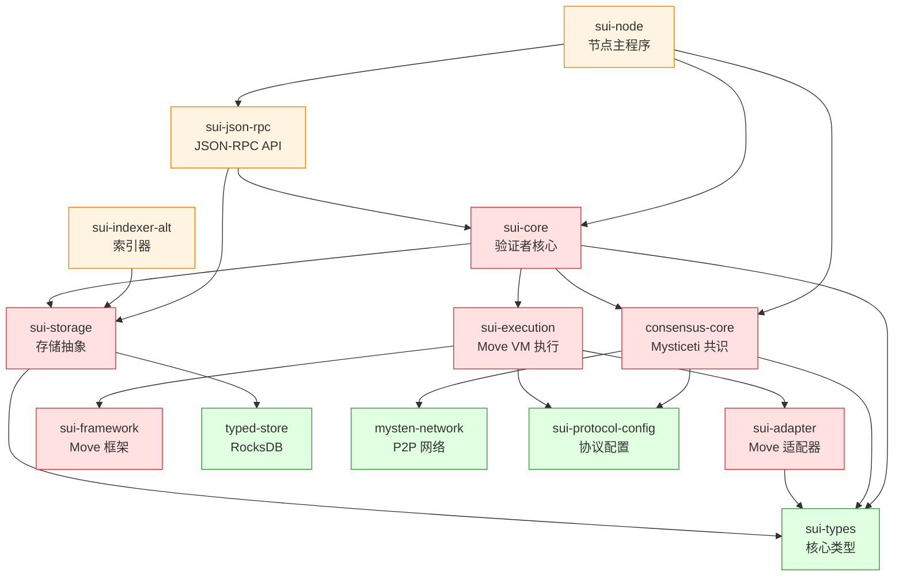

# Sui 关键模块详解

> **文档用途**: 深入解析 20-30 个最核心的 Rust 模块
>
> **预计阅读**: 1-2 小时 | **适合人群**: 开发者、代码贡献者

---

## 目录

- [模块分类](#模块分类)
- [共识模块 (4个)](#共识模块-4个)
- [执行模块 (6个)](#执行模块-6个)
- [核心逻辑模块 (4个)](#核心逻辑模块-4个)
- [存储模块 (4个)](#存储模块-4个)
- [网络模块 (3个)](#网络模块-3个)
- [服务模块 (4个)](#服务模块-4个)
- [其他核心模块 (5个)](#其他核心模块-5个)
- [核心模块依赖图](#核心模块依赖图)

---

## 模块分类

| 类别 | 模块数量 | 核心代表 |
|-----|---------|---------|
| 共识模块 | 4 | consensus-core |
| 执行模块 | 6 | sui-execution, sui-adapter |
| 核心逻辑 | 4 | sui-core, sui-types |
| 存储模块 | 4 | sui-storage, typed-store |
| 网络模块 | 3 | mysten-network |
| 服务模块 | 4 | sui-node, sui-json-rpc |
| 其他核心 | 5 | sui-protocol-config, sui-framework |
| **总计** | **30** | - |

---

## 共识模块 (4个)

### 1. consensus-core

**路径**: `consensus/core/`

**职责**:
- 实现 Mysticeti DAG-based BFT 共识协议
- 管理 DAG 状态和区块提交
- 协调验证者之间的投票和决策

**核心数据结构**:
```rust
pub struct BlockV2 {
    pub epoch: Epoch,
    pub round: Round,
    pub author: AuthorityIndex,
    pub ancestors: Vec<BlockRef>,       // DAG 前驱
    pub transactions: Vec<Transaction>, // 批量交易
}

pub struct DagState {
    blocks: HashMap<BlockDigest, BlockV2>,
    dag: DAG,  // 有向无环图
}
```

**关键流程**:
1. **区块提议** (Round 3n+1): 领导者提议新区块
2. **投票** (Round 3n+2): 验证者广播投票
3. **决策** (Round 3n+3): 检查是否达到 2f+1 投票,提交区块

**核心子模块**:
- `core.rs`: 共识主逻辑
- `block_manager.rs`: 区块管理和验证
- `dag_state.rs`: DAG 状态维护
- `commit_finalizer.rs`: 提交终结器 (Wave-based)
- `leader_schedule.rs`: 领导者调度 (轮换算法)
- `network/`: P2P 通信

**依赖**:
- `consensus-config` (配置)
- `consensus-types` (类型定义)
- `sui-protocol-config` (协议版本)
- `mysten-network` (网络通信)

**被依赖**:
- `sui-core` (接收共识输出)
- `sui-node` (集成到节点)

**相关文档**: [交易流程 - 共识路径](03-TRANSACTION-FLOWS.md#共享对象交易流程)

---

### 2. consensus-config

**路径**: `consensus/config/`

**职责**:
- 共识协议参数配置
- 验证者委员会配置
- 性能调优参数

**关键配置**:
```rust
pub struct ConsensusConfig {
    pub round_duration_ms: u64,        // 轮次时长 (默认 200ms)
    pub leader_timeout_ms: u64,        // 领导者超时
    pub min_wave_length: u32,          // Wave 最小长度
    pub max_pending_transactions: usize, // 最大待处理交易
}
```

**调优参数**:
- `round_duration_ms`: 200-500ms (低延迟 vs 高吞吐)
- `max_pending_transactions`: 10,000-100,000 (内存 vs 吞吐)

---

### 3. consensus-types

**路径**: `consensus/types/`

**职责**:
- 共识相关类型定义
- 区块、投票、证书等数据结构

**核心类型**:
```rust
pub struct Vote {
    pub block: BlockRef,
    pub author: AuthorityIndex,
    pub signature: Signature,
}

pub struct Certificate {
    pub block: Block,
    pub votes: Vec<Vote>,  // 2f+1 个投票
}

pub struct CommittedSubDag {
    pub blocks: Vec<Block>,  // 已提交的区块子图
    pub timestamp: u64,
}
```

---

### 4. consensus-simtests

**路径**: `consensus/simtests/`

**职责**: 共识协议模拟测试 (拜占庭故障、网络分区等)

---

## 执行模块 (6个)

### 5. sui-execution (⭐⭐⭐⭐⭐)

**路径**: `sui-execution/latest/`

**职责**:
- Move VM 执行层的统一入口
- 协议版本化管理 (v0, v1, v2, latest)
- Gas 计量和限制
- 执行结果生成

**架构设计** (关键):
```
sui-execution (多路复用器)
    ├─> sui-execution/v0   (历史版本快照)
    ├─> sui-execution/v1
    ├─> sui-execution/v2
    └─> sui-execution/latest (当前版本)
            ├─> sui-adapter (Move 适配器)
            ├─> sui-move-natives (原生函数)
            └─> sui-verifier (字节码验证器)
```

**为什么需要版本化?**
- 防止协议升级时状态同步分叉
- 不同验证者可能在不同协议版本
- 通过 `sui-protocol-config` 进行版本门控

**核心接口**:
```rust
pub trait Executor {
    fn execute_transaction(
        &self,
        protocol_config: &ProtocolConfig,
        tx: Transaction,
        input_objects: BTreeMap<ObjectID, Object>,
    ) -> Result<(ExecutionResults, Gas)>;
}
```

**执行流程**:
1. 加载输入对象 (从 storage)
2. 创建 `TemporaryStore` (临时状态)
3. 调用 Move VM 执行交易
4. 计量 Gas 消耗
5. 生成输出对象 (新版本)
6. 返回 `ExecutionResults`

**依赖**:
- `move-vm-runtime` (Move VM 核心)
- `sui-protocol-config` (协议版本)
- `sui-types` (类型系统)

**被依赖**:
- `sui-core/authority` (执行交易)

**重要提示**: ⚠️ **所有 authority 代码必须通过 `sui-execution` 访问执行层,不得直接依赖特定版本!**

---

### 6. sui-adapter

**路径**: `sui-execution/latest/sui-adapter/`

**职责**:
- 将 Move VM 集成到 Sui 区块链
- 处理对象模型和 Move 资源的转换
- Gas 计费逻辑
- 临时状态管理

**核心模块**:
- `adapter.rs`: VM 适配器主逻辑
- `execution_engine.rs`: 执行引擎
- `programmable_transactions/`: 可编程交易执行器
- `gas_charger.rs`: Gas 计费
- `temporary_store.rs`: 临时状态存储

**关键设计 - TemporaryStore**:
```rust
pub struct TemporaryStore {
    // 输入对象 (交易开始时)
    input_objects: BTreeMap<ObjectID, Object>,
    
    // Lamport 时间戳 (版本号生成)
    lamport_timestamp: SequenceNumber,
    
    // 执行结果 (新对象、删除对象、事件)
    execution_results: ExecutionResultsV2,
}
```

**Lamport 版本分配算法**:
```rust
// 确保对象版本单调递增
new_version = 1 + max(input_objects.versions)
```

**Programmable Transactions**:
- 支持批量操作 (TransferObjects, MoveCall等)
- 链式调用 (一个交易的输出可作为下一个的输入)
- Gas 优化 (批量执行减少签名验证)

**依赖**:
- `move-vm-runtime`
- `sui-types`
- `sui-protocol-config`

---

### 7. sui-verifier

**路径**: `sui-execution/latest/sui-verifier/`

**职责**:
- Move 字节码验证 (安全性检查)
- Gas 预估 (静态分析)
- Sui 特定规则验证

**验证规则**:
1. **标准 Move 验证**: 类型安全、资源安全
2. **Sui 扩展验证**:
   - 对象所有权检查
   - `sui::object::UID` 必须作为第一个字段
   - `entry` 函数签名检查
   - 禁止某些操作 (如 `copy` 对象)

**Gas Metering Verifier**:
- 插入 Gas 计量指令
- 防止无限循环 (最大指令数限制)

---

### 8. sui-move-natives

**路径**: `sui-execution/latest/sui-move-natives/`

**职责**: Sui 特有的 Move 原生函数实现

**核心原生函数**:
```rust
// 对象操作
native fun uid_to_inner(uid: &UID): address;
native fun delete_impl(id: address);

// 密码学
native fun hash_keccak256(data: &vector<u8>): vector<u8>;
native fun verify_signature(sig: &vector<u8>, pubkey: &vector<u8>, msg: &vector<u8>): bool;

// 动态字段
native fun add_impl<K: copy + drop + store, V: store>(
    object: &mut UID,
    key: K,
    value: V,
);
```

---

### 9. execution_scheduler

**路径**: `sui-core/src/execution_scheduler/`

**职责**:
- 并行执行调度
- 依赖检测 (Barrier 机制)
- 对象级锁管理

**Barrier 依赖机制**:
```rust
// 如果是独占写 (Mutable),需要等待所有前置操作完成
if mutability == Mutable {
    barrier_deps.extend(dep_state[object_id])
}

// 如果是非独占写,可以并行
if mutability == ImmutableBorrow || mutability == Shared {
    // 无需 barrier
}
```

**调度策略**:
- 无依赖交易: 立即调度执行
- 有依赖交易: 等待 Barrier 完成
- 共享对象交易: 按共识顺序串行执行

**效果**:
- 自动最大化并行度
- 防止竞态条件
- 保证确定性执行

---

### 10. temporary_store

**路径**: `sui-execution/latest/sui-adapter/src/temporary_store.rs`

**职责**:
- 执行期间的内存状态
- Lamport 时间戳版本分配
- 对象读写追踪

**核心数据结构**:
```rust
pub struct TemporaryStore {
    input_objects: BTreeMap<ObjectID, Object>,
    lamport_timestamp: SequenceNumber,
    execution_results: ExecutionResultsV2,
}

pub struct ExecutionResultsV2 {
    written_objects: Vec<Object>,      // 新创建或修改的对象
    deleted_objects: Vec<ObjectID>,    // 被删除的对象
    events: Vec<Event>,                // 发射的事件
    gas_summary: GasSummary,           // Gas 消耗统计
}
```

**版本分配示例**:
```
输入对象:
  - Coin_A (v10)
  - Coin_B (v20)

Lamport Timestamp = max(10, 20) + 1 = 21

输出对象:
  - Coin_C (v21) ← 新创建
  - Coin_A (v21) ← 修改后的新版本
```

---

## 核心逻辑模块 (4个)

### 11. sui-core (⭐⭐⭐⭐⭐)

**路径**: `crates/sui-core/`

**职责**:
- 验证者核心业务逻辑
- 交易验证和签名
- 执行调度和协调
- 状态管理和持久化

**核心子模块**:

#### authority/ (验证者逻辑)
- `authority.rs`: Authority 主结构
- `authority_store.rs`: 持久化存储
- `authority_per_epoch_store.rs`: Epoch 相关存储

```rust
pub struct AuthorityState {
    name: AuthorityName,
    committee: Arc<Committee>,
    epoch_store: Arc<AuthorityPerEpochStore>,
    database: Arc<AuthorityStore>,
    execution_cache: Arc<ExecutionCache>,
    consensus_adapter: Arc<ConsensusAdapter>,
}
```

#### execution_cache/ (执行缓存)
- 热点对象缓存
- 交易和 Effects 缓存
- 减少 RocksDB 访问

#### checkpoints/ (检查点机制)
- `checkpoint_executor/`: 检查点执行器
- `checkpoint_service/`: 检查点服务
- 状态同步和快照

#### epoch/ (Epoch 管理)
- Epoch 切换逻辑
- 验证者集合更新
- 协议升级

**关键流程 - 交易处理**:
```
1. handle_transaction()
   ↓
2. check_transaction_input()  // 验证输入
   ↓
3. sign_transaction()         // 验证者签名
   ↓ (收集 2f+1 签名)
4. execute_certificate()      // 执行证书
   ↓
5. sui-execution              // 调用执行层
   ↓
6. authority_store.persist()  // 持久化
   ↓
7. 返回 Effects
```

**依赖**:
- `consensus-core` (共识)
- `sui-execution` (执行)
- `sui-storage` (存储)
- `sui-types` (类型)

**被依赖**:
- `sui-node` (节点主程序)
- `sui-json-rpc` (RPC 服务)

---

### 12. sui-types (⭐⭐⭐⭐⭐)

**路径**: `crates/sui-types/`

**职责**: 整个 Sui 系统的核心类型定义

**核心类型**:

#### 基础类型 (`base_types.rs`)
```rust
pub struct ObjectID(pub AccountAddress);  // 20字节对象ID
pub struct TransactionDigest(pub [u8; 32]); // 交易摘要
pub struct SequenceNumber(pub u64);       // 对象版本号
```

#### 对象 (`object.rs`)
```rust
pub struct Object {
    pub data: Data,        // 对象数据
    pub owner: Owner,      // 所有权
    pub previous_transaction: TransactionDigest,
    pub storage_rebate: u64,  // 存储退款
}

pub enum Owner {
    AddressOwner(SuiAddress),   // 地址拥有 (Owned)
    ObjectOwner(ObjectID),      // 对象拥有 (Child Object)
    Shared { initial_shared_version: SequenceNumber }, // 共享对象
    Immutable,                  // 不可变对象
}
```

#### 交易 (`transaction.rs`)
```rust
pub struct Transaction {
    pub data: TransactionData,
    pub signatures: Vec<Signature>,  // 用户签名
}

pub struct TransactionData {
    pub kind: TransactionKind,
    pub sender: SuiAddress,
    pub gas_payment: ObjectRef,      // Gas 支付对象
    pub gas_price: u64,
    pub gas_budget: u64,
}
```

#### 交易效果 (`effects/`)
```rust
pub struct TransactionEffects {
    pub status: ExecutionStatus,     // 成功 or 失败
    pub executed_epoch: EpochId,
    pub gas_used: GasUsed,
    pub modified_at_versions: Vec<(ObjectID, SequenceNumber)>,
    pub created: Vec<ObjectRef>,     // 新创建的对象
    pub mutated: Vec<ObjectRef>,     // 修改的对象
    pub deleted: Vec<ObjectRef>,     // 删除的对象
    pub events: Vec<Event>,          // 事件
}
```

**其他关键模块**:
- `committee.rs`: 验证者委员会
- `crypto.rs`: 密钥和签名
- `coin.rs`, `balance.rs`: 代币和余额
- `dynamic_field/`: 动态字段

---

### 13. sui-framework (⭐⭐⭐⭐⭐)

**路径**: `crates/sui-framework/`

**职责**: Sui Move 标准库和系统包

**包结构**:
```
sui-framework/packages/
├── move-stdlib/          # Move 标准库
├── sui-framework/        # Sui 框架
│   ├── sources/
│   │   ├── object.move         # 对象系统
│   │   ├── transfer.move       # 所有权转移
│   │   ├── tx_context.move     # 交易上下文
│   │   ├── coin.move           # 代币标准
│   │   ├── balance.move        # 余额管理
│   │   ├── table.move          # 动态键值存储
│   │   ├── linked_table.move   # 链表
│   │   ├── clock.move          # 链上时钟
│   │   ├── event.move          # 事件系统
│   │   └── dynamic_field.move  # 动态字段
├── sui-system/           # Sui 系统包
│   └── sources/
│       ├── validator.move      # 验证者管理
│       ├── staking_pool.move   # 质押池
│       └── sui_system.move     # 系统对象
├── deepbook/             # DeepBook DEX
│   └── sources/
│       ├── clob_v2.move        # 订单簿
│       └── custodian_v2.move   # 资金托管
└── bridge/               # 跨链桥
```

**核心模块示例 - object.move**:
```move
module sui::object {
    struct UID has store {
        id: address,  // 唯一对象ID
    }
    
    public fun new(ctx: &mut TxContext): UID {
        UID { id: tx_context::new_object(ctx) }
    }
    
    public fun delete(id: UID) {
        let UID { id } = id;
        delete_impl(id)
    }
}
```

**核心模块示例 - transfer.move**:
```move
module sui::transfer {
    // 转移对象所有权
    public fun transfer<T: key>(obj: T, recipient: address) {
        transfer_impl(obj, recipient)
    }
    
    // 共享对象
    public fun share_object<T: key>(obj: T) {
        share_object_impl(obj)
    }
    
    // 冻结对象 (设为 Immutable)
    public fun freeze_object<T: key>(obj: T) {
        freeze_object_impl(obj)
    }
}
```

---

### 14. sui-transaction-checks

**路径**: `crates/sui-transaction-checks/`

**职责**: 交易合法性检查 (在执行前)

**检查项**:
1. Gas 预算检查
2. 输入对象存在性
3. 对象所有权验证
4. 签名验证
5. Epoch 有效性

---

## 存储模块 (4个)

### 15. sui-storage (⭐⭐⭐⭐⭐)

**路径**: `crates/sui-storage/`

**职责**:
- 存储抽象层 (统一接口)
- 分片 LRU 缓存
- 对象版本管理

**核心模块**:

#### sharded_lru.rs (分片缓存)
```rust
pub struct ShardedCache<K, V> {
    shards: Vec<Mutex<LruCache<K, V>>>,  // 64 个分片
    shard_mask: usize,                   // 用于分片选择
}

// 通过对象ID的哈希选择分片
fn shard_index(&self, key: &K) -> usize {
    hash(key) & self.shard_mask
}
```

**为什么要分片?**
- 减少锁竞争 (64个分片 vs 1个全局锁)
- 提高并发性能
- 局部性原理 (相同分片的对象可能在同一CPU缓存)

#### object_store.rs (对象存储抽象)
```rust
pub trait ObjectStore {
    fn get_object(&self, id: &ObjectID) -> Result<Option<Object>>;
    fn multi_get_objects(&self, ids: &[ObjectID]) -> Result<Vec<Option<Object>>>;
    fn insert_object(&self, object: Object) -> Result<()>;
}
```

**缓存策略**:
```
查询流程:
1. 查询 sharded_lru (内存缓存)
   ↓ 未命中
2. 查询 authority_store (RocksDB)
   ↓
3. 更新缓存
   ↓
4. 返回对象
```

**依赖**:
- `typed-store` (RocksDB)
- `sui-types`

---

### 16. authority_store

**路径**: `sui-core/src/authority/authority_store.rs`

**职责**:
- 持久化存储管理
- 对象版本化存储
- 交易和 Effects 存储

**核心表结构**:
```rust
pub struct AuthorityPerpetualTables {
    // 对象存储 (ObjectID, Version) → Object
    pub objects: DBMap<ObjectKey, StoreObjectWrapper>,
    
    // 交易存储 Digest → Transaction
    pub transactions: DBMap<TransactionDigest, TrustedTransaction>,
    
    // Effects 存储 Digest → Effects
    pub effects: DBMap<TransactionEffectsDigest, TransactionEffects>,
    
    // Checkpoint 存储
    pub checkpoints: DBMap<CheckpointSequenceNumber, Checkpoint>,
    
    // 事件存储
    pub events: DBMap<EventID, Event>,
}

pub struct ObjectKey {
    pub object_id: ObjectID,
    pub version: SequenceNumber,  // 关键:版本号
}
```

**存储格式**:
```
对象存储 (支持历史查询):
  (ObjectID=0x123, Version=1) → Object_v1
  (ObjectID=0x123, Version=2) → Object_v2
  (ObjectID=0x123, Version=3) → Object_v3

查询最新版本:
  object_id → latest_version
  (object_id, latest_version) → Object
```

**依赖**:
- `typed-store`

---

### 17. typed-store (⭐⭐⭐⭐⭐)

**路径**: `crates/typed-store/`

**职责**: RocksDB 的类型安全封装

**核心抽象 - DBMap**:
```rust
pub struct DBMap<K, V> {
    db: Arc<RocksDB>,
    cf_handle: Arc<BoundColumnFamily>,
    _phantom: PhantomData<(K, V)>,
}

impl<K, V> DBMap<K, V>
where
    K: Serialize,
    V: Serialize + DeserializeOwned,
{
    pub fn insert(&self, key: &K, value: &V) -> Result<()> {
        let key_bytes = bcs::to_bytes(key)?;
        let value_bytes = bcs::to_bytes(value)?;
        self.db.put_cf(self.cf_handle, key_bytes, value_bytes)?;
        Ok(())
    }
    
    pub fn get(&self, key: &K) -> Result<Option<V>> {
        let key_bytes = bcs::to_bytes(key)?;
        let value_bytes = self.db.get_cf(self.cf_handle, key_bytes)?;
        match value_bytes {
            Some(bytes) => Ok(Some(bcs::from_bytes(&bytes)?)),
            None => Ok(None),
        }
    }
}
```

**特性**:
- 类型安全 (编译时检查)
- BCS 序列化 (Binary Canonical Serialization)
- 列族 (Column Family) 支持
- 批量写入和事务

**核心子模块**:
- `rocks/`: RocksDB 适配器
- `traits.rs`: 存储 trait 定义

---

### 18. sharded_lru

**路径**: `sui-storage/src/sharded_lru.rs`

**详细分析** (补充 sui-storage):

**分片策略**:
```rust
// 64 个分片 (2^6)
const NUM_SHARDS: usize = 64;

// 使用对象ID的哈希值选择分片
fn shard_index(object_id: &ObjectID) -> usize {
    let hash = hash_object_id(object_id);
    hash as usize & (NUM_SHARDS - 1)  // 取低6位
}
```

**LRU 淘汰策略**:
- 每个分片独立维护 LRU
- 达到容量上限时淘汰最久未使用的条目
- 默认每个分片 10,000 条目 (总共 640,000 条)

**性能优化**:
- 无锁快速路径 (读取命中)
- 分片减少锁竞争
- CPU 缓存友好 (局部性)

---

## 网络模块 (3个)

### 19. mysten-network (⭐⭐⭐⭐⭐)

**路径**: `crates/mysten-network/`

**职责**:
- P2P 网络抽象层
- 连接管理和多路复用
- 编解码和序列化

**底层框架**: Anemo (基于 QUIC)

**核心特性**:
- **QUIC 协议**: 低延迟、多路复用
- **1-RTT 握手**: 快速连接建立
- **流控制**: 防止拥塞
- **TLS 1.3**: 加密传输

**依赖**:
- `anemo` (QUIC P2P 框架)
- `sui-types`

---

### 20. anemo (外部依赖)

**职责**: 高性能 QUIC-based P2P 框架

**特点**:
- 基于 Quinn (Rust QUIC 实现)
- Tower 中间件生态
- gRPC 风格 API

---

### 21. sui-network

**路径**: `crates/sui-network/`

**职责**: Sui 特定网络协议 (在 mysten-network 之上)

**协议类型**:
- 验证者间通信 (共识、证书传播)
- 全节点同步 (Checkpoint 下载)
- RPC 请求 (查询、提交交易)

---

## 服务模块 (4个)

### 22. sui-node (⭐⭐⭐⭐⭐)

**路径**: `crates/sui-node/`

**职责**: 验证者/全节点主程序

**核心结构**:
```rust
pub struct SuiNode {
    state: Arc<AuthorityState>,               // 验证者状态
    validator_components: ValidatorComponents, // 验证者组件 (共识等)
    http_servers: HttpServers,                // RPC 服务器
    transaction_orchestrator: Option<...>,    // 全节点交易协调器
    checkpoint_store: Arc<CheckpointStore>,   // Checkpoint 存储
}
```

**启动流程** (`main.rs`):
```
1. 加载配置 (NodeConfig)
2. 初始化运行时 (Tokio)
3. 启动 Prometheus 监控
4. 调用 SuiNode::start_async()
   ↓
5. 启动 AuthorityState
6. 启动 Consensus (如果是验证者)
7. 启动 RPC 服务
8. 启动 Checkpoint 同步
```

**依赖**:
- `sui-core`
- `sui-json-rpc`
- `consensus-core` (验证者)

---

### 23. sui-json-rpc (⭐⭐⭐⭐⭐)

**路径**: `crates/sui-json-rpc/`

**职责**: JSON-RPC API 服务器

**核心 API**:

#### ReadApi (状态查询)
```rust
// 查询对象
sui_getObject(object_id: ObjectID) -> Object

// 批量查询对象
sui_multiGetObjects(object_ids: Vec<ObjectID>) -> Vec<Object>

// 查询交易
sui_getTransaction(digest: TransactionDigest) -> TransactionResponse
```

#### TransactionExecutionApi (交易提交)
```rust
// 执行交易 (等待最终确认)
sui_executeTransactionBlock(
    tx_bytes: Base64,
    signatures: Vec<Base64>,
    options: TransactionBlockResponseOptions,
) -> TransactionBlockResponse
```

#### CoinReadApi (代币查询)
```rust
// 查询账户代币
sui_getCoins(
    owner: SuiAddress,
    coin_type: Option<String>,
) -> CoinPage

// 查询代币余额
sui_getBalance(
    owner: SuiAddress,
    coin_type: Option<String>,
) -> Balance
```

#### IndexerApi (索引查询)
```rust
// 查询交易历史
sui_queryTransactionBlocks(
    query: TransactionBlockQuery,
    cursor: Option<TransactionDigest>,
    limit: Option<usize>,
) -> TransactionBlockPage
```

**依赖**:
- `jsonrpsee` (RPC 框架)
- `sui-core`
- `sui-storage`

---

### 24. sui-graphql-rpc (⭐⭐⭐⭐)

**路径**: `crates/sui-graphql-rpc/`

**职责**: GraphQL API 服务器

**优势**:
- 灵活查询 (客户端指定返回字段)
- 减少过度获取 (Overfetching)
- 类型安全 (Schema 定义)

**查询示例**:
```graphql
query {
  object(address: "0x123") {
    version
    owner {
      __typename
      ... on AddressOwner {
        owner
      }
    }
    contents {
      type {
        repr
      }
      data
    }
  }
}
```

**依赖**:
- `async-graphql` (GraphQL 框架)
- `sui-indexer` (索引数据)
- `diesel` (PostgreSQL ORM)

---

### 25. sui-indexer-alt (⭐⭐⭐⭐⭐)

**路径**: `crates/sui-indexer-alt/`

**职责**: 新一代索引器主程序

**架构** (模块化):
```
sui-indexer-alt
    ├─> sui-indexer-alt-framework  (索引器框架)
    ├─> sui-indexer-alt-schema     (数据库 Schema)
    ├─> sui-indexer-alt-jsonrpc    (JSON-RPC 接口)
    └─> sui-indexer-alt-graphql    (GraphQL 接口)
```

**数据流**:
```
1. sui-data-ingestion-core
   ↓ 读取 Checkpoint
2. sui-indexer-alt-framework
   ↓ 解析交易和 Effects
3. sui-indexer-alt-schema
   ↓ 写入 PostgreSQL
4. sui-indexer-alt-jsonrpc / graphql
   ↓ 提供查询接口
5. 客户端查询
```

**与旧索引器对比**:
- 更模块化 (13个子 crate)
- 更高性能 (批量插入)
- 支持多种接口 (JSON-RPC + GraphQL)
- 一致性存储 (sui-indexer-alt-consistent-store)

---

## 其他核心模块 (5个)

### 26. sui-protocol-config (⭐⭐⭐⭐⭐)

**路径**: `crates/sui-protocol-config/`

**职责**: 协议参数配置和版本门控

**核心结构**:
```rust
pub struct ProtocolConfig {
    pub version: ProtocolVersion,  // 当前协议版本
    
    // Gas 相关
    pub max_tx_gas: u64,
    pub max_gas_price: u64,
    pub gas_rounding_step: u64,
    
    // 对象相关
    pub max_tx_size_bytes: u64,
    pub max_input_objects: u64,
    
    // Move VM 相关
    pub max_move_package_size: u64,
    pub max_move_vector_len: u64,
    
    // 功能开关 (Feature Flags)
    pub enable_zklogin: bool,
    pub enable_mysticeti_v2: bool,
}
```

**版本门控**:
```rust
if protocol_config.version >= ProtocolVersion::new(48) {
    // 使用 sui-execution/v2
} else {
    // 使用 sui-execution/v1
}
```

**为什么重要?**
- 防止协议升级时的不兼容
- 协调不同验证者的版本
- 平滑引入新功能

---

### 27. sui-config

**路径**: `crates/sui-config/`

**职责**: 节点配置管理

**核心配置**:
```rust
pub struct NodeConfig {
    pub protocol_key_pair: KeyPair,      // 验证者密钥
    pub account_key_pair: KeyPair,       // 账户密钥
    pub network_address: Multiaddr,      // P2P 地址
    pub json_rpc_address: SocketAddr,    // RPC 地址
    pub db_path: PathBuf,                // 数据库路径
    pub consensus_config: Option<ConsensusConfig>,  // 共识配置
}
```

---

### 28. sui-sdk (⭐⭐⭐⭐⭐)

**路径**: `crates/sui-sdk/`

**职责**: Rust SDK (客户端库)

**核心接口**:
```rust
pub struct SuiClient {
    api: Arc<RpcClient>,
}

impl SuiClient {
    // 查询对象
    pub async fn get_object(&self, id: ObjectID) -> Result<Object>;
    
    // 提交交易
    pub async fn execute_transaction_block(
        &self,
        tx: Transaction,
    ) -> Result<TransactionBlockResponse>;
    
    // 查询余额
    pub async fn get_balance(
        &self,
        owner: SuiAddress,
        coin_type: Option<String>,
    ) -> Result<Balance>;
}
```

**示例**:
```rust
let sui = SuiClientBuilder::default()
    .build("https://fullnode.mainnet.sui.io:443")
    .await?;

let object = sui.get_object(object_id).await?;
```

---

### 29. sui-transaction-builder

**路径**: `crates/sui-transaction-builder/`

**职责**: 交易构建器

**示例 - 转账交易**:
```rust
let tx = TransactionBuilder::new()
    .transfer_sui(
        sender,
        recipient,
        amount,
        gas_budget,
    )
    .build();

// 签名
let signature = keystore.sign(&sender, &tx)?;

// 提交
let response = sui_client.execute_transaction_block(tx, vec![signature]).await?;
```

**示例 - Move 调用**:
```rust
let tx = TransactionBuilder::new()
    .move_call(
        package_id,
        module_name,
        function_name,
        type_args,
        call_args,
        gas_budget,
    )
    .build();
```

---

### 30. sui-crypto

**路径**: `crates/shared-crypto/` (shared-crypto)

**职责**: 加密原语和签名算法

**支持的签名算法**:
- **Ed25519**: 验证者签名
- **ECDSA (Secp256k1)**: 用户签名 (兼容 Ethereum)
- **ECDSA (Secp256r1)**: 用户签名 (兼容 Web3)
- **BLS12-381**: 聚合签名 (zkLogin)

**核心接口**:
```rust
pub trait Signer {
    fn sign(&self, msg: &[u8]) -> Signature;
}

pub trait Verifier {
    fn verify(sig: &Signature, msg: &[u8], pubkey: &PublicKey) -> bool;
}
```

---

## 核心模块依赖图



---

**返回**: [架构文档首页](README.md) | **下一步**: [交易流程分析](03-TRANSACTION-FLOWS.md)
