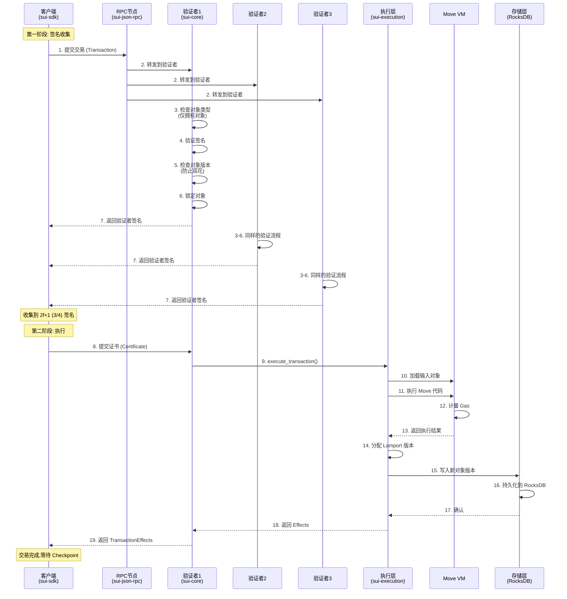
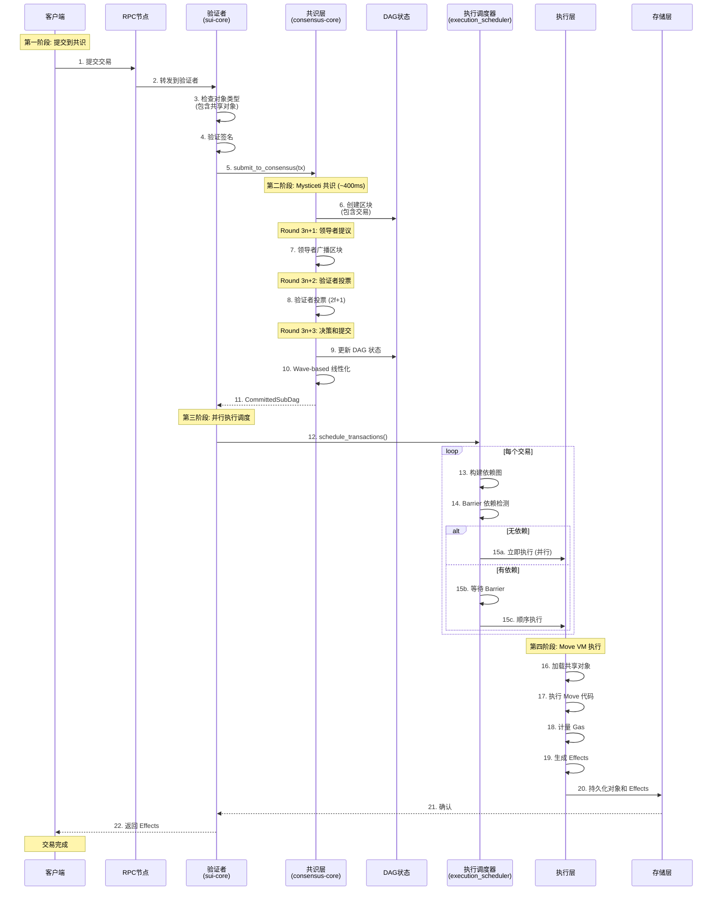
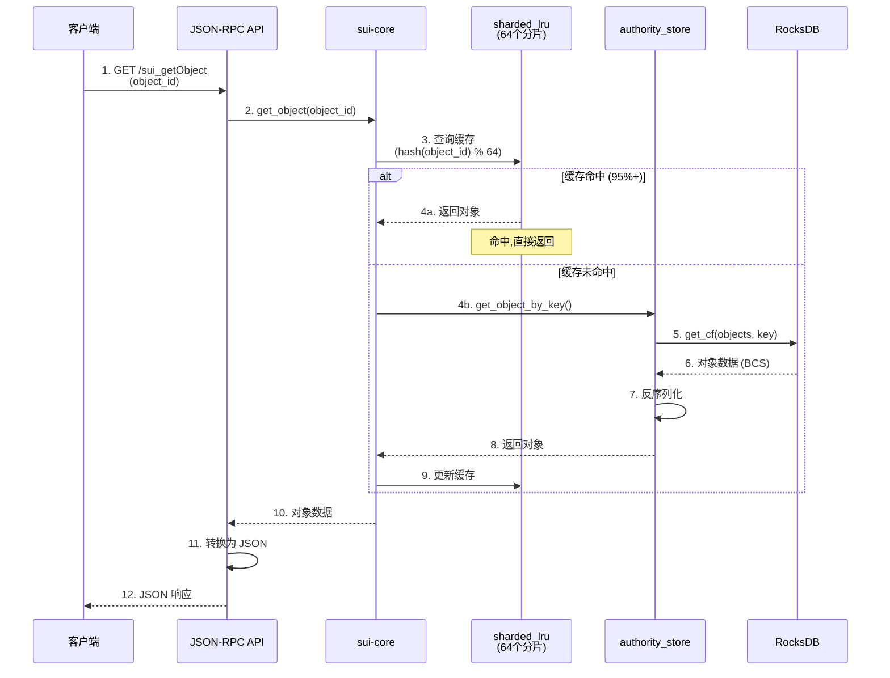
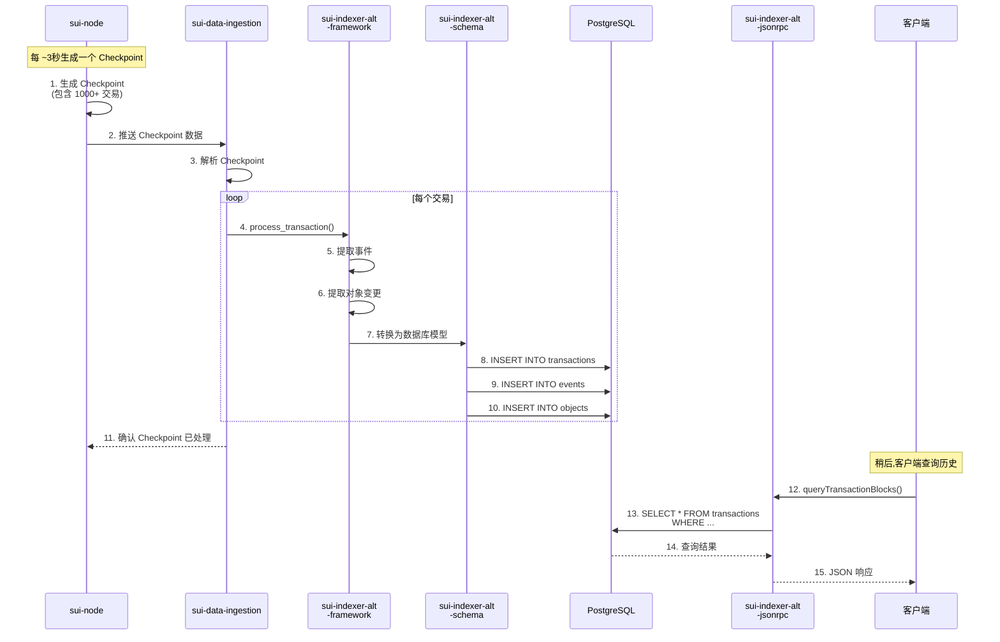

# Sui 交易流程分析

> **文档用途**: 深入理解 Sui 的关键调用链和数据流
>
> **预计阅读**: 30-45分钟 | **适合人群**: 开发者、性能优化工程师

---

## 目录

- [概述](#概述)
- [拥有对象交易流程 (FastPath)](#拥有对象交易流程-fastpath)
- [共享对象交易流程 (共识路径)](#共享对象交易流程-共识路径)
- [Mysticeti 共识流程](#mysticeti-共识流程)
- [数据查询流程](#数据查询流程)
- [索引流程](#索引流程)
- [状态存储流程](#状态存储流程)
- [性能分析](#性能分析)

---

## 概述

### Sui 的两种交易路径

Sui 根据交易涉及的对象类型,采用不同的处理路径:

| 交易类型 | 处理路径 | 延迟 | TPS | 示例 |
|---------|---------|------|-----|------|
| **拥有对象交易** | FastPath (跳过共识) | ~200ms | 200,000+ | 转账、NFT交易 |
| **共享对象交易** | 共识路径 | ~400-500ms | 2,000-5,000/Pool | DEX订单、拍卖 |

### 核心区别

**拥有对象 (Owned Objects)**:
- 只有一个所有者
- 无并发冲突
- 验证者独立处理
- 无需全局排序

**共享对象 (Shared Objects)**:
- 多个用户可访问
- 存在并发冲突
- 需要共识排序
- 保证确定性执行

---

## 拥有对象交易流程 (FastPath)

### 流程概述

FastPath 是 Sui 的创新设计,允许拥有对象交易跳过共识,直接执行。

**核心思想**:
- 拥有对象的交易不会与其他交易冲突
- 验证者可以独立验证和执行
- 只需收集 2f+1 签名即可确认

### 详细流程图



### 关键步骤详解

#### 第一阶段: 签名收集 (~100-150ms)

**1. 客户端构建交易**:
```rust
let tx = Transaction {
    data: TransactionData {
        kind: TransferObjects { objects: [coin_id], recipient },
        sender: sender_address,
        gas_payment: gas_coin,
        gas_price: 1000,
        gas_budget: 10_000_000,
    },
    signatures: vec![sender_signature],
};
```

**2. 验证者验证** (`sui-core/authority.rs:handle_transaction()`):
```rust
// 检查对象类型
for object_ref in tx.input_objects() {
    let object = self.get_object(&object_ref.id)?;
    if object.is_shared() {
        return Err(Error::SharedObjectInFastPath);
    }
}

// 验证签名
verify_signature(&tx.data, &tx.signatures)?;

// 检查对象版本 (防止双花)
for object_ref in tx.input_objects() {
    let current_version = self.get_latest_version(&object_ref.id)?;
    if object_ref.version != current_version {
        return Err(Error::ObjectVersionMismatch);
    }
}

// 锁定对象 (乐观锁)
self.lock_objects(&tx)?;

// 返回验证者签名
let signature = self.sign_transaction(&tx)?;
return Ok(signature);
```

**3. 客户端收集签名**:
- 并行向 N 个验证者请求
- 只需等待 2f+1 个响应
- 构建 `Certificate`

#### 第二阶段: 执行 (~100-150ms)

**4. 提交证书**:
```rust
let certificate = Certificate {
    transaction: tx,
    signatures: vec![sig1, sig2, sig3, ...],  // 2f+1 个签名
};
```

**5. 验证者执行** (`sui-core/authority.rs:execute_certificate()`):
```rust
// 验证证书 (检查 2f+1 签名)
verify_certificate(&certificate)?;

// 调用执行层
let effects = self.execution_cache
    .execute_transaction(certificate.transaction)?;

// 持久化
self.authority_store.persist_effects(effects)?;

return Ok(effects);
```

**6. 执行层处理** (`sui-execution/adapter.rs`):
```rust
// 加载输入对象
let input_objects = load_objects(tx.input_objects())?;

// 创建临时存储
let mut temporary_store = TemporaryStore::new(input_objects);

// 执行 Move VM
let execution_result = move_vm.execute_transaction(
    &tx.data,
    &mut temporary_store,
)?;

// 分配 Lamport 版本
let new_version = temporary_store.assign_lamport_version();

// 生成 Effects
let effects = TransactionEffects {
    status: ExecutionStatus::Success,
    created: temporary_store.created_objects(),
    mutated: temporary_store.mutated_objects(),
    deleted: temporary_store.deleted_objects(),
    gas_used: execution_result.gas_used,
    events: execution_result.events,
};

return Ok(effects);
```

**7. 存储持久化** (`sui-core/authority_store.rs`):
```rust
// 批量写入 RocksDB
let mut batch = self.db.batch();

// 写入新对象
for object in effects.created() {
    let key = ObjectKey { id: object.id(), version: object.version() };
    batch.put_cf(cf_objects, key, bcs::to_bytes(&object)?);
}

// 更新对象版本索引
for object in effects.mutated() {
    batch.put_cf(cf_latest_version, object.id(), object.version());
}

// 写入 Effects
batch.put_cf(cf_effects, tx.digest(), bcs::to_bytes(&effects)?);

// 原子提交
self.db.write(batch)?;
```

### 性能分析

**延迟分解**:
```
第一阶段 (签名收集):
  - 网络往返: 50-100ms
  - 验证处理: 10-20ms
  - 锁定对象: 5-10ms
  小计: ~100ms

第二阶段 (执行):
  - 网络往返: 20-50ms
  - Move VM 执行: 20-50ms
  - RocksDB 写入: 10-30ms
  - 生成 Effects: 5-10ms
  小计: ~100ms

总延迟: ~200ms
```

**吞吐量**:
- 无共识瓶颈
- 受限于网络带宽和CPU
- 理论上可达 200,000+ TPS

---

## 共享对象交易流程 (共识路径)

### 流程概述

共享对象交易必须经过 Mysticeti 共识,确保全局顺序。

**为什么需要共识?**
```
场景: BTC/USDC 订单簿 (共享对象)

用户A: 以 50,000 买入 1 BTC
用户B: 以 49,000 卖出 1 BTC

如果没有共识:
  验证者1: 先执行A,再执行B → 成交价 50,000
  验证者2: 先执行B,再执行A → 成交价 49,000
  → 状态分叉! ❌

有共识:
  所有验证者按相同顺序执行 → 状态一致 ✅
```

### 详细流程图



### 关键步骤详解

#### 第一阶段: 提交到共识

**检查共享对象**:
```rust
// sui-core/authority.rs
for object_ref in tx.input_objects() {
    let object = self.get_object(&object_ref.id)?;
    if object.is_shared() {
        // 必须走共识路径
        return self.submit_to_consensus(tx);
    }
}
```

#### 第二阶段: Mysticeti 共识 (详见下一节)

**共识输出**: `CommittedSubDag`
```rust
pub struct CommittedSubDag {
    pub blocks: Vec<Block>,  // 已提交的区块
    pub timestamp: u64,      // 提交时间
}

pub struct Block {
    pub epoch: Epoch,
    pub round: Round,
    pub transactions: Vec<Transaction>,  // 全局有序
}
```

#### 第三阶段: 执行调度

**Barrier 依赖检测** (`sui-core/execution_scheduler.rs`):
```rust
// 为每个对象维护依赖状态
let mut dep_state: HashMap<ObjectID, Vec<TransactionID>> = HashMap::new();

for tx in transactions {
    let mut barrier_deps = Vec::new();

    for obj_ref in tx.input_objects() {
        if obj_ref.mutability == Mutable {
            // 独占写入: 需要等待所有前置操作
            barrier_deps.extend(&dep_state[&obj_ref.id]);
        }
        // 更新依赖状态
        dep_state.get_mut(&obj_ref.id).push(tx.id);
    }

    if barrier_deps.is_empty() {
        // 无依赖,立即调度
        schedule_immediately(tx);
    } else {
        // 有依赖,等待 Barrier
        schedule_after_barrier(tx, barrier_deps);
    }
}
```

**并行执行示例**:
```
交易序列 (共识排序):
  Tx1: 修改 OrderBook_BTC_USDC
  Tx2: 修改 OrderBook_ETH_USDC
  Tx3: 修改 OrderBook_BTC_USDC
  Tx4: 修改 OrderBook_ETH_USDC

调度结果:
  Tx1 和 Tx2 并行执行 ✅ (不同对象)
  Tx3 等待 Tx1 完成 ⏳ (同一对象)
  Tx4 等待 Tx2 完成 ⏳ (同一对象)
```

### 性能分析

**延迟分解**:
```
第一阶段 (提交):
  - 网络往返: 20-50ms
  - 验证处理: 10-20ms
  小计: ~50ms

第二阶段 (共识):
  - Round 3n+1: 50-100ms (提议)
  - Round 3n+2: 100-150ms (投票)
  - Round 3n+3: 50-100ms (提交)
  - 线性化: 50-100ms
  小计: ~400ms

第三阶段 (调度):
  - 依赖分析: 10-20ms
  小计: ~20ms

第四阶段 (执行):
  - Move VM: 20-50ms
  - RocksDB: 10-30ms
  小计: ~50ms

总延迟: ~520ms
```

**吞吐量**:
- 受共识限制
- 单个共享对象: 2,000-5,000 TPS
- 多个共享对象 (不同): 可并行,总TPS提升

---

## Mysticeti 共识流程

### 共识概述

Mysticeti 是 Sui 的 DAG-based BFT 共识协议,具有以下特点:

- **3轮消息**: 比 PBFT 的 5轮更快
- **Wave-based**: 批量提交区块
- **乐观路径**: 无超时情况下 3轮即可提交

### DAG 结构

```
Epoch 1, Round 3n+3 (决策轮):
  ┌─────────┐
  │ Block E │ (提交)
  └────┬────┘
       │
Round 3n+2 (投票轮):
  ┌────┴────┬─────────┬─────────┐
  │ Block A │ Block B │ Block C │ (投票)
  └────┬────┴────┬────┴────┬────┘
       │         │         │
Round 3n+1 (提议轮):
  ┌────┴────┐ ┌──┴───┐ ┌──┴───┐
  │ Block 1 │ │Block2│ │Block3│ (领导者提议)
  └─────────┘ └──────┘ └──────┘
```

### 详细流程

#### Round 3n+1: 领导者提议

**领导者选举** (`consensus-core/leader_schedule.rs`):
```rust
// 基于轮次和 Epoch 确定性选举
fn leader_for_round(round: Round, committee: &Committee) -> AuthorityIndex {
    let seed = hash((epoch, round));
    committee.authorities[seed % committee.size()]
}
```

**区块提议**:
```rust
// 领导者创建区块
let block = Block {
    epoch: current_epoch,
    round: 3n + 1,
    author: self.authority_index,
    ancestors: self.dag.latest_blocks(),  // 指向前一轮的区块
    transactions: self.mempool.pop(batch_size),
};

// 广播到所有验证者
self.network.broadcast(block);
```

#### Round 3n+2: 验证者投票

**接收和验证**:
```rust
// 验证者接收区块
fn handle_block(&mut self, block: Block) {
    // 验证区块
    if !self.verify_block(&block) {
        return Err(Error::InvalidBlock);
    }

    // 添加到 DAG
    self.dag.add_block(block.clone());

    // 投票 (如果区块有效)
    let vote = Vote {
        block_ref: block.digest(),
        author: self.authority_index,
        signature: self.sign(&block),
    };

    // 广播投票
    self.network.broadcast(vote);
}
```

**收集投票**:
```rust
// 每个验证者收集投票
fn handle_vote(&mut self, vote: Vote) {
    self.votes_for_block
        .entry(vote.block_ref)
        .or_insert_with(Vec::new)
        .push(vote);

    // 检查是否达到 2f+1
    if self.votes_for_block[&vote.block_ref].len() >= self.committee.quorum() {
        // 区块获得证书,可以提交
        self.certified_blocks.insert(vote.block_ref);
    }
}
```

#### Round 3n+3: 决策和提交

**Wave-based 提交**:
```rust
// 每个 Wave 包含 3 轮
fn commit_wave(&mut self, wave_round: Round) {
    // 查找该 Wave 中获得证书的区块
    let certified_blocks = self.dag
        .blocks_in_round(wave_round + 1)  // Round 3n+2
        .filter(|b| self.certified_blocks.contains(&b.digest()));

    // 如果有 2f+1 个证书,提交整个 Wave
    if certified_blocks.len() >= self.committee.quorum() {
        // 线性化 DAG (拓扑排序)
        let ordered_blocks = self.linearize_dag(certified_blocks);

        // 提取所有交易 (全局有序)
        let committed_transactions = ordered_blocks
            .flat_map(|b| b.transactions)
            .collect();

        // 提交给执行层
        self.commit_transactions(committed_transactions);
    }
}
```

**线性化算法** (Wave-based):
```rust
fn linearize_dag(&self, blocks: Vec<Block>) -> Vec<Block> {
    // 1. 收集所有祖先 (递归)
    let mut all_blocks = HashSet::new();
    for block in blocks {
        self.collect_ancestors(block, &mut all_blocks);
    }

    // 2. 拓扑排序 (按 Round 和权重)
    let mut sorted_blocks = all_blocks.into_iter().collect::<Vec<_>>();
    sorted_blocks.sort_by_key(|b| (b.round, b.weight()));

    // 3. 返回有序区块列表
    sorted_blocks
}
```

### 共识性能

**延迟**:
- 乐观情况: 3轮 × 100ms/轮 = ~300ms
- 悲观情况 (重试): ~500-600ms
- 平均: ~400ms

**吞吐量**:
- 批量大小: 100,000-500,000 交易/批
- 批量频率: ~400ms/批
- 理论 TPS: 250,000-1,250,000

**实际瓶颈**:
- 网络带宽 (区块广播)
- CPU (签名验证)
- 共享对象冲突 (降低并行度)

---

## 数据查询流程

### 流程图



### 缓存策略

**分片 LRU 缓存** (`sui-storage/sharded_lru.rs`):
```rust
pub struct ShardedCache<K, V> {
    shards: Vec<Mutex<LruCache<K, V>>>,  // 64 个分片
    shard_mask: usize,  // 0x3F (63)
}

impl<K, V> ShardedCache<K, V> {
    fn shard_index(&self, key: &K) -> usize {
        let hash = hash_object_id(key);
        (hash as usize) & self.shard_mask  // 取低 6 位
    }

    fn get(&self, key: &K) -> Option<V> {
        let index = self.shard_index(key);
        let mut shard = self.shards[index].lock().unwrap();
        shard.get(key).cloned()
    }

    fn put(&self, key: K, value: V) {
        let index = self.shard_index(&key);
        let mut shard = self.shards[index].lock().unwrap();
        shard.put(key, value);
    }
}
```

**为什么 64 个分片?**
- 减少锁竞争 (64个锁 vs 1个全局锁)
- CPU 缓存友好 (每个分片 ~10,000 条目)
- 2^6 = 64,位运算高效

**缓存配置**:
```rust
const NUM_SHARDS: usize = 64;
const ENTRIES_PER_SHARD: usize = 10_000;
const TOTAL_CACHE_SIZE: usize = 640_000;  // 约 640K 对象
```

### 查询性能

| 操作 | 延迟 | 说明 |
|-----|------|------|
| 缓存命中 | <1ms | 内存读取 |
| 缓存未命中 | 5-20ms | RocksDB 读取 |
| 批量查询 (10个) | 10-50ms | 并行读取 |

---

## 索引流程

### 架构概述

```
sui-node (实时执行)
    ↓ Checkpoint 数据
sui-data-ingestion-core (数据摄取)
    ↓ 解析交易和事件
sui-indexer-alt-framework (索引框架)
    ↓ 转换为数据库模型
PostgreSQL (持久化)
    ↓ SQL 查询
sui-indexer-alt-jsonrpc (查询接口)
    ↓ JSON-RPC
客户端 (历史查询)
```

### 详细流程



### 数据库 Schema

**transactions 表**:
```sql
CREATE TABLE transactions (
    tx_digest BYTEA PRIMARY KEY,
    checkpoint_seq BIGINT,
    timestamp BIGINT,
    sender TEXT,
    transaction_kind TEXT,
    gas_used BIGINT,
    status TEXT,
    -- ...
);

CREATE INDEX idx_transactions_sender ON transactions(sender);
CREATE INDEX idx_transactions_checkpoint ON transactions(checkpoint_seq);
```

**events 表**:
```sql
CREATE TABLE events (
    event_id BIGSERIAL PRIMARY KEY,
    tx_digest BYTEA,
    event_type TEXT,
    package_id TEXT,
    module TEXT,
    event_data JSONB,
    -- ...
);

CREATE INDEX idx_events_type ON events(event_type);
CREATE INDEX idx_events_tx ON events(tx_digest);
```

### 索引器性能

**吞吐量**:
- 处理速度: 1,000-5,000 TPS
- 延迟: 1-5 秒 (相对链上)

**优化建议**:
- 批量插入 (1000条/批)
- 异步写入
- 分区表 (按时间)

---

## 状态存储流程

### 对象版本化存储

**存储格式**:
```
ObjectKey = (ObjectID, Version)
ObjectValue = Object (BCS 编码)

示例:
  (0x123, v1) → Object { ... }
  (0x123, v2) → Object { ... }
  (0x123, v3) → Object { ... }
```

**版本索引**:
```
LatestVersionMap:
  ObjectID → Version

示例:
  0x123 → v3 (最新版本)
```

**查询最新版本**:
```rust
// 1. 查询版本索引
let latest_version = self.get_latest_version(object_id)?;

// 2. 构建 ObjectKey
let key = ObjectKey { id: object_id, version: latest_version };

// 3. 查询对象
let object = self.objects.get(&key)?;
```

### RocksDB 列族

```
sui-storage RocksDB:
  ├─ cf_objects: (ObjectID, Version) → Object
  ├─ cf_latest_version: ObjectID → Version
  ├─ cf_transactions: TransactionDigest → Transaction
  ├─ cf_effects: TransactionDigest → Effects
  ├─ cf_checkpoints: CheckpointSeq → Checkpoint
  └─ cf_events: EventID → Event
```

---

## 性能分析

### 延迟对比

| 操作 | FastPath | 共识路径 | 说明 |
|-----|---------|---------|------|
| 转账 | ~200ms | N/A | 拥有对象 |
| DEX 下单 | N/A | ~500ms | 共享对象 |
| NFT 交易 | ~200ms | N/A | 拥有对象 |
| 查询对象 | <1ms | <1ms | 缓存命中 |
| 查询历史 | 50-200ms | 50-200ms | 索引器 |

### TPS 对比

| 场景 | TPS | 瓶颈 |
|-----|-----|------|
| 简单转账 (FastPath) | 200,000+ | 网络/CPU |
| 单交易对 DEX | 2,000-5,000 | 共识 |
| 10个交易对 DEX | 20,000-50,000 | 执行 |
| 混合负载 | 50,000-100,000 | 共识+执行 |

### 优化建议

**1. FastPath 优化**:
- 并行签名收集
- 批量证书提交
- 减少网络往返

**2. 共识优化**:
- 调整批次大小
- 优化网络拓扑
- 使用更快的签名算法

**3. 执行优化**:
- 最大化并行度 (不同共享对象)
- 优化 Move 合约 (减少 Gas)
- 预编译热点合约

**4. 存储优化**:
- 增大缓存
- 使用 NVMe SSD
- 调优 RocksDB 参数

---

**返回**: [架构文档首页](README.md) | **相关**: [关键模块详解](02-KEY-MODULES.md)
