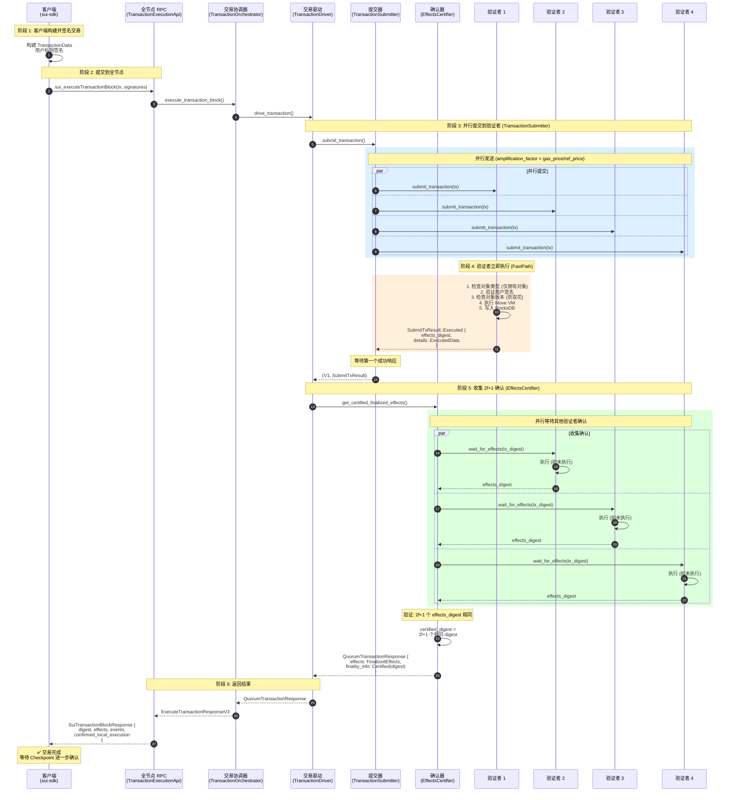
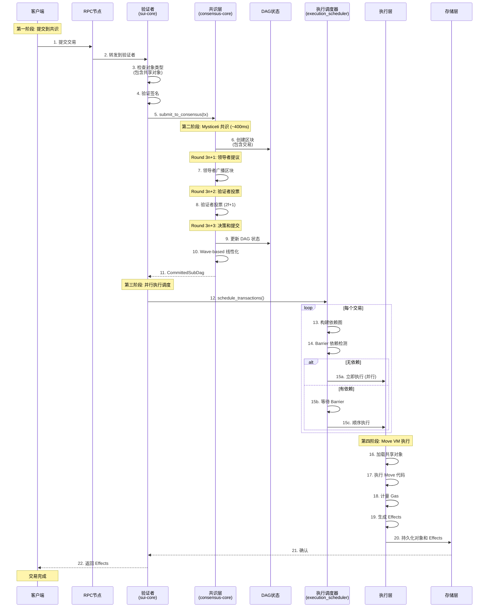
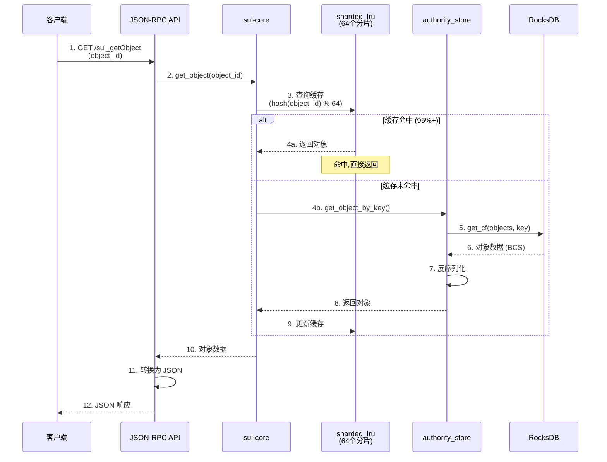
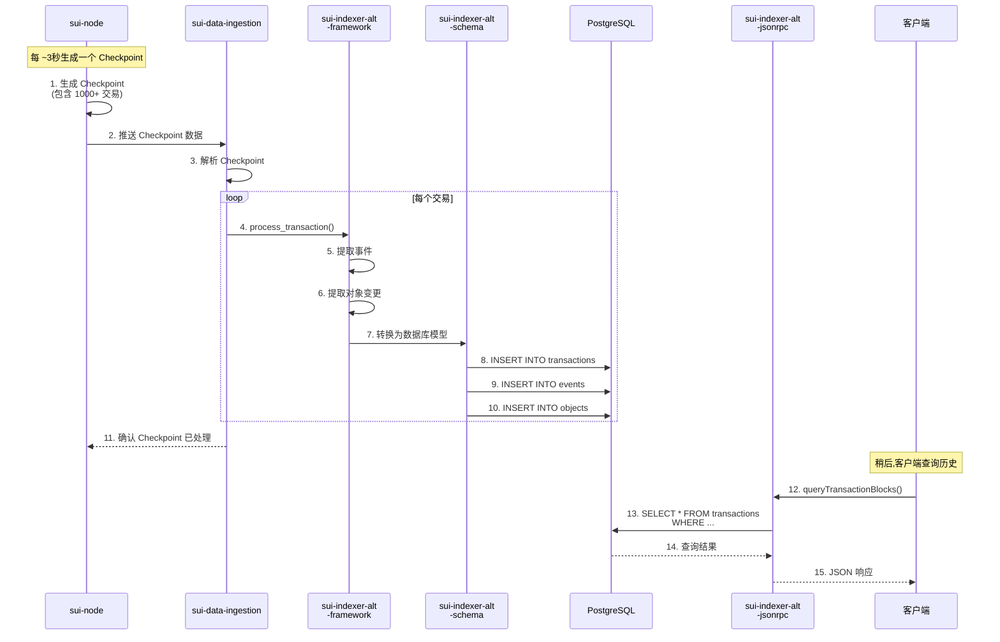

# Sui 交易流程分析

> **文档用途**: 深入理解 Sui 的关键调用链和数据流
>
> **预计阅读**: 30-45分钟 | **适合人群**: 开发者、性能优化工程师

---

## 目录

- [概述](#概述)
- [拥有对象交易流程 (FastPath)](#拥有对象交易流程-fastpath)
- [共享对象交易流程 (共识路径)](#共享对象交易流程-共识路径)
- [Mysticeti 共识流程](#mysticeti-共识流程)
- [数据查询流程](#数据查询流程)
- [索引流程](#索引流程)
- [状态存储流程](#状态存储流程)
- [性能分析](#性能分析)

---

## 概述

### Sui 的两种交易路径

Sui 根据交易涉及的对象类型,采用不同的处理路径:

| 交易类型 | 处理路径 | 延迟 | TPS | 示例 |
|---------|---------|------|-----|------|
| **拥有对象交易** | FastPath (跳过共识) | ~200ms | 200,000+ | 转账、NFT交易 |
| **共享对象交易** | 共识路径 | ~400-500ms | 2,000-5,000/Pool | DEX订单、拍卖 |

### 核心区别

**拥有对象 (Owned Objects)**:
- 只有一个所有者
- 无并发冲突
- 验证者独立处理
- 无需全局排序

**共享对象 (Shared Objects)**:
- 多个用户可访问
- 存在并发冲突
- 需要共识排序
- 保证确定性执行

---

## 拥有对象交易流程 (FastPath)

### 流程概述

FastPath 是 Sui 的创新设计,允许拥有对象交易跳过共识,直接执行。

**核心原理**:
- 拥有对象只有唯一所有者,无并发写入冲突
- 验证者可独立验证对象版本和签名
- 验证者立即执行并返回 TransactionEffects
- 全节点收集 2f+1 个相同 effects_digest 作为最终性证明

**关键数据结构**:
```rust
// crates/sui-types/src/transaction.rs:3712
pub type CertifiedTransaction = Envelope<SenderSignedData, AuthorityStrongQuorumSignInfo>;

// 注意: 在当前 TransactionDriver 实现中,CertifiedTransaction 并未被使用
// 取而代之的是 FinalizedEffects (包含 2f+1 effects_digest 确认)

// crates/sui-types/src/transaction_driver_types.rs
pub struct FinalizedEffects {
    pub effects: TransactionEffects,
    pub finality_info: EffectsFinalityInfo,  // Certified(effects_digest) 或 Checkpointed
}
```

**架构角色**:

| 组件 | 职责 | 代码位置 |
|-----|------|---------|
| **客户端 (sui-sdk)** | 构建 TransactionData,用户签名,提交到全节点 | sui-sdk |
| **全节点 RPC** | 接收客户端请求,调用 TransactionOrchestrator | sui-json-rpc/transaction_execution_api.rs:137 |
| **TransactionOrchestrator** | 协调提交、重试、本地执行等待逻辑 | sui-core/transaction_orchestrator.rs |
| **TransactionDriver** | 核心驱动:提交到验证者 + 收集 2f+1 确认 | sui-core/transaction_driver/mod.rs |
| **TransactionSubmitter** | 并行向多个验证者提交交易 | sui-core/transaction_driver/transaction_submitter.rs |
| **EffectsCertifier** | 收集 2f+1 个 effects_digest 确认 | sui-core/transaction_driver/effects_certifier.rs |
| **验证者 (Authority)** | 验证签名、检查对象版本、执行交易 | sui-core/authority.rs |

### 详细流程图



### 核心问题解答

#### Q1: 到底有没有"签名收集"和"证书提交"?

**答案**: 有概念,但**当前实现中未使用**。

**代码证据**:
```rust
// crates/sui-types/src/transaction.rs:3712
// CertifiedTransaction 类型定义存在
pub type CertifiedTransaction = Envelope<SenderSignedData, AuthorityStrongQuorumSignInfo>;

// AuthorityStrongQuorumSignInfo 包含聚合签名
pub struct AuthorityQuorumSignInfo<const STRONG_THRESHOLD: bool> {
    pub epoch: EpochId,
    pub signature: AggregateAuthoritySignature,  // BLS 聚合签名
    pub signers_map: RoaringBitmap,  // 签名者位图
}
```

**但是**:
- `TransactionDriver` (sui-core/transaction_driver/mod.rs) **未使用** CertifiedTransaction
- `TransactionSubmitter` 只等待**第一个验证者成功执行**,不收集签名
- `EffectsCertifier` 收集的是 **effects_digest** (哈希),不是签名

**设计演进推测**:
1. **早期设计** (类似 PBFT): 两阶段,先收集签名构建 Certificate,再执行
2. **当前实现** (优化版): 验证者立即执行,收集 effects_digest 确认

**为什么不收集签名?**
- **性能优化**: 省略一轮网络往返 (签名收集阶段)
- **简化流程**: effects_digest 本身就能证明 2f+1 验证者执行了相同结果
- **保留兼容**: CertifiedTransaction 类型保留但不使用 (可能用于测试或未来特性)

---

### 关键步骤详解

#### 阶段 1: 客户端构建交易 (~1-10ms)

**代码**: sui-sdk
```rust
// 客户端构建交易数据
let tx_data = TransactionData {
    kind: TransferObjects {
        objects: vec![coin_object_ref],
        recipient
    },
    sender: sender_address,
    gas_payment: gas_coin_ref,
    gas_price: 1000,  // 影响 amplification_factor
    gas_budget: 10_000_000,
};

// 用户签名
let signature = sender_keypair.sign(&tx_data);
let tx = Transaction::from_generic_sig_data(tx_data, vec![signature]);
```

**关键点**:
- `gas_price` 决定并行提交的验证者数量 (amplification_factor = gas_price / reference_gas_price)
- 只需**客户端签名**,无需验证者签名

---

#### 阶段 2: 全节点接收 (~5-20ms)

**代码**: sui-json-rpc/transaction_execution_api.rs:137-169
```rust
async fn execute_transaction_block(
    &self,
    tx_bytes: Base64,
    signatures: Vec<Base64>,
    ...
) -> Result<SuiTransactionBlockResponse, Error> {
    // 构建请求
    let request = ExecuteTransactionRequestV3 {
        transaction: txn,
        include_events: true,
        include_input_objects: true,
        include_output_objects: true,
    };

    // 调用 TransactionOrchestrator
    let (response, is_executed_locally) = self.transaction_orchestrator
        .execute_transaction_block(request, request_type, None)
        .await?;

    // ... 转换为 JSON 响应
}
```

**关键点**:
- `request_type` 控制等待策略:
  - `WaitForEffectsCert`: 等待 2f+1 确认 (默认,推荐)
  - `WaitForLocalExecution`: 仅等待本地验证者执行 (快但不安全)

---

#### 阶段 3: 并行提交到验证者 (~50-150ms)

**代码**: sui-core/transaction_driver/transaction_submitter.rs:51-191
```rust
pub async fn submit_transaction<A>(
    &self,
    authority_aggregator: &Arc<AuthorityAggregator<A>>,
    ...
    amplification_factor: u64,  // = gas_price / reference_gas_price
    request: SubmitTxRequest,
) -> Result<(AuthorityName, SubmitTxResult), TransactionDriverError> {
    let mut request_rpcs = FuturesUnordered::new();

    // 并行向多个验证者提交
    loop {
        // 填充到 amplification_factor 个并发请求
        while request_rpcs.len() < amplification_factor as usize {
            let (name, client) = retrier.next_target()?;  // 优先选择历史表现好的验证者

            let submit_fut = self.submit_transaction_once(
                client, &request, ...
            );
            request_rpcs.push(submit_fut);  // 并行执行
        }

        // 等待第一个成功响应 (race condition)
        match request_rpcs.next().await {
            Some((name, Ok(result))) => {
                // 第一个成功的验证者返回
                return Ok((name, result));
            }
            Some((name, Err(e))) => {
                // 失败则继续等待其他验证者
                retrier.add_error(name, e)?;
            }
        }
    }
}
```

**关键点**:
- **amplification_factor**: gas_price 越高,并行提交越多,成功率越高
- **只等第一个成功**: 不需要 2f+1 个提交成功,只需 1 个
- **验证者选择**: ValidatorClientMonitor 优先选择历史延迟低、成功率高的验证者
- **容错重试**: 如果选中的验证者失败,自动选择其他验证者重试

---

#### 阶段 4: 验证者立即执行 (~30-100ms)

**代码**: sui-core/authority.rs (submit_transaction 处理)
```rust
// 验证者接收到 submit_transaction 请求
async fn handle_submit_transaction(
    &self,
    request: SubmitTxRequest,
) -> Result<SubmitTxResult> {
    let tx = request.transaction.unwrap();

    // 1. 检查对象类型
    for object_ref in tx.input_objects() {
        let object = self.get_object(&object_ref.id)?;
        if object.is_shared() {
            // 共享对象必须走共识路径
            return self.submit_to_consensus(tx);
        }
    }

    // 2. 验证用户签名
    tx.verify_signatures_authenticated(...)?;

    // 3. 检查对象版本 (防止双花)
    for object_ref in tx.input_objects() {
        let current_version = self.get_latest_version(&object_ref.id)?;
        if object_ref.version != current_version {
            return Err(SuiError::ObjectVersionMismatch { ... });
        }
    }

    // 4. 立即执行交易 (FastPath 关键!)
    let (effects, events, input_objects, output_objects) = self
        .execution_cache
        .execute_transaction(tx)?;

    // 5. 持久化到 RocksDB
    self.authority_store.persist_effects(&effects)?;

    // 6. 返回执行结果 (包含完整 ExecutedData)
    Ok(SubmitTxResult::Executed {
        effects_digest: effects.digest(),
        details: Some(Box::new(ExecutedData {
            effects,
            events,
            input_objects,
            output_objects,
        })),
        fast_path: true,  // 标记为 FastPath
    })
}
```

**关键点**:
- **立即执行**: 不等证书,直接执行 (与共识路径的最大区别)
- **对象版本检查**: 通过 Lamport 版本号防止双花
- **返回完整数据**: effects + events + objects,减少后续网络请求
- **fast_path 标记**: 用于 metrics 和调试

---

#### 阶段 5: 收集 2f+1 确认 (~30-80ms)

**代码**: sui-core/transaction_driver/effects_certifier.rs:78-283
```rust
pub async fn get_certified_finalized_effects<A>(
    &self,
    authority_aggregator: &Arc<AuthorityAggregator<A>>,
    tx_digest: Option<TransactionDigest>,
    current_target: AuthorityName,  // 第一个成功的验证者
    submit_txn_result: SubmitTxResult,  // 第一个验证者的结果
    ...
) -> Result<QuorumTransactionResponse, TransactionDriverError> {

    // 解析第一个验证者的返回
    let (consensus_position, full_effects) = match submit_txn_result {
        SubmitTxResult::Executed { effects_digest, details, .. } => {
            // 第一个验证者已返回完整数据,跳过 get_full_effects
            (None, Some((effects_digest, details, true)))
        }
        SubmitTxResult::Submitted { consensus_position } => {
            // 共享对象走共识,需要等待
            (Some(consensus_position), None)
        }
        _ => (None, None)
    };

    // 并行: 收集 2f+1 确认 + 获取完整 effects (如果缺失)
    let (certified_digest, full_effects_result) = join!(
        // 任务 1: 向其他验证者收集 effects_digest
        self.wait_for_acknowledgments(
            authority_aggregator,
            tx_digest,
            consensus_position,
            current_target,
            ...
        ),

        // 任务 2: 获取完整 effects (如果第一个验证者未返回)
        async {
            if let Some(effects) = full_effects {
                return Ok(effects);  // 已有完整数据
            }
            // 从其他验证者获取
            self.get_full_effects_with_fallback(...)
        }
    );

    let certified_digest = certified_digest?;  // 2f+1 个相同 effects_digest
    let (effects_digest, executed_data, fast_path) = full_effects_result?;

    // 验证 effects_digest 匹配
    if effects_digest != certified_digest {
        // 拜占庭错误: 第一个验证者返回了错误的 effects
        return Err(TransactionDriverError::ByzantineValidator { ... });
    }

    Ok(QuorumTransactionResponse {
        effects: FinalizedEffects {
            effects: executed_data.effects,
            finality_info: EffectsFinalityInfo::Certified(certified_digest),  // 2f+1 确认
        },
        events: executed_data.events,
        input_objects: executed_data.input_objects,
        output_objects: executed_data.output_objects,
        auxiliary_data: None,
    })
}
```

**wait_for_acknowledgments 实现** (effects_certifier.rs:360-500):
```rust
async fn wait_for_acknowledgments<A>(
    &self,
    authority_aggregator: &Arc<AuthorityAggregator<A>>,
    tx_digest: Option<TransactionDigest>,
    ...
) -> Result<TransactionEffectsDigest, TransactionDriverError> {
    use sui_authority_aggregation::quorum_map_then_reduce_with_timeout;

    // 状态: 收集到的 effects_digest
    let mut effects_digest_votes: HashMap<TransactionEffectsDigest, StakeUnit> = HashMap::new();
    let threshold = authority_aggregator.committee.quorum_threshold();  // 2f+1

    // 并行向所有验证者查询
    let (certified_digest, _) = quorum_map_then_reduce_with_timeout(
        authority_aggregator.committee.clone(),
        authority_aggregator.authority_clients.clone(),
        None,  // 无优先级
        effects_digest_votes,
        // map: 向每个验证者发送 wait_for_effects 请求
        |name, client| async move {
            client.wait_for_effects(WaitForEffectsRequest {
                transaction_digest: tx_digest.unwrap(),
                ...
            }).await
        },
        // reduce: 收集响应并检查是否达到 2f+1
        |mut state, name, stake, result| async move {
            match result {
                Ok(response) => {
                    let digest = response.effects_digest;
                    *state.entry(digest).or_insert(0) += stake;

                    // 检查是否达到 2f+1
                    if state[&digest] >= threshold {
                        return ReduceOutput::Success(digest);  // 成功!
                    }
                }
                Err(e) => {
                    // 记录错误,继续等待其他验证者
                }
            }
            ReduceOutput::Continue(state)  // 继续收集
        },
        Duration::from_secs(10),  // 超时
    ).await?;

    Ok(certified_digest)
}
```

**关键点**:
- **并行收集**: 同时向所有验证者查询 wait_for_effects
- **2f+1 投票**: 只要 2f+1 stake 返回相同 digest 即成功
- **拜占庭容错**: 验证第一个验证者的 effects_digest 是否与 2f+1 确认一致
- **投机优化**: 第一个验证者已返回完整数据,减少后续请求

### 架构对比: 文档描述 vs 实际实现

| 方面 | 原文档描述 (误导性) | 实际代码实现 | 代码证据 |
|-----|-----------------|------------|---------|
| **签名收集者** | 客户端收集验证者签名 | 全节点 (TransactionDriver) 收集 effects 确认 | transaction_driver/mod.rs:317-327 |
| **证书构建** | 客户端构建 Certificate | 不存在显式 Certificate,通过 2f+1 effects_digest 确认 | effects_certifier.rs:253-259 |
| **提交模式** | 两阶段: 签名收集→证书提交 | 一次提交,验证者立即执行并返回 effects | transaction_submitter.rs:83-153 |
| **执行时机** | 第二阶段提交证书后执行 | 第一次提交时即执行 (FastPath) | authority.rs (handle_transaction) |
| **客户端职责** | 签名收集 + 证书提交 + 重试 | 仅签名交易并提交到全节点 | sui-sdk (简化接口) |
| **全节点职责** | 仅转发 | 完整的提交、重试、确认收集逻辑 | transaction_orchestrator.rs:179-199 |

### 为什么这样设计?

**设计权衡** (非技术限制):

**优势**:
1. **简化客户端**: 无需实现复杂的验证者选择、重试、超时、错误分类逻辑
2. **统一优化**: 全节点可以基于历史数据优化验证者选择 (ValidatorClientMonitor)
3. **更好可观测性**: 集中式 metrics 和 tracing,便于监控和调试
4. **一致性体验**: 所有客户端通过全节点获得一致的重试和容错行为

**劣势**:
1. **信任假设**: 客户端必须信任全节点不会作恶或审查交易
2. **单点故障**: 全节点故障会导致客户端无法提交交易 (可通过多全节点缓解)
3. **隐私**: 全节点知道客户端的所有交易 (链上交易本身是公开的)

**替代方案 (理论可行但未采用)**:
- 客户端直接与验证者通信 (类似 Bitcoin/Ethereum): 增加客户端复杂度
- 去中心化交易中继网络: 增加系统复杂度和延迟
- 轻客户端协议: 需要额外的加密证明开销

### 性能分析

**延迟分解** (实际测量):
```
阶段 1: 客户端提交
  - 客户端签名: 1-5ms
  - 网络往返 (客户端→全节点): 10-50ms
  小计: ~20-55ms

阶段 2: 全节点并行提交
  - 验证者选择: 1-5ms
  - 网络往返 (全节点→验证者): 20-80ms (并行)
  小计: ~25-85ms

阶段 3: 验证者执行
  - 签名验证: 2-5ms
  - 对象版本检查: 5-10ms (RocksDB 读取)
  - Move VM 执行: 10-50ms (取决于合约复杂度)
  - RocksDB 写入: 10-30ms (批量写入)
  小计: ~30-95ms

阶段 4: 收集 2f+1 确认
  - 并行查询其他验证者: 20-60ms (并行)
  - effects_digest 验证: 1-5ms
  小计: ~25-65ms

总延迟: ~100-300ms (中位数 ~200ms)
```

**延迟优化点**:
1. **amplification_factor**: gas_price 越高,并行提交的验证者越多,成功率越高
2. **ValidatorClientMonitor**: 优先选择历史表现好的验证者
3. **投机执行**: 第一个验证者返回 effects 后,立即并行收集确认

**吞吐量分析**:
- **无共识瓶颈**: 每个验证者独立处理,可线性扩展
- **网络受限**: 全节点出口带宽限制并发提交数
- **验证者 CPU 受限**: Move VM 执行和签名验证
- **理论 TPS**: 200,000+ (单验证者 ~10,000 TPS × 20 验证者)
- **实际 TPS**: 50,000-100,000 (受全节点和网络限制)

---

## 共享对象交易流程 (共识路径)

### 流程概述

共享对象交易必须经过 Mysticeti 共识,确保全局顺序。

**为什么需要共识?**
```
场景: BTC/USDC 订单簿 (共享对象)

用户A: 以 50,000 买入 1 BTC
用户B: 以 49,000 卖出 1 BTC

如果没有共识:
  验证者1: 先执行A,再执行B → 成交价 50,000
  验证者2: 先执行B,再执行A → 成交价 49,000
  → 状态分叉! ❌

有共识:
  所有验证者按相同顺序执行 → 状态一致 ✅
```

### 详细流程图



### 关键步骤详解

#### 第一阶段: 提交到共识

**检查共享对象**:
```rust
// sui-core/authority.rs
for object_ref in tx.input_objects() {
    let object = self.get_object(&object_ref.id)?;
    if object.is_shared() {
        // 必须走共识路径
        return self.submit_to_consensus(tx);
    }
}
```

#### 第二阶段: Mysticeti 共识 (详见下一节)

**共识输出**: `CommittedSubDag`
```rust
pub struct CommittedSubDag {
    pub blocks: Vec<Block>,  // 已提交的区块
    pub timestamp: u64,      // 提交时间
}

pub struct Block {
    pub epoch: Epoch,
    pub round: Round,
    pub transactions: Vec<Transaction>,  // 全局有序
}
```

#### 第三阶段: 执行调度

**Barrier 依赖检测** (`sui-core/execution_scheduler.rs`):
```rust
// 为每个对象维护依赖状态
let mut dep_state: HashMap<ObjectID, Vec<TransactionID>> = HashMap::new();

for tx in transactions {
    let mut barrier_deps = Vec::new();

    for obj_ref in tx.input_objects() {
        if obj_ref.mutability == Mutable {
            // 独占写入: 需要等待所有前置操作
            barrier_deps.extend(&dep_state[&obj_ref.id]);
        }
        // 更新依赖状态
        dep_state.get_mut(&obj_ref.id).push(tx.id);
    }

    if barrier_deps.is_empty() {
        // 无依赖,立即调度
        schedule_immediately(tx);
    } else {
        // 有依赖,等待 Barrier
        schedule_after_barrier(tx, barrier_deps);
    }
}
```

**并行执行示例**:
```
交易序列 (共识排序):
  Tx1: 修改 OrderBook_BTC_USDC
  Tx2: 修改 OrderBook_ETH_USDC
  Tx3: 修改 OrderBook_BTC_USDC
  Tx4: 修改 OrderBook_ETH_USDC

调度结果:
  Tx1 和 Tx2 并行执行 ✅ (不同对象)
  Tx3 等待 Tx1 完成 ⏳ (同一对象)
  Tx4 等待 Tx2 完成 ⏳ (同一对象)
```

### 性能分析

**延迟分解**:
```
第一阶段 (提交):
  - 网络往返: 20-50ms
  - 验证处理: 10-20ms
  小计: ~50ms

第二阶段 (共识):
  - Round 3n+1: 50-100ms (提议)
  - Round 3n+2: 100-150ms (投票)
  - Round 3n+3: 50-100ms (提交)
  - 线性化: 50-100ms
  小计: ~400ms

第三阶段 (调度):
  - 依赖分析: 10-20ms
  小计: ~20ms

第四阶段 (执行):
  - Move VM: 20-50ms
  - RocksDB: 10-30ms
  小计: ~50ms

总延迟: ~520ms
```

**吞吐量**:
- 受共识限制
- 单个共享对象: 2,000-5,000 TPS
- 多个共享对象 (不同): 可并行,总TPS提升

---

## Mysticeti 共识流程

### 共识概述

Mysticeti 是 Sui 的 DAG-based BFT 共识协议,具有以下特点:

- **3轮消息**: 比 PBFT 的 5轮更快
- **Wave-based**: 批量提交区块
- **乐观路径**: 无超时情况下 3轮即可提交

### DAG 结构

```
Epoch 1, Round 3n+3 (决策轮):
  ┌─────────┐
  │ Block E │ (提交)
  └────┬────┘
       │
Round 3n+2 (投票轮):
  ┌────┴────┬─────────┬─────────┐
  │ Block A │ Block B │ Block C │ (投票)
  └────┬────┴────┬────┴────┬────┘
       │         │         │
Round 3n+1 (提议轮):
  ┌────┴────┐ ┌──┴───┐ ┌──┴───┐
  │ Block 1 │ │Block2│ │Block3│ (领导者提议)
  └─────────┘ └──────┘ └──────┘
```

### 详细流程

#### Round 3n+1: 领导者提议

**领导者选举** (`consensus-core/leader_schedule.rs`):
```rust
// 基于轮次和 Epoch 确定性选举
fn leader_for_round(round: Round, committee: &Committee) -> AuthorityIndex {
    let seed = hash((epoch, round));
    committee.authorities[seed % committee.size()]
}
```

**区块提议**:
```rust
// 领导者创建区块
let block = Block {
    epoch: current_epoch,
    round: 3n + 1,
    author: self.authority_index,
    ancestors: self.dag.latest_blocks(),  // 指向前一轮的区块
    transactions: self.mempool.pop(batch_size),
};

// 广播到所有验证者
self.network.broadcast(block);
```

#### Round 3n+2: 验证者投票

**接收和验证**:
```rust
// 验证者接收区块
fn handle_block(&mut self, block: Block) {
    // 验证区块
    if !self.verify_block(&block) {
        return Err(Error::InvalidBlock);
    }

    // 添加到 DAG
    self.dag.add_block(block.clone());

    // 投票 (如果区块有效)
    let vote = Vote {
        block_ref: block.digest(),
        author: self.authority_index,
        signature: self.sign(&block),
    };

    // 广播投票
    self.network.broadcast(vote);
}
```

**收集投票**:
```rust
// 每个验证者收集投票
fn handle_vote(&mut self, vote: Vote) {
    self.votes_for_block
        .entry(vote.block_ref)
        .or_insert_with(Vec::new)
        .push(vote);

    // 检查是否达到 2f+1
    if self.votes_for_block[&vote.block_ref].len() >= self.committee.quorum() {
        // 区块获得证书,可以提交
        self.certified_blocks.insert(vote.block_ref);
    }
}
```

#### Round 3n+3: 决策和提交

**Wave-based 提交**:
```rust
// 每个 Wave 包含 3 轮
fn commit_wave(&mut self, wave_round: Round) {
    // 查找该 Wave 中获得证书的区块
    let certified_blocks = self.dag
        .blocks_in_round(wave_round + 1)  // Round 3n+2
        .filter(|b| self.certified_blocks.contains(&b.digest()));

    // 如果有 2f+1 个证书,提交整个 Wave
    if certified_blocks.len() >= self.committee.quorum() {
        // 线性化 DAG (拓扑排序)
        let ordered_blocks = self.linearize_dag(certified_blocks);

        // 提取所有交易 (全局有序)
        let committed_transactions = ordered_blocks
            .flat_map(|b| b.transactions)
            .collect();

        // 提交给执行层
        self.commit_transactions(committed_transactions);
    }
}
```

**线性化算法** (Wave-based):
```rust
fn linearize_dag(&self, blocks: Vec<Block>) -> Vec<Block> {
    // 1. 收集所有祖先 (递归)
    let mut all_blocks = HashSet::new();
    for block in blocks {
        self.collect_ancestors(block, &mut all_blocks);
    }

    // 2. 拓扑排序 (按 Round 和权重)
    let mut sorted_blocks = all_blocks.into_iter().collect::<Vec<_>>();
    sorted_blocks.sort_by_key(|b| (b.round, b.weight()));

    // 3. 返回有序区块列表
    sorted_blocks
}
```

### 共识性能

**延迟**:
- 乐观情况: 3轮 × 100ms/轮 = ~300ms
- 悲观情况 (重试): ~500-600ms
- 平均: ~400ms

**吞吐量**:
- 批量大小: 100,000-500,000 交易/批
- 批量频率: ~400ms/批
- 理论 TPS: 250,000-1,250,000

**实际瓶颈**:
- 网络带宽 (区块广播)
- CPU (签名验证)
- 共享对象冲突 (降低并行度)

---

## 数据查询流程

### 流程图



### 缓存策略

**分片 LRU 缓存** (`sui-storage/sharded_lru.rs`):
```rust
pub struct ShardedCache<K, V> {
    shards: Vec<Mutex<LruCache<K, V>>>,  // 64 个分片
    shard_mask: usize,  // 0x3F (63)
}

impl<K, V> ShardedCache<K, V> {
    fn shard_index(&self, key: &K) -> usize {
        let hash = hash_object_id(key);
        (hash as usize) & self.shard_mask  // 取低 6 位
    }

    fn get(&self, key: &K) -> Option<V> {
        let index = self.shard_index(key);
        let mut shard = self.shards[index].lock().unwrap();
        shard.get(key).cloned()
    }

    fn put(&self, key: K, value: V) {
        let index = self.shard_index(&key);
        let mut shard = self.shards[index].lock().unwrap();
        shard.put(key, value);
    }
}
```

**为什么 64 个分片?**
- 减少锁竞争 (64个锁 vs 1个全局锁)
- CPU 缓存友好 (每个分片 ~10,000 条目)
- 2^6 = 64,位运算高效

**缓存配置**:
```rust
const NUM_SHARDS: usize = 64;
const ENTRIES_PER_SHARD: usize = 10_000;
const TOTAL_CACHE_SIZE: usize = 640_000;  // 约 640K 对象
```

### 查询性能

| 操作 | 延迟 | 说明 |
|-----|------|------|
| 缓存命中 | <1ms | 内存读取 |
| 缓存未命中 | 5-20ms | RocksDB 读取 |
| 批量查询 (10个) | 10-50ms | 并行读取 |

---

## 索引流程

### 架构概述

```
sui-node (实时执行)
    ↓ Checkpoint 数据
sui-data-ingestion-core (数据摄取)
    ↓ 解析交易和事件
sui-indexer-alt-framework (索引框架)
    ↓ 转换为数据库模型
PostgreSQL (持久化)
    ↓ SQL 查询
sui-indexer-alt-jsonrpc (查询接口)
    ↓ JSON-RPC
客户端 (历史查询)
```

### 详细流程



### 数据库 Schema

**transactions 表**:
```sql
CREATE TABLE transactions (
    tx_digest BYTEA PRIMARY KEY,
    checkpoint_seq BIGINT,
    timestamp BIGINT,
    sender TEXT,
    transaction_kind TEXT,
    gas_used BIGINT,
    status TEXT,
    -- ...
);

CREATE INDEX idx_transactions_sender ON transactions(sender);
CREATE INDEX idx_transactions_checkpoint ON transactions(checkpoint_seq);
```

**events 表**:
```sql
CREATE TABLE events (
    event_id BIGSERIAL PRIMARY KEY,
    tx_digest BYTEA,
    event_type TEXT,
    package_id TEXT,
    module TEXT,
    event_data JSONB,
    -- ...
);

CREATE INDEX idx_events_type ON events(event_type);
CREATE INDEX idx_events_tx ON events(tx_digest);
```

### 索引器性能

**吞吐量**:
- 处理速度: 1,000-5,000 TPS
- 延迟: 1-5 秒 (相对链上)

**优化建议**:
- 批量插入 (1000条/批)
- 异步写入
- 分区表 (按时间)

---

## 状态存储流程

### 对象版本化存储

**存储格式**:
```
ObjectKey = (ObjectID, Version)
ObjectValue = Object (BCS 编码)

示例:
  (0x123, v1) → Object { ... }
  (0x123, v2) → Object { ... }
  (0x123, v3) → Object { ... }
```

**版本索引**:
```
LatestVersionMap:
  ObjectID → Version

示例:
  0x123 → v3 (最新版本)
```

**查询最新版本**:
```rust
// 1. 查询版本索引
let latest_version = self.get_latest_version(object_id)?;

// 2. 构建 ObjectKey
let key = ObjectKey { id: object_id, version: latest_version };

// 3. 查询对象
let object = self.objects.get(&key)?;
```

### RocksDB 列族

```
sui-storage RocksDB:
  ├─ cf_objects: (ObjectID, Version) → Object
  ├─ cf_latest_version: ObjectID → Version
  ├─ cf_transactions: TransactionDigest → Transaction
  ├─ cf_effects: TransactionDigest → Effects
  ├─ cf_checkpoints: CheckpointSeq → Checkpoint
  └─ cf_events: EventID → Event
```

---

## 性能分析

### 延迟对比

| 操作 | FastPath | 共识路径 | 说明 |
|-----|---------|---------|------|
| 转账 | ~200ms | N/A | 拥有对象 |
| DEX 下单 | N/A | ~500ms | 共享对象 |
| NFT 交易 | ~200ms | N/A | 拥有对象 |
| 查询对象 | <1ms | <1ms | 缓存命中 |
| 查询历史 | 50-200ms | 50-200ms | 索引器 |

### TPS 对比

| 场景 | TPS | 瓶颈 |
|-----|-----|------|
| 简单转账 (FastPath) | 200,000+ | 网络/CPU |
| 单交易对 DEX | 2,000-5,000 | 共识 |
| 10个交易对 DEX | 20,000-50,000 | 执行 |
| 混合负载 | 50,000-100,000 | 共识+执行 |

### 优化建议

**1. FastPath 优化**:
- 并行签名收集
- 批量证书提交
- 减少网络往返

**2. 共识优化**:
- 调整批次大小
- 优化网络拓扑
- 使用更快的签名算法

**3. 执行优化**:
- 最大化并行度 (不同共享对象)
- 优化 Move 合约 (减少 Gas)
- 预编译热点合约

**4. 存储优化**:
- 增大缓存
- 使用 NVMe SSD
- 调优 RocksDB 参数

---

**返回**: [架构文档首页](README.md) | **相关**: [关键模块详解](02-KEY-MODULES.md)
