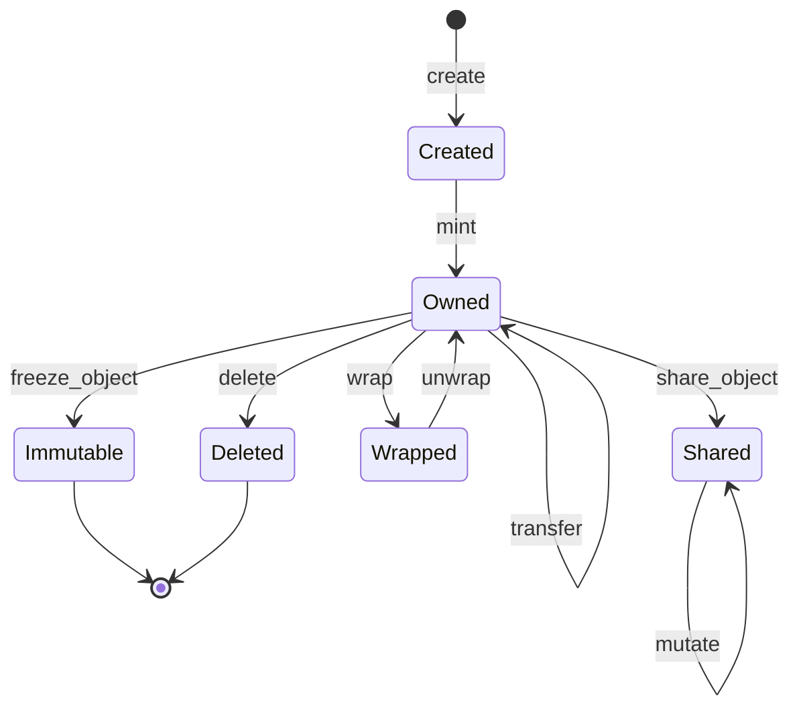

# Sui 架构深度解析

> **版本**: v1.0  
> **日期**: 2025-01-XX  
> **参考**: [Sui 官方文档](https://docs.sui.io/), Sui 代码仓库, 内部架构研究报告

---

## 📋 目录

1. [架构概述](#1-架构概述)
2. [核心组件](#2-核心组件)
3. [与以太坊和 Solana 的区别](#3-与以太坊和-solana-的区别)
4. [共识算法 - Mysticeti](#4-共识算法---mysticeti)
5. [特殊存储机制](#5-特殊存储机制)
6. [FastPath 机制](#6-fastpath-机制)
7. [对象模型与版本控制](#7-对象模型与版本控制)
8. [执行层设计](#8-执行层设计)
9. [网络层设计](#9-网络层设计)
10. [特殊机制与难点](#10-特殊机制与难点)

---

## 1. 架构概述

### 1.1 整体架构

Sui 采用**三层分离架构**，各层职责清晰，支持高度并行化：

```
┌─────────────────────────────────────────────────────────────┐
│                     Sui 三层架构                              │
├─────────────────────────────────────────────────────────────┤
│                                                              │
│  ┌────────────────────────────────────────────────────────┐ │
│  │  Layer 1: 共识层 (Consensus Layer)                     │ │
│  │  • Mysticeti Protocol (DAG-based BFT)                 │ │
│  │  • 仅处理 Shared Objects 交易                         │ │
│  │  • 延迟: ~500ms (平均)                                │ │
│  └────────────────────────────────────────────────────────┘ │
│                         │                                    │
│                         ▼                                    │
│  ┌────────────────────────────────────────────────────────┐ │
│  │  Layer 2: 执行层 (Execution Layer)                     │ │
│  │  • Move VM                                             │ │
│  │  • 并行执行调度器                                      │ │
│  │  • TemporaryStore (内存状态)                           │ │
│  └────────────────────────────────────────────────────────┘ │
│                         │                                    │
│                         ▼                                    │
│  ┌────────────────────────────────────────────────────────┐ │
│  │  Layer 3: 存储层 (Storage Layer)                       │ │
│  │  • RocksDB (via typed-store)                          │ │
│  │  • 对象版本化存储                                      │ │
│  │  • ShardedLruCache (内存缓存)                          │ │
│  └────────────────────────────────────────────────────────┘ │
│                                                              │
└─────────────────────────────────────────────────────────────┘
```

### 1.2 核心设计理念

| 设计原则 | 说明 | 优势 |
|---------|------|------|
| **对象中心模型** | 状态以对象为单位，而非账户 | 支持细粒度并行 |
| **因果顺序 vs 全序** | 仅对冲突交易全序，其他因果序 | 减少共识开销 |
| **FastPath** | 拥有对象交易跳过共识 | 极低延迟 (~200ms) |
| **版本化存储** | 对象每次修改产生新版本 | 支持历史查询 |
| **并行执行** | 对象级别并行调度 | 高吞吐量 |

### 1.3 性能指标

根据 [Sui 官方文档](https://docs.sui.io/concepts/sui-architecture/consensus) 和测试数据：

- **吞吐量**: 
  - 10 节点: 300,000 TPS (延迟 < 1s)
  - 50 节点: 400,000 TPS (延迟 < 1s)
  - 平均: 200,000 TPS (延迟 ~0.5s)
- **延迟**:
  - FastPath (拥有对象): ~200ms
  - 共识路径 (共享对象): ~500ms
- **最终确认**: ~1.2-1.5s (等待 Checkpoint)

---

## 2. 核心组件

### 2.1 共识层组件

#### 2.1.1 Mysticeti Protocol

**位置**: `consensus/core/src/`

**核心特性**:
- **DAG-based**: 区块形成有向无环图，非线性链
- **Multi-leader**: 每轮多个验证者可同时提议区块
- **Wave-based commit**: 3 轮消息达成共识（理论最小值）
- **Implicit commitment**: 减少节点间通信开销

**关键数据结构**:
```rust
// consensus/core/src/block.rs
pub struct BlockV2 {
    pub epoch: Epoch,
    pub round: Round,
    pub author: AuthorityIndex,
    pub ancestors: Vec<BlockRef>,  // DAG 祖先引用
    pub transactions: Vec<Transaction>,
    pub commit_votes: Vec<CommitVote>,
}

pub struct CommittedSubDag {
    pub leader: BlockRef,
    pub blocks: Vec<VerifiedBlock>,
    pub timestamp_ms: BlockTimestampMs,
}
```

#### 2.1.2 DAG State Manager

**位置**: `consensus/core/src/dag_state.rs`

管理 DAG 状态，包括：
- 区块缓存（最近 N 轮）
- 轮次追踪
- 提交状态
- 待写入区块队列

### 2.2 执行层组件

#### 2.2.1 Move VM

**位置**: `sui-execution/latest/sui-adapter/src/execution_engine.rs`

**核心功能**:
- 执行 Move 字节码
- Gas 计量
- 对象版本管理
- 临时状态管理

#### 2.2.2 Execution Scheduler

**位置**: `crates/sui-core/src/execution_scheduler/`

**并行调度机制**:
- **Barrier 依赖**: 共享对象的非独占写入 → 独占写入
- **对象级别锁**: 细粒度并行控制
- **依赖图构建**: 自动检测交易依赖

#### 2.2.3 TemporaryStore

**位置**: `sui-execution/latest/sui-adapter/src/temporary_store.rs`

执行期间的内存状态容器：
- 输入对象缓存
- 写入对象追踪
- Lamport 时间戳（版本分配）
- 执行结果收集

### 2.3 存储层组件

#### 2.3.1 AuthorityStore

**位置**: `crates/sui-core/src/authority/authority_store.rs`

**核心表结构**:
```rust
pub struct AuthorityPerpetualTables {
    pub objects: DBMap<ObjectKey, StoreObjectWrapper>,
    pub transactions: DBMap<TransactionDigest, TrustedTransaction>,
    pub effects: DBMap<TransactionEffectsDigest, TransactionEffects>,
    pub events_2: DBMap<TransactionDigest, TransactionEvents>,
    pub checkpoints: DBMap<CheckpointSequenceNumber, CertifiedCheckpointSummary>,
}
```

#### 2.3.2 typed-store

**位置**: `crates/typed-store/src/rocks/mod.rs`

RocksDB 的类型安全封装：
- `DBMap<K, V>`: 类型安全的列族封装
- `DBBatch`: 原子批量写入
- 支持事务和范围查询

#### 2.3.3 ShardedLruCache

**位置**: `crates/sui-storage/src/sharded_lru.rs`

分片 LRU 缓存，减少锁竞争：
- 多个独立分片（默认 64）
- 每个分片独立 LRU 缓存
- 支持批量失效

---

## 3. 与以太坊和 Solana 的区别

### 3.1 数据模型对比

| 特性 | 以太坊 | Solana | Sui |
|-----|--------|--------|-----|
| **数据模型** | 账户模型 | 账户模型 | **对象模型** |
| **状态组织** | 全局状态树 (MPT) | 账户数据库 | **扁平对象存储** |
| **状态根** | 每区块 Merkle 根 | 无全局根 | **Checkpoint 承诺** |
| **状态证明** | O(log N) Merkle 证明 | 无 | **对象级证明** |

**关键差异**:

1. **以太坊**: 所有账户在一个 Merkle Patricia Trie 中，每区块重建状态根
2. **Solana**: 账户存储在平面数据库中，无全局状态根
3. **Sui**: 对象独立存储，每个对象有唯一 ID 和版本号

### 3.2 交易执行对比

| 特性 | 以太坊 | Solana | Sui |
|-----|--------|--------|-----|
| **执行模式** | 串行执行 | 并行执行 (Sealevel) | **对象级并行** |
| **冲突检测** | 全局状态冲突 | 账户级冲突 | **对象级冲突** |
| **Gas 模型** | 基于操作码 | 基于计算单元 | **基于对象操作** |
| **并行粒度** | 无（单线程） | 账户级 | **对象级** |

**关键差异**:

1. **以太坊**: 单线程串行执行，所有交易必须全序
2. **Solana**: 账户级并行，但需要显式声明账户依赖
3. **Sui**: 对象级并行，自动检测依赖，仅对冲突对象全序

### 3.3 共识机制对比

| 特性 | 以太坊 (PoS) | Solana (PoH + PoS) | Sui (Mysticeti) |
|-----|-------------|-------------------|----------------|
| **共识类型** | 线性区块链 | 线性区块链 | **DAG-based** |
| **区块结构** | 线性链 | 线性链 | **有向无环图** |
| **延迟** | ~12s | ~400ms | **~500ms** |
| **吞吐量** | ~15 TPS | ~3,000 TPS | **200,000+ TPS** |
| **FastPath** | 无 | 无 | **有（拥有对象）** |

**关键差异**:

1. **以太坊**: 传统线性区块链，所有交易必须全序
2. **Solana**: 历史证明 (PoH) + 权益证明，高吞吐但中心化风险
3. **Sui**: DAG-based 共识，仅对共享对象交易全序，拥有对象跳过共识

### 3.4 存储机制对比

| 特性 | 以太坊 | Solana | Sui |
|-----|--------|--------|-----|
| **存储后端** | LevelDB/RocksDB | RocksDB | **RocksDB** |
| **状态组织** | Merkle 树 | 账户数据库 | **对象版本化** |
| **历史查询** | 需要归档节点 | 有限 | **完整版本历史** |
| **状态证明** | Merkle 证明 | 无 | **对象级证明** |
| **存储开销** | 高（树节点） | 中 | **低（扁平存储）** |

**关键差异**:

1. **以太坊**: 全局 Merkle 树，状态根每区块更新，存储开销大
2. **Solana**: 账户数据库，无全局状态根，历史查询受限
3. **Sui**: 对象版本化存储，支持完整历史，可按需修剪

### 3.5 编程模型对比

| 特性 | 以太坊 (Solidity) | Solana (Rust) | Sui (Move) |
|-----|------------------|---------------|------------|
| **语言** | Solidity | Rust | **Move** |
| **资源模型** | 无 | 无 | **资源类型** |
| **所有权** | 无 | 无 | **显式所有权** |
| **并行提示** | 无 | 显式账户列表 | **自动检测** |
| **安全性** | 运行时检查 | 编译时 + 运行时 | **编译时验证** |

**关键差异**:

1. **以太坊**: Solidity 无资源概念，容易出现重入等安全问题
2. **Solana**: Rust 提供内存安全，但需要显式声明账户依赖
3. **Sui**: Move 的资源类型和所有权系统，编译时保证安全性

---

## 4. 共识算法 - Mysticeti

### 4.1 协议概述

Mysticeti 是 Sui 的共识协议，基于 DAG 结构实现高吞吐量的拜占庭容错共识。

**核心特性**:
- **DAG-based**: 区块形成有向无环图，而非线性链
- **Multi-leader**: 每轮多个验证者可同时提议区块
- **Wave-based commit**: 基于波次 (Wave) 的提交决策
- **3 轮消息**: 理论最小轮次达成共识

### 4.2 Wave-based 共识机制

**波次结构**:
```
Wave N = Round (3n+1, 3n+2, 3n+3)

Round 3n+1: Leader Round
  - 领导者提议区块
  - 包含祖先引用（DAG 结构）

Round 3n+2: Voting Round
  - 验证者投票支持领导者区块
  - 可同时投票多个领导者

Round 3n+3: Decision Round
  - 如果领导者获得 2f+1 投票 → COMMIT
  - 否则 → SKIP
```

**代码位置**: `consensus/core/src/universal_committer.rs`

### 4.3 提交决策类型

```rust
pub enum Decision {
    Direct,     // 直接提交：领导者区块获得 2f+1 直接投票
    Indirect,   // 间接提交：通过后续轮次的因果关系达到法定人数
    Certified,  // 认证提交：由法定人数验证者签名
}
```

### 4.4 DAG 状态管理

**位置**: `consensus/core/src/dag_state.rs`

```rust
pub struct DagState {
    // 创世区块
    genesis: BTreeMap<BlockRef, VerifiedBlock>,
    
    // 最近区块缓存
    recent_blocks: BTreeMap<BlockRef, BlockInfo>,
    recent_refs_by_authority: Vec<BTreeSet<BlockRef>>,
    
    // 轮次追踪
    threshold_clock: ThresholdClock,
    highest_accepted_round: Round,
    
    // 提交状态
    last_commit: Option<TrustedCommit>,
    last_committed_rounds: Vec<Round>,
}
```

### 4.5 性能优势

根据 [Sui 官方文档](https://docs.sui.io/concepts/sui-architecture/consensus):

- **吞吐量**: 400,000+ TPS (50 节点)
- **延迟**: ~0.5s 平均提交时间
- **通信开销**: 隐式提交减少节点间通信

**与传统共识对比**:
- 传统 PBFT: 需要显式区块验证和认证，通信开销大
- Mysticeti: 隐式提交，减少签名和广播

---

## 5. 特殊存储机制

### 5.1 对象版本化存储

**核心概念**:
- 每个对象有唯一 `ObjectID` 和 `VersionNumber`
- 每次修改产生新版本: `(ObjectID, Version) → Object`
- 支持完整版本历史查询

**存储格式**:
```rust
// ObjectKey = (ObjectID, VersionNumber)
pub type ObjectKey = (ObjectID, VersionNumber);

// 存储示例
(0x1234..., 0) → Object v0
(0x1234..., 1) → Object v1
(0x1234..., 2) → Object v2
```

**位置**: `crates/sui-core/src/authority/authority_store_tables.rs`

### 5.2 Lamport 时间戳版本分配

**算法**:
```rust
// 新版本 = 1 + max(所有输入对象的版本)
new_version = 1 + max(input_objects.versions)
```

**优势**:
- 保证版本单调递增
- 支持因果顺序检测
- 无需全局计数器

**位置**: `sui-execution/latest/sui-adapter/src/temporary_store.rs`

### 5.3 扁平存储 vs 全局状态树

**以太坊方式** (全局状态树):
```
StateRoot (Merkle Patricia Trie)
  ├── Account1: StateHash1
  │     ├── Balance
  │     ├── Nonce
  │     └── StorageRoot
  ├── Account2: StateHash2
  └── ...
```

**Sui 方式** (扁平对象存储):
```
对象存储（键值对）
  ├── (Object1, Version3) → Object1内容
  ├── (Object2, Version7) → Object2内容
  └── ...

Checkpoint承诺（仅摘要）
  ├── CheckpointArtifacts: Merkle(仅变更对象)
  └── ECMHLiveObjectSet: ECMH(全部活跃对象)
```

**优势**:
- **无全局树**: 避免每区块重建状态根
- **O(1) 查找**: 直接通过 ObjectID + Version 查找
- **按需计算**: 仅在 Checkpoint 时计算承诺
- **可修剪**: 可删除旧版本（如果不需要历史）

### 5.4 Checkpoint 机制

**位置**: `crates/sui-core/src/checkpoints/`

**功能**:
- 定期创建状态快照（每 N 个 CommittedSubDag）
- 计算状态哈希（ECMH）
- 验证者签名形成 CertifiedCheckpoint
- 支持状态同步和恢复

**数据结构**:
```rust
pub struct CheckpointSummary {
    pub epoch: EpochId,
    pub sequence_number: CheckpointSequenceNumber,
    pub timestamp_ms: u64,
    pub transactions: Vec<TransactionDigest>,
    pub checkpoint_commitments: CheckpointCommitments,
}

pub struct CertifiedCheckpoint {
    pub summary: CheckpointSummary,
    pub auth_signature: AuthorityStrongQuorumSignInfo,
}
```

### 5.5 存储优化

#### 5.5.1 分片缓存

**ShardedLruCache**:
- 64 个独立分片
- 每个分片独立 LRU 缓存
- 减少锁竞争

**位置**: `crates/sui-storage/src/sharded_lru.rs`

#### 5.5.2 批量写入

**DBBatch**:
- 累积多个操作
- 原子提交
- 减少 I/O 次数

**位置**: `crates/typed-store/src/rocks/mod.rs`

#### 5.5.3 WAL (Write-Ahead Log)

- 先写日志，再写数据
- 支持崩溃恢复
- RocksDB 默认启用

---

## 6. FastPath 机制

### 6.1 核心概念

FastPath 是 Sui 针对**拥有对象 (Owned Objects)** 交易的优化路径，允许跳过共识直接执行。

**条件**:
- 交易仅涉及拥有对象或不可变对象
- 不涉及共享对象 (Shared Objects)
- 可立即执行，无需等待共识

### 6.2 执行流程

```
拥有对象交易
    ↓
广播到所有验证者
    ↓
收集 2f+1 签名
    ↓
形成证书 (Certificate)
    ↓
执行交易
    ↓
返回结果
```

**延迟**: ~200ms (vs 共识路径 ~500ms)

### 6.3 代码实现

**位置**: `crates/sui-core/src/authority.rs`

```rust
pub async fn handle_transaction(&self, tx: Transaction) -> Result<...> {
    // 检查是否有共享对象
    let has_shared_objects = tx.shared_input_objects().next().is_some();
    
    if has_shared_objects {
        // 走共识路径
        self.submit_to_consensus(tx).await
    } else {
        // 走 FastPath
        self.execute_locally(tx).await
    }
}
```

### 6.4 FastPath vs 共识路径

| 特性 | FastPath | 共识路径 |
|-----|----------|---------|
| **对象类型** | 仅 Owned/Immutable | 包含 Shared |
| **是否进入 Consensus Block** | ❌ 否 | ✅ 是 |
| **执行时机** | 立即执行 | 共识后执行 |
| **延迟** | ~200ms | ~500ms |
| **最终确认** | 等待 Checkpoint | 等待 Checkpoint |

### 6.5 优势与限制

**优势**:
- ✅ 极低延迟 (~200ms)
- ✅ 高吞吐量（完全并行）
- ✅ 低 Gas 成本

**限制**:
- ⚠️ 仅适用于拥有对象
- ⚠️ 需要协调多用户访问（否则可能锁冲突）
- ⚠️ 不适合需要全局顺序的场景

---

## 7. 对象模型与版本控制

### 7.1 对象类型

根据 [Sui 官方文档](https://docs.sui.io/guides/developer/objects/object-ownership):

| 对象类型 | 所有权 | 版本控制 | 执行路径 |
|---------|--------|---------|---------|
| **AddressOwner** | 单个地址 | 手动（交易指定版本） | FastPath |
| **ObjectOwner** | 父对象 | 自动（通过父对象） | - |
| **Shared** | 全局共享 | 自动（共识分配） | 共识路径 |
| **Immutable** | 无（不可变） | 最终版本 | FastPath |

### 7.2 对象状态转换



### 7.3 版本控制机制

**Lamport 时间戳算法**:
```rust
// 新版本 = 1 + max(所有输入对象的版本)
new_version = 1 + max(input_objects.map(|o| o.version))
```

**示例**:
```
交易 T1:
  输入: Object A (v5), Object B (v3)
  输出: Object A (v6), Object B (v6)
  原因: max(5, 3) + 1 = 6
```

**优势**:
- 保证版本单调递增
- 支持因果顺序检测
- 无需全局计数器

### 7.4 对象锁定机制

**拥有对象锁定**:
- 验证者签名时锁定对象版本
- 其他交易无法使用同一版本
- 防止双重花费

**代码位置**: `crates/sui-core/src/authority/authority_store.rs`

```rust
pub struct LockDetails {
    pub object_id: ObjectID,
    pub version: SequenceNumber,
    pub transaction_digest: TransactionDigest,
}
```

---

## 8. 执行层设计

### 8.1 并行执行调度

**位置**: `crates/sui-core/src/execution_scheduler/execution_scheduler_impl.rs`

**Barrier 依赖机制**:
```rust
// 伪代码: 处理共享对象的并行调度
process_tx(tx_digest, tx):
    for each shared_input_object in tx:
        if mutability == NonExclusiveWrite:
            // 非独占写入：记录为该对象的写者
            dep_state[object_id].insert(tx_digest)
        
        elif mutability == Mutable:
            // 排他性写入：必须等待所有前置非独占写者
            if dep_state[object_id] exists:
                barrier_deps.extend(dep_state[object_id])
                dep_state.remove(object_id)
    
    return barrier_deps
```

**并行执行示例**:
```
Object A:
  TX1 (NonExclusive) ──┐
  TX2 (NonExclusive) ──┼──> TX3 (Exclusive)
  
Object B:
  TX4 (Exclusive) ──> TX5 (Exclusive)
```

### 8.2 TemporaryStore 设计

**位置**: `sui-execution/latest/sui-adapter/src/temporary_store.rs`

**核心数据结构**:
```rust
pub struct TemporaryStore<'backing> {
    // 后端存储引用
    store: &'backing dyn BackingStore,
    
    // 输入对象
    input_objects: BTreeMap<ObjectID, Object>,
    
    // Lamport 时间戳（确定性版本分配）
    lamport_timestamp: SequenceNumber,
    
    // 执行结果
    execution_results: ExecutionResultsV2,
    
    // 动态加载的对象
    loaded_runtime_objects: BTreeMap<ObjectID, DynamicallyLoadedObjectMetadata>,
}
```

### 8.3 Gas 计量机制

**位置**: `sui-execution/latest/sui-adapter/src/gas_charger.rs`

**Gas 组成**:
- **输入对象计费**: 读取对象成本
- **执行计费**: Move VM 指令成本
- **存储计费**: 对象存储成本
- **存储返利**: 删除对象返利

**Gas 模型版本**:
- 支持多版本 Gas 模型
- 可通过协议配置升级

---

## 9. 网络层设计

### 9.1 网络架构

根据 [Sui 网络传播分析](notes/SUI_NETWORK_PROPAGATION_ANALYSIS.md):

```
┌─────────────────────────────────────────────┐
│   Application Layer (Validator Service)     │  ← gRPC/Tonic
├─────────────────────────────────────────────┤
│   Domain Services Layer                     │
│   ├─ Discovery Service (节点发现)            │
│   ├─ State Sync Service (状态同步)          │
│   └─ Randomness Service (随机性)             │
├─────────────────────────────────────────────┤
│   Network Abstraction Layer                 │
│   (Mysten Network)                          │  ← 编解码、连接监控
├─────────────────────────────────────────────┤
│   P2P Framework Layer                       │
│   (Anemo)                                   │  ← QUIC-based P2P
├─────────────────────────────────────────────┤
│   Transport Layer (QUIC/TLS)                │
└─────────────────────────────────────────────┘
```

### 9.2 Anemo P2P 框架

**核心特性**:
- **QUIC 协议**: 1-RTT 握手，多路复用
- **BCS 序列化**: 确定性序列化
- **Snappy 压缩**: 减少带宽 30-50%
- **自动重连**: 网络故障自动恢复

**位置**: `crates/mysten-network/`

### 9.3 网络服务

#### 9.3.1 Discovery Service

**功能**: 节点发现和连接管理

**配置**:
- 发现周期: 5 秒
- 并发连接数: 4
- TTL: 24 小时

**位置**: `crates/sui-network/src/discovery/mod.rs`

#### 9.3.2 State Sync Service

**功能**: 状态同步和追赶

**机制**:
- 批量对象传输
- Checkpoint 同步
- 增量更新

**位置**: `crates/sui-core/src/checkpoints/`

---

## 10. 特殊机制与难点

### 10.1 因果顺序 vs 全序

**核心概念**:
- **全序**: 所有交易必须全局排序（传统区块链）
- **因果顺序**: 仅对相关交易排序（Sui 创新）

**实现**:
- 如果交易 T1 的输出对象被 T2 使用，则 T1 必须在 T2 之前
- 无因果关系的交易可以并行执行

**难点**:
- 如何高效检测因果依赖？
- 如何保证并行执行的正确性？

**解决方案**:
- Lamport 时间戳自动检测依赖
- 对象版本号隐含因果关系
- 执行调度器自动构建依赖图

### 10.2 对象版本管理

**难点**:
- 如何保证版本单调递增？
- 如何处理版本冲突？
- 如何支持历史查询？

**解决方案**:
- Lamport 时间戳算法
- 对象锁定机制（防止版本冲突）
- 版本化存储（支持历史查询）

### 10.3 并行执行正确性

**难点**:
- 如何检测交易冲突？
- 如何保证并行执行的一致性？
- 如何处理共享对象的并发写入？

**解决方案**:
- Barrier 依赖机制
- 非独占写入 → 独占写入的屏障
- 对象级别的细粒度锁

### 10.4 FastPath 与共识路径协调

**难点**:
- 如何判断交易走哪条路径？
- 如何保证两条路径的一致性？
- 如何处理混合交易（既有拥有对象又有共享对象）？

**解决方案**:
- 交易分类：检查是否有共享对象
- 混合交易走共识路径
- 统一的执行引擎和存储层

### 10.5 状态同步与恢复

**难点**:
- 新节点如何快速同步状态？
- 如何验证状态正确性？
- 如何支持增量同步？

**解决方案**:
- Checkpoint 机制（定期快照）
- ECMH 状态哈希（高效验证）
- 批量对象传输
- 增量更新机制

### 10.6 存储优化挑战

**难点**:
- 如何平衡存储空间和历史查询？
- 如何高效处理版本化存储？
- 如何优化缓存性能？

**解决方案**:
- 可配置的版本修剪策略
- 分片 LRU 缓存
- 批量写入优化
- WAL 机制保证持久性

### 10.7 共识性能优化

**难点**:
- 如何在高吞吐量下保持低延迟？
- 如何处理网络分区？
- 如何优化 DAG 结构？

**解决方案**:
- DAG-based 共识（支持并行提议）
- Wave-based 提交（3 轮消息）
- 隐式提交（减少通信开销）
- 多领导者机制（充分利用带宽）

---

## 11. 总结

### 11.1 核心创新

1. **对象中心模型**: 从账户模型转向对象模型，支持细粒度并行
2. **因果顺序**: 仅对相关交易全序，其他并行执行
3. **FastPath**: 拥有对象交易跳过共识，极低延迟
4. **DAG 共识**: Mysticeti 协议实现高吞吐量共识
5. **版本化存储**: 支持完整历史查询和按需修剪

### 11.2 性能优势

- **吞吐量**: 200,000+ TPS (vs 以太坊 ~15 TPS, Solana ~3,000 TPS)
- **延迟**: FastPath ~200ms, 共识路径 ~500ms
- **并行性**: 对象级别并行，充分利用多核 CPU

### 11.3 技术难点

- 因果依赖检测
- 并行执行正确性
- 状态同步与恢复
- 存储优化

### 11.4 适用场景

**适合**:
- 高频交易应用
- 游戏和 NFT
- 需要低延迟的应用
- 需要高吞吐量的应用

**不适合**:
- 需要严格全局顺序的应用
- 需要复杂状态共享的应用（可能更适合共享对象）

---

## 12. 参考资源

### 12.1 官方文档
- [Sui 官方文档](https://docs.sui.io/)
- [Sui 共识机制](https://docs.sui.io/concepts/sui-architecture/consensus)
- [对象模型](https://docs.sui.io/guides/developer/objects/object-model)

### 12.2 代码仓库
- Sui 主仓库: `https://github.com/MystenLabs/sui`
- 核心模块:
  - `consensus/core/` - Mysticeti 共识
  - `sui-execution/latest/` - Move 执行层
  - `crates/sui-core/` - 核心逻辑
  - `crates/typed-store/` - 存储层

### 12.3 内部文档
- `notes/SUI_ARCHITECTURE_REPORT.md` - 架构研究报告
- `notes/SUI_NETWORK_PROPAGATION_ANALYSIS.md` - 网络传播分析
- `notes/QUICK_START_GUIDE.md` - 快速开始指南

---

**文档版本**: v1.0  
**最后更新**: 2025-01-XX  
**维护者**: Sui 架构研究团队

