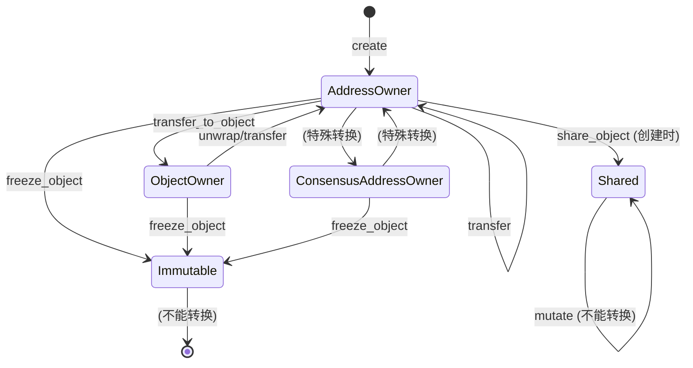

# Sui Object 机制深度解析

> **版本**: v1.0  
> **日期**: 2025-01-XX  
> **参考**: [Sui 官方文档](https://docs.sui.io/guides/developer/objects/object-model), Sui 代码仓库

---

## 📋 目录

1. [Object 概述](#1-object-概述)
2. [Object 数据结构](#2-object-数据结构)
3. [Object 类型](#3-object-类型)
4. [Owner 机制](#4-owner-机制)
5. [版本控制机制](#5-版本控制机制)
6. [Object 引用](#6-object-引用)
7. [Object 生命周期](#7-object-生命周期)
8. [特殊机制](#8-特殊机制)
9. [存储机制](#9-存储机制)
10. [与交易的交互](#10-与交易的交互)
11. [最佳实践](#11-最佳实践)

---

## 1. Object 概述

### 1.1 核心概念

在 Sui 中，**Object（对象）是状态的基本单元**。与传统区块链的账户模型不同，Sui 采用对象中心模型：

- **账户模型**（以太坊、Solana）: 状态围绕账户组织，每个账户包含键值对
- **对象模型**（Sui）: 状态围绕对象组织，每个对象有唯一 ID 和版本号

### 1.2 Object 的基本组成

根据 [Sui 官方文档](https://docs.sui.io/guides/developer/objects/object-model)，每个 Object 包含：

1. **全局唯一 ID** (32 字节)
   - 从创建交易的摘要和计数器派生
   - 在对象整个生命周期中保持不变

2. **Owner（所有者）**
   - 可以是地址、对象、共享或不可变
   - 决定谁可以使用该对象

3. **版本号** (8 字节无符号整数)
   - 每次修改对象时单调递增
   - 使用 Lamport 时间戳算法

4. **元数据**
   - 最后使用该对象的交易摘要
   - 对象类型信息
   - 其他系统元数据

5. **内容字段** (可变大小)
   - BCS 编码的有效载荷
   - 包含对象的实际数据

### 1.3 Object 的重要性

Object 是 Sui 架构的核心创新：

- **并行执行**: 对象级别的细粒度并行
- **FastPath**: 拥有对象交易可跳过共识
- **版本化存储**: 支持完整历史查询
- **类型安全**: Move 语言保证对象类型安全

---

## 2. Object 数据结构

### 2.1 核心数据结构

**位置**: `crates/sui-types/src/object.rs`

```rust
#[derive(Eq, PartialEq, Debug, Clone, Deserialize, Serialize, Hash)]
pub struct Object {
    /// 数据部分（Move Object 或 Package）
    pub data: Data,
    
    /// 所有者信息
    pub owner: Owner,
    
    /// 前驱交易摘要（最后修改该对象的交易）
    pub previous_transaction: TransactionDigest,
    
    /// 存储费用返利
    pub storage_rebate: u64,
}

#[derive(Eq, PartialEq, Debug, Clone, Deserialize, Serialize, Hash)]
pub enum Data {
    /// Move 对象（用户定义的数据结构）
    Move(MoveObject),
    
    /// Move 包（智能合约）
    Package(MovePackage),
}

#[derive(Eq, PartialEq, Debug, Clone, Deserialize, Serialize, Hash)]
pub struct MoveObject {
    /// 对象类型（Move 结构类型）
    type_: MoveObjectType,
    
    /// 是否允许公共转移（deprecated，现在从类型推导）
    has_public_transfer: bool,
    
    /// 版本号（Lamport 时间戳）
    version: SequenceNumber,
    
    /// BCS 编码的内容
    #[serde_as(as = "Bytes")]
    contents: Vec<u8>,
}
```

### 2.2 ObjectID 生成

**位置**: `crates/sui-types/src/base_types.rs`

ObjectID 从交易摘要和计数器生成：

```rust
// 伪代码
object_id = hash(
    transaction_digest,
    object_index  // 交易中创建的第几个对象
)
```

**特点**:
- 全局唯一
- 确定性（相同交易和索引总是产生相同 ID）
- 不可预测（需要知道交易摘要）

### 2.3 Object 内容结构

对于 Move Object，内容字段的 BCS 编码结构：

```
[0..32]   : ObjectID (32 字节)
[32..]    : 对象字段数据
```

**示例** (Coin 对象):
```rust
struct Coin {
    id: UID,      // 32 字节 (ObjectID)
    value: u64,   // 8 字节
}
// 总大小: 40 字节
```

---

## 3. Object 类型

### 3.1 Sui Object

**定义**: 链上的任何资源、资产或数据

**特点**:
- 有唯一 ID
- 有所有者
- 有版本号
- 可被交易操作

### 3.2 Sui Move Object

**定义**: 使用 Move 语言定义的对象

**创建要求**:
```move
struct MyObject has key {
    id: UID,  // 必须是第一个字段
    // ... 其他字段
}
```

**关键要求**:
- 必须有 `key` ability
- 第一个字段必须是 `id: UID`
- 可以使用 `sui::object::new(ctx)` 创建

**示例**:
```move
module example::my_object {
    use sui::object::{Self, UID};
    use sui::transfer;
    use sui::tx_context::{Self, TxContext};
    
    struct MyObject has key {
        id: UID,
        value: u64,
    }
    
    public entry fun create(value: u64, ctx: &mut TxContext) {
        let obj = MyObject {
            id: object::new(ctx),
            value,
        };
        transfer::transfer(obj, tx_context::sender(ctx));
    }
}
```

### 3.3 Sui Move Package

**定义**: 智能合约，包含 Move 字节码模块

**特点**:
- 发布后不可变
- 包含多个模块
- 可以有依赖关系
- 通过包 ID + 模块名唯一标识

**版本化**:
- 用户包: 每次升级生成新 ID
- 框架包: 升级时保持相同 ID，版本递增

---

## 4. Owner 机制

### 4.1 Owner 类型

**位置**: `crates/sui-types/src/object.rs`

根据 [Sui Owner 文档](crates/sui-types/src/object.md) 和代码实现：

```rust
pub enum Owner {
    /// 地址拥有（单个地址独占拥有）
    AddressOwner(SuiAddress),
    
    /// 对象拥有（被另一个对象拥有）
    ObjectOwner(SuiAddress),  // 注意：实际是 ObjectID 转换为 SuiAddress
    
    /// 共享（任何人都可以使用）
    Shared {
        initial_shared_version: SequenceNumber,
    },
    
    /// 不可变（任何人都可以读取，但不能修改）
    Immutable,
    
    /// 共识地址拥有（通过共识排序的地址拥有对象）
    ConsensusAddressOwner {
        start_version: SequenceNumber,
        owner: SuiAddress,
    },
}
```

### 4.2 Owner 属性对比

根据 `object.md` 文档：

| Owner 类型 | 版本控制 | 执行路径 | PTB 输入 | 权限 |
|-----------|---------|---------|---------|------|
| **AddressOwner** | 手动 | FastPath | `ImmOrOwnedObject` | 仅所有者: r w d t |
| **ObjectOwner** | 自动（通过父对象） | - | 通过父对象访问 | 由父对象决定 |
| **Shared** | 自动 | 共识路径 | `SharedObject` | 全局: r w d |
| **Immutable** | 手动（最终） | FastPath | `ImmOrOwnedObject` (只读) | 全局: r d |
| **ConsensusAddressOwner** | 自动 | 共识路径 | `SharedObject` | 仅所有者: r w d t |

**权限说明**:
- **r (read)**: 可以传递 `&T` 到入口函数
- **w (write)**: 可以传递 `&mut T`
- **d (delete)**: 可以删除对象
- **t (transfer)**: 可以改变所有权、包装/解包、升级

### 4.3 AddressOwner

**特点**:
- 单个地址独占拥有
- 版本由交易指定（手动）
- 走 FastPath（跳过共识）
- 只有所有者可以操作

**使用场景**:
- 代币（Coin）
- NFT
- 个人数据

**代码示例**:
```move
// 创建并转移给地址
transfer::transfer(object, recipient_address);
```

### 4.4 ObjectOwner

**特点**:
- 被另一个对象拥有（子对象）
- 版本自动管理（通过父对象）
- 不能直接作为交易输入
- 必须通过父对象访问

**使用场景**:
- 对象组合
- 嵌套数据结构
- 资源封装

**代码示例**:
```move
struct Parent has key {
    id: UID,
    child: Child,  // Child 被 Parent 拥有
}

struct Child has key, store {
    id: UID,
    value: u64,
}
```

### 4.5 Shared

**特点**:
- 全局共享，任何人都可以使用
- 版本由共识自动分配
- 必须走共识路径
- 不能转移（transfer 被禁止）

**使用场景**:
- 去中心化应用状态
- 多用户共享数据
- 需要全局顺序的场景

**代码示例**:
```move
// 共享对象
transfer::share_object(object);
```

**重要限制**:
- 必须在创建时共享（不能后续共享）
- 一旦共享，不能转换回其他 Owner 类型

### 4.6 Immutable

**特点**:
- 不可变，任何人都可以读取
- 版本固定（最终版本）
- 走 FastPath
- 不能修改、转移或删除（只能读取和删除）

**使用场景**:
- 配置数据
- 元数据
- 历史记录

**代码示例**:
```move
// 冻结对象使其不可变
transfer::freeze_object(object);
```

### 4.7 ConsensusAddressOwner

**特点**:
- 单个地址拥有，但通过共识排序
- 版本自动管理
- 必须走共识路径
- 只有所有者可以操作

**使用场景**:
- 需要全局顺序的地址拥有对象
- 高并发场景下的地址拥有对象

### 4.8 Party Objects

根据 [Sui 官方文档](https://docs.sui.io/guides/developer/objects/object-ownership)，**Party Objects** 是一种特殊的对象所有权类型：

**特点**:
- 可以单点拥有（类似 AddressOwner）
- 但通过共识排序（类似 ConsensusAddressOwner）
- 版本自动管理
- 必须走共识路径
- 使用 `sui::transfer::party_transfer` 或 `public_party_transfer` 进行转移

**与 FastPath 对象的区别**:
- FastPath 对象：版本手动指定，跳过共识
- Party 对象：版本自动管理，需要共识

**官方建议**:
> **推荐使用 Party 对象而非 FastPath 对象**

**使用场景**:
- 需要全局顺序的地址拥有对象
- 多用户协调场景
- 需要避免 Equivocation 的场景

**代码示例**:
```move
// 使用 party_transfer 转移对象
transfer::party_transfer(object, recipient_address);
```

### 4.9 Owner 状态转换

根据 `object.md` 文档和 [Sui 官方文档](https://docs.sui.io/guides/developer/objects/object-ownership)：

**允许的转换**:
- `AddressOwner` ↔ `ObjectOwner` ↔ `ConsensusAddressOwner` ↔ `Party`
- 以上四种都可以转换为 `Immutable`
- `Shared` 和 `Immutable` **不能**转换为其他类型

**重要限制**:
- `Shared` 对象必须在创建时共享，一旦共享不能转换回其他类型
- `Immutable` 对象是最终状态，不能转换

**转换规则**:


---

## 5. 版本控制机制

### 5.1 Lamport 时间戳算法

**核心原理**:
```
新版本 = 1 + max(所有输入对象的版本)
```

**位置**: `sui-execution/latest/sui-adapter/src/temporary_store.rs`

**实现**:
```rust
// 伪代码
fn assign_version(input_objects: &[Object]) -> SequenceNumber {
    let max_version = input_objects
        .iter()
        .map(|obj| obj.version())
        .max()
        .unwrap_or(OBJECT_START_VERSION);
    
    max_version + 1
}
```

### 5.2 版本分配示例

**示例 1: 简单转移**
```
交易 T1:
  输入: Coin A (v5), Gas Coin (v3)
  输出: Coin A (v6), Gas Coin (v6)
  原因: max(5, 3) + 1 = 6
```

**示例 2: 多对象交易**
```
交易 T2:
  输入: Object A (v10), Object B (v7), Object C (v12)
  输出: Object A (v13), Object B (v13), Object C (v13)
  原因: max(10, 7, 12) + 1 = 13
```

### 5.3 版本控制特性

**保证**:
- ✅ 版本严格单调递增
- ✅ 相同 ID 和版本对不会重用
- ✅ 支持因果顺序检测
- ✅ 无需全局计数器

**优势**:
- 支持并行执行
- 自动检测依赖关系
- 支持历史查询

### 5.4 不同 Owner 类型的版本控制

#### 5.4.1 AddressOwner

**版本控制**: 手动（交易指定）

**要求**:
- 交易必须指定对象的精确版本
- 验证者签名时锁定该版本
- 其他交易无法使用同一版本（防止双重花费）

**代码示例**:
```move
// 交易必须指定版本
let coin_ref = coin::coin_ref(&coin);  // 包含 (id, version, digest)
transfer::public_transfer(coin, recipient);
```

#### 5.4.2 Shared

**版本控制**: 自动（共识分配）

**机制**:
- 交易只指定对象 ID 和共享版本
- 共识决定交易顺序
- 验证者自动分配版本

**代码示例**:
```move
// 只指定 ID 和共享版本
let shared_obj = shared_object::id(&obj);
// 共识会决定实际使用的版本
```

#### 5.4.3 Immutable

**版本控制**: 固定（最终版本）

**特点**:
- 版本在冻结时确定
- 之后不再变化
- 可以指定版本查询历史状态

### 5.5 版本冲突与 Equivocation

**Equivocation（二义性）**:
- 如果两个不同的交易使用同一对象的同一版本
- 对象会被标记为 equivocated
- 在该 epoch 内无法再使用
- Epoch 结束后锁会重置

**预防措施**:
- 不要同时提交使用相同对象的多个交易
- 如果交易未确认，不要重用其对象
- 使用最新版本的对象

---

## 6. Object 引用

### 6.1 引用类型

根据 [Sui 官方文档](https://docs.sui.io/guides/developer/objects/object-model)，有三种引用方式：

#### 6.1.1 ObjectID

**定义**: 对象的全局唯一标识符

**特点**:
- 稳定标识符，不随版本变化
- 用于查询当前状态
- 用于描述对象转移

**使用场景**:
- 查询对象当前状态
- 描述对象转移历史
- 对象查找

#### 6.1.2 Versioned ID

**定义**: `(ObjectID, Version)` 对

**特点**:
- 描述对象在特定历史点的状态
- 用于查询历史状态
- 用于确定对象最近更新时间

**使用场景**:
- 查询对象历史状态
- 时间点快照
- 版本比较

#### 6.1.3 Object Reference

**定义**: `(ObjectID, Version, ObjectDigest)` 三元组

**特点**:
- 提供对象在特定历史点的认证视图
- 包含内容摘要，保证完整性
- 交易输入必须使用 Object Reference

**使用场景**:
- 交易输入（必须）
- 对象认证
- 防止重放攻击

### 6.2 ObjectRef 结构

**位置**: `crates/sui-types/src/base_types.rs`

```rust
pub type ObjectRef = (ObjectID, SequenceNumber, ObjectDigest);

pub struct ObjectID([u8; 32]);  // 32 字节
pub type SequenceNumber = u64;  // 8 字节
pub type ObjectDigest = [u8; 32];  // 32 字节
```

**ObjectDigest 计算**:
```rust
object_digest = hash(
    object_id,
    version,
    owner,
    previous_transaction,
    data,
    storage_rebate
)
```

### 6.3 引用使用示例

**查询当前状态**:
```rust
// 使用 ObjectID
let object = sui_client.get_object(object_id).await?;
```

**查询历史状态**:
```rust
// 使用 Versioned ID
let object = sui_client.get_object_at_version(object_id, version).await?;
```

**交易输入**:
```rust
// 使用 Object Reference
let coin_ref = coin::coin_ref(&coin);  // (id, version, digest)
let tx = Transaction::new_move_call(
    package_id,
    module,
    function,
    vec![coin_ref],  // 必须使用 ObjectRef
    // ...
);
```

---

## 7. Object 生命周期

### 7.1 创建

**方式 1: Move 代码创建**
```move
let obj = MyObject {
    id: object::new(ctx),  // 生成新 ObjectID
    // ... 字段
};
```

**方式 2: 系统创建**
- Gas Coin: 系统自动创建
- 系统对象: 通过系统交易创建

### 7.2 转移

**地址转移**:
```move
transfer::transfer(object, recipient_address);
```

**对象转移** (Transfer-to-Object):
```move
transfer::transfer_to_object(object, parent_object_id);
```

### 7.3 修改

**可变引用**:
```move
let mut obj = borrow_object_mut(&mut obj_id);
obj.value = new_value;
```

**版本更新**:
- 修改对象时，版本自动递增
- 使用 Lamport 时间戳算法

### 7.4 共享

**共享对象**:
```move
transfer::share_object(object);
```

**限制**:
- 必须在创建时共享
- 一旦共享，不能转换回其他类型

### 7.5 冻结

**冻结为不可变**:
```move
transfer::freeze_object(object);
```

**特点**:
- 版本固定
- 不能修改、转移
- 任何人都可以读取

### 7.6 包装

**包装对象**:
```move
struct Outer has key {
    id: UID,
    inner: Inner,  // Inner 被包装
}
```

**特点**:
- 包装的对象不能直接访问
- 必须通过父对象访问
- 可以解包恢复

### 7.7 删除

**删除对象**:
```move
object::delete(id);
```

**效果**:
- 对象从链上删除
- 释放存储空间
- 获得存储返利

### 7.8 完整生命周期图

```mermaid
stateDiagram-v2
    [*] --> Created: object::new()
    Created --> AddressOwned: transfer()
    AddressOwned --> AddressOwned: transfer()
    AddressOwned --> ObjectOwned: transfer_to_object()
    AddressOwned --> Shared: share_object() (创建时)
    AddressOwned --> Immutable: freeze_object()
    AddressOwned --> Wrapped: wrap in struct
    AddressOwned --> Deleted: object::delete()
    
    ObjectOwned --> AddressOwned: unwrap/transfer
    ObjectOwned --> Immutable: freeze_object()
    
    Shared --> Shared: mutate (不能转换)
    Immutable --> [*]: (永久状态)
    Wrapped --> AddressOwned: unwrap
    Deleted --> [*]
```

---

## 8. 特殊机制

### 8.1 Wrapped Objects

**定义**: 被另一个对象包含的对象

**特点**:
- 不能直接通过 ID 访问
- 必须通过父对象访问
- 不需要指定版本（版本由父对象管理）

**代码示例**:
```move
struct Inner has key, store {
    id: UID,
    value: u64,
}

struct Outer has key {
    id: UID,
    inner: Inner,  // Inner 被包装
}

// 创建
let inner = Inner { id: object::new(ctx), value: 42 };
let outer = Outer { id: object::new(ctx), inner };

// 访问
let inner = &outer.inner;  // 通过父对象访问

// 解包
let Outer { id, inner } = outer;
object::delete(id);
transfer::transfer(inner, sender);  // 现在可以独立访问
```

**版本保证**:
- 包装时: `outer.version >= inner.version`
- 解包时: `inner_new.version > outer_old.version`

### 8.2 Dynamic Fields

**定义**: 动态字段，可以在运行时添加/删除

**特点**:
- 行为类似 Wrapped Objects
- 只能通过父对象访问
- 不需要指定版本
- 字段修改会递增父对象版本

**代码示例**:
```move
use sui::dynamic_object_field as ofield;

// 添加动态字段
ofield::add(&mut parent, key, value);

// 读取动态字段
let value = ofield::borrow(&parent, &key);

// 删除动态字段
ofield::remove(&mut parent, &key);
```

**与 Wrapped 的区别**:
- Dynamic Fields: 修改字段会递增父对象版本
- Wrapped Objects: 包装/解包不影响父对象版本（除非父对象被修改）

### 8.3 Receiving Objects

**定义**: 通过 Transfer-to-Object 接收的对象

**机制**:
1. 发送者调用 `transfer::transfer_to_object(child, parent_id)`
2. 子对象的 owner 变为 `ObjectOwner(parent_id)`
3. 接收者使用 `transfer::receive(child_ref, &mut parent)` 接收

**代码示例**:
```move
// 发送者
transfer::transfer_to_object(child, parent_id);

// 接收者（在 PTB 中）
let child = transfer::receive(
    Receiving { id: child_id, version: child_version },
    &mut parent
);
```

### 8.4 Party Objects

根据 [Sui 官方文档](https://docs.sui.io/guides/developer/objects/object-ownership)，**Party Objects** 是推荐使用的共识对象类型：

**定义**: 使用 `party_transfer` 转移的对象，通过共识排序的地址拥有对象

**特点**:
- 可以单点拥有（类似 AddressOwner）
- 但通过共识排序（类似 ConsensusAddressOwner）
- 版本自动管理
- 必须走共识路径
- 使用 `sui::transfer::party_transfer` 或 `public_party_transfer` 进行转移

**与 FastPath 对象的对比**:

| 特性 | FastPath 对象 | Party 对象 |
|-----|--------------|-----------|
| **所有权** | AddressOwner | Party (类似 AddressOwner) |
| **版本控制** | 手动（交易指定） | 自动（共识分配） |
| **执行路径** | FastPath（跳过共识） | 共识路径 |
| **延迟** | 100-300ms | 500ms-2s+ |
| **Equivocation 风险** | 高（需要链下协调） | 低（共识保证） |

**官方建议**:
> **推荐使用 Party 对象而非 FastPath 对象**，因为 Party 对象提供了更好的版本管理和协调能力。

**使用场景**:
- 需要全局顺序的地址拥有对象
- 多用户协调场景
- 需要避免 Equivocation 的场景
- 频繁多用户访问的对象

**代码示例**:
```move
// 创建对象
let obj = MyObject {
    id: object::new(ctx),
    value: 42,
};

// 使用 party_transfer 转移（推荐）
transfer::party_transfer(obj, recipient_address);

// 或使用 public_party_transfer
transfer::public_party_transfer(obj, recipient_address);
```

---

## 9. 存储机制

### 9.1 存储格式

**位置**: `crates/sui-core/src/authority/authority_store_types.rs`

```rust
// 存储键
pub type ObjectKey = (ObjectID, VersionNumber);

// 存储值
pub enum StoreObjectWrapper {
    V1(StoreObjectV1),
}

pub enum StoreObjectV1 {
    Value(Box<StoreObjectValue>),  // 活跃对象
    Deleted,                        // 删除标记
    Wrapped,                        // 被包装的对象
}

pub struct StoreObjectValue {
    pub data: StoreData,
    pub owner: Owner,
    pub previous_transaction: TransactionDigest,
    pub storage_rebate: u64,
}
```

### 9.2 版本化存储

**存储结构**:
```
(ObjectID, Version) → Object
```

**示例**:
```
(0x1234..., 0) → Object v0
(0x1234..., 1) → Object v1
(0x1234..., 2) → Object v2
```

**特点**:
- 同一对象的不同版本都存储
- 支持历史查询
- 可以修剪旧版本

### 9.3 对象查找

**当前版本查找**:
```rust
// 查找对象的最新版本
fn get_latest_object(object_id: ObjectID) -> Option<Object> {
    // 从最新版本开始查找
    for version in (0..=max_version).rev() {
        if let Some(obj) = store.get((object_id, version)) {
            if !obj.is_deleted() {
                return Some(obj);
            }
        }
    }
    None
}
```

**历史版本查找**:
```rust
// 直接通过 (ID, Version) 查找
let object = store.get((object_id, version))?;
```

### 9.4 存储优化

**分片缓存**:
- 使用 `ShardedLruCache` 缓存热对象
- 64 个独立分片，减少锁竞争

**批量写入**:
- 使用 `DBBatch` 批量写入
- 原子提交，保证一致性

**版本修剪**:
- 可以删除旧版本（如果不需要历史）
- 配置 `object_pruning` 参数

---

## 10. 与交易的交互

### 10.1 交易输入

**要求**:
- 必须使用 Object Reference `(ID, Version, Digest)`
- 验证者会验证 Digest 匹配
- 防止重放攻击

**代码示例**:
```rust
// 构建交易输入
let input_objects = vec![
    InputObject::ImmOrOwnedObject(ObjectRef {
        object_id: coin_id,
        version: coin_version,
        digest: coin_digest,
    }),
];
```

### 10.2 交易输出

**TransactionEffects**:
```rust
pub struct TransactionEffects {
    pub changed_objects: Vec<(ObjectID, EffectsObjectChange)>,
    // ...
}

pub enum EffectsObjectChange {
    Written(ObjectRef),      // 新创建或修改
    Deleted(ObjectRef),       // 删除
    Unchanged,               // 未改变
}
```

### 10.3 对象锁定

**AddressOwner 锁定**:
- 验证者签名时锁定对象版本
- 其他交易无法使用同一版本
- 防止双重花费

**代码位置**: `crates/sui-core/src/authority/authority_store.rs`

```rust
pub struct LockDetails {
    pub object_id: ObjectID,
    pub version: SequenceNumber,
    pub transaction_digest: TransactionDigest,
}
```

### 10.4 执行路径选择

根据 [Sui 官方文档](https://docs.sui.io/guides/developer/objects/object-ownership)：

**FastPath** (Fastpath 对象):
- 仅涉及 `AddressOwner` 或 `Immutable` 对象
- 版本手动指定（Lamport 时间戳）
- 跳过共识，直接执行
- 延迟: ~100-300ms
- ⚠️ **注意**: 官方建议优先使用 Party 对象而非 FastPath 对象

**共识路径** (共识对象):
- 涉及 `Shared`、`Party` 或 `ConsensusAddressOwner` 对象
- 版本自动管理（共识分配）
- 必须经过共识排序
- 延迟: ~500ms-2s+
- ✅ **推荐**: Party 对象是共识对象的推荐选择

**判断逻辑**:
```rust
fn is_consensus_tx(tx: &Transaction) -> bool {
    tx.shared_input_objects().next().is_some()
        || tx.has_funds_withdrawals()
}
```

**版本控制路径对比**:

| 路径 | 对象类型 | 版本控制 | 执行路径 | 推荐度 |
|-----|---------|---------|---------|--------|
| **FastPath** | AddressOwner, Immutable | 手动 | 跳过共识 | ⚠️ 不推荐（除非特殊需求） |
| **Consensus** | Shared, Party, ConsensusAddressOwner | 自动 | 共识排序 | ✅ 推荐（Party 对象） |

---

## 11. 最佳实践

### 11.1 对象设计

**推荐**:
- ✅ 使用 `key` ability
- ✅ 第一个字段必须是 `id: UID`
- ✅ 合理使用 `store` ability（如果需要转移）
- ✅ 考虑对象大小限制

**避免**:
- ❌ 创建过大的对象
- ❌ 在对象中存储敏感信息（如果不需要）
- ❌ 过度嵌套对象

### 11.2 Owner 选择

根据 [Sui 官方文档](https://docs.sui.io/guides/developer/objects/object-ownership) 的建议：

**AddressOwner (FastPath)**:
- ✅ 个人资产（代币、NFT）
- ✅ 需要快速交易的场景
- ✅ 单用户数据
- ⚠️ **注意**: 如果可能，考虑使用 Party 对象

**Party (Consensus - 推荐)**:
- ✅ 需要全局顺序的地址拥有对象
- ✅ 多用户协调场景
- ✅ 需要避免 Equivocation 的场景
- ✅ **官方推荐**: 优先使用 Party 而非 FastPath

**Shared (Consensus)**:
- ✅ 多用户共享状态
- ✅ 需要全局顺序的场景
- ✅ 去中心化应用状态
- ✅ 频繁多用户访问的对象

**Immutable**:
- ✅ 配置数据
- ✅ 元数据
- ✅ 历史记录

**ObjectOwner**:
- ✅ 对象组合
- ✅ 资源封装
- ✅ 嵌套数据结构

**ConsensusAddressOwner**:
- ✅ 需要全局顺序的地址拥有对象（旧方案）
- ⚠️ **注意**: 推荐使用 Party 对象替代

**选择决策树**:
```
需要多用户共享状态？
  ├─ 是 → 使用 Shared 对象
  └─ 否 → 需要全局顺序？
      ├─ 是 → 使用 Party 对象（推荐）✅
      └─ 否 → 使用 AddressOwner（FastPath）⚠️
```

### 11.3 版本管理

**推荐**:
- ✅ 总是使用最新版本的对象
- ✅ 不要重用未确认交易的对象
- ✅ 处理版本冲突错误

**避免**:
- ❌ 同时提交使用相同对象的多个交易
- ❌ 重用可能已确认的对象
- ❌ 忽略版本错误

### 11.4 性能优化

根据 [Sui 官方文档](https://docs.sui.io/guides/developer/objects/object-ownership) 的建议：

**减少共识开销**:
- ⚠️ 谨慎使用 `AddressOwner`（FastPath）- 官方建议优先使用 Party
- 避免不必要的 `Shared` 对象
- ✅ **推荐**: 合理使用 `Party` 对象（需要全局顺序时）

**FastPath vs Consensus 权衡**:
- FastPath: 低延迟，但需要链下协调，有 Equivocation 风险
- Consensus (Party): 较高延迟，但自动版本管理，无 Equivocation 风险
- **官方建议**: 除非对延迟/Gas 极其敏感，否则使用 Party 对象

**减少存储开销**:
- 避免创建过多小对象
- 考虑对象合并
- 及时删除不需要的对象

**并行执行**:
- 设计无冲突的对象结构
- 避免不必要的共享对象
- 利用对象级别的并行性

---

## 12. 总结

### 12.1 核心特性

1. **对象中心模型**: 状态以对象为单位，而非账户
2. **版本化存储**: 每个对象有版本历史
3. **灵活的所有权**: 6 种 Owner 类型（AddressOwner, ObjectOwner, Shared, Immutable, ConsensusAddressOwner, Party），适应不同场景
4. **版本控制路径**: FastPath（手动版本）和 Consensus（自动版本）
5. **Lamport 时间戳**: 自动版本分配和依赖检测
6. **并行执行**: 对象级别的细粒度并行

### 12.2 关键优势

- **性能**: FastPath 实现极低延迟
- **并行性**: 对象级别并行，充分利用多核
- **类型安全**: Move 语言保证对象类型安全
- **历史查询**: 支持完整版本历史

### 12.3 适用场景

**适合**:
- 高频交易应用
- 游戏和 NFT
- 需要低延迟的应用
- 需要高吞吐量的应用

**需要注意**:
- 共享对象需要共识，延迟较高
- 版本管理需要仔细处理
- 对象大小有限制

---

## 13. 参考资源

### 13.1 官方文档
- [Object Model](https://docs.sui.io/guides/developer/objects/object-model) - Sui 对象模型详解
- [Object Ownership](https://docs.sui.io/guides/developer/objects/object-ownership) - 对象所有权和版本控制路径
- [Object Versioning](https://docs.sui.io/guides/developer/objects/versioning) - 对象版本控制机制

### 13.2 代码位置
- `crates/sui-types/src/object.rs` - Object 核心定义
- `crates/sui-types/src/object.md` - Owner 机制文档
- `sui-execution/latest/sui-adapter/src/temporary_store.rs` - 版本分配
- `crates/sui-core/src/authority/authority_store.rs` - 存储管理

### 13.3 相关文档
- `mynotes/sui/sui_arch.md` - Sui 架构总览
- `notes/SUI_ARCHITECTURE_REPORT.md` - 架构研究报告

---

**文档版本**: v1.0  
**最后更新**: 2025-01-XX  
**维护者**: Sui 开发团队

