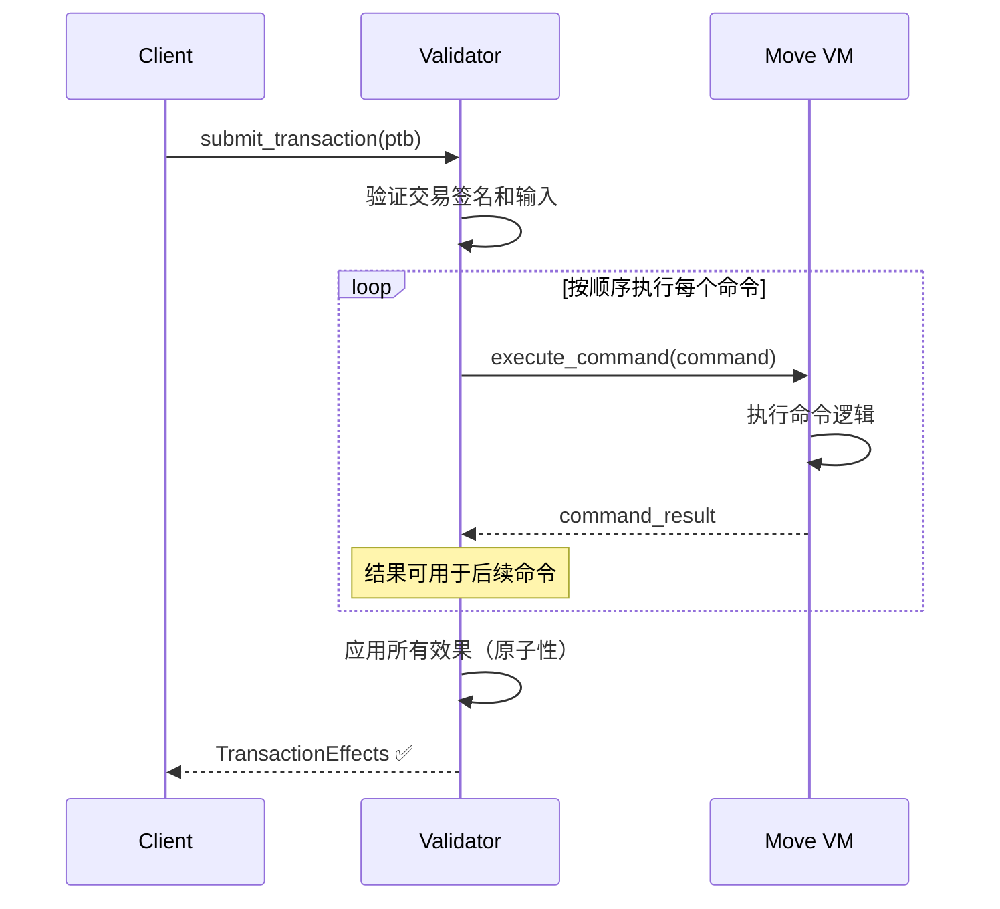

# Sui PTB (Programmable Transaction Blocks) 深度解析

> **版本**: v1.0  
> **日期**: 2025-01-XX  
> **参考**: [Sui 官方文档](https://docs.sui.io/concepts/transactions/prog-txn-blocks), Sui 代码仓库

---

## 📋 目录

1. [概述](#1-概述)
2. [PTB 结构](#2-ptb-结构)
3. [命令类型](#3-命令类型)
4. [输入和结果](#4-输入和结果)
5. [执行语义](#5-执行语义)
6. [使用示例](#6-使用示例)
7. [最佳实践](#7-最佳实践)
8. [限制和注意事项](#8-限制和注意事项)

---

## 1. 概述

### 1.1 什么是 PTB？

**PTB (Programmable Transaction Blocks)** 是 Sui 的可编程交易块，允许在一个交易中包含多个命令（commands），这些命令按顺序执行，并且原子性地应用所有效果。

### 1.2 核心特性

| 特性 | 说明 |
|-----|------|
| **多命令执行** | 一个 PTB 可以包含多个命令，最多 1,024 个操作 |
| **原子性** | 所有命令要么全部成功，要么全部失败 |
| **顺序执行** | 命令按顺序执行，后续命令可以使用前面命令的结果 |
| **Gas 优化** | 批量操作比单独执行更节省 Gas |
| **灵活性** | 无需发布新 Move 包即可组合多个操作 |

### 1.3 与传统区块链的对比

**传统区块链（如以太坊）**:
- 每个交易只能调用一个函数
- 需要 1,024 个交易才能执行 1,024 个操作
- 每个交易都需要支付 Gas

**Sui PTB**:
- 一个 PTB 可以包含多个命令
- 最多 1,024 个操作在一个交易中完成
- 批量操作 Gas 成本更低

### 1.4 设计目标

PTB 的设计目标包括：

1. **自动化友好**: 便于交易构建器和自动化工具使用
2. **轻量级**: 无需发布新 Move 包即可组合操作
3. **灵活性**: 支持多种操作类型的组合
4. **成本效益**: 批量操作降低 Gas 成本

---

## 2. PTB 结构

### 2.1 基本结构

根据 [Sui 官方文档](https://docs.sui.io/concepts/transactions/prog-txn-blocks)，PTB 的结构如下：

```rust
{
    inputs: [Input],      // 输入参数向量
    commands: [Command],  // 命令向量
}
```

### 2.2 完整交易结构

一个完整的 PTB 交易包含以下元数据：

```rust
pub struct Transaction {
    // 交易元数据
    sender: SuiAddress,           // 发送者地址
    gas_input: ObjectRef,          // Gas 支付对象引用
    gas_price: u64,               // Gas 价格
    gas_budget: u64,              // 最大 Gas 预算
    epoch: EpochId,               // 目标 Epoch
    
    // PTB 内容
    kind: TransactionKind::ProgrammableTransaction {
        inputs: Vec<CallArg>,     // 输入参数（历史原因称为 CallArg）
        commands: Vec<Command>,    // 命令列表
    },
}
```

### 2.3 Inputs（输入）

**Input** 是 PTB 的参数，可以是：

1. **对象 (Objects)**:
   - `Owned` 对象：发送者拥有的对象
   - `Shared` 对象：共享对象
   - `Immutable` 对象：不可变对象

2. **纯值 (Pure Values)**:
   - 简单的 Move 值，如 `u64`、`String`、`bool` 等
   - 可以从字节直接构造

**代码示例**:
```rust
// 对象输入
let coin: ObjectRef = (coin_id, version, digest);

// 纯值输入
let amount: u64 = 100;
let recipient: SuiAddress = 0x123...;
```

### 2.4 Commands（命令）

**Command** 是 PTB 中执行的操作，包括：

1. `TransferObjects` - 转移对象
2. `SplitCoins` - 分割代币
3. `MergeCoins` - 合并代币
4. `MakeMoveVec` - 创建 Move 向量
5. `MoveCall` - 调用 Move 函数
6. `Publish` - 发布包
7. `Upgrade` - 升级包

---

## 3. 命令类型

### 3.1 TransferObjects

**功能**: 将一个或多个对象转移到指定地址

**语法**:
```rust
TransferObjects {
    objects: Vec<Argument>,  // 要转移的对象
    address: Argument,       // 接收者地址
}
```

**示例**:
```typescript
// TypeScript SDK
const tx = new Transaction();
const coin = tx.splitCoins(tx.gas, [tx.pure('u64', 100)]);
tx.transferObjects([coin], tx.pure('address', '0xRecipient'));
```

**Move 等价**:
```move
transfer::public_transfer(coin, recipient);
```

### 3.2 SplitCoins

**功能**: 从一个代币中分割出一个或多个新代币

**语法**:
```rust
SplitCoins {
    coin: Argument,              // 源代币
    amounts: Vec<Argument>,      // 要分割的金额列表
}
```

**示例**:
```typescript
// 从 Gas 代币中分割出 100 和 200 两个新代币
const tx = new Transaction();
const [coin1, coin2] = tx.splitCoins(
    tx.gas,
    [tx.pure('u64', 100), tx.pure('u64', 200)]
);
```

**Move 等价**:
```move
let (coin1, remainder) = coin::divide_into_n(coin, 100);
let (coin2, remainder) = coin::divide_into_n(remainder, 200);
```

### 3.3 MergeCoins

**功能**: 将一个或多个代币合并到单个代币中

**语法**:
```rust
MergeCoins {
    destination: Argument,       // 目标代币
    sources: Vec<Argument>,      // 源代币列表
}
```

**示例**:
```typescript
// 合并多个代币到一个
const tx = new Transaction();
const coin1 = tx.splitCoins(tx.gas, [tx.pure('u64', 100)]);
const coin2 = tx.splitCoins(tx.gas, [tx.pure('u64', 200)]);
tx.mergeCoins(tx.gas, [coin1, coin2]);
```

**Move 等价**:
```move
coin::join(&mut coin1, coin2);
```

### 3.4 MakeMoveVec

**功能**: 创建一个 Move 向量（可能为空）

**语法**:
```rust
MakeMoveVec {
    type_tag: Option<TypeTag>,   // 可选的类型标签
    elements: Vec<Argument>,     // 向量元素
}
```

**示例**:
```typescript
// 创建一个 u64 向量
const tx = new Transaction();
const vec = tx.makeMoveVec({
    type: 'u64',
    elements: [
        tx.pure('u64', 1),
        tx.pure('u64', 2),
        tx.pure('u64', 3),
    ],
});
```

**用途**: 主要用于构造向量作为 `MoveCall` 的参数

### 3.5 MoveCall

**功能**: 调用已发布包中的 `entry` 或 `public` Move 函数

**语法**:
```rust
MoveCall {
    package: ObjectID,           // 包 ID
    module: String,              // 模块名
    function: String,            // 函数名
    type_arguments: Vec<TypeTag>, // 类型参数
    arguments: Vec<Argument>,     // 函数参数
}
```

**示例**:
```typescript
// 调用 Move 函数
const tx = new Transaction();
tx.moveCall({
    target: '0xPackage::module::function',
    arguments: [
        coin,
        tx.pure('u64', 100),
        tx.pure('address', recipient),
    ],
    typeArguments: ['SUI'],
});
```

**Move 等价**:
```move
module::function<SUI>(coin, 100, recipient);
```

### 3.6 Publish

**功能**: 创建新包并调用每个模块的 `init` 函数

**语法**:
```rust
Publish {
    modules: Vec<Vec<u8>>,       // 模块字节码
    dependencies: Vec<ObjectID>,  // 依赖包 ID
}
```

**示例**:
```typescript
// 发布新包
const tx = new Transaction();
const publishResult = tx.publish({
    modules: [moduleBytes],
    dependencies: [dependencyPackageId],
});
```

### 3.7 Upgrade

**功能**: 升级现有包（需要 `sui::package::UpgradeCap`）

**语法**:
```rust
Upgrade {
    modules: Vec<Vec<u8>>,        // 新模块字节码
    dependencies: Vec<ObjectID>,  // 依赖包 ID
    package_id: ObjectID,         // 要升级的包 ID
    upgrade_cap: Argument,       // UpgradeCap 对象
}
```

**示例**:
```typescript
// 升级包
const tx = new Transaction();
tx.upgrade({
    packageId: '0xPackage',
    upgradeCap: upgradeCap,
    modules: [newModuleBytes],
    dependencies: [dependencyPackageId],
});
```

---

## 4. 输入和结果

### 4.1 Inputs（输入）

**输入类型**:

1. **对象输入**:
   - 通过索引引用：`Argument::Input(index)`
   - 对象必须是发送者拥有的、共享的或不可变的

2. **纯值输入**:
   - 通过索引引用：`Argument::Input(index)`
   - 可以是任何 Move 基本类型

### 4.2 Results（结果）

**结果类型**:

- 每个命令可以产生一个或多个结果
- 结果通过 `Argument::Result(index)` 引用
- 结果可以是任意 Move 值，包括对象

### 4.3 参数引用

**Argument 类型**:
```rust
pub enum Argument {
    GasCoin,                    // Gas 代币
    Input(u16),                 // 输入参数索引
    Result(u16),                // 命令结果索引
    NestedResult(u16, u16),     // 嵌套结果（命令索引，结果索引）
}
```

**使用示例**:
```typescript
const tx = new Transaction();

// 使用输入
const coin = tx.object('0xCoinId');  // Input(0)

// 使用命令结果
const [coin1, coin2] = tx.splitCoins(tx.gas, [100, 200]);  // Result(0), Result(1)

// 使用嵌套结果
const vec = tx.makeMoveVec({ elements: [coin1, coin2] });  // Result(1)
```

---

## 5. 执行语义

### 5.1 执行顺序

**关键规则**:
1. 命令按顺序执行
2. 后续命令可以使用前面命令的结果
3. 所有命令的效果在交易结束时原子性应用
4. 如果任何命令失败，整个 PTB 失败

### 5.2 执行流程



### 5.3 原子性保证

**原子性规则**:
- ✅ 所有命令成功 → 所有效果应用
- ❌ 任何命令失败 → 所有效果回滚
- ✅ 对象修改在交易结束时统一应用
- ✅ 对象转移在交易结束时统一应用

### 5.4 Gas 计算

**Gas 消耗**:
- 每个命令消耗 Gas
- Gas 从 `gas_input` 对象扣除
- 如果 Gas 不足，交易失败
- 批量操作比单独操作更节省 Gas

**Gas 优化**:
```typescript
// ❌ 低效：多个单独交易
for (const transfer of transfers) {
    await suiClient.transferObject({ ... });  // 每个交易支付 Gas
}

// ✅ 高效：一个 PTB
const tx = new Transaction();
for (const transfer of transfers) {
    const coin = tx.splitCoins(tx.gas, [transfer.amount]);
    tx.transferObjects([coin], transfer.recipient);
}
await suiClient.signAndExecuteTransaction({ ... });  // 只支付一次 Gas
```

---

## 6. 使用示例

### 6.1 基本转账

```typescript
import { Transaction } from '@mysten/sui/transactions';

const tx = new Transaction();

// 从 Gas 代币中分割出 100 SUI
const [coin] = tx.splitCoins(tx.gas, [tx.pure('u64', 100)]);

// 转移到指定地址
tx.transferObjects([coin], tx.pure('address', '0xRecipient'));

// 签名并执行
const result = await suiClient.signAndExecuteTransaction({
    signer: keypair,
    transaction: tx,
});
```

### 6.2 批量转账

```typescript
interface Transfer {
    to: string;
    amount: number;
}

const transfers: Transfer[] = [
    { to: '0xAlice', amount: 100 },
    { to: '0xBob', amount: 200 },
    { to: '0xCharlie', amount: 300 },
];

const tx = new Transaction();

// 分割 Gas 代币为多个代币
const coins = tx.splitCoins(
    tx.gas,
    transfers.map(t => tx.pure('u64', t.amount))
);

// 为每个转账创建转移命令
transfers.forEach((transfer, index) => {
    tx.transferObjects(
        [coins[index]],
        tx.pure('address', transfer.to)
    );
});

await suiClient.signAndExecuteTransaction({
    signer: keypair,
    transaction: tx,
});
```

### 6.3 调用 Move 函数

```typescript
const tx = new Transaction();

// 准备参数
const coin = tx.object('0xCoinId');
const amount = tx.pure('u64', 100);
const recipient = tx.pure('address', '0xRecipient');

// 调用 Move 函数
tx.moveCall({
    target: '0xPackage::module::transfer_coin',
    arguments: [coin, amount, recipient],
    typeArguments: ['SUI'],
});

await suiClient.signAndExecuteTransaction({
    signer: keypair,
    transaction: tx,
});
```

### 6.4 复杂操作组合

```typescript
const tx = new Transaction();

// 1. 分割代币
const [coin1, coin2] = tx.splitCoins(
    tx.gas,
    [tx.pure('u64', 100), tx.pure('u64', 200)]
);

// 2. 调用 Move 函数处理 coin1
tx.moveCall({
    target: '0xPackage::module::process_coin',
    arguments: [coin1],
});

// 3. 转移 coin2
tx.transferObjects([coin2], tx.pure('address', '0xRecipient'));

// 4. 合并剩余代币
tx.mergeCoins(tx.gas, [/* 其他代币 */]);

await suiClient.signAndExecuteTransaction({
    signer: keypair,
    transaction: tx,
});
```

### 6.5 Rust SDK 示例

```rust
use sui_sdk::SuiClientBuilder;
use sui_types::transaction::Transaction;

let client = SuiClientBuilder::default()
    .build("https://fullnode.testnet.sui.io:443")
    .await?;

let mut tx = Transaction::new();

// 分割代币
let coin = tx.split_coin(tx.gas(), vec![100, 200])?;

// 转移代币
tx.transfer_object(coin[0], recipient)?;

// 执行交易
let response = client.execute_transaction(tx).await?;
```

---

## 7. 最佳实践

### 7.1 性能优化

**批量操作**:
- ✅ 使用 PTB 批量处理多个操作
- ✅ 减少交易数量，降低 Gas 成本
- ✅ 提高执行效率

**避免**:
- ❌ 为每个操作创建单独交易
- ❌ 不必要的中间对象创建
- ❌ 超过 1,024 个操作限制

### 7.2 错误处理

**原子性利用**:
```typescript
// ✅ 利用原子性：要么全部成功，要么全部失败
const tx = new Transaction();
tx.moveCall({ target: '0xPackage::check_condition' });
tx.moveCall({ target: '0xPackage::execute_action' });
// 如果 check_condition 失败，execute_action 不会执行
```

**错误处理**:
```typescript
try {
    const result = await suiClient.signAndExecuteTransaction({
        signer: keypair,
        transaction: tx,
    });
    console.log('Transaction succeeded:', result);
} catch (error) {
    console.error('Transaction failed:', error);
    // 所有命令的效果都已回滚
}
```

### 7.3 Gas 管理

**Gas 预算**:
```typescript
const tx = new Transaction();
// ... 添加命令 ...

// 设置 Gas 预算
tx.setGasBudget(1000000);  // 1M MIST

// 设置 Gas 价格
tx.setGasPrice(1000);  // 1000 MIST per gas unit
```

**Gas 优化技巧**:
- 合并相似操作
- 减少不必要的对象创建
- 使用批量操作而非循环

### 7.4 命令顺序

**依赖关系**:
```typescript
// ✅ 正确：先创建对象，再使用
const tx = new Transaction();
const coin = tx.splitCoins(tx.gas, [100]);  // 命令 0
tx.transferObjects([coin], recipient);      // 命令 1：使用命令 0 的结果

// ❌ 错误：使用未创建的对象
const tx = new Transaction();
tx.transferObjects([coin], recipient);      // 错误：coin 未定义
const coin = tx.splitCoins(tx.gas, [100]);
```

---

## 8. 限制和注意事项

### 8.1 操作数量限制

**限制**:
- 最多 **1,024 个操作** 在一个 PTB 中
- 超过限制会导致交易失败

**解决方案**:
- 将大操作拆分为多个 PTB
- 使用 Move 函数处理复杂逻辑

### 8.2 不支持的控制流

**不支持**:
- ❌ 循环（loops）
- ❌ 条件分支（if-else）
- ❌ 递归调用

**解决方案**:
- 发布新的 Move 包来处理复杂逻辑
- 在客户端进行循环，创建多个 PTB

### 8.3 对象所有权

**限制**:
- 只能使用发送者拥有的对象
- 共享对象和不可变对象可以使用
- 不能使用其他地址拥有的对象

### 8.4 Gas 限制

**注意事项**:
- 每个命令消耗 Gas
- 必须确保 Gas 预算足够
- Gas 不足会导致整个 PTB 失败

### 8.5 执行顺序

**重要**:
- 命令必须按顺序执行
- 不能并行执行命令
- 后续命令依赖前面命令的结果

---

## 9. 与 Move 函数的交互

### 9.1 Entry 函数

**特点**:
- 可以通过 `MoveCall` 直接调用
- 不需要返回值处理
- 适合作为 PTB 命令

**示例**:
```move
module example::transfer {
    public entry fun transfer_coin(
        coin: Coin<SUI>,
        recipient: address,
    ) {
        transfer::public_transfer(coin, recipient);
    }
}
```

```typescript
tx.moveCall({
    target: '0xExample::transfer::transfer_coin',
    arguments: [coin, tx.pure('address', recipient)],
});
```

### 9.2 Public 函数

**特点**:
- 也可以通过 `MoveCall` 调用
- 可以返回值和对象
- 返回值可以在后续命令中使用

**示例**:
```move
module example::utils {
    public fun split_coin(
        coin: Coin<SUI>,
        amount: u64,
    ): (Coin<SUI>, Coin<SUI>) {
        coin::divide_into_n(coin, amount)
    }
}
```

### 9.3 函数参数

**支持的类型**:
- 对象引用（`&T`, `&mut T`）
- 基本类型（`u64`, `u8`, `bool`, `address`, `String`）
- 向量（通过 `MakeMoveVec` 创建）
- 结构体（通过 `MakeMoveVec` 或对象传递）

---

## 10. 总结

### 10.1 核心优势

1. **批量操作**: 一个 PTB 可以执行多个操作
2. **原子性**: 所有操作要么全部成功，要么全部失败
3. **Gas 优化**: 批量操作比单独操作更节省 Gas
4. **灵活性**: 无需发布新包即可组合操作
5. **自动化友好**: 便于交易构建器使用

### 10.2 适用场景

**适合使用 PTB**:
- ✅ 批量转账
- ✅ 代币分割和合并
- ✅ 多个 Move 函数调用组合
- ✅ 简单的操作序列

**不适合使用 PTB**:
- ❌ 需要循环的逻辑
- ❌ 需要条件分支的逻辑
- ❌ 超过 1,024 个操作
- ❌ 需要复杂控制流

### 10.3 关键要点

- PTB 是 Sui 交易的核心机制
- 最多支持 1,024 个操作
- 所有命令原子性执行
- 命令按顺序执行，可以使用前面命令的结果
- 批量操作比单独操作更节省 Gas

---

## 11. 参考资源

### 11.1 官方文档
- [Programmable Transaction Blocks](https://docs.sui.io/concepts/transactions/prog-txn-blocks) - Sui 官方 PTB 概念文档
- [Building PTBs](https://docs.sui.io/guides/developer/sui-101/building-ptb) - 构建 PTB 指南
- [Working with PTBs](https://docs.sui.io/guides/developer/sui-101/working-with-ptbs) - PTB 使用指南

### 11.2 SDK 文档
- [TypeScript SDK](https://sdk.mystenlabs.com/typescript) - Sui TypeScript SDK
- [Rust SDK](https://docs.rs/sui-sdk) - Sui Rust SDK

### 11.3 代码位置
- `crates/sui-types/src/transaction.rs` - 交易类型定义
- `crates/sui/src/client_ptb/ptb.rs` - PTB 客户端实现
- `sui-execution/latest/sui-adapter/src/execution_engine.rs` - 执行引擎

---

**文档版本**: v1.0  
**最后更新**: 2025-01-XX  
**维护者**: Sui 开发团队

