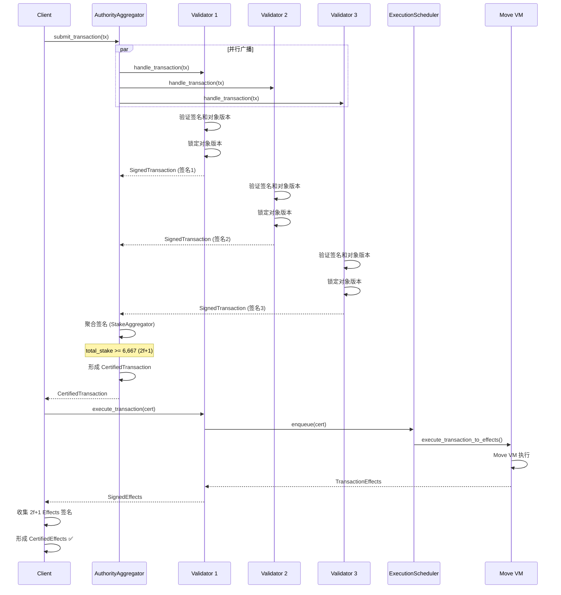
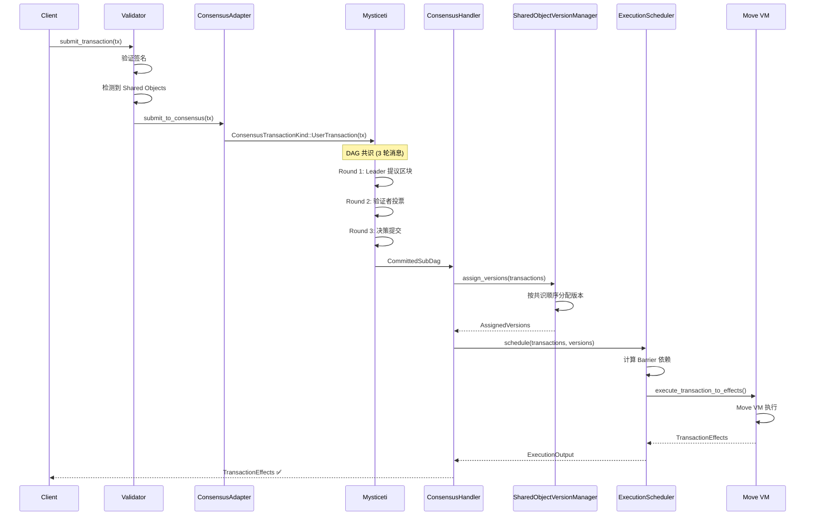

# Sui 简单交易与共享交易深度解析

> **版本**: v1.0  
> **日期**: 2025-01-XX  
> **参考**: Sui 代码仓库, 内部性能分析报告

---

## 📋 目录

1. [概述](#1-概述)
2. [交易类型判断](#2-交易类型判断)
3. [简单交易（FastPath）](#3-简单交易fastpath)
4. [共享交易（共识路径）](#4-共享交易共识路径)
5. [流程对比](#5-流程对比)
6. [性能分析](#6-性能分析)
7. [代码实现细节](#7-代码实现细节)
8. [使用场景](#8-使用场景)
9. [最佳实践](#9-最佳实践)
10. [常见问题](#10-常见问题)

---

## 1. 概述

### 1.1 两种交易类型

根据 [Sui 官方文档](https://docs.sui.io/guides/developer/objects/object-ownership)，Sui 根据交易涉及的对象类型和版本控制路径，将交易分为两类：

| 特性 | 简单交易 (Simple TX) | 共享交易 (Shared TX) |
|-----|---------------------|---------------------|
| **别名** | FastPath Transaction / Owned Object Transaction | Consensus Transaction |
| **对象类型** | 仅 AddressOwner/Immutable 对象 | 包含 Shared/Party/ConsensusAddressOwner 对象 |
| **版本控制路径** | FastPath | Consensus |
| **执行路径** | FastPath（跳过共识） | 共识路径（必须共识） |
| **延迟** | 100-300ms | 500ms-2s+ |
| **并行性** | 完全并行 | 受共享对象限制 |
| **吞吐量** | 极高（无共识瓶颈） | 受共识吞吐量限制 |

### 1.2 核心区别

**简单交易**:
- ✅ 跳过 Mysticeti 共识
- ✅ 立即执行（收集 2f+1 签名后）
- ✅ 完全并行（对象级别）
- ✅ 极低延迟

**共享交易**:
- ✅ 必须经过 Mysticeti 共识排序
- ✅ 共识后执行（按全局顺序）
- ⚠️ 受共享对象冲突限制
- ⚠️ 较高延迟

### 1.3 对象版本控制路径

根据 [Sui 官方文档](https://docs.sui.io/guides/developer/objects/object-ownership)，Sui 对象可以通过两种路径进行版本控制：

#### Fastpath 对象

**特点**:
- 只能使用 `AddressOwner` 或 `Immutable` 所有权类型
- 版本由交易手动指定（Lamport 时间戳）
- 跳过共识，直接执行
- 低延迟和快速最终确认

**限制**:
- 多用户访问同一对象时需要链下协调
- 频繁多用户访问可能导致 Equivocation 或对象锁定
- 必须锁定对象的当前版本作为交易输入

**适用场景**:
- 对延迟或 Gas 成本极其敏感的应用
- 不需要处理复杂多方交易的场景
- 已有链下服务的应用

#### 共识对象

**特点**:
- 可以使用 `AddressOwner`、`Party` 或 `Shared` 所有权类型
- 版本由共识自动分配
- 必须经过共识排序
- 版本管理更简单，特别是频繁访问的对象

**优势**:
- 允许多个地址以协调方式访问同一对象
- 自动处理版本冲突
- 无需链下协调

**适用场景**:
- 需要多方协调的应用
- 频繁访问的共享对象
- 需要全局顺序的场景

### 1.4 设计理念

Sui 的核心创新是**因果顺序 vs 全序**：

- **简单交易 (FastPath)**: 仅需要因果顺序（通过对象版本保证）
- **共享交易 (Consensus)**: 需要全序（通过共识保证）

这允许大部分交易跳过共识，实现极高的吞吐量和低延迟。

---

## 2. 交易类型判断

### 2.1 判断逻辑

**位置**: `crates/sui-types/src/transaction.rs:3380-3383`

```rust
pub fn is_consensus_tx(&self) -> bool {
    self.transaction_data().has_funds_withdrawals()
        || self.shared_input_objects().next().is_some()
}
```

**判断条件**:
1. **有资金提取** (`has_funds_withdrawals()`): 从 DEX 提取资金
2. **有共享对象** (`shared_input_objects()`): 交易输入包含 Shared/Party/ConsensusAddressOwner 对象

**如果两个条件都不满足** → 简单交易（FastPath）

**重要**: 根据 [Sui 官方文档](https://docs.sui.io/guides/developer/objects/object-ownership)，只有 `AddressOwner` 和 `Immutable` 对象可以使用 FastPath。所有其他所有权类型（`Shared`、`Party`、`ConsensusAddressOwner`）都需要共识。

### 2.2 共享对象检测

**位置**: `crates/sui-types/src/transaction.rs:3385-3392`

```rust
pub fn shared_input_objects(&self) -> impl Iterator<Item = SharedInputObject> + '_ {
    self.data()
        .inner()
        .intent_message
        .value
        .shared_input_objects()
        .into_iter()
}
```

**SharedInputObject 结构**:
```rust
pub struct SharedInputObject {
    pub id: ObjectID,
    pub initial_shared_version: SequenceNumber,  // 共享时的版本
    pub mutable: bool,                           // 是否可变访问
}
```

### 2.3 代码示例

**简单交易示例**:
```move
// 只涉及拥有对象
public entry fun transfer_coin(
    coin: Coin<SUI>,
    recipient: address,
    ctx: &mut TxContext,
) {
    transfer::public_transfer(coin, recipient);
}
```

**共享交易示例**:
```move
// 涉及共享对象
public entry fun update_counter(
    counter: &mut Counter,  // Shared object
    ctx: &mut TxContext,
) {
    counter.value = counter.value + 1;
}
```

---

## 3. 简单交易（FastPath）

### 3.1 执行流程



### 3.2 关键阶段

#### 阶段 1: 交易广播与签名收集

**位置**: `crates/sui-core/src/authority_aggregator.rs:762-911`

```rust
pub async fn process_transaction(
    &self,
    transaction: Transaction,
    client_addr: Option<SocketAddr>,
) -> Result<ProcessTransactionResult> {
    // 1. 初始化签名聚合器
    let state = ProcessTransactionState {
        tx_signatures: StakeAggregator::new(committee.clone()),
        // ...
    };

    // 2. 并行广播到所有验证者
    let result = quorum_map_then_reduce_with_timeout(
        committee.clone(),
        self.authority_clients.clone(),
        state,
        |name, client| {
            Box::pin(async move {
                client.handle_transaction(transaction_ref.clone(), client_addr).await
            })
        },
        |mut state, name, weight, response| {
            // 3. 处理响应并聚合签名
            Box::pin(async move {
                match self.handle_process_transaction_response(...) {
                    Ok(Some(result)) => {
                        // Quorum 达成，立即返回
                        return ReduceOutput::Success(result);
                    }
                    // ... 继续等待
                }
            })
        },
    ).await;

    result
}
```

**延迟**: 50-150ms（等待最快的 2f+1 个验证者响应）

#### 阶段 2: 签名聚合与证书形成

**位置**: `crates/sui-core/src/stake_aggregator.rs`

```rust
pub fn insert(
    &mut self,
    authority: AuthorityName,
    signed_tx: SignedTransaction,
) -> InsertResult {
    let votes = self.committee.weight(&authority);
    self.total_votes += votes;

    // 检查是否达到 Quorum (2f+1 = 6,667/10,000)
    if self.total_votes >= self.committee.threshold::<STRENGTH>() {
        InsertResult::QuorumReached(cert_sig)
    } else {
        InsertResult::NotEnoughVotes { ... }
    }
}
```

**Quorum 阈值**:
- `QUORUM_THRESHOLD = 6,667` (2f+1)
- `VALIDITY_THRESHOLD = 3,334` (f+1)

#### 阶段 3: 证书执行

**位置**: `crates/sui-core/src/authority.rs:1469-1516`

```rust
pub async fn wait_for_transaction_execution(
    &self,
    transaction: &VerifiedExecutableTransaction,
    epoch_store: &Arc<AuthorityPerEpochStore>,
) -> SuiResult<TransactionEffects> {
    // 简单交易可以立即入队执行
    if !transaction.is_consensus_tx()
        && !epoch_store.protocol_config().disable_preconsensus_locking()
    {
        // 立即入队执行（FastPath）
        self.execution_scheduler.enqueue(
            vec![(
                Schedulable::Transaction(transaction.clone()),
                ExecutionEnv::new().with_scheduling_source(SchedulingSource::NonFastPath),
            )],
            epoch_store,
        );
    }

    // 等待执行完成
    epoch_store
        .within_alive_epoch(self.notify_read_effects(...))
        .await
}
```

### 3.3 对象锁定机制

**位置**: `crates/sui-core/src/authority/authority_store.rs`

**锁定逻辑**:
```rust
pub struct LockDetails {
    pub object_id: ObjectID,
    pub version: SequenceNumber,
    pub transaction_digest: TransactionDigest,
}

// 验证者签名时锁定对象版本
fn lock_object_version(
    &self,
    object_id: ObjectID,
    version: SequenceNumber,
    tx_digest: TransactionDigest,
) -> Result<()> {
    // 检查是否已被其他交易锁定
    if let Some(existing_lock) = self.get_lock(object_id, version)? {
        if existing_lock.tx_digest != tx_digest {
            return Err(SuiError::ObjectVersionLocked);
        }
    }
    
    // 设置锁
    self.set_lock(LockDetails {
        object_id,
        version,
        transaction_digest: tx_digest,
    })?;
    
    Ok(())
}
```

**防止双重花费**:
- 验证者签名时锁定对象版本
- 其他交易无法使用同一版本
- 证书执行后释放锁

### 3.4 性能特点

**延迟分解**:
```
简单交易总延迟 = 网络传播 + 签名收集 + 证书验证 + 执行 + 存储
              = (50-100) + (50-150) + (1-5) + (1-50) + (1-50) ms
              ≈ 100-355ms

典型情况: 150-250ms
最优情况: 100ms
最坏情况: 60s+ (等待 pre_quorum_timeout)
```

**吞吐量**:
- 理论上限: 10,000+ TPS（单验证者）
- 实际: 受网络和存储 I/O 限制
- 完全并行: 不同对象的交易可同时执行

---

## 4. 共享交易（共识路径）

### 4.1 执行流程



### 4.2 关键阶段

#### 阶段 1: 交易提交到共识

**位置**: `crates/sui-core/src/consensus_adapter.rs`

```rust
pub async fn submit_transaction(
    &self,
    transaction: Transaction,
) -> SuiResult {
    // 检测交易类型
    if transaction.is_consensus_tx() {
        // 构建共识交易
        let consensus_tx = ConsensusTransactionKind::UserTransaction(
            Box::new(transaction)
        );
        
        // 提交到 Mysticeti
        self.consensus_client
            .submit_transaction(consensus_tx)
            .await?;
    }
    
    Ok(())
}
```

**重要**: 共享交易以 `UserTransaction`（原始交易）形式提交，**不是** `CertifiedTransaction`。

#### 阶段 2: Mysticeti 共识排序

**位置**: `consensus/core/src/`

**共识流程**:
```
Wave N (Round 3n+1, 3n+2, 3n+3)

Round 3n+1: Leader Round
  - 领导者提议区块
  - 包含祖先引用（DAG 结构）

Round 3n+2: Voting Round
  - 验证者投票支持领导者区块

Round 3n+3: Decision Round
  - 如果领导者获得 2f+1 投票 → COMMIT
  - 否则 → SKIP
```

**延迟**: ~500ms（3 轮消息 + 网络传播）

#### 阶段 3: 共享对象版本分配

**位置**: `crates/sui-core/src/shared_object_version_manager.rs`

```rust
pub fn assign_versions(
    &self,
    transactions: &[Transaction],
) -> Result<AssignedVersions> {
    let mut assigned = AssignedVersions::new();
    let mut current_versions: HashMap<ObjectID, SequenceNumber> = HashMap::new();
    
    // 按共识顺序处理交易
    for tx in transactions {
        for shared_input in tx.shared_input_objects() {
            let obj_id = shared_input.id;
            
            // 获取当前版本
            let current_version = current_versions
                .get(&obj_id)
                .copied()
                .unwrap_or(shared_input.initial_shared_version);
            
            // 如果是可变访问，递增版本
            if shared_input.mutable {
                let next_version = current_version + 1;
                assigned.insert((obj_id, next_version));
                current_versions.insert(obj_id, next_version);
            } else {
                // 只读访问，版本不变
                assigned.insert((obj_id, current_version));
            }
        }
    }
    
    Ok(assigned)
}
```

**版本分配规则**:
- 按共识顺序处理交易
- 可变访问: 版本递增
- 只读访问: 版本不变
- 保证线性历史

#### 阶段 4: 执行调度

**位置**: `crates/sui-core/src/execution_scheduler/execution_scheduler_impl.rs`

```rust
pub fn schedule_transaction(
    &self,
    transaction: VerifiedExecutableTransaction,
    assigned_versions: &AssignedVersions,
) -> Result<()> {
    // 1. 获取共享对象版本
    let shared_object_versions = assigned_versions
        .get_versions_for_transaction(&transaction)?;
    
    // 2. 计算 Barrier 依赖
    let barrier_deps = self.compute_barrier_dependencies(
        &transaction,
        &shared_object_versions,
    )?;
    
    // 3. 入队执行
    self.enqueue_with_dependencies(
        transaction,
        barrier_deps,
    )?;
    
    Ok(())
}
```

**Barrier 依赖机制**:
- 非独占写入 → 独占写入: 必须等待所有非独占写入完成
- 相同对象的交易: 按共识顺序执行

### 4.3 性能特点

**延迟分解**:
```
共享交易总延迟 = 共识排序 + 版本分配 + 执行调度 + 执行 + 存储
              = (400-600) + (1-5) + (1-10) + (1-50) + (1-50) ms
              ≈ 400-715ms

典型情况: 500-700ms
最优情况: 400ms
最坏情况: 2s+ (共识延迟)
```

**吞吐量**:
- 受 Mysticeti 共识吞吐量限制
- 理论: 200,000+ TPS（50 节点）
- 实际: 受共享对象冲突影响

---

## 5. 流程对比

### 5.1 完整流程对比

| 阶段 | 简单交易 | 共享交易 |
|-----|---------|---------|
| **1. 交易提交** | Client → Validators | Client → Validator |
| **2. 验证签名** | ✅ 并行验证 | ✅ 单点验证 |
| **3. 形成证书** | ✅ 客户端收集 2f+1 签名 | ❌ 不需要 |
| **4. 提交共识** | ❌ 跳过 | ✅ 提交原始交易 |
| **5. 共识排序** | ❌ 跳过 | ✅ Mysticeti DAG |
| **6. 版本分配** | ✅ 自动（Lamport） | ✅ 按共识顺序 |
| **7. 执行** | ✅ 立即执行 | ✅ 共识后执行 |
| **8. 返回结果** | ✅ SignedEffects | ✅ TransactionEffects |

### 5.2 时间线对比

**简单交易时间线**:
```
T+0ms:    交易提交
T+50ms:   并行广播到验证者
T+100ms:  收集 2f+1 签名
T+101ms:  形成 CertifiedTransaction
T+102ms:  立即执行
T+150ms:  返回 SignedEffects ✅
```

**共享交易时间线**:
```
T+0ms:    交易提交
T+10ms:   验证签名
T+20ms:   提交到 Mysticeti
T+200ms:  Round 1: Leader 提议
T+250ms:  Round 2: 验证者投票
T+300ms:  Round 3: 决策提交
T+500ms:  共识完成，接收 CommittedSubDag
T+501ms:  分配共享对象版本
T+502ms:  调度执行
T+550ms:  返回 TransactionEffects ✅
```

### 5.3 网络往返次数

| 操作 | 简单交易 | 共享交易 |
|-----|---------|---------|
| **获得证书** | 1 次 RTT | 不需要 |
| **执行交易** | 1 次 RTT（可选） | 1 次 RTT |
| **总 RTT** | 1-2 次 | 1 次 |

**注意**: 简单交易可以在一次 RTT 中同时获得证书和执行结果（如果验证者支持）。

### 5.4 共识参与度

**简单交易**:
- ❌ 不进入 Consensus Block
- ❌ 不参与 Mysticeti DAG
- ✅ 直接执行，事后在 Checkpoint 中排序

**共享交易**:
- ✅ 进入 Consensus Block
- ✅ 参与 Mysticeti DAG
- ✅ 按共识顺序执行

---

## 6. 性能分析

### 6.1 延迟对比

根据 [Sui 简单交易性能分析](notes/SUI_SIMPLE_TX_PERFORMANCE.md):

| 指标 | 简单交易 | 共享交易 |
|-----|---------|---------|
| **P50 延迟** | ~150ms | ~500ms |
| **P99 延迟** | ~300ms | ~1.5s |
| **最坏情况** | 60s+ (超时) | 2s+ |
| **主要瓶颈** | 网络 + Quorum | 共识排序 |

### 6.2 吞吐量对比

| 指标 | 简单交易 | 共享交易 |
|-----|---------|---------|
| **理论 TPS** | 10,000+ (单验证者) | 200,000+ (全网) |
| **实际 TPS** | 受网络和存储限制 | 受共识吞吐量限制 |
| **并行度** | 完全并行 | 受共享对象限制 |
| **瓶颈** | I/O 和网络 | 共识和冲突 |

### 6.3 资源消耗对比

| 资源 | 简单交易 | 共享交易 |
|-----|---------|---------|
| **CPU** | 低（无共识开销） | 中（共识计算） |
| **网络** | 中（签名传播） | 高（DAG 消息） |
| **存储** | 低（无共识状态） | 中（DAG 状态） |
| **内存** | 低 | 中（DAG 缓存） |

### 6.4 成本对比

| 成本类型 | 简单交易 | 共享交易 |
|---------|---------|---------|
| **Gas 费用** | 低 | 中高 |
| **网络费用** | 低 | 中 |
| **时间成本** | 低（快速确认） | 高（较慢确认） |

---

## 7. 代码实现细节

### 7.1 交易类型判断

**位置**: `crates/sui-types/src/transaction.rs:3380-3383`

```rust
pub fn is_consensus_tx(&self) -> bool {
    self.transaction_data().has_funds_withdrawals()
        || self.shared_input_objects().next().is_some()
}
```

**判断逻辑**:
1. 检查是否有资金提取（`has_funds_withdrawals()`）
2. 检查是否有共享对象输入（`shared_input_objects()`）

### 7.2 简单交易处理

**位置**: `crates/sui-core/src/authority.rs:1150-1217`

```rust
pub async fn handle_transaction(
    &self,
    transaction: Transaction,
) -> SuiResult<HandleTransactionResponse> {
    let epoch_store = self.load_epoch_store_one_call_per_task();
    
    // 验证和签名（不执行）
    self.handle_sign_transaction(epoch_store, transaction).await
}
```

**返回**: `TransactionStatus::Signed(AuthoritySignInfo)`

### 7.3 共享交易处理

**位置**: `crates/sui-core/src/consensus_adapter.rs`

```rust
pub async fn submit_transaction(
    &self,
    transaction: Transaction,
) -> SuiResult {
    if transaction.is_consensus_tx() {
        // 构建共识交易
        let consensus_tx = ConsensusTransactionKind::UserTransaction(
            Box::new(transaction)
        );
        
        // 提交到 Mysticeti
        self.consensus_client
            .submit_transaction(consensus_tx)
            .await?;
    }
    
    Ok(())
}
```

### 7.4 共识输出处理

**位置**: `crates/sui-core/src/consensus_handler.rs`

```rust
pub async fn handle_consensus_commit(
    &self,
    committed_subdag: CommittedSubDag,
) -> SuiResult {
    // 1. 提取共识提交的交易
    let transactions = committed_subdag.all_transactions();
    
    // 2. 分配共享对象版本
    let assigned_versions = self.shared_object_version_manager
        .assign_versions(transactions)?;
    
    // 3. 调度执行
    for tx in transactions {
        self.execution_scheduler.schedule(
            tx,
            assigned_versions.clone(),
        )?;
    }
    
    Ok(())
}
```

### 7.5 执行路径选择

**位置**: `crates/sui-core/src/authority.rs:1487-1504`

```rust
if !transaction.is_consensus_tx()
    && !epoch_store.protocol_config().disable_preconsensus_locking()
{
    // 简单交易：立即入队执行（FastPath）
    self.execution_scheduler.enqueue(
        vec![(
            Schedulable::Transaction(transaction.clone()),
            ExecutionEnv::new().with_scheduling_source(SchedulingSource::NonFastPath),
        )],
        epoch_store,
    );
} else {
    // 共享交易：等待共识排序
    // 在 consensus_handler 中处理
}
```

---

## 8. 使用场景

### 8.1 简单交易适用场景

**推荐使用**:
- ✅ **代币转移**: Coin 转移（只涉及拥有对象）
- ✅ **NFT 交易**: NFT 转移和铸造
- ✅ **个人数据**: 用户自己的数据操作
- ✅ **高频操作**: 需要低延迟的场景
- ✅ **批量操作**: 大量独立交易

**示例**:
```move
// 代币转移
public entry fun transfer_coin(
    coin: Coin<SUI>,
    recipient: address,
    ctx: &mut TxContext,
) {
    transfer::public_transfer(coin, recipient);
}

// NFT 铸造
public entry fun mint_nft(
    name: vector<u8>,
    ctx: &mut TxContext,
) {
    let nft = NFT {
        id: object::new(ctx),
        name,
    };
    transfer::public_transfer(nft, tx_context::sender(ctx));
}
```

### 8.2 共享交易适用场景

**推荐使用**:
- ✅ **去中心化应用**: 多用户共享状态
- ✅ **订单簿**: 需要全局顺序的交易
- ✅ **计数器**: 多用户更新同一对象
- ✅ **游戏状态**: 多人游戏共享状态
- ✅ **需要全局顺序**: 必须保证执行顺序的场景

**示例**:
```move
// 共享计数器
public entry fun increment(
    counter: &mut Counter,  // Shared object
    ctx: &mut TxContext,
) {
    counter.value = counter.value + 1;
}

// 订单簿下单
public entry fun place_order(
    orderbook: &mut Orderbook,  // Shared object
    order: Order,
    ctx: &mut TxContext,
) {
    orderbook.add_order(order);
}
```

### 8.3 混合场景

**同时使用两种类型**:
```move
// 存款到 DEX（混合交易）
public entry fun deposit(
    coin: Coin<SUI>,           // Owned object
    dex_vault: &mut DexVault,  // Shared object
    ctx: &mut TxContext,
) {
    // 这个交易会走共识路径（因为有 Shared object）
    dex_vault.deposit(coin);
}
```

**优化建议**:
- 将操作拆分为两个交易
- 先转移代币（简单交易）
- 再更新共享状态（共享交易）

---

## 9. 最佳实践

### 9.1 设计原则

根据 [Sui 官方文档](https://docs.sui.io/guides/developer/objects/object-ownership) 的建议：

**优先使用 FastPath 对象**:
- ✅ 如果可能，避免使用 Shared 对象
- ✅ 使用 Transfer-to-Object 代替 Shared
- ✅ 考虑使用 Party 对象（需要全局顺序的地址拥有对象，但推荐使用 Party 而非 FastPath）
- ⚠️ **注意**: 官方文档建议使用 Party 对象而非 FastPath 对象

**合理使用共识对象**:
- ✅ 只在真正需要全局顺序时使用
- ✅ 避免高冲突的共享对象
- ✅ 考虑对象分片（多个共享对象）
- ✅ 对于需要多方协调的场景，使用 Shared 对象

**FastPath vs Consensus 选择指南**:

| 场景 | 推荐方案 |
|-----|---------|
| 对延迟/Gas 极其敏感 | FastPath (AddressOwner) |
| 不需要复杂多方交易 | FastPath (AddressOwner) |
| 已有链下服务 | FastPath (AddressOwner) |
| 需要多方协调 | Consensus (Shared/Party) |
| 频繁多用户访问 | Consensus (Shared) |
| 需要全局顺序的地址拥有对象 | Consensus (Party) - **推荐** |

### 9.2 性能优化

**简单交易优化**:
- ✅ 批量提交交易（减少网络往返）
- ✅ 使用最新版本的对象（避免版本冲突）
- ✅ 避免重用未确认交易的对象

**共享交易优化**:
- ✅ 减少共享对象冲突（使用多个对象）
- ✅ 优化共享对象访问模式（减少可变访问）
- ✅ 考虑使用只读访问（不递增版本）

### 9.3 错误处理

**版本冲突**:
```rust
// 处理对象版本锁定错误
match result {
    Err(SuiError::ObjectVersionLocked) => {
        // 获取最新版本并重试
        let latest_version = get_latest_object_version(object_id)?;
        retry_with_new_version(latest_version);
    }
    // ...
}
```

**Equivocation 处理**:
- 不要同时提交使用相同对象的多个交易
- 如果交易未确认，不要重用其对象
- 使用最新版本的对象

### 9.4 监控指标

**关键指标**:
- `execute_certificate_latency_single_writer`: 简单交易延迟
- `execute_certificate_latency_shared_object`: 共享交易延迟
- `transaction_manager_num_pending_certificates`: 待执行证书数
- `consensus_commit_latency`: 共识提交延迟

---

## 10. 常见问题

### 10.1 简单交易如何保证正确性？

**答案**: 通过对象版本号和锁定机制

1. **对象版本**: 每个对象有版本号，交易必须指定精确版本
2. **版本锁定**: 验证者签名时锁定对象版本
3. **防止双重花费**: 其他交易无法使用已锁定的版本
4. **因果顺序**: Lamport 时间戳保证因果顺序

### 10.2 简单交易不经过共识，如何排序？

**答案**: 执行与排序分离

1. **执行**: 简单交易立即执行（无需共识）
2. **排序**: 事后在 Checkpoint 中排序
3. **保证**: 对象版本号隐含因果关系，不需要全局顺序

### 10.3 共享交易为什么需要共识？

**答案**: 需要全局顺序保证一致性

1. **多用户访问**: 多个用户可能同时修改共享对象
2. **顺序依赖**: 执行顺序影响结果
3. **一致性**: 所有验证者必须看到相同的执行顺序

### 10.4 可以混合使用两种类型吗？

**答案**: 可以，但会走共识路径

- 如果交易同时包含 Owned 和 Shared 对象
- 整个交易会走共识路径
- 建议拆分为两个独立交易

### 10.5 如何选择使用哪种类型？

**决策树**:
```
需要多用户共享状态？
  ├─ 是 → 使用 Shared 对象（共享交易）
  └─ 否 → 使用 Owned 对象（简单交易）
         │
         └─ 需要全局顺序？
            ├─ 是 → 考虑 Party 对象
            └─ 否 → 使用 Owned 对象
```

---

## 11. 总结

### 11.1 核心区别

| 维度 | 简单交易 | 共享交易 |
|-----|---------|---------|
| **对象类型** | Owned/Immutable | Shared |
| **执行路径** | FastPath | 共识路径 |
| **延迟** | 100-300ms | 500ms-2s+ |
| **吞吐量** | 极高 | 受共识限制 |
| **并行性** | 完全并行 | 受冲突限制 |

### 11.2 设计优势

1. **性能**: 大部分交易（简单交易）跳过共识，实现极高吞吐量
2. **灵活性**: 根据需求选择交易类型
3. **可扩展性**: 对象级别并行，充分利用多核 CPU

### 11.3 关键要点

- ✅ 简单交易是 Sui 高性能的关键
- ✅ 共享交易提供全局一致性保证
- ✅ 合理选择交易类型可以优化性能
- ✅ 理解两种类型的区别有助于设计高效应用

---

## 12. 参考资源

### 12.1 代码位置

- `crates/sui-types/src/transaction.rs` - 交易类型判断
- `crates/sui-core/src/authority.rs` - 交易处理入口
- `crates/sui-core/src/authority_aggregator.rs` - 签名聚合
- `crates/sui-core/src/consensus_adapter.rs` - 共识适配器
- `crates/sui-core/src/consensus_handler.rs` - 共识输出处理
- `crates/sui-core/src/shared_object_version_manager.rs` - 版本分配

### 12.2 相关文档

- `notes/SUI_SIMPLE_TX_PERFORMANCE.md` - 简单交易性能分析
- `notes/SUI_CERTIFICATE_SEPARATION_ANALYSIS.md` - 证书分离分析
- `notes/SUI_KEY_PARAMETERS_AND_METRICS.md` - 关键参数和指标
- `mynotes/sui/sui_arch.md` - Sui 架构总览
- `mynotes/sui/sui_object.md` - Object 机制详解

### 12.3 官方文档参考

- [Object Ownership](https://docs.sui.io/guides/developer/objects/object-ownership) - Sui 官方对象所有权文档
- [Object Model](https://docs.sui.io/guides/developer/objects/object-model) - Sui 官方对象模型文档

---

**文档版本**: v1.0  
**最后更新**: 2025-01-XX  
**维护者**: Sui 开发团队

