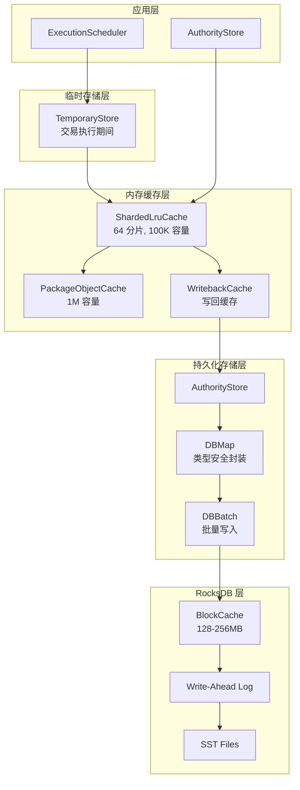
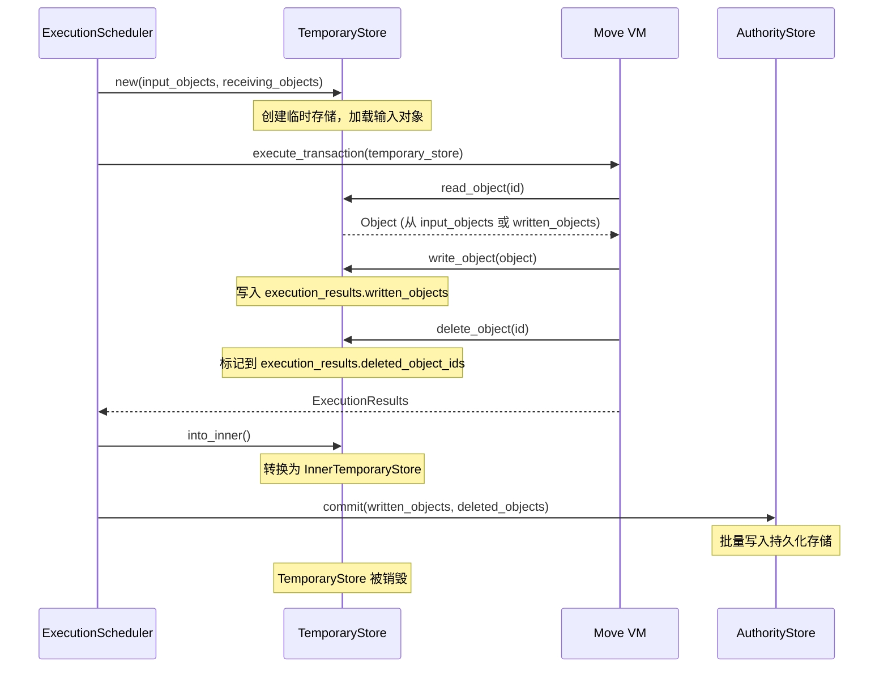
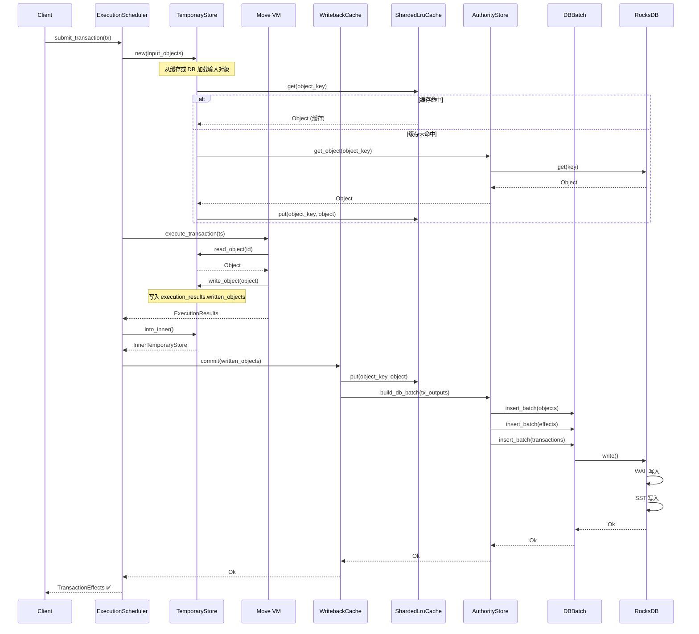

# Sui 存储机制深度解析

> **版本**: v1.0  
> **日期**: 2025-01-XX  
> **参考**: [Sui 官方文档](https://docs.sui.io/), Sui 代码仓库

---

## 📋 目录

1. [概述](#1-概述)
2. [存储架构总览](#2-存储架构总览)
3. [持久化存储层](#3-持久化存储层)
4. [内存存储机制](#4-内存存储机制)
5. [临时存储机制](#5-临时存储机制)
6. [存储流程](#6-存储流程)
7. [缓存策略](#7-缓存策略)
8. [性能优化](#8-性能优化)
9. [存储配置](#9-存储配置)
10. [最佳实践](#10-最佳实践)

---

## 1. 概述

### 1.1 存储设计理念

Sui 的存储系统采用**分层架构**，从内存到磁盘提供多级缓存和持久化：

- **对象中心模型**: 以对象为基本存储单元，而非账户
- **版本化存储**: 每个对象的不同版本都独立存储
- **扁平键值对**: 无全局状态树，直接通过 `(ObjectID, Version)` 查找
- **多层缓存**: 内存缓存 → RocksDB BlockCache → 磁盘存储

### 1.2 存储层次

```
应用层 (Application Layer)
    ↓
内存缓存层 (In-Memory Cache Layer)
    ├─ ShardedLruCache (对象缓存)
    ├─ PackageObjectCache (包缓存)
    └─ WritebackCache (写回缓存)
    ↓
临时存储层 (Temporary Storage Layer)
    └─ TemporaryStore (交易执行期间)
    ↓
持久化存储层 (Persistent Storage Layer)
    ├─ AuthorityStore (存储抽象)
    ├─ DBMap (类型安全封装)
    └─ RocksDB (底层存储引擎)
```

### 1.3 关键特性

| 特性 | 说明 |
|-----|------|
| **版本化存储** | `(ObjectID, Version)` → Object |
| **原子批量写入** | DBBatch 保证一致性 |
| **分片缓存** | 减少锁竞争，提高并发 |
| **写回缓存** | 延迟写入，提高性能 |
| **WAL 日志** | 保证崩溃恢复 |

---

## 2. 存储架构总览

### 2.1 整体架构图



### 2.2 数据流向

**读取路径**:
```
查询请求 → ShardedLruCache → PackageObjectCache → RocksDB BlockCache → SST Files
```

**写入路径**:
```
交易执行 → TemporaryStore → WritebackCache → DBBatch → WAL → SST Files
```

---

## 3. 持久化存储层

### 3.1 RocksDB 后端

**位置**: `crates/typed-store/src/rocks/`

Sui 使用 **RocksDB** 作为持久化存储后端：

- **列族 (Column Families)**: 不同类型数据使用不同列族
- **WAL (Write-Ahead Log)**: 保证崩溃恢复
- **SST (Sorted String Table)**: 持久化数据文件
- **BlockCache**: 内存中的块缓存

### 3.2 AuthorityPerpetualTables

**位置**: `crates/sui-core/src/authority/authority_store_tables.rs`

```rust
pub struct AuthorityPerpetualTables {
    // 对象存储：ObjectKey → StoreObjectWrapper
    pub(crate) objects: DBMap<ObjectKey, StoreObjectWrapper>,

    // 拥有对象的活跃标记
    pub(crate) live_owned_object_markers: DBMap<ObjectRef, Option<LockDetailsWrapperDeprecated>>,

    // 交易存储：TransactionDigest → TrustedTransaction
    pub(crate) transactions: DBMap<TransactionDigest, TrustedTransaction>,

    // 执行效果存储：TransactionEffectsDigest → TransactionEffects
    pub(crate) effects: DBMap<TransactionEffectsDigest, TransactionEffects>,

    // 已执行交易标记：TransactionDigest → TransactionEffectsDigest
    pub(crate) executed_effects: DBMap<TransactionDigest, TransactionEffectsDigest>,

    // 事件日志：TransactionDigest → TransactionEvents
    pub(crate) events_2: DBMap<TransactionDigest, TransactionEvents>,

    // 每个 epoch 的对象标记表
    pub(crate) object_per_epoch_marker_table: DBMap<(EpochId, ObjectKey), MarkerValue>,
    pub(crate) object_per_epoch_marker_table_v2: DBMap<(EpochId, FullObjectKey), MarkerValue>,

    // 状态哈希（用于 checkpoint）
    pub(crate) root_state_hash_by_epoch: DBMap<EpochId, (CheckpointSequenceNumber, GlobalStateHash)>,

    // 系统配置
    pub(crate) epoch_start_configuration: DBMap<(), EpochStartConfiguration>,
    pub(crate) pruned_checkpoint: DBMap<(), CheckpointSequenceNumber>,
}
```

### 3.3 对象存储格式

**位置**: `crates/sui-core/src/authority/authority_store_types.rs`

```rust
// 版本化的对象包装器（支持未来迁移）
pub enum StoreObjectWrapper {
    V1(StoreObjectV1),
}

pub enum StoreObjectV1 {
    Value(Box<StoreObjectValue>),  // 活跃对象
    Deleted,                        // 删除标记
    Wrapped,                        // 被包装的对象
}

pub struct StoreObjectValue {
    pub data: StoreData,           // 对象数据
    pub owner: Owner,              // 所有权信息
    pub previous_transaction: TransactionDigest,  // 前驱交易
    pub storage_rebate: u64,       // 存储费用返利
}

pub enum StoreData {
    Package(MovePackage),          // Move 包
    Object(MoveObject),            // Move 对象
    IndirectObject,                // 间接对象引用
}

// 对象键：ObjectKey = (ObjectID, VersionNumber)
pub type ObjectKey = (ObjectID, VersionNumber);
```

### 3.4 DBMap 类型安全封装

**位置**: `crates/typed-store/src/rocks/mod.rs`

```rust
// DBMap: 类型安全的列族封装
pub struct DBMap<K, V> {
    cf: String,           // 列族名称
    db: Arc<Database>,    // 数据库引用
    _phantom: PhantomData<(K, V)>,
}

impl<K, V> DBMap<K, V> {
    // 类型安全的键值对操作
    pub fn get(&self, key: &K) -> Result<Option<V>, TypedStoreError>
    pub fn insert(&self, key: K, value: V) -> Result<(), TypedStoreError>
    pub fn remove(&self, key: &K) -> Result<(), TypedStoreError>
    pub fn iter(&self) -> Result<impl Iterator<Item = (K, V)>>
}
```

**特点**:
- 编译时类型检查
- 自动序列化/反序列化（BCS）
- 列族隔离
- 支持范围查询

### 3.5 DBBatch 原子批量写入

**位置**: `crates/typed-store/src/rocks/mod.rs`

```rust
// DBBatch: 原子批量写入
pub struct DBBatch {
    database: Arc<Database>,
    batch: StorageWriteBatch,      // RocksDB WriteBatch
    db_metrics: Arc<DBMetrics>,
    write_sample_interval: SamplingInterval,
}

impl DBBatch {
    // 批量插入
    pub fn insert_batch<K, V>(
        &mut self,
        db: &DBMap<K, V>,
        new_vals: impl IntoIterator<Item = (K, V)>,
    ) -> Result<&mut Self, TypedStoreError> {
        for (key, value) in new_vals {
            let key_bytes = bcs::to_bytes(&key)?;
            let value_bytes = bcs::to_bytes(&value)?;
            self.batch.put_cf(&db.cf, key_bytes, value_bytes);
        }
        Ok(self)
    }

    // 批量删除
    pub fn delete_batch<K, V>(
        &mut self,
        db: &DBMap<K, V>,
        purged_vals: impl IntoIterator<Item = K>,
    ) -> Result<(), TypedStoreError>

    // 原子提交
    pub fn write(self) -> Result<(), TypedStoreError> {
        let timer = self.db_metrics
            .rocksdb_batch_commit_latency_seconds
            .start_timer();

        let batch_size = self.batch.size_in_bytes();

        // 写入 RocksDB
        self.database.write_opt(self.batch, &rocksdb::WriteOptions::default())?;

        let elapsed = timer.stop_and_record();

        // 慢速写入告警 (>1秒)
        if elapsed > 1.0 {
            warn!(?elapsed, "very_slow_batch_write");
            self.db_metrics.rocksdb_very_slow_batch_writes_count.inc();
        }

        Ok(())
    }
}
```

**使用示例**:
```rust
// 批量写入多个交易输出
let mut write_batch = self.perpetual_tables.transactions.batch();

for tx_output in tx_outputs {
    write_batch
        .insert_batch(&self.perpetual_tables.effects, [(effects_digest, tx_output.effects.clone())])?
        .insert_batch(&self.perpetual_tables.executed_effects, [(tx_digest, effects_digest)])?
        .insert_batch(&self.perpetual_tables.transactions, [(tx_digest, tx_output.transaction.serializable_ref())])?
        .insert_batch(&self.perpetual_tables.objects, tx_output.written.iter().map(|(oref, obj)| {
            (ObjectKey::from(oref), get_store_object(obj.clone()))
        }))?;
}

// 原子提交
write_batch.write()?;
```

### 3.6 RocksDB 配置

**位置**: `crates/typed-store/src/rocks/options.rs`

```rust
fn default_db_options() -> DBOptions {
    let mut opt = rocksdb::Options::default();

    // 并行化
    opt.increase_parallelism(8);  // 线程数
    opt.set_enable_pipelined_write(true);  // 管道化写入

    // 压缩配置
    opt.set_compression_type(rocksdb::DBCompressionType::Lz4);  // 内存层
    opt.set_bottommost_compression_type(rocksdb::DBCompressionType::Zstd);  // 底层

    // 块缓存
    opt.set_table_cache_num_shard_bits(10);  // 1024 分片

    let mut block_opts = BlockBasedOptions::default();
    block_opts.set_block_size(16 * 1024);  // 16KB 块大小
    block_opts.set_block_cache(&Cache::new_lru_cache(128 << 20));  // 128MB
    block_opts.set_bloom_filter(10.0, false);  // 布隆过滤器

    opt.set_block_based_table_factory(&block_opts);
    opt
}

// 对象表专用配置
fn objects_table_config() -> DBOptions {
    default_db_options()
        .optimize_for_write_throughput()      // 写入优化
        .optimize_for_point_lookup(256 << 20) // 256MB 块缓存
        .optimize_for_large_values_no_scan(512)  // 512B 最小 blob
}
```

**环境变量配置**:
| 变量 | 功能 | 默认值 |
|-----|------|--------|
| `OBJECTS_BLOCK_CACHE_MB` | 对象表块缓存大小 | 128MB |
| `LOCKS_BLOCK_CACHE_MB` | 锁表块缓存大小 | 64MB |
| `TRANSACTIONS_BLOCK_CACHE_MB` | 交易表块缓存大小 | 64MB |
| `EFFECTS_BLOCK_CACHE_MB` | 效果表块缓存大小 | 64MB |
| `DB_WRITE_BUFFER_SIZE_MB` | 写入缓冲区大小 | 256MB |
| `DB_WAL_SIZE_MB` | WAL 大小 | 1GB |

---

## 4. 内存存储机制

### 4.1 ShardedLruCache

**位置**: `crates/sui-storage/src/sharded_lru.rs`

**设计目标**:
- 减少锁竞争（分片设计）
- 高并发访问
- LRU 淘汰策略

```rust
pub struct ShardedLruCache<K, V, S = RandomState> {
    shards: Vec<RwLock<LruCache<K, V>>>,  // 多个独立分片
    hasher: S,
}

impl<K, V> ShardedLruCache<K, V> {
    pub fn new(capacity: u64, num_shards: u64) -> Self {
        let cap_per_shard = capacity.div_ceil(num_shards);
        let hasher = RandomState::default();
        Self {
            hasher,
            shards: (0..num_shards)
                .map(|_| {
                    RwLock::new(LruCache::new(
                        NonZeroUsize::new(cap_per_shard as usize).unwrap(),
                    ))
                })
                .collect(),
        }
    }

    fn shard_id(&self, key: &K) -> usize {
        let h = self.hasher.hash_one(key) as usize;
        h % self.shards.len()
    }

    pub fn get(&self, key: &K) -> Option<V> {
        let shard = self.read_shard(key);
        shard.peek(key).cloned()
    }

    pub fn put(&self, key: K, value: V) -> Option<V> {
        let mut shard = self.write_shard(&key);
        shard.push(key, value)
    }

    // 批量失效（按分片分组避免死锁）
    pub fn batch_invalidate(&self, keys: impl IntoIterator<Item = K>) {
        let mut grouped = HashMap::new();
        for key in keys.into_iter() {
            let shard_idx = self.shard_id(&key);
            grouped.entry(shard_idx).or_insert(vec![]).push(key);
        }
        for (shard_idx, keys) in grouped.into_iter() {
            let mut lock = self.shards[shard_idx].write();
            for key in keys {
                lock.pop(&key);
            }
        }
    }
}
```

**特点**:
- **分片设计**: 默认 64 个分片，减少锁竞争
- **LRU 淘汰**: 自动淘汰最久未使用的项
- **批量操作**: 支持批量失效，按分片分组避免死锁
- **线程安全**: 使用 `RwLock` 保证并发安全

**默认配置**:
```rust
// 文件: crates/sui-core/src/execution_cache/writeback_cache.rs
object_cache_size: 100,000        // 环境变量: SUI_MAX_CACHE_SIZE
marker_cache_size: 100,000        // 默认 = object_cache_size
transaction_cache_size: 100,000   // 默认 = max_cache_size
num_shards: 64                    // 分片数量
```

### 4.2 PackageObjectCache

**位置**: `crates/sui-storage/src/package_object_cache.rs`

**用途**: 缓存 Move 包对象，减少重复加载

```rust
pub struct PackageObjectCache {
    cache: ShardedLruCache<ObjectID, PackageObject>,
}

impl PackageObjectCache {
    pub fn new(capacity: u64) -> Self {
        Self {
            cache: ShardedLruCache::new(capacity, 64),
        }
    }
}
```

**默认配置**:
```rust
package_cache_size: 1,000,000  // 环境变量: SUI_PACKAGE_CACHE_SIZE
```

### 4.3 WritebackCache

**位置**: `crates/sui-core/src/execution_cache/writeback_cache.rs`

**设计目标**:
- 延迟写入，提高性能
- 批量提交，减少 I/O
- 保证一致性

```rust
pub struct WritebackCache {
    // 对象缓存
    object_cache: ShardedLruCache<ObjectKey, CachedObject>,
    
    // 包缓存
    package_cache: PackageObjectCache,
    
    // 未提交的写入
    uncommitted_writes: Arc<RwLock<HashMap<ObjectKey, CachedObject>>>,
    
    // 背压阈值
    backpressure_threshold: u64,
}
```

**工作流程**:
1. **写入**: 先写入内存缓存，标记为未提交
2. **读取**: 优先从缓存读取，未命中则从 DB 读取
3. **提交**: 批量将未提交写入持久化到 DB
4. **失效**: 提交后失效缓存项

---

## 5. 临时存储机制

### 5.1 TemporaryStore 概述

**位置**: `sui-execution/latest/sui-adapter/src/temporary_store.rs`

**设计目标**:
- 交易执行期间的临时状态容器
- 隔离不同交易的执行状态
- 支持回滚和原子性

**重要**: TemporaryStore 是**交易级别**的临时存储，不是区块级别的。每个交易执行时创建独立的 TemporaryStore。

### 5.2 TemporaryStore 结构

```rust
pub struct TemporaryStore<'backing> {
    // 后端存储引用（用于加载包和父对象）
    store: &'backing dyn BackingStore,
    
    // 交易摘要
    tx_digest: TransactionDigest,
    
    // 输入对象（交易输入的所有对象）
    input_objects: BTreeMap<ObjectID, Object>,
    
    // 非独占写入输入的原始版本（用于检测非法修改）
    non_exclusive_input_original_versions: BTreeMap<ObjectID, Object>,
    
    // 共识对象流结束标记
    stream_ended_consensus_objects: BTreeMap<ObjectID, SequenceNumber>,
    
    // Lamport 时间戳（用于版本分配）
    lamport_timestamp: SequenceNumber,
    
    // 可变输入引用追踪
    mutable_input_refs: BTreeMap<ObjectID, (VersionDigest, Owner)>,
    
    // 执行结果
    execution_results: ExecutionResultsV2,
    
    // 运行时加载的对象（动态字段 + 接收对象）
    loaded_runtime_objects: BTreeMap<ObjectID, DynamicallyLoadedObjectMetadata>,
    
    // 包装对象容器映射
    wrapped_object_containers: BTreeMap<ObjectID, ObjectID>,
    
    // 协议配置
    protocol_config: &'backing ProtocolConfig,
    
    // 运行时从 DB 加载的包
    runtime_packages_loaded_from_db: RwLock<BTreeMap<ObjectID, PackageObject>>,
    
    // 接收对象列表
    receiving_objects: Vec<ObjectRef>,
    
    // 生成的对象 ID
    generated_runtime_ids: BTreeSet<ObjectID>,
    
    // 当前 epoch
    cur_epoch: EpochId,
    
    // 加载的每 epoch 配置对象
    loaded_per_epoch_config_objects: RwLock<BTreeSet<ObjectID>>,
}
```

### 5.3 TemporaryStore 生命周期



### 5.4 TemporaryStore 关键方法

```rust
impl TemporaryStore {
    /// 创建新的临时存储
    pub fn new(
        store: &'backing dyn BackingStore,
        input_objects: InputObjects,
        receiving_objects: Vec<ObjectRef>,
        tx_digest: TransactionDigest,
        protocol_config: &'backing ProtocolConfig,
        cur_epoch: EpochId,
    ) -> Self {
        // 计算 Lamport 时间戳
        let lamport_timestamp = input_objects.lamport_timestamp(&receiving_objects);
        
        // 提取可变输入引用
        let mutable_input_refs = input_objects.exclusive_mutable_inputs();
        
        // 转换为对象映射
        let objects = input_objects.into_object_map();
        
        Self {
            store,
            tx_digest,
            input_objects: objects,
            lamport_timestamp,
            mutable_input_refs,
            execution_results: ExecutionResultsV2::default(),
            // ...
        }
    }

    /// 读取对象（优先从写入缓存，其次从输入）
    pub fn read_object(&self, id: &ObjectID) -> Option<&Object> {
        self.execution_results.written_objects.get(id)
            .or_else(|| self.input_objects.get(id))
    }

    /// 修改输入对象
    pub fn mutate_input_object(&mut self, object: Object) {
        let id = object.id();
        self.execution_results.modified_objects.insert(id);
        self.execution_results.written_objects.insert(id, object);
    }

    /// 创建新对象
    pub fn create_object(&mut self, object: Object) {
        let id = object.id();
        self.execution_results.created_object_ids.insert(id);
        self.execution_results.written_objects.insert(id, object);
    }

    /// 删除对象
    pub fn delete_input_object(&mut self, id: &ObjectID) {
        self.execution_results.modified_objects.insert(*id);
        self.execution_results.deleted_object_ids.insert(*id);
    }

    /// 更新对象版本和前驱交易
    pub fn update_object_version_and_prev_tx(&mut self) {
        self.execution_results.update_version_and_previous_tx(
            self.lamport_timestamp,
            self.tx_digest,
            &self.input_objects,
            self.protocol_config.reshare_at_same_initial_version(),
        );
    }

    /// 转换为内部存储结构
    pub fn into_inner(self) -> InnerTemporaryStore {
        let results = self.execution_results;
        InnerTemporaryStore {
            input_objects: self.input_objects,
            written: results.written_objects,
            deleted: results.deleted_object_ids,
            events: TransactionEvents {
                data: results.user_events,
            },
            // ...
        }
    }
}
```

### 5.5 区块级别的临时存储？

**重要发现**: Sui **没有区块级别的临时存储**。

**原因**:
1. **对象中心模型**: Sui 以对象为单位，而非区块
2. **并行执行**: 不同对象的交易可以并行执行，不需要区块级别的临时状态
3. **交易原子性**: 每个交易独立执行，使用自己的 TemporaryStore
4. **Checkpoint 机制**: 使用 Checkpoint 而非区块来组织交易

**对比传统区块链**:
- **以太坊**: 区块级别的状态树，区块内交易串行执行
- **Sui**: 交易级别的 TemporaryStore，交易并行执行

---

## 6. 存储流程

### 6.1 完整存储流程



### 6.2 读取流程

```
1. 查询请求
   ↓
2. ShardedLruCache::get()
   ├─ 缓存命中 → 返回对象 ✅
   └─ 缓存未命中 → 继续
      ↓
3. PackageObjectCache::get() (如果是包)
   ├─ 缓存命中 → 返回包 ✅
   └─ 缓存未命中 → 继续
      ↓
4. RocksDB BlockCache::get()
   ├─ 块缓存命中 → 返回对象 ✅
   └─ 块缓存未命中 → 继续
      ↓
5. RocksDB SST Files::get()
   └─ 从磁盘读取 → 返回对象 ✅
      ↓
6. 回填缓存
   └─ ShardedLruCache::put()
```

### 6.3 写入流程

```
1. 交易执行
   ↓
2. TemporaryStore::write_object()
   └─ 写入 execution_results.written_objects
      ↓
3. 交易完成
   ↓
4. WritebackCache::commit()
   ├─ 写入 ShardedLruCache
   └─ 构建 DBBatch
      ↓
5. DBBatch::insert_batch()
   └─ 累积多个写入操作
      ↓
6. DBBatch::write()
   ├─ 写入 WAL (Write-Ahead Log)
   └─ 写入 MemTable
      ↓
7. RocksDB Flush
   └─ MemTable → SST Files
      ↓
8. 持久化完成 ✅
```

---

## 7. 缓存策略

### 7.1 缓存层次

| 层次 | 类型 | 容量 | 延迟 | 用途 |
|-----|------|------|------|------|
| **L1** | ShardedLruCache | 100K 对象 | ~1μs | 热对象缓存 |
| **L2** | PackageObjectCache | 1M 包 | ~1μs | 包对象缓存 |
| **L3** | RocksDB BlockCache | 128-256MB | ~0.1ms | 块级缓存 |
| **L4** | RocksDB SST | 磁盘 | ~1-10ms | 持久化存储 |

### 7.2 缓存失效策略

**写入时失效**:
```rust
// 对象被修改后，失效缓存
fn invalidate_on_write(object_key: ObjectKey) {
    object_cache.invalidate(&object_key);
}
```

**批量失效**:
```rust
// 批量失效多个对象
fn batch_invalidate(keys: Vec<ObjectKey>) {
    object_cache.batch_invalidate(keys);
}
```

**LRU 淘汰**:
- 当缓存达到容量上限时，自动淘汰最久未使用的项
- 使用 `LruCache` 实现

### 7.3 缓存预热

**启动时预热**:
- 可以预加载热门对象到缓存
- 基于历史访问模式预测

**运行时预热**:
- 读取对象时自动回填缓存
- 支持批量预取

---

## 8. 性能优化

### 8.1 批量写入优化

**DBBatch 批量写入**:
```rust
// 单个交易输出包含多个对象
let mut write_batch = self.perpetual_tables.transactions.batch();

// 累积多个写入操作
for tx_output in tx_outputs {
    write_batch
        .insert_batch(&self.perpetual_tables.effects, [...])?
        .insert_batch(&self.perpetual_tables.objects, [...])?
        .insert_batch(&self.perpetual_tables.transactions, [...])?;
}

// 一次性原子提交
write_batch.write()?;
```

**优势**:
- 减少 I/O 次数
- 原子性保证
- 更好的 RocksDB 性能

### 8.2 分片缓存优化

**减少锁竞争**:
- 64 个独立分片
- 每个分片独立锁
- 减少锁竞争概率

**批量操作优化**:
- 按分片分组操作
- 避免死锁
- 提高并发性能

### 8.3 写回缓存优化

**延迟写入**:
- 先写入内存缓存
- 批量提交到 DB
- 减少 I/O 开销

**背压控制**:
```rust
if uncommitted_writes.len() > backpressure_threshold {
    // 触发批量提交
    commit_uncommitted_writes()?;
}
```

---

## 9. 存储配置

### 9.1 环境变量配置

| 变量 | 功能 | 默认值 |
|-----|------|--------|
| `SUI_MAX_CACHE_SIZE` | 对象缓存大小 | 100,000 |
| `SUI_PACKAGE_CACHE_SIZE` | 包缓存大小 | 1,000,000 |
| `OBJECTS_BLOCK_CACHE_MB` | 对象表块缓存 | 128MB |
| `DB_WRITE_BUFFER_SIZE_MB` | 写入缓冲区 | 256MB |
| `DB_WAL_SIZE_MB` | WAL 大小 | 1GB |
| `DB_PARALLELISM` | 并行度 | 8 |

### 9.2 配置文件

**NodeConfig** (`sui-config/src/node.rs`):
```rust
pub struct NodeConfig {
    pub authority_store_pruning_config: AuthorityStorePruningConfig,
    pub expensive_safety_check_config: ExpensiveSafetyCheckConfig,
    // ...
}
```

### 9.3 性能调优建议

**高吞吐量场景**:
- 增加 `SUI_MAX_CACHE_SIZE` (200,000+)
- 增加 `OBJECTS_BLOCK_CACHE_MB` (512MB+)
- 增加 `DB_WRITE_BUFFER_SIZE_MB` (512MB+)

**低延迟场景**:
- 增加缓存大小
- 使用 SSD 存储
- 优化 RocksDB 配置

**内存受限场景**:
- 减少缓存大小
- 启用对象版本修剪
- 优化压缩配置

---

## 10. 最佳实践

### 10.1 存储设计

**推荐**:
- ✅ 使用 DBBatch 批量写入
- ✅ 合理配置缓存大小
- ✅ 监控存储指标
- ✅ 定期修剪旧版本

**避免**:
- ❌ 单条写入（使用批量写入）
- ❌ 过度缓存（导致内存压力）
- ❌ 忽略 WAL 配置
- ❌ 不监控存储性能

### 10.2 性能优化

**缓存优化**:
- 根据访问模式调整缓存大小
- 监控缓存命中率
- 使用分片缓存减少锁竞争

**写入优化**:
- 使用 DBBatch 批量写入
- 合理配置 WAL 大小
- 优化 RocksDB 压缩配置

**读取优化**:
- 增加 BlockCache 大小
- 使用 SSD 存储
- 优化查询模式

### 10.3 监控指标

**关键指标**:
- `rocksdb_batch_commit_latency_seconds`: 批量提交延迟
- `rocksdb_batch_commit_bytes`: 批量提交大小
- `cache_hit_rate`: 缓存命中率
- `uncommitted_writes_count`: 未提交写入数量

---

## 11. 总结

### 11.1 核心特性

1. **分层存储**: 内存缓存 → 临时存储 → 持久化存储
2. **版本化存储**: `(ObjectID, Version)` → Object
3. **批量写入**: DBBatch 原子批量写入
4. **分片缓存**: 减少锁竞争，提高并发
5. **写回缓存**: 延迟写入，提高性能

### 11.2 关键发现

- ✅ **有持久化存储**: RocksDB 作为后端
- ✅ **有内存缓存**: ShardedLruCache + PackageObjectCache
- ❌ **没有区块级别临时存储**: 只有交易级别的 TemporaryStore

### 11.3 设计优势

- **性能**: 多层缓存，减少 I/O
- **一致性**: 原子批量写入
- **可扩展性**: 分片设计，支持高并发
- **可靠性**: WAL 保证崩溃恢复

---

## 12. 参考资源

### 12.1 官方文档
- [Sui Documentation](https://docs.sui.io/) - Sui 官方文档

### 12.2 代码位置
- `crates/sui-core/src/authority/authority_store.rs` - AuthorityStore 实现
- `crates/sui-core/src/authority/authority_store_tables.rs` - 存储表定义
- `crates/sui-storage/src/sharded_lru.rs` - 分片 LRU 缓存
- `sui-execution/latest/sui-adapter/src/temporary_store.rs` - 临时存储
- `crates/typed-store/src/rocks/mod.rs` - RocksDB 封装

### 12.3 相关文档
- `mynotes/sui/sui_arch.md` - Sui 架构总览
- `mynotes/sui/sui_object.md` - Object 机制详解
- `notes/SUI_ARCHITECTURE_REPORT.md` - 架构研究报告
- `notes/SUI_SIMPLE_TX_PERFORMANCE.md` - 性能分析报告

---

**文档版本**: v1.0  
**最后更新**: 2025-01-XX  
**维护者**: Sui 开发团队

