# Sui 架构研究报告

> 本报告深入分析 Sui 区块链的核心架构，重点关注共识层、执行层、存储层的设计及其交互方式，特别是状态从内存到磁盘的存储流程。

---

## 目录

1. [概述](#1-概述)
2. [共识层 - Mysticeti Protocol](#2-共识层---mysticeti-protocol)
3. [执行层 - Move VM Integration](#3-执行层---move-vm-integration)
4. [存储层 - RocksDB Backend](#4-存储层---rocksdb-backend)
5. [状态存储流程：内存到磁盘](#5-状态存储流程内存到磁盘)
6. [层间交互](#6-层间交互)
7. [总结](#7-总结)

---

## 1. 概述

### 1.1 整体架构

Sui 采用三层分离架构，各层职责清晰：

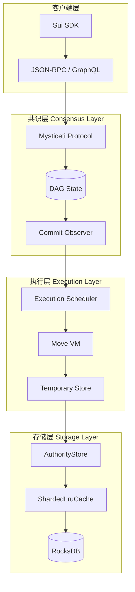

### 1.2 设计理念

| 特性 | 传统区块链 | Sui |
|------|-----------|-----|
| 数据模型 | 账户模型 (Account-based) | 对象模型 (Object-centric) |
| 交易并行 | 串行执行 | 对象级别并行 |
| 共识机制 | 线性区块链 | DAG-based (Mysticeti) |
| 状态存储 | 全局状态树 | 对象版本化存储 |

### 1.3 对象中心模型

Sui 的核心创新是对象中心模型：

- **对象 (Object)**: 状态的基本单元，拥有唯一 ID 和版本号
- **所有权 (Ownership)**: 对象可被地址拥有、共享或不可变
- **版本 (Version)**: 每次修改都产生新版本，支持并行执行

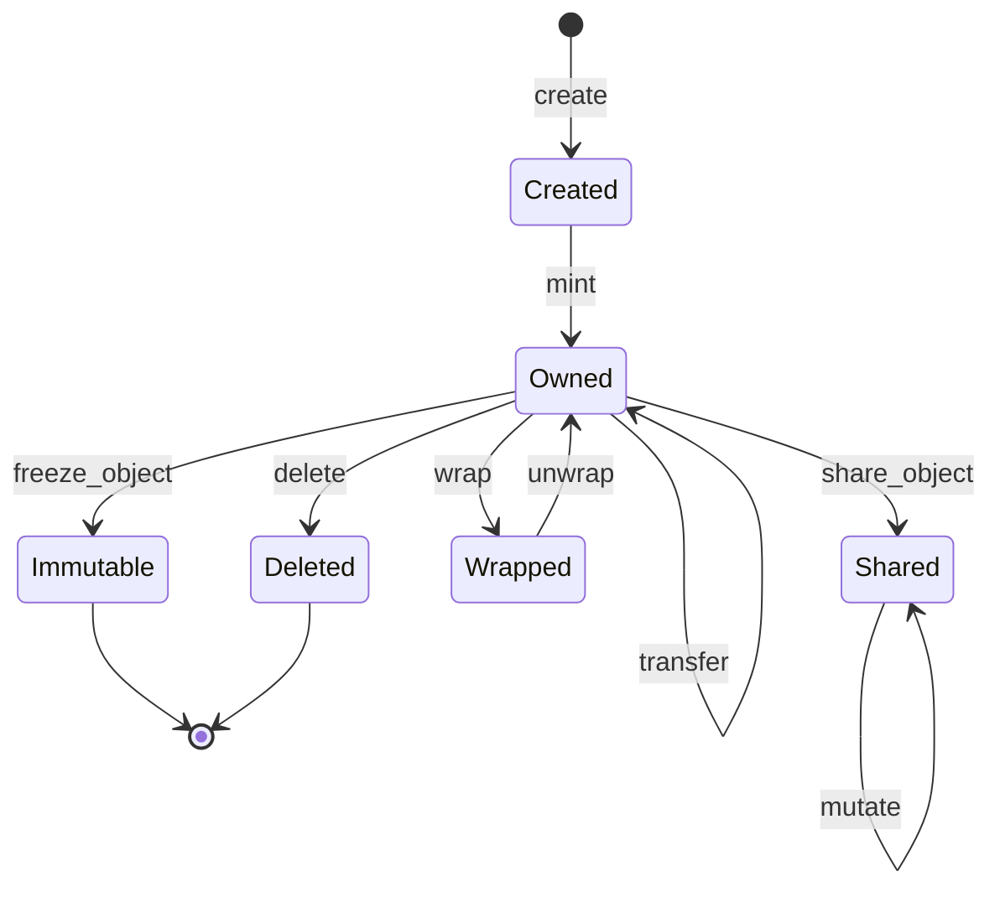

### 1.4 核心目录结构

```
sui/
├── consensus/              # Mysticeti 共识协议
│   ├── core/               # 核心共识逻辑
│   ├── config/             # 协议配置
│   └── types/              # 类型定义
├── sui-execution/          # Move 执行层
│   ├── latest/             # 当前版本
│   │   ├── sui-adapter/    # 执行适配器
│   │   ├── sui-move-natives/  # 本地函数
│   │   └── sui-verifier/   # 验证器
│   └── v0, v1, v2/         # 历史版本
├── crates/
│   ├── sui-core/           # 核心逻辑
│   │   ├── authority/      # 验证者存储
│   │   ├── execution_scheduler/  # 执行调度
│   │   └── checkpoints/    # 检查点
│   ├── sui-types/          # 核心类型
│   ├── sui-storage/        # 存储工具
│   └── typed-store/        # RocksDB 封装
└── external-crates/        # Move 编译器和 VM
```

---

## 2. 共识层 - Mysticeti Protocol

### 2.1 协议概述

Mysticeti 是 Sui 的共识协议，基于 DAG (Directed Acyclic Graph) 结构实现高吞吐量的拜占庭容错共识。

**核心特性：**
- **DAG-based**: 区块形成有向无环图，而非线性链
- **Multi-leader**: 每轮多个验证者可同时提议区块
- **Wave-based commit**: 基于波次 (Wave) 的提交决策
- **FastPath**: 拥有对象交易可跳过共识直接执行

### 2.2 核心数据结构

#### Block 结构

**文件**: `consensus/core/src/block.rs`

```rust
pub struct BlockV2 {
    pub epoch: Epoch,                           // 当前 Epoch
    pub round: Round,                           // 轮次
    pub author: AuthorityIndex,                 // 作者验证者索引
    pub timestamp_ms: BlockTimestampMs,         // 时间戳
    pub ancestors: Vec<BlockRef>,               // 祖先区块引用
    pub transactions: Vec<Transaction>,         // 交易列表
    pub commit_votes: Vec<CommitVote>,          // 提交投票
    pub transaction_votes: Vec<BlockTransactionVotes>, // 交易拒绝投票
    pub misbehavior_reports: Vec<MisbehaviorReport>,  // 作恶报告
}

pub struct BlockRef {
    pub round: Round,
    pub author: AuthorityIndex,
    pub digest: BlockDigest,
}
```

#### CommittedSubDag 结构

**文件**: `consensus/core/src/commit.rs`

```rust
pub struct CommittedSubDag {
    pub leader: BlockRef,                       // 领导者区块
    pub blocks: Vec<VerifiedBlock>,            // 所有提交的区块
    pub timestamp_ms: BlockTimestampMs,        // 提交时间戳
    pub commit_ref: CommitRef,                 // 提交引用
    pub reputation_scores_desc: Vec<(AuthorityIndex, u64)>, // 声誉分数
    pub rejected_transactions_by_block: BTreeMap<BlockRef, Vec<TransactionIndex>>,
}
```

### 2.3 Wave-based 共识机制

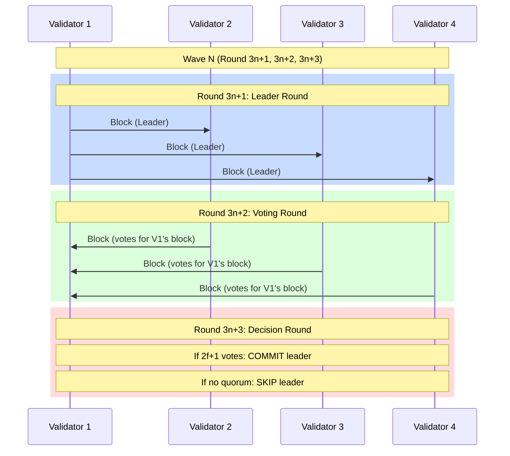

**波次参数：**
- `MINIMUM_WAVE_LENGTH = 3` rounds
- 每波包含：领导者轮 → 投票轮 → 决策轮

### 2.4 提交决策类型

**文件**: `consensus/core/src/commit.rs`

```rust
pub enum Decision {
    Direct,     // 直接提交：领导者区块获得 2f+1 直接投票
    Indirect,   // 间接提交：通过后续轮次的因果关系达到法定人数
    Certified,  // 认证提交：由法定人数验证者签名
}

pub enum DecidedLeader {
    Commit(VerifiedBlock, bool),  // bool: 是否直接提交
    Skip(Slot),                    // 跳过此领导者槽位
}
```

### 2.5 DAG 状态管理

**文件**: `consensus/core/src/dag_state.rs`

```rust
pub struct DagState {
    // 创世区块
    genesis: BTreeMap<BlockRef, VerifiedBlock>,

    // 最近区块缓存 (CACHED_ROUNDS from committed)
    recent_blocks: BTreeMap<BlockRef, BlockInfo>,
    recent_refs_by_authority: Vec<BTreeSet<BlockRef>>,

    // 轮次追踪
    threshold_clock: ThresholdClock,
    highest_accepted_round: Round,

    // 提交状态
    last_commit: Option<TrustedCommit>,
    last_committed_rounds: Vec<Round>,

    // 待写入
    blocks_to_write: Vec<VerifiedBlock>,
    commits_to_write: Vec<TrustedCommit>,
}
```

### 2.6 Quorum 和 Stake 计算

**文件**: `consensus/config/src/committee.rs`

```rust
pub struct Committee {
    epoch: Epoch,
    total_stake: Stake,
    quorum_threshold: Stake,      // 2f+1
    validity_threshold: Stake,    // f+1
    authorities: Vec<Authority>,
}

// 阈值计算:
// fault_tolerance = (total_stake - 1) / 3
// quorum_threshold = total_stake - fault_tolerance  (2f+1)
// validity_threshold = fault_tolerance + 1          (f+1)
```

### 2.7 核心文件清单

| 文件路径 | 功能描述 |
|---------|---------|
| `consensus/core/src/core.rs` | 核心共识引擎 |
| `consensus/core/src/block.rs` | 区块结构定义 |
| `consensus/core/src/commit.rs` | 提交逻辑和 CommittedSubDag |
| `consensus/core/src/dag_state.rs` | DAG 状态管理 |
| `consensus/core/src/universal_committer.rs` | 多领导者提交决策 |
| `consensus/core/src/base_committer.rs` | 单领导者提交规则 |
| `consensus/core/src/transaction_certifier.rs` | FastPath 交易认证 |
| `consensus/core/src/commit_observer.rs` | 提交观察和通知 |

---

## 3. 执行层 - Move VM Integration

### 3.1 执行流程概述

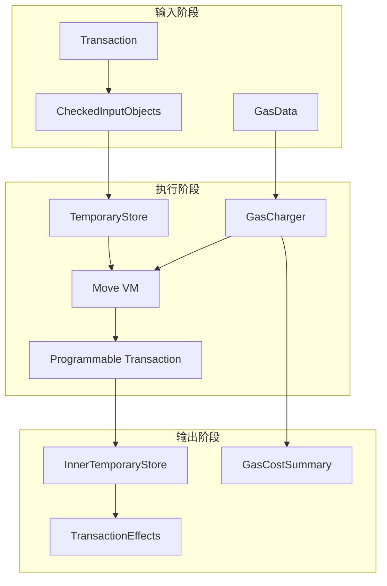

### 3.2 核心执行入口

**文件**: `sui-execution/latest/sui-adapter/src/execution_engine.rs`

```rust
pub fn execute_transaction_to_effects<Mode: ExecutionMode>(
    store: &dyn BackingStore,
    input_objects: CheckedInputObjects,
    gas_data: GasData,
    gas_status: SuiGasStatus,
    transaction_kind: TransactionKind,
    transaction_signer: SuiAddress,
    transaction_digest: TransactionDigest,
    move_vm: &Arc<MoveVM>,
    epoch_id: &EpochId,
    epoch_timestamp_ms: u64,
    protocol_config: &ProtocolConfig,
    metrics: Arc<LimitsMetrics>,
    enable_expensive_checks: bool,
    execution_params: ExecutionOrEarlyError,
    trace_builder_opt: &mut Option<MoveTraceBuilder>,
) -> (
    InnerTemporaryStore,      // 执行结果存储
    SuiGasStatus,             // 更新后的 Gas 状态
    TransactionEffects,       // 交易效果
    Vec<ExecutionTiming>,     // 执行时间
    Result<Mode::ExecutionResults, ExecutionError>,
)
```

### 3.3 TemporaryStore 设计

**文件**: `sui-execution/latest/sui-adapter/src/temporary_store.rs`

TemporaryStore 是执行期间的内存状态容器：

```rust
pub struct TemporaryStore<'backing> {
    // 后端存储引用
    store: &'backing dyn BackingStore,
    tx_digest: TransactionDigest,

    // 输入对象
    input_objects: BTreeMap<ObjectID, Object>,
    non_exclusive_input_original_versions: BTreeMap<ObjectID, Object>,

    // Lamport 时间戳（确定性版本分配）
    lamport_timestamp: SequenceNumber,

    // 可变输入引用追踪
    mutable_input_refs: BTreeMap<ObjectID, (VersionDigest, Owner)>,

    // 执行结果
    execution_results: ExecutionResultsV2,

    // 动态加载的对象
    loaded_runtime_objects: BTreeMap<ObjectID, DynamicallyLoadedObjectMetadata>,

    // 运行时包缓存
    runtime_packages_loaded_from_db: RwLock<BTreeMap<ObjectID, PackageObject>>,

    // 接收对象
    receiving_objects: Vec<ObjectRef>,

    // 协议配置
    protocol_config: &'backing ProtocolConfig,
    cur_epoch: EpochId,
}
```

**关键方法：**

```rust
impl TemporaryStore {
    // 读取对象（优先从写入缓存，其次从输入）
    pub fn read_object(&self, id: &ObjectID) -> Option<&Object> {
        self.execution_results.written_objects.get(id)
            .or_else(|| self.input_objects.get(id))
    }

    // 修改输入对象
    pub fn mutate_input_object(&mut self, object: Object) {
        let id = object.id();
        self.execution_results.modified_objects.insert(id);
        self.execution_results.written_objects.insert(id, object);
    }

    // 创建新对象
    pub fn create_object(&mut self, object: Object) {
        let id = object.id();
        self.execution_results.created_object_ids.insert(id);
        self.execution_results.written_objects.insert(id, object);
    }

    // 删除对象
    pub fn delete_input_object(&mut self, id: &ObjectID) {
        self.execution_results.modified_objects.insert(*id);
        self.execution_results.deleted_object_ids.insert(*id);
    }
}
```

### 3.4 TransactionEffects 生成

**文件**: `crates/sui-types/src/effects/effects_v2.rs`

```rust
pub struct TransactionEffectsV2 {
    pub status: ExecutionStatus,              // 执行状态
    pub executed_epoch: EpochId,              // 执行 Epoch
    pub gas_used: GasCostSummary,            // Gas 成本汇总
    pub transaction_digest: TransactionDigest, // 交易摘要
    pub gas_object_index: Option<u32>,       // Gas 对象索引
    pub events_digest: Option<TransactionEventsDigest>,
    pub dependencies: Vec<TransactionDigest>,// 交易依赖
    pub lamport_version: SequenceNumber,     // Lamport 版本
    pub changed_objects: Vec<(ObjectID, EffectsObjectChange)>,
    pub unchanged_consensus_objects: Vec<(ObjectID, UnchangedConsensusKind)>,
    pub aux_data_digest: Option<EffectsAuxDataDigest>,
}
```

**Effects 创建流程** (`temporary_store.rs:into_effects()`):

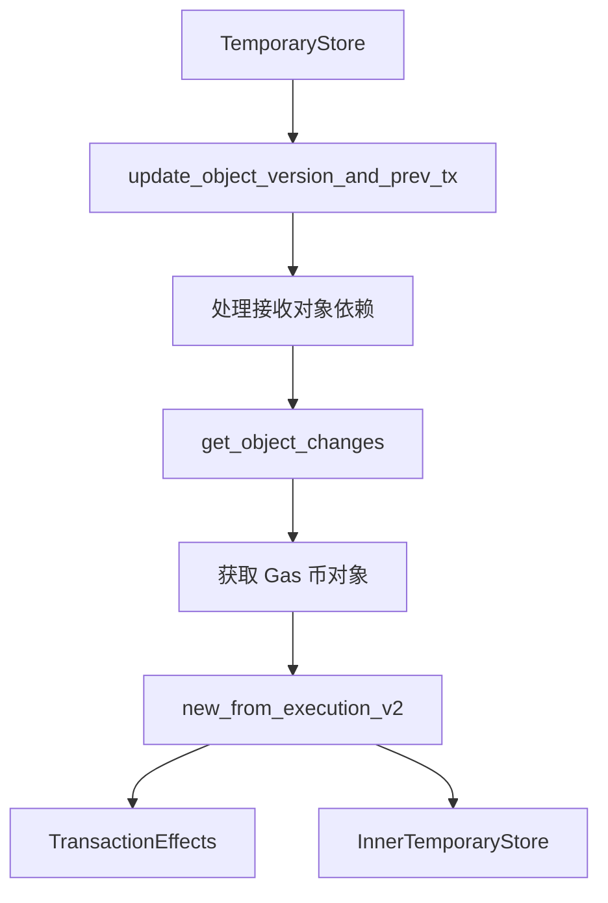

### 3.5 Gas 计量机制

**文件**: `sui-execution/latest/sui-adapter/src/gas_charger.rs`

```rust
pub struct GasCharger {
    tx_digest: TransactionDigest,
    gas_model_version: u64,              // Gas 模型版本
    gas_coins: Vec<ObjectRef>,           // Gas 币列表
    smashed_gas_coin: Option<ObjectID>,  // 合并后的 Gas 币
    gas_status: SuiGasStatus,            // Gas 状态追踪
    address_balance_gas_payer: Option<SuiAddress>, // 地址余额支付者
}
```

**Gas 计量流程：**

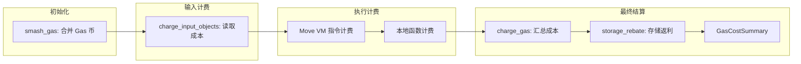

### 3.6 并行执行调度

**文件**: `crates/sui-core/src/execution_scheduler/execution_scheduler_impl.rs`

```rust
pub struct ExecutionScheduler {
    object_cache_read: Arc<dyn ObjectCacheRead>,
    transaction_cache_read: Arc<dyn TransactionCacheRead>,
    overload_tracker: Arc<OverloadTracker>,
    tx_ready_certificates: UnboundedSender<PendingCertificate>,
    balance_withdraw_scheduler: Arc<Mutex<Option<BalanceWithdrawScheduler>>>,
    metrics: Arc<AuthorityMetrics>,
}
```

**Barrier 依赖机制：**

```rust
// 伪代码: 处理共享对象的并行调度
process_tx(tx_digest, tx):
    for each shared_input_object in tx:
        if mutability == NonExclusiveWrite:
            // 非独占写入：记录为该对象的写者
            dep_state[object_id].insert(tx_digest)

        elif mutability == Mutable:
            // 排他性写入：必须等待所有前置非独占写者
            if dep_state[object_id] exists:
                barrier_deps.extend(dep_state[object_id])
                dep_state.remove(object_id)

    return barrier_deps
```

**并行执行图示：**

```mermaid
gantt
    title 交易并行执行示例
    dateFormat X
    axisFormat %s

    section Object A
    TX1 (NonExclusive) :a1, 0, 2
    TX2 (NonExclusive) :a2, 0, 3
    TX3 (Exclusive)    :a3, after a1 a2, 2

    section Object B
    TX4 (Exclusive)    :b1, 0, 2
    TX5 (Exclusive)    :b2, after b1, 2
```

### 3.7 版本控制 (v0, v1, v2, latest)

**目录结构：**
```
sui-execution/
├── latest/             # 当前活跃版本 (alias)
├── v0/                 # 历史版本
├── v1/                 # 历史版本
├── v2/                 # 历史版本
└── src/                # 版本协调和选择
```

每个版本包含完整的执行栈：
- `sui-adapter/`: 执行适配器
- `sui-move-natives/`: Move 本地函数
- `sui-verifier/`: Move 验证器

### 3.8 核心文件清单

| 文件路径 | 功能描述 |
|---------|---------|
| `sui-execution/latest/sui-adapter/src/execution_engine.rs` | 核心执行引擎 |
| `sui-execution/latest/sui-adapter/src/temporary_store.rs` | 临时存储管理 |
| `sui-execution/latest/sui-adapter/src/gas_charger.rs` | Gas 计费 |
| `sui-execution/latest/sui-adapter/src/gas_meter.rs` | Gas 计量 |
| `sui-execution/latest/sui-adapter/src/programmable_transactions/execution.rs` | PT 执行 |
| `crates/sui-core/src/execution_scheduler/execution_scheduler_impl.rs` | 调度器 |
| `crates/sui-types/src/effects/effects_v2.rs` | Effects 定义 |

---

## 4. 存储层 - RocksDB Backend

### 4.1 存储架构概述

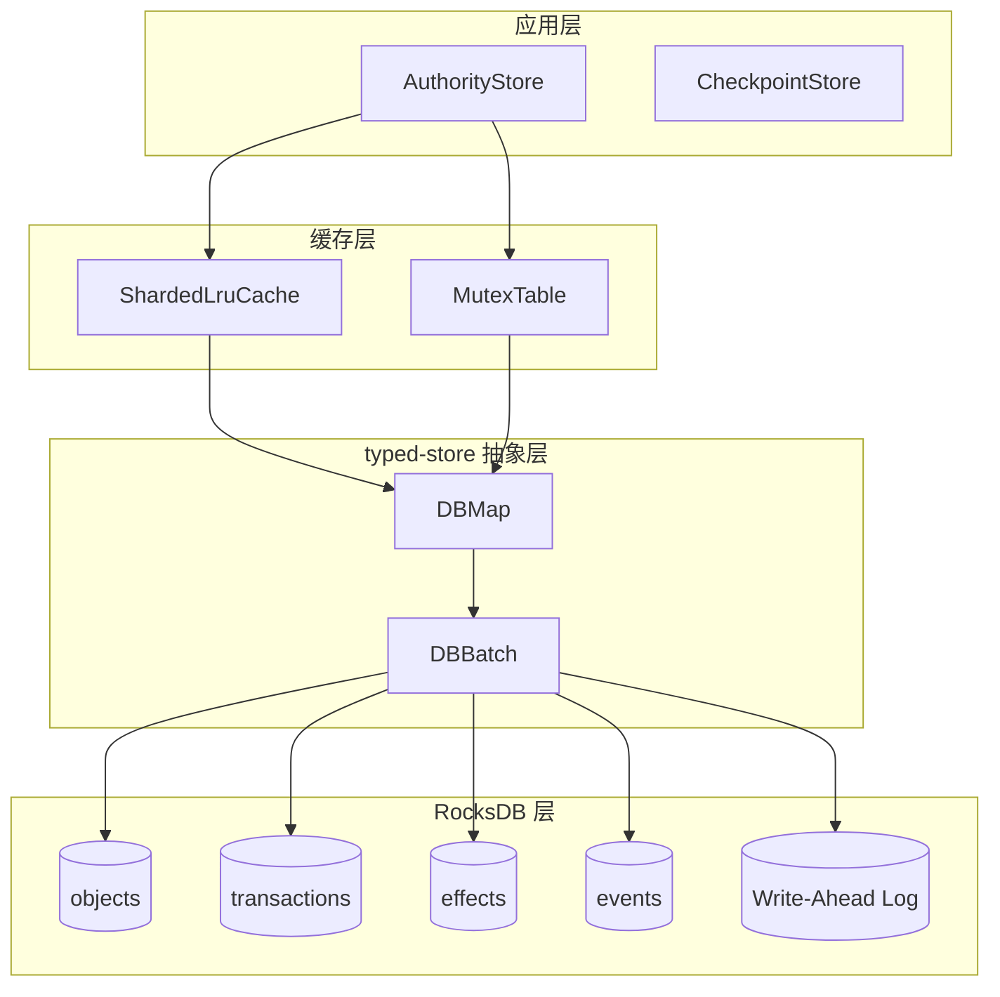

### 4.2 AuthorityPerpetualTables 结构

**文件**: `crates/sui-core/src/authority/authority_store_tables.rs`

```rust
pub struct AuthorityPerpetualTables {
    // 对象存储
    pub(crate) objects: DBMap<ObjectKey, StoreObjectWrapper>,

    // 拥有对象的活跃标记
    pub(crate) live_owned_object_markers: DBMap<ObjectRef, Option<LockDetailsWrapperDeprecated>>,

    // 交易存储
    pub(crate) transactions: DBMap<TransactionDigest, TrustedTransaction>,

    // 执行效果存储
    pub(crate) effects: DBMap<TransactionEffectsDigest, TransactionEffects>,

    // 已执行交易标记
    pub(crate) executed_effects: DBMap<TransactionDigest, TransactionEffectsDigest>,

    // 事件日志
    pub(crate) events_2: DBMap<TransactionDigest, TransactionEvents>,

    // 每个 epoch 的对象标记表
    pub(crate) object_per_epoch_marker_table: DBMap<(EpochId, ObjectKey), MarkerValue>,
    pub(crate) object_per_epoch_marker_table_v2: DBMap<(EpochId, FullObjectKey), MarkerValue>,

    // 状态哈希（用于 checkpoint）
    pub(crate) root_state_hash_by_epoch: DBMap<EpochId, (CheckpointSequenceNumber, GlobalStateHash)>,

    // 系统配置
    pub(crate) epoch_start_configuration: DBMap<(), EpochStartConfiguration>,
    pub(crate) pruned_checkpoint: DBMap<(), CheckpointSequenceNumber>,
}
```

### 4.3 对象存储格式

**文件**: `crates/sui-core/src/authority/authority_store_types.rs`

```rust
// 版本化的对象包装器（支持未来迁移）
pub enum StoreObjectWrapper {
    V1(StoreObjectV1),
}

pub type StoreObject = StoreObjectV1;

pub enum StoreObjectV1 {
    Value(Box<StoreObjectValue>),  // 活跃对象
    Deleted,                        // 删除标记
    Wrapped,                        // 被包装的对象
}

pub struct StoreObjectValue {
    pub data: StoreData,           // 对象数据
    pub owner: Owner,              // 所有权信息
    pub previous_transaction: TransactionDigest,  // 前驱交易
    pub storage_rebate: u64,       // 存储费用返利
}

pub enum StoreData {
    Package(MovePackage),          // Move 包
    Object(MoveObject),            // Move 对象
    IndirectObject,                // 间接对象引用
}
```

**ObjectKey 定义：**
```rust
pub type ObjectKey = (ObjectID, VersionNumber);
```

### 4.4 DBMap 和 DBBatch

**文件**: `crates/typed-store/src/rocks/mod.rs`

```rust
// DBMap: 类型安全的列族封装
pub struct DBMap<K, V> {
    cf: String,           // 列族名称
    db: Arc<Database>,    // 数据库引用
    _phantom: PhantomData<(K, V)>,
}

// DBBatch: 原子批量写入
pub struct DBBatch {
    database: Arc<Database>,
    batch: StorageWriteBatch,      // RocksDB WriteBatch
    db_metrics: Arc<DBMetrics>,
    write_sample_interval: SamplingInterval,
}

impl DBBatch {
    // 批量插入
    pub fn insert_batch<K, V>(
        &mut self,
        db: &DBMap<K, V>,
        new_vals: impl IntoIterator<Item = (K, V)>,
    ) -> Result<&mut Self, TypedStoreError>

    // 批量删除
    pub fn delete_batch<K, V>(
        &mut self,
        db: &DBMap<K, V>,
        purged_vals: impl IntoIterator<Item = K>,
    ) -> Result<(), TypedStoreError>

    // 范围删除
    pub fn schedule_delete_range<K, V>(
        &mut self,
        db: &DBMap<K, V>,
        from: &K,
        to: &K,
    ) -> Result<(), TypedStoreError>

    // 原子写入
    pub fn write(self) -> Result<(), TypedStoreError>
}
```

### 4.5 缓存层设计

**ShardedLruCache** (`crates/sui-storage/src/sharded_lru.rs`):

```rust
pub struct ShardedLruCache<K, V, S = RandomState> {
    shards: Vec<RwLock<LruCache<K, V>>>,  // 多个独立分片
    hasher: S,
}

impl ShardedLruCache {
    pub fn new(capacity: u64, num_shards: u64) -> Self

    pub fn get(&self, key: &K) -> Option<V>
    pub fn put(&self, key: K, value: V) -> Option<V>
    pub fn invalidate(&self, key: &K) -> Option<V>
    pub fn batch_invalidate(&self, keys: impl IntoIterator<Item = K>)
}
```

**MutexTable** (`crates/sui-storage/src/mutex_table.rs`):

```rust
pub struct MutexTable<K> {
    shards: Vec<RwLock<HashMap<K, Arc<Mutex<()>>>>>,
    // 用于对象级别的细粒度锁
    // 默认 4096 个分片
}
```

### 4.6 RocksDB 配置

**环境变量配置：**
| 变量 | 功能 |
|-----|------|
| `OBJECTS_BLOCK_CACHE_MB` | 对象表块缓存大小 |
| `LOCKS_BLOCK_CACHE_MB` | 锁表块缓存大小 |
| `TRANSACTIONS_BLOCK_CACHE_MB` | 交易表块缓存大小 |
| `EFFECTS_BLOCK_CACHE_MB` | 效果表块缓存大小 |

**存储后端支持：**
```rust
pub enum Storage {
    Rocks(RocksDB),           // RocksDB (生产环境)
    InMemory(InMemoryDB),     // 内存 (测试)
    #[cfg(tidehunter)]
    TideHunter(Arc<TideHunterDb>),  // 实验性
}
```

### 4.7 核心文件清单

| 文件路径 | 功能描述 |
|---------|---------|
| `crates/sui-core/src/authority/authority_store.rs` | AuthorityStore 管理器 |
| `crates/sui-core/src/authority/authority_store_tables.rs` | 数据表定义 |
| `crates/sui-core/src/authority/authority_store_types.rs` | 对象存储格式 |
| `crates/typed-store/src/rocks/mod.rs` | RocksDB 封装层 |
| `crates/typed-store/src/traits.rs` | 存储 trait 定义 |
| `crates/sui-storage/src/sharded_lru.rs` | LRU 缓存 |
| `crates/sui-storage/src/mutex_table.rs` | 分片锁表 |

---

## 5. 状态存储流程：内存到磁盘

### 5.1 完整流程概览

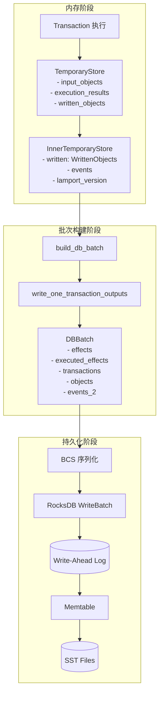

### 5.2 TemporaryStore 到 InnerTemporaryStore

**转换过程** (`temporary_store.rs:into_effects()`):

```rust
pub fn into_effects(
    mut self,
    shared_object_refs: Vec<SharedInput>,
    transaction_digest: &TransactionDigest,
    mut transaction_dependencies: BTreeSet<TransactionDigest>,
    gas_cost_summary: GasCostSummary,
    status: ExecutionStatus,
    gas_charger: &mut GasCharger,
    epoch: EpochId,
) -> (InnerTemporaryStore, TransactionEffects) {
    // 1. 更新对象版本和前驱交易
    self.update_object_version_and_prev_tx();

    // 2. 处理接收对象依赖
    for obj_ref in &self.receiving_objects {
        if let Some(meta) = self.loaded_runtime_objects.get(&obj_ref.0) {
            transaction_dependencies.insert(meta.previous_transaction);
        }
    }

    // 3. 获取对象变化列表
    let (changed_objects, unchanged_consensus_objects) = self.get_object_changes();

    // 4. 获取 Gas 币信息
    let gas_coin = gas_charger.gas_coin_id()...;

    // 5. 创建 Effects
    let effects = TransactionEffects::new_from_execution_v2(
        status,
        epoch,
        gas_cost_summary,
        changed_objects,
        unchanged_consensus_objects,
        lamport_version,
        ...
    );

    // 6. 构建 InnerTemporaryStore
    let inner = InnerTemporaryStore {
        input_objects,
        mutable_inputs,
        written: self.get_written_objects(),
        loaded_runtime_objects,
        events,
        lamport_version,
        ...
    };

    (inner, effects)
}
```

### 5.3 build_db_batch 批次构建

**文件**: `crates/sui-core/src/authority/authority_store.rs`

```rust
pub fn build_db_batch(
    &self,
    epoch_id: EpochId,
    tx_outputs: &[Arc<TransactionOutputs>],
) -> SuiResult<DBBatch> {
    // 创建空批次
    let mut write_batch = self.perpetual_tables.transactions.batch();

    // 遍历所有交易输出
    for outputs in tx_outputs {
        self.write_one_transaction_outputs(&mut write_batch, epoch_id, outputs)?;
    }

    // 崩溃恢复测试点
    fail_point!("crash");

    Ok(write_batch)
}
```

### 5.4 write_one_transaction_outputs 详解

```rust
fn write_one_transaction_outputs(
    &self,
    write_batch: &mut DBBatch,
    epoch_id: EpochId,
    tx_outputs: &TransactionOutputs,
) -> SuiResult {
    let TransactionOutputs {
        transaction,
        effects,
        events,
        markers,
        written,
        deleted,
        ...
    } = tx_outputs;

    let tx_digest = transaction.digest();
    let effects_digest = effects.digest();

    // === 写入顺序很重要! ===

    // 1. 先写 effects（包含 epoch 信息用于修剪）
    write_batch.insert_batch(
        &self.perpetual_tables.effects,
        [(effects_digest, effects.clone())]
    )?

    // 2. 标记已执行
    .insert_batch(
        &self.perpetual_tables.executed_effects,
        [(tx_digest, effects_digest)]
    )?

    // 3. 存储交易
    .insert_batch(
        &self.perpetual_tables.transactions,
        [(tx_digest, transaction.serializable_ref())]
    )?

    // 4. 更新对象（新版本）
    .insert_batch(
        &self.perpetual_tables.objects,
        written.iter().map(|(oref, obj)| {
            (ObjectKey::from(oref), get_store_object(obj.clone()))
        })
    )?

    // 5. 标记删除的对象
    .insert_batch(
        &self.perpetual_tables.objects,
        deleted.iter().map(|oref| {
            (ObjectKey::from(oref), StoreObjectWrapper::V1(StoreObjectV1::Deleted))
        })
    )?

    // 6. 更新锁状态
    .insert_batch(
        &self.perpetual_tables.live_owned_object_markers,
        lock_updates
    )?

    // 7. 存储事件
    .insert_batch(
        &self.perpetual_tables.events_2,
        [(tx_digest, events.clone())]
    )?;

    Ok(())
}
```

### 5.5 DBBatch::write() 原子提交

**文件**: `crates/typed-store/src/rocks/mod.rs`

```rust
pub fn write(self) -> Result<(), TypedStoreError> {
    // 性能采样
    let _timer = if self.write_sample_interval.sample() {
        Some(self.db_metrics.write_batch_latency.start_timer())
    } else {
        None
    };

    // 序列化并写入 RocksDB
    match &self.database.storage {
        Storage::Rocks(rocks) => {
            let write_opts = rocksdb::WriteOptions::default();
            // 默认启用 WAL (Write-Ahead Log)
            // write_opts.disable_wal(false);

            rocks.underlying
                .write_opt(batch_into_rocksdb(self.batch), &write_opts)
                .map_err(typed_store_err_from_rocks_err)
        }
        Storage::InMemory(db) => {
            db.write(self.batch)
        }
        #[cfg(tidehunter)]
        Storage::TideHunter(db) => {
            db.write(self.batch)
        }
    }
}
```

### 5.6 序列化过程

**BCS 序列化：**
```rust
// 值序列化: Binary Canonical Serialization
let bytes = bcs::to_bytes(&value)?;

// 键序列化: 大端定长整数 (确保字典序 = 数值序)
fn be_fix_int_ser<T: FixedInt>(t: &T) -> Vec<u8> {
    t.encode_fixed_be()
}
```

### 5.7 RocksDB 写入路径

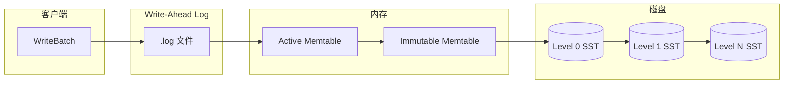

**写入流程：**
1. **WriteBatch 创建**: 累积多个 put/delete 操作
2. **WAL 写入**: 先写日志保证持久性
3. **Memtable 插入**: 内存有序结构
4. **Memtable 刷盘**: 达到阈值后转为 Immutable 并刷盘
5. **Compaction**: 后台合并 SST 文件

### 5.8 崩溃恢复机制

**Fail Points:**
```rust
// 模拟崩溃以测试恢复
fail_point!("crash");
fail_point_arg!("initial_epoch_flags", |flags| { ... });
```

**待处理交易恢复** (`write_path_pending_tx_log.rs`):

```rust
pub struct WritePathPendingTransactionLog {
    // 磁盘存储
    pending_transactions: WritePathPendingTransactionTable,
    // 内存集合（快速检查）
    transactions_set: Mutex<HashSet<TransactionDigest>>,
}

impl WritePathPendingTransactionLog {
    // 重启时恢复待处理交易
    pub fn load_all_pending_transactions(&self) -> SuiResult<Vec<VerifiedTransaction>> {
        let transactions = self.pending_transactions.logs
            .safe_iter()
            .map(|item| item.map(|(_tx_digest, tx)| VerifiedTransaction::from(tx)))
            .collect::<Result<Vec<_>, _>>()?;

        // 重新注册为待处理
        transactions_set.extend(transactions.iter().map(|t| *t.digest()));
        Ok(transactions)
    }
}
```

### 5.9 性能监控指标

```rust
pub struct DBMetrics {
    pub op_metrics: OperationalMetrics,
    pub write_perf_ctx_metrics: RocksDBPerfContext,
    pub read_perf_ctx_metrics: RocksDBPerfContext,
}

// 关键指标
// rocksdb_get_bytes              - GET 字节数
// rocksdb_put_bytes              - PUT 字节数
// rocksdb_batch_commit_bytes     - 批次提交大小
// rocksdb_batch_commit_latency_seconds  - 批次提交延迟
// rocksdb_very_slow_batch_writes_count  - 缓慢写入计数
```

---

## 6. 层间交互

### 6.1 完整交易生命周期

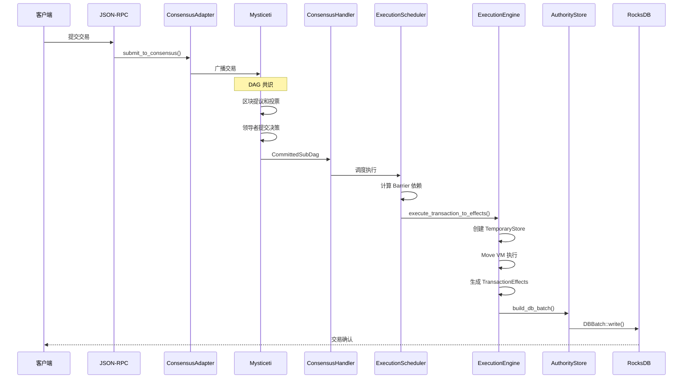

### 6.2 共识到执行的数据流

**CommittedSubDag 处理** (`crates/sui-core/src/consensus_handler.rs`):

```rust
pub async fn handle_consensus_commit(
    &self,
    committed_subdag: CommittedSubDag,
) -> SuiResult {
    // 1. 提取共识提交的交易
    let transactions = committed_subdag.all_transactions();

    // 2. 分配共享对象版本
    let assigned_versions = self.shared_object_version_manager
        .assign_versions(transactions)?;

    // 3. 调度执行
    for tx in transactions {
        self.execution_scheduler.schedule(tx, assigned_versions)?;
    }

    Ok(())
}
```

### 6.3 执行到存储的数据流

**交易提交流程：**

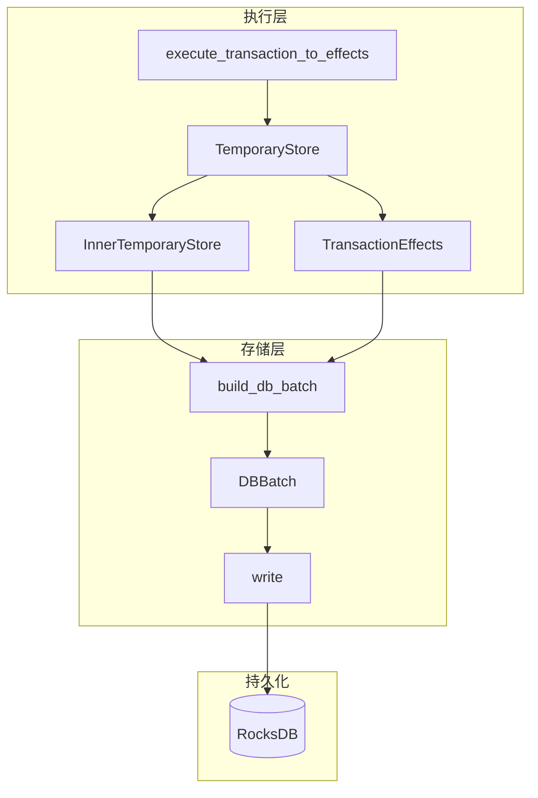

### 6.4 FastPath 流程

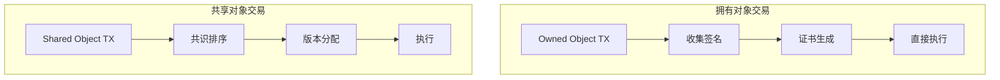

**FastPath 条件：**
- 交易仅涉及拥有对象 (Owned Objects)
- 不涉及共享对象 (Shared Objects)
- 可跳过共识直接执行

### 6.5 Checkpoint 流程

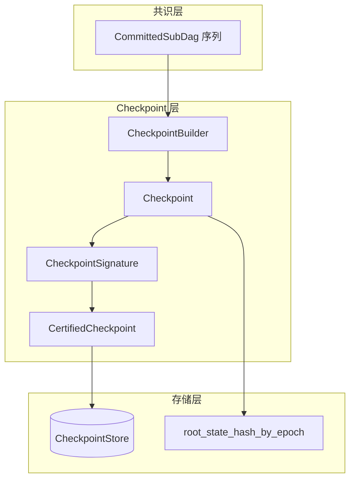

### 6.6 状态同步流程

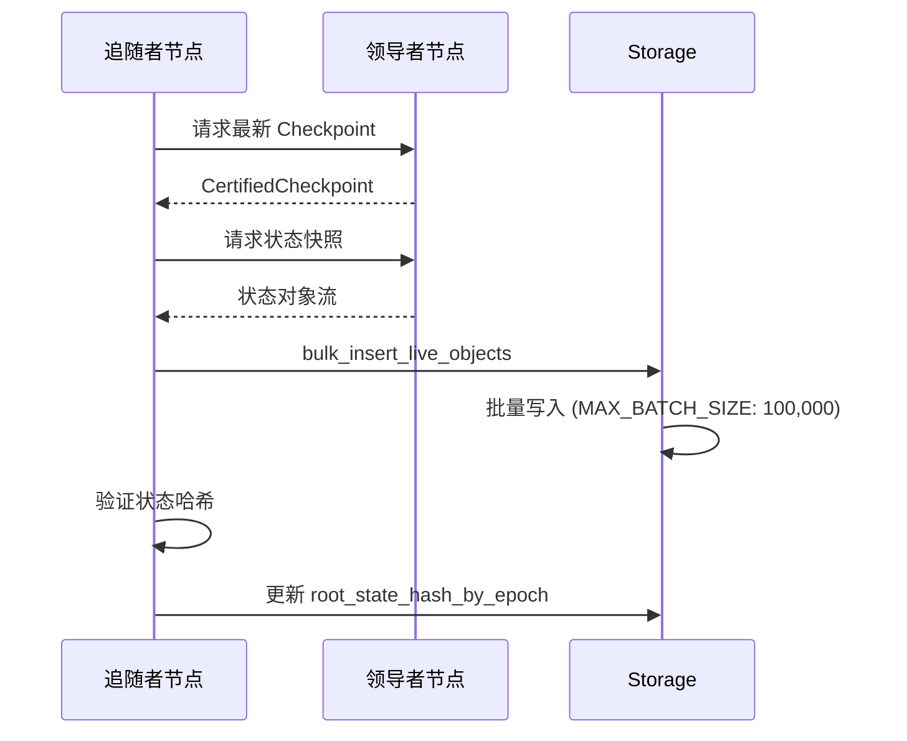

---

## 7. 总结

### 7.1 架构特点

| 层级 | 核心组件 | 关键特性 |
|------|---------|---------|
| **共识层** | Mysticeti Protocol | DAG-based, Multi-leader, Wave commit |
| **执行层** | Move VM + Scheduler | 并行执行, Barrier 依赖, Gas 计量 |
| **存储层** | RocksDB + typed-store | 原子批量写入, LRU 缓存, WAL 恢复 |

### 7.2 关键数据流

```
Transaction
    ↓ (共识排序)
CommittedSubDag
    ↓ (版本分配)
ExecutionScheduler
    ↓ (并行调度)
TemporaryStore (内存)
    ↓ (执行)
InnerTemporaryStore + TransactionEffects
    ↓ (批次构建)
DBBatch
    ↓ (原子写入)
RocksDB (WAL → Memtable → SST)
```

### 7.3 关键代码路径

**共识提交：**
```
consensus/core/src/universal_committer.rs:try_decide()
→ consensus/core/src/commit_observer.rs:handle_commit()
→ consensus/core/src/linearizer.rs:get_subdag()
→ 输出 CommittedSubDag
```

**交易执行：**
```
sui-execution/latest/sui-adapter/src/execution_engine.rs:execute_transaction_to_effects()
→ temporary_store.rs:into_effects()
→ 输出 (InnerTemporaryStore, TransactionEffects)
```

**状态持久化：**
```
crates/sui-core/src/authority/authority_store.rs:build_db_batch()
→ write_one_transaction_outputs()
→ typed-store/rocks/mod.rs:DBBatch::write()
→ RocksDB
```

### 7.4 性能优化要点

1. **并行执行**: 对象级别的细粒度锁和 Barrier 依赖
2. **批量写入**: DBBatch 累积多个操作后原子提交
3. **分片缓存**: ShardedLruCache 减少锁竞争
4. **版本化存储**: 支持对象历史查询和快照
5. **FastPath**: 拥有对象交易跳过共识

### 7.5 可靠性保证

1. **WAL**: Write-Ahead Log 保证崩溃恢复
2. **原子提交**: WriteBatch 保证数据一致性
3. **Checkpoint**: 定期状态快照用于恢复
4. **版本控制**: 执行层多版本支持协议升级

---

## 附录：关键文件索引

| 模块 | 文件路径 | 行数(约) |
|------|---------|---------|
| 共识核心 | `consensus/core/src/core.rs` | ~1000 |
| 区块结构 | `consensus/core/src/block.rs` | ~800 |
| 提交逻辑 | `consensus/core/src/commit.rs` | ~600 |
| DAG状态 | `consensus/core/src/dag_state.rs` | ~1200 |
| 执行引擎 | `sui-execution/latest/sui-adapter/src/execution_engine.rs` | ~3000 |
| 临时存储 | `sui-execution/latest/sui-adapter/src/temporary_store.rs` | ~600 |
| Gas计费 | `sui-execution/latest/sui-adapter/src/gas_charger.rs` | ~400 |
| 执行调度 | `crates/sui-core/src/execution_scheduler/execution_scheduler_impl.rs` | ~1500 |
| 权限存储 | `crates/sui-core/src/authority/authority_store.rs` | ~1000 |
| 数据表 | `crates/sui-core/src/authority/authority_store_tables.rs` | ~300 |
| RocksDB封装 | `crates/typed-store/src/rocks/mod.rs` | ~1500 |
| LRU缓存 | `crates/sui-storage/src/sharded_lru.rs` | ~200 |

---

*报告生成时间: 2025-12-27*
*基于 Sui 源码分析*
