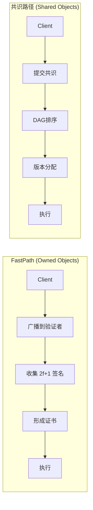
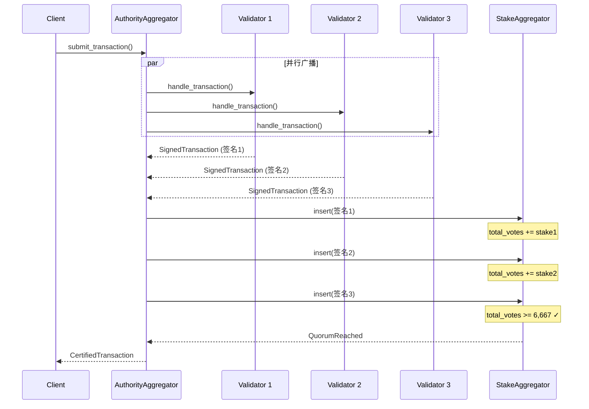
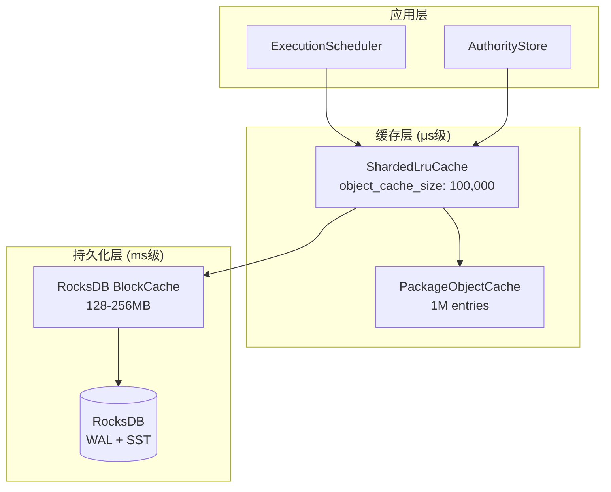

# Sui 简单交易性能分析研究报告

> 本报告深入分析 Sui 区块链中简单交易（Owned Object Transaction）的延迟和 TPS，重点研究影响性能的网络传播路径、Quorum 机制、批处理机制和存储机制。

---

## 目录

1. [概述](#1-概述)
2. [网络传播路径分析](#2-网络传播路径分析)
3. [Quorum 机制分析](#3-quorum-机制分析)
4. [批处理机制分析](#4-批处理机制分析)
5. [存储机制分析](#5-存储机制分析)
6. [端到端延迟分析](#6-端到端延迟分析)
7. [TPS 分析](#7-tps-分析)
8. [二次开发优化参考](#8-二次开发优化参考)
9. [总结](#9-总结)

---

## 1. 概述

### 1.1 简单交易 vs 共享对象交易

Sui 根据交易涉及的对象类型，将交易分为两类：

| 特性 | 简单交易 (Owned Object TX) | 共享对象交易 (Shared Object TX) |
|------|---------------------------|-------------------------------|
| 对象类型 | 仅涉及 Owned/Immutable 对象 | 涉及 Shared 对象 |
| 执行路径 | FastPath（跳过共识） | 必须经过共识排序 |
| 延迟 | 100-300ms | 500ms-2s+ |
| 并行性 | 完全并行 | 受共享对象限制 |

**交易类型判断逻辑**：

```rust
// 文件: crates/sui-types/src/transaction.rs:3178-3181
pub fn is_consensus_tx(&self) -> bool {
    self.transaction_data().has_funds_withdrawals()
        || self.shared_input_objects().next().is_some()
}
```

### 1.2 FastPath 机制简介

FastPath 是 Sui 针对 Owned Object 交易的优化路径：



**FastPath 核心优势**：
- **跳过共识**：不需要等待 Mysticeti DAG 达成共识
- **单次 RTT**：客户端只需一次网络往返即可获得证书
- **并行执行**：不同 Owned Object 的交易可完全并行

### 1.3 延迟组成分解

```
简单交易总延迟 = 网络传播 + 签名收集 + 证书验证 + 输入获取 + 执行 + 存储
              ≈ 50-100ms + 50-150ms + 1-5ms + 1μs-10ms + 1-50ms + 1-50ms
              ≈ 100-300ms (典型情况)
```

---

## 2. 网络传播路径分析

### 2.1 交易广播流程



### 2.2 核心代码路径

**交易处理入口**：

```rust
// 文件: crates/sui-core/src/authority_aggregator.rs:762-911
pub async fn process_transaction(
    &self,
    transaction: Transaction,
    client_addr: Option<SocketAddr>,
) -> Result<ProcessTransactionResult, AggregatorProcessTransactionError> {
    let tx_digest = transaction.digest();

    // 1. 初始化签名聚合器
    let state = ProcessTransactionState {
        tx_signatures: StakeAggregator::new(committee.clone()),
        effects_map: MultiStakeAggregator::new(committee.clone()),
        errors: vec![],
        // ...
    };

    // 2. 并行广播到所有验证者
    let result = quorum_map_then_reduce_with_timeout(
        committee.clone(),
        self.authority_clients.clone(),
        state,
        |name, client| {
            Box::pin(async move {
                // 发送交易到单个验证者
                client.handle_transaction(transaction_ref.clone(), client_addr)
                    .await
            })
        },
        |mut state, name, weight, response| {
            // 3. 处理响应并聚合签名
            Box::pin(async move {
                match self.handle_process_transaction_response(
                    tx_digest, &mut state, response, name, weight,
                ) {
                    Ok(Some(result)) => {
                        // Quorum 达成，立即返回
                        return ReduceOutput::Success(result);
                    }
                    // ... 继续等待更多响应
                }
            })
        },
    ).await;

    result
}
```

**签名聚合与 Quorum 检查**：

```rust
// 文件: crates/sui-core/src/authority_aggregator.rs:1041-1075
fn handle_transaction_response_with_signed(
    &self,
    state: &mut ProcessTransactionState,
    plain_tx: SignedTransaction,
) -> SuiResult<Option<ProcessTransactionResult>> {
    // 将签名插入聚合器
    match state.tx_signatures.insert(plain_tx.clone()) {
        InsertResult::NotEnoughVotes { .. } => {
            // 还未达到 Quorum
            Ok(None)
        }
        InsertResult::QuorumReached(cert_sig) => {
            // ===== Quorum 达成！形成证书 =====
            let certificate = CertifiedTransaction::new_from_data_and_sig(
                plain_tx.into_data(),
                cert_sig  // AuthorityStrongQuorumSignInfo (2f+1)
            );
            certificate.verify_committee_sigs_only(&self.committee)?;

            Ok(Some(ProcessTransactionResult::Certified {
                certificate,
                newly_formed: true,
            }))
        }
        InsertResult::Failed { error } => Err(error),
    }
}
```

### 2.3 网络往返次数分析

| 阶段 | RTT 次数 | 说明 |
|------|---------|------|
| 交易广播 + 签名收集 | 1 | 并行广播，等待最快的 2f+1 响应 |
| 证书执行（可选） | 1 | 如果需要立即执行 |
| **FastPath 总计** | **1-2** | 最优情况仅需 1 次 RTT |

### 2.4 超时配置

```rust
// 文件: crates/sui-core/src/authority_aggregator.rs:70-82
pub struct TimeoutConfig {
    pub pre_quorum_timeout: Duration,   // 等待 Quorum 的超时
    pub post_quorum_timeout: Duration,  // Quorum 后等待额外响应
}

impl Default for TimeoutConfig {
    fn default() -> Self {
        Self {
            pre_quorum_timeout: Duration::from_secs(60),  // 60秒
            post_quorum_timeout: Duration::from_secs(7),  // 7秒
        }
    }
}
```

---

## 3. Quorum 机制分析

### 3.1 阈值定义

```rust
// 文件: crates/sui-types/src/committee.rs:44-47
pub const TOTAL_VOTING_POWER: StakeUnit = 10_000;    // 总投票权
pub const QUORUM_THRESHOLD: StakeUnit = 6_667;       // 2f+1 阈值
pub const VALIDITY_THRESHOLD: StakeUnit = 3_334;     // f+1 阈值
```

**设计说明**：
- 固定总投票权为 10,000，每个基点 (basis point) 代表 0.01%
- **Quorum 阈值 (2f+1) = 6,667**：需要超过 2/3 的验证者权重
- **Validity 阈值 (f+1) = 3,334**：用于检测不可恢复错误

### 3.2 Stake 聚合实现

```rust
// 文件: crates/sui-core/src/stake_aggregator.rs:78-94
pub fn insert_generic(
    &mut self,
    authority: AuthorityName,
    s: S,
) -> InsertResult<&HashMap<AuthorityName, S>> {
    // 获取此验证者的 stake 权重
    let votes = self.committee.weight(&authority);

    if votes > 0 {
        self.total_votes += votes;

        // 关键：检查是否达到阈值
        if self.total_votes >= self.committee.threshold::<STRENGTH>() {
            InsertResult::QuorumReached(&self.data)  // STRENGTH=true 时为 2f+1
        } else {
            InsertResult::NotEnoughVotes {
                bad_votes: 0,
                bad_authorities: vec![],
            }
        }
    } else {
        // 未知验证者
        InsertResult::Failed { error: SuiError::UnknownValidator { .. } }
    }
}
```

### 3.3 Committee 结构

```rust
// 文件: crates/sui-types/src/committee.rs:50-60
pub struct Committee {
    pub epoch: EpochId,
    pub voting_rights: Vec<(AuthorityName, StakeUnit)>,  // 验证者及其权重
    expanded_keys: HashMap<AuthorityName, AuthorityPublicKey>,
    index_map: HashMap<AuthorityName, usize>,
}

impl Committee {
    // 计算阈值
    pub fn threshold<const STRENGTH: bool>(&self) -> StakeUnit {
        if STRENGTH {
            QUORUM_THRESHOLD   // 2f+1 = 6,667
        } else {
            VALIDITY_THRESHOLD // f+1 = 3,334
        }
    }

    // 获取验证者权重
    pub fn weight(&self, authority: &AuthorityName) -> StakeUnit {
        self.voting_rights
            .iter()
            .find(|(name, _)| name == authority)
            .map(|(_, stake)| *stake)
            .unwrap_or(0)
    }
}
```

### 3.4 Quorum 延迟影响

```
Quorum 延迟 = max(前 2f+1 个最快验证者的响应时间)

假设 4 个验证者，各 2,500 stake：
- 需要 3 个验证者签名 (7,500 >= 6,667)
- 延迟 = 第 3 快验证者的响应时间

典型场景：
- 最优情况：所有验证者快速响应 → 100-200ms
- 一般情况：部分验证者较慢 → 200-500ms
- 最坏情况：等待 pre_quorum_timeout → 60s
```

---

## 4. 批处理机制分析（简单交易专用）

> **重要说明**：Mysticeti Block 批处理是**共识路径**（Shared Object）的机制，**不适用于简单交易的 FastPath**。
> 本章专门分析简单交易在传播、执行、存储各环节的批处理现状。

### 4.1 各环节批处理现状总览

| 环节 | 是否批处理 | 实现方式 | 代码位置 |
|------|-----------|---------|---------|
| **传播** | ❌ 否 | 单笔提交，并发广播 | `authority_aggregator.rs:762` |
| **执行调度** | ⚠️ 部分 | 批量入队，逐笔调度 | `execution_scheduler_impl.rs:496` |
| **执行** | ⚠️ 并发 | 有限并发 (CPU 核心数) | `execution_driver.rs:33` |
| **存储** | ✅ 是 | DBBatch 原子写入 | `authority_store.rs:730` |

### 4.2 传播环节 - 无批处理

**代码路径**：
```
AuthorityAggregator::process_transaction()      # 单个 Transaction 参数
  └─ quorum_map_then_reduce_with_timeout()      # 并发广播到所有验证者
      └─ client.handle_transaction(tx)          # 每个验证者单笔处理
```

**关键代码** (`authority_aggregator.rs:762-804`)：
```rust
pub async fn process_transaction(
    &self,
    transaction: Transaction,  // ← 单个交易，不支持批量！
    client_addr: Option<SocketAddr>,
) -> Result<ProcessTransactionResult, AggregatorProcessTransactionError>
```

**延迟影响**：
- 每笔交易独立发起网络请求
- 无法分摊 RTT 开销
- 高并发时产生大量独立连接

### 4.3 执行调度环节 - 部分批处理

**入队支持批量** (`execution_scheduler_impl.rs:496-535`)：
```rust
pub fn enqueue(
    &self,
    certs: Vec<(Schedulable, ExecutionEnv)>,  // ← 批量入队
    epoch_store: &Arc<AuthorityPerEpochStore>,
) {
    // 按类型分类
    let mut ordinary_txns = Vec::new();
    let mut tx_with_withdraws = Vec::new();
    // ...

    // 分别处理
    self.enqueue_transactions(ordinary_txns, epoch_store);
}
```

**但调度逐笔进行** (`execution_scheduler_impl.rs:579-589`)：
```rust
for (cert, execution_env) in pending_certs {
    spawn_monitored_task!(  // ← 每笔交易单独 spawn 任务
        scheduler.schedule_transaction(cert, execution_env, &epoch_store)
    );
}
```

**批量状态检查** (`execution_scheduler_impl.rs:561-564`)：
```rust
let digests: Vec<_> = certs.iter().map(|(cert, _)| *cert.digest()).collect();
let executed = self.transaction_cache_read
    .multi_get_executed_effects_digests(&digests);  // ← 批量读取已执行状态
```

**小结**：
- ✅ 批量入队
- ✅ 批量状态检查
- ❌ 逐笔 spawn 调度任务

### 4.4 执行环节 - 有限并发

**并发控制** (`execution_driver.rs:25-45`)：
```rust
pub async fn execution_process(
    authority_state: Weak<AuthorityState>,
    mut rx_ready_certificates: UnboundedReceiver<PendingCertificate>,
    rx_execution_shutdown: oneshot::Receiver<()>,
) {
    // 并发限制 = CPU 核心数
    let limit = Arc::new(Semaphore::new(num_cpus::get()));

    loop {
        // 单笔接收
        let certificate = rx_ready_certificates.recv().await;

        // 获取 CPU 信号量许可
        let permit = limit.acquire_owned().await.unwrap();

        // 单笔执行
        spawn_monitored_task!(async move {
            authority.try_execute_immediately(&certificate, ...).await;
            drop(permit);  // 释放许可
        });
    }
}
```

**默认并发数**：`num_cpus::get()` (通常 4-16)

**特点**：
- 不是批处理，是**有限并发**
- 最多同时执行 CPU 核心数个交易
- 每个交易独立任务

### 4.5 存储环节 - 真正的批处理

**批量写入** (`authority_store.rs:730-758`)：
```rust
pub fn build_db_batch(
    &self,
    epoch_id: EpochId,
    tx_outputs: &[Arc<TransactionOutputs>],  // ← 批量交易输出
) -> SuiResult<DBBatch> {
    let mut write_batch = self.perpetual_tables.transactions.batch();

    // 迭代处理每个交易的输出，累积到同一个 batch
    for outputs in tx_outputs {
        self.write_one_transaction_outputs(&mut write_batch, epoch_id, outputs)?;
    }

    Ok(write_batch)  // 返回单个 DBBatch 对象
}
```

**单笔写入累积** (`authority_store.rs:761-857`)：
```rust
fn write_one_transaction_outputs(
    &self,
    write_batch: &mut DBBatch,  // ← 累积到同一个 batch
    epoch_id: EpochId,
    tx_outputs: &TransactionOutputs,
) {
    write_batch
        .insert_batch(&self.perpetual_tables.effects, [...])
        .insert_batch(&self.perpetual_tables.executed_effects, [...])
        .insert_batch(&self.perpetual_tables.transactions, [...])
        .insert_batch(&self.perpetual_tables.objects, [...])
        .insert_batch(&self.perpetual_tables.events_2, [...]);
}
```

**原子提交**：
```rust
// 多个交易累积后一次性原子写入
write_batch.write()?;  // → RocksDB WriteBatch 原子提交
```

**这是简单交易唯一的真正批处理点**。

### 4.6 批处理延迟影响分析

| 环节 | 当前模式 | 延迟影响 | 优化潜力 |
|------|---------|---------|---------|
| **传播** | 单笔 | 每笔独立 RTT | **高**：批量提交可分摊网络开销 |
| **调度** | 逐笔 spawn | 任务创建开销 | **中**：可批量调度减少开销 |
| **执行** | 有限并发 | 等待 CPU 许可 | **低**：受 CPU 限制 |
| **存储** | 批量写入 | 已优化 | **低**：已是批处理 |

### 4.7 关键配置参数

| 参数 | 默认值 | 位置 | 说明 |
|------|-------|------|------|
| 执行并发数 | `num_cpus::get()` | `execution_driver.rs:33` | 可通过环境变量调整 |
| 待执行队列 | unbounded | `execution_scheduler.rs` | 无上限，靠背压控制 |
| 执行超时 | 60s pre-quorum | `authority_aggregator.rs:70` | 聚合超时 |

### 4.8 优化建议（二次开发参考）

**1. 传播层批量提交（新增 API）**：
```rust
// 建议实现
pub async fn process_transaction_batch(
    &self,
    transactions: Vec<Transaction>,  // 批量交易
    client_addr: Option<SocketAddr>,
) -> Result<Vec<ProcessTransactionResult>, Error>
```

**2. 执行调度批量优化**：
```rust
// 当前：逐笔 spawn
for cert in certs {
    spawn_monitored_task!(schedule_transaction(cert));
}

// 优化：批量 spawn
spawn_monitored_task!(batch_schedule_transactions(certs));
```

**3. 执行并发数可配置**：
```rust
// 当前
let limit = Semaphore::new(num_cpus::get());

// 优化：支持环境变量
let concurrency = std::env::var("EXECUTION_CONCURRENCY")
    .ok()
    .and_then(|v| v.parse().ok())
    .unwrap_or_else(|| num_cpus::get() * 2);
```

---

## 5. 存储机制分析

### 5.1 多层缓存架构



### 5.2 ShardedLruCache 实现

```rust
// 文件: crates/sui-storage/src/sharded_lru.rs
pub struct ShardedLruCache<K, V, S = RandomState> {
    shards: Vec<RwLock<LruCache<K, V>>>,  // 多个分片，减少锁竞争
    hasher: S,
}

impl<K, V> ShardedLruCache<K, V> {
    pub fn new(capacity: u64, num_shards: u64) -> Self {
        let cap_per_shard = capacity.div_ceil(num_shards);
        let shards = (0..num_shards)
            .map(|_| RwLock::new(LruCache::new(cap_per_shard as usize)))
            .collect();
        Self { shards, hasher: RandomState::new() }
    }

    pub fn get(&self, key: &K) -> Option<V> {
        let shard_idx = self.shard_index(key);
        self.shards[shard_idx].read().get(key).cloned()
    }

    pub fn put(&self, key: K, value: V) -> Option<V> {
        let shard_idx = self.shard_index(&key);
        self.shards[shard_idx].write().put(key, value)
    }

    // 批量失效（按分片分组避免死锁）
    pub fn batch_invalidate(&self, keys: impl IntoIterator<Item = K>) {
        let mut by_shard: Vec<Vec<K>> = vec![vec![]; self.shards.len()];
        for key in keys {
            by_shard[self.shard_index(&key)].push(key);
        }
        for (shard_idx, keys) in by_shard.into_iter().enumerate() {
            let mut shard = self.shards[shard_idx].write();
            for key in keys {
                shard.pop(&key);
            }
        }
    }
}
```

**缓存默认配置**：

```rust
// 文件: crates/sui-core/src/execution_cache/writeback_cache.rs
max_cache_size: 100,000           // 环境变量: SUI_MAX_CACHE_SIZE
object_cache_size: 100,000        // 默认 = max_cache_size
marker_cache_size: 100,000        // 默认 = object_cache_size
transaction_cache_size: 100,000   // 默认 = max_cache_size
package_cache_size: 1,000         // 环境变量: SUI_PACKAGE_CACHE_SIZE
backpressure_threshold: 100,000   // 未提交事务数量阈值
```

### 5.3 RocksDB 配置

```rust
// 文件: crates/typed-store/src/rocks/options.rs
const DEFAULT_DB_WRITE_BUFFER_SIZE: usize = 1024;  // 1GB
const DEFAULT_DB_WAL_SIZE: usize = 1024;           // 1GB

fn default_db_options() -> DBOptions {
    let mut opt = rocksdb::Options::default();

    // 并行化
    opt.increase_parallelism(8);  // 线程数
    opt.set_enable_pipelined_write(true);  // 管道化写入

    // 压缩配置
    opt.set_compression_type(rocksdb::DBCompressionType::Lz4);  // 内存层
    opt.set_bottommost_compression_type(rocksdb::DBCompressionType::Zstd);  // 底层

    // 块缓存
    opt.set_table_cache_num_shard_bits(10);  // 1024 分片

    let mut block_opts = BlockBasedOptions::default();
    block_opts.set_block_size(16 * 1024);  // 16KB 块大小
    block_opts.set_block_cache(&Cache::new_lru_cache(128 << 20));  // 128MB
    block_opts.set_bloom_filter(10.0, false);  // 布隆过滤器

    opt.set_block_based_table_factory(&block_opts);
    opt
}

// 对象表专用配置
fn objects_table_config() -> DBOptions {
    default_db_options()
        .optimize_for_write_throughput()      // 写入优化
        .optimize_for_point_lookup(256 << 20) // 256MB 块缓存
        .optimize_for_large_values_no_scan(512)  // 512B 最小 blob
}
```

### 5.4 DBBatch 批量写入

```rust
// 文件: crates/typed-store/src/rocks/mod.rs
pub struct DBBatch {
    database: Arc<Database>,
    batch: StorageWriteBatch,
    db_metrics: Arc<DBMetrics>,
    write_sample_interval: SamplingInterval,
}

impl DBBatch {
    // 插入多个键值对
    pub fn insert_batch<K, V>(
        &mut self,
        db: &DBMap<K, V>,
        new_vals: impl IntoIterator<Item = (K, V)>,
    ) -> Result<&mut Self, TypedStoreError> {
        for (key, value) in new_vals {
            let key_bytes = bcs::to_bytes(&key)?;
            let value_bytes = bcs::to_bytes(&value)?;
            self.batch.put_cf(&db.cf, key_bytes, value_bytes);
        }
        Ok(self)
    }

    // 原子提交
    pub fn write(self) -> Result<(), TypedStoreError> {
        let timer = self.db_metrics
            .rocksdb_batch_commit_latency_seconds
            .start_timer();

        let batch_size = self.batch.size_in_bytes();

        // 写入 RocksDB
        self.database.write_opt(self.batch, &rocksdb::WriteOptions::default())?;

        let elapsed = timer.stop_and_record();

        // 慢速写入告警 (>1秒)
        if elapsed > 1.0 {
            warn!(?elapsed, "very_slow_batch_write");
            self.db_metrics.rocksdb_very_slow_batch_writes_count.inc();
        }

        Ok(())
    }
}
```

### 5.5 写入路径

```rust
// 文件: crates/sui-core/src/authority/authority_store.rs:910-1001
fn write_one_transaction_outputs(
    &self,
    write_batch: &mut DBBatch,
    epoch_id: EpochId,
    tx_outputs: &TransactionOutputs,
) -> SuiResult {
    let tx_digest = tx_outputs.transaction.digest();
    let effects_digest = tx_outputs.effects.digest();

    // === 写入顺序很重要! ===

    // 1. 先写 effects
    write_batch.insert_batch(
        &self.perpetual_tables.effects,
        [(effects_digest, tx_outputs.effects.clone())]
    )?

    // 2. 标记已执行
    .insert_batch(
        &self.perpetual_tables.executed_effects,
        [(tx_digest, effects_digest)]
    )?

    // 3. 存储交易
    .insert_batch(
        &self.perpetual_tables.transactions,
        [(tx_digest, tx_outputs.transaction.serializable_ref())]
    )?

    // 4. 更新对象（新版本）
    .insert_batch(
        &self.perpetual_tables.objects,
        tx_outputs.written.iter().map(|(oref, obj)| {
            (ObjectKey::from(oref), get_store_object(obj.clone()))
        })
    )?

    // 5. 标记删除的对象
    .insert_batch(
        &self.perpetual_tables.objects,
        tx_outputs.deleted.iter().map(|oref| {
            (ObjectKey::from(oref), StoreObjectWrapper::V1(StoreObjectV1::Deleted))
        })
    )?

    // 6. 存储事件
    .insert_batch(
        &self.perpetual_tables.events_2,
        [(tx_digest, tx_outputs.events.clone())]
    )?;

    Ok(())
}
```

### 5.6 存储延迟分析

| 操作 | 延迟 | 说明 |
|------|-----|------|
| ShardedLruCache 查询 | 1-10μs | 缓存命中 |
| RocksDB BlockCache 查询 | 0.1-1ms | 内存中的块 |
| RocksDB 磁盘读取 | 1-10ms | SSD 随机读 |
| DBBatch 写入 (无 fsync) | 1-50ms | 批量提交 |
| WAL fsync | 1-5ms | 可选，默认异步 |

---

## 6. 端到端延迟分析

### 6.1 交易广播与签名收集 (50-150ms)

```
AuthorityAggregator::process_transaction()
  │
  └─ quorum_map_then_reduce_with_timeout()           # 并行广播
      │
      ├─ SafeClient::handle_transaction()            # gRPC 调用
      │   │
      │   └─ [网络 RTT: 50-100ms]
      │
      └─ handle_process_transaction_response()       # 响应处理
          │
          └─ StakeAggregator::insert()               # 签名聚合
              │
              └─ committee.threshold::<STRENGTH>()   # Quorum 检查
                  │
                  └─ [达到 6,667/10,000 时返回]
```

**关键文件**:
- `crates/sui-core/src/authority_aggregator.rs:762-911`
- `crates/sui-core/src/stake_aggregator.rs:78-94`

### 6.2 证书验证 (1-5ms)

```
CertifiedTransaction::new_from_data_and_sig()
  │
  └─ verify_committee_sigs_only()                    # 验证 2f+1 签名
      │
      └─ [BLS 签名聚合验证]
```

**关键文件**: `crates/sui-types/src/certificate.rs`

### 6.3 输入对象获取 (1μs-10ms)

```
ExecutionScheduler::schedule_transaction()
  │
  └─ object_cache_read.multi_input_objects_available_cache_only()
      │
      ├─ [缓存命中: 1-10μs] ShardedLruCache::get()
      │
      └─ [缓存未命中: 1-10ms] RocksDB::get()
          │
          └─ perpetual_tables.objects.get()
```

**关键文件**:
- `crates/sui-core/src/execution_scheduler/execution_scheduler_impl.rs:174-289`
- `crates/sui-storage/src/sharded_lru.rs`

### 6.4 Move VM 执行 (1-50ms)

```
execute_transaction_to_effects()
  │
  └─ TemporaryStore::new()                           # 创建临时存储
      │
      └─ execution_loop()                            # PT 执行循环
          │
          └─ MoveVM::execute_function()              # Move 字节码执行
              │
              └─ [Gas 计量: gas_charger.charge()]
```

**关键文件**:
- `sui-execution/latest/sui-adapter/src/execution_engine.rs:329-352`
- `sui-execution/latest/sui-adapter/src/temporary_store.rs`

### 6.5 Effects 生成 (0.1-1ms)

```
TemporaryStore::into_effects()
  │
  ├─ update_object_version_and_prev_tx()             # 版本更新
  │
  ├─ get_object_changes()                            # 变更收集
  │
  └─ TransactionEffects::new_from_execution_v2()     # Effects 构建
```

**关键文件**: `sui-execution/latest/sui-adapter/src/temporary_store.rs:853-903`

### 6.6 存储持久化 (1-50ms)

```
AuthorityStore::build_db_batch()
  │
  └─ write_one_transaction_outputs()
      │
      ├─ perpetual_tables.effects.insert()           # 写入 effects
      │
      ├─ perpetual_tables.executed_effects.insert()  # 标记已执行
      │
      ├─ perpetual_tables.transactions.insert()      # 存储交易
      │
      ├─ perpetual_tables.objects.insert()           # 更新对象
      │
      └─ perpetual_tables.events_2.insert()          # 存储事件
          │
          └─ DBBatch::write()                        # 原子提交
              │
              └─ RocksDB::write_opt()                # WAL 写入
                  │
                  └─ [fsync: 可选, 默认异步]
```

**关键文件**:
- `crates/sui-core/src/authority/authority_store.rs:910-1001`
- `crates/typed-store/src/rocks/mod.rs:1009-1037`

### 6.7 延迟汇总表

| 阶段 | 典型延迟 | 代码入口 | 备注 |
|------|---------|---------|------|
| 网络传播 | 50-100ms | `SafeClient::handle_transaction` | 单次 RTT |
| 签名收集 | 50-150ms | `StakeAggregator::insert` | 等待 2f+1 响应 |
| 证书验证 | 1-5ms | `verify_committee_sigs_only` | BLS 聚合验证 |
| 缓存查询 | 1-10μs | `ShardedLruCache::get` | 命中时 |
| DB 查询 | 1-10ms | `DBMap::get` | 缓存未命中 |
| Move 执行 | 1-50ms | `MoveVM::execute_function` | 取决于合约复杂度 |
| Effects 生成 | 0.1-1ms | `into_effects` | 内存操作 |
| 存储写入 | 1-50ms | `DBBatch::write` | 批量提交 |

### 6.8 总延迟公式

```
FastPath 交易总延迟 = 网络 RTT + 签名收集 + 证书验证 + 输入获取 + 执行 + 存储
                   = (50-100) + (50-150) + (1-5) + (0.001-10) + (1-50) + (1-50) ms
                   ≈ 100-365ms

典型情况: 150-250ms
最优情况: 100ms (网络快、缓存命中、简单交易)
最坏情况: 60s+ (等待 pre_quorum_timeout)
```

---

## 7. TPS 分析

### 7.1 理论 TPS 上限

**单验证者 TPS**：
```
TPS_single = min(
    CPU 处理能力,
    存储 I/O 能力,
    网络带宽
)

假设：
- Move VM 执行: 10,000 简单 tx/s
- RocksDB 写入: 50,000 ops/s
- 网络接收: 100,000 tx/s

TPS_single ≈ 10,000 tx/s (受 CPU 限制)
```

**全网 TPS**：
```
TPS_network = min(
    单验证者 TPS,
    共识吞吐量,
    网络传播能力
)

Mysticeti 配置：
- max_transactions_in_block: 512
- min_round_delay: 50ms
- 理论 Block 率: 20 blocks/s

TPS_network ≈ 512 * 20 = 10,240 tx/s (共识路径)
FastPath TPS ≈ 并行执行能力 × 验证者数
```

### 7.2 影响因素

| 因素 | 影响 | 优化方向 |
|------|-----|---------|
| 批处理大小 | 更大批次→更高吞吐 | 增加 `max_transactions_in_block` |
| 并行执行 | 对象级别并行 | 优化 Barrier 依赖 |
| 存储 I/O | RocksDB 写入瓶颈 | 增加缓存、优化压缩 |
| 网络带宽 | 签名传播开销 | 签名聚合优化 |
| CPU | Move VM 执行 | 预编译、JIT |

### 7.3 性能指标

```rust
// 关键 Prometheus 指标
// 文件: crates/sui-core/src/authority.rs
transaction_manager_num_enqueued_certificates: IntCounterVec,
transaction_manager_num_pending_certificates: IntGauge,
transaction_manager_transaction_queue_age_s: Histogram,
transaction_manager_num_executing_certificates: IntGauge,

// RocksDB 指标
// 文件: crates/typed-store/src/metrics.rs
rocksdb_batch_commit_latency_seconds: HistogramVec,
rocksdb_batch_commit_bytes: HistogramVec,
rocksdb_very_slow_batch_writes_count: IntCounterVec,
```

---

## 8. 二次开发优化参考

### 8.1 网络层可调参数

| 参数 | Sui 默认值 | 调整方向 | 影响 |
|------|----------|---------|------|
| `pre_quorum_timeout` | 60s | 降低至 10-30s | 减少最坏情况延迟 |
| `post_quorum_timeout` | 7s | 根据网络调整 | 平衡延迟和可靠性 |
| Quorum 阈值 | 6,667/10,000 | 可考虑动态调整 | 安全性 vs 延迟权衡 |

**代码位置**: `crates/sui-core/src/authority_aggregator.rs:70-82`

### 8.2 批处理层可调参数

| 参数 | Sui 默认值 | 调整方向 | 影响 |
|------|----------|---------|------|
| `min_round_delay` | 50ms | 降低→更低延迟 | CPU 使用增加 |
| `max_transactions_in_block` | 512 | 增加→更高吞吐 | 单 Block 延迟增加 |
| `max_transactions_in_block_bytes` | 512KB | 根据交易大小调整 | 网络带宽使用 |
| `MAX_PENDING_TRANSACTIONS` | 2,000 | 增加→更多缓冲 | 内存使用增加 |

**代码位置**:
- `consensus/config/src/parameters.rs:105-117`
- `crates/sui-protocol-config/src/lib.rs:1666-1668`

### 8.3 存储层可调参数

| 参数 | Sui 默认值 | 调整方向 | 影响 |
|------|----------|---------|------|
| `object_cache_size` | 100,000 | 增加缓存命中率 | 内存占用增加 |
| `package_cache_size` | 1,024 | 热门合约多时增加 | 减少 DB 查询 |
| RocksDB 块缓存 | 128-256MB | 增加至 512MB+ | 减少磁盘 IO |
| WAL 大小 | 1GB | 根据写入量调整 | flush 频率 |
| `write_buffer_size` | 256MB | 增加→减少 flush | 内存占用 |

**代码位置**: `crates/typed-store/src/rocks/options.rs`

**环境变量**:
```bash
SUI_MAX_CACHE_SIZE=200000
SUI_PACKAGE_CACHE_SIZE=2000
DB_WRITE_BUFFER_SIZE_MB=512
DB_WAL_SIZE_MB=2048
DB_PARALLELISM=16
```

### 8.4 架构层优化方向

1. **简化 Quorum 机制**
   - 对于许可链场景，可降低验证者数量
   - 调整阈值比例（如 3f+1 → 2f+1）
   - 实现动态 Quorum 根据网络状况调整

2. **存储引擎替换**
   - 考虑 LMDB 用于读多写少场景
   - 内存数据库用于高频交易
   - 分层存储（热/温/冷数据）

3. **异步确认模式**
   - 对低价值交易提供快速弱确认
   - 延迟最终确认到批处理时
   - 乐观执行 + 延迟验证

4. **批处理策略**
   - 根据交易类型差异化批处理
   - 优先级队列区分紧急交易
   - 自适应批次大小

5. **缓存预热**
   - 启动时预加载热门对象
   - 基于历史访问模式预测
   - 分布式缓存共享

### 8.5 新 L1 设计启示

| 特性 | Sui 实现 | 建议 |
|------|---------|------|
| **FastPath** | Owned Object 跳过共识 | 保留，是低延迟关键 |
| **对象模型** | 版本化存储 | 支持高效并行，建议保留 |
| **分层缓存** | ShardedLruCache 分片设计 | 减少锁竞争，可直接复用 |
| **批量写入** | DBBatch 原子提交 | 保证一致性，建议保留 |
| **签名聚合** | BLS 聚合签名 | 减少带宽，可优化算法 |

---

## 9. 总结

### 9.1 关键发现

1. **FastPath 是低延迟关键**
   - Owned Object 交易跳过共识，典型延迟 100-300ms
   - 仅需 1 次网络 RTT 即可获得证书

2. **Quorum 机制影响**
   - 2f+1 阈值 (6,667/10,000) 平衡安全和性能
   - 延迟取决于最慢的必要验证者

3. **批处理权衡**
   - `min_round_delay=50ms` 是延迟下限
   - 更大批次提高吞吐但增加单交易延迟

4. **存储层优化空间**
   - 缓存命中可将查询延迟从 ms 降至 μs
   - 批量写入比单条写入高效 10-100 倍

### 9.2 延迟瓶颈排序

```
1. 网络传播 + Quorum 收集: 100-250ms (占比 ~70%)
2. Move VM 执行: 1-50ms (占比 ~15%)
3. 存储写入: 1-50ms (占比 ~15%)
4. 其他（证书验证、Effects 生成）: <10ms
```

### 9.3 优化优先级

| 优先级 | 优化项 | 预期收益 |
|-------|-------|---------|
| **高** | 网络拓扑优化 | 减少 RTT 30-50% |
| **高** | 缓存命中率提升 | 减少 DB 延迟 90% |
| **中** | 批处理参数调优 | 提升吞吐 20-50% |
| **中** | 存储引擎优化 | 减少写入延迟 30% |
| **低** | 签名算法优化 | 减少验证延迟 50% |

---

## 附录：关键文件索引

| 模块 | 文件路径 | 主要功能 |
|------|---------|---------|
| 交易广播 | `crates/sui-core/src/authority_aggregator.rs` | 并行广播和签名收集 |
| Quorum 计算 | `crates/sui-core/src/stake_aggregator.rs` | 签名聚合和阈值检查 |
| 阈值定义 | `crates/sui-types/src/committee.rs` | Committee 和投票权 |
| 执行调度 | `crates/sui-core/src/execution_scheduler/` | 并行调度和 Barrier |
| 批处理配置 | `crates/sui-protocol-config/src/lib.rs` | 协议参数配置 |
| 共识参数 | `consensus/config/src/parameters.rs` | Mysticeti 参数 |
| 缓存实现 | `crates/sui-storage/src/sharded_lru.rs` | 分片 LRU 缓存 |
| RocksDB 封装 | `crates/typed-store/src/rocks/` | 数据库抽象层 |
| 执行引擎 | `sui-execution/latest/sui-adapter/src/execution_engine.rs` | Move VM 执行 |
| 临时存储 | `sui-execution/latest/sui-adapter/src/temporary_store.rs` | 执行期状态 |
| 权限存储 | `crates/sui-core/src/authority/authority_store.rs` | 持久化写入 |

---

*报告生成时间: 2025-12-31*
*基于 Sui 源码分析*
