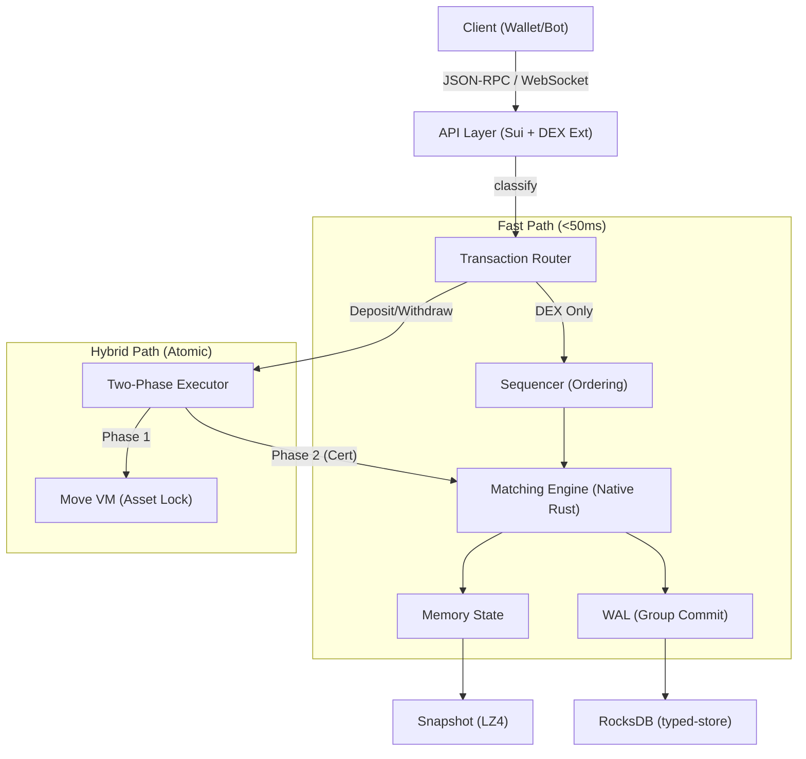

# DEX L1 综合设计总结 / DEX L1 Design Summary

> **状态**: Draft | **版本**: v1.0 | **日期**: 2026-01-04
> **愿景**: 基于 Sui Fork 的原生高性能去中心化交易所，实现 CEX 级交易体验。

---

## 1. 核心目标与性能指标 (01-REQUIREMENTS)

| 指标名称 | 目标值 | 说明 |
|---------|-------|------|
| **端到端延迟 (P99)** | < 50ms | 用户提交订单到获得软确认 |
| **撮合吞吐量 (TPS)** | ≥ 200,000 | 单市场峰值能力 |
| **单次撮合耗时** | < 10μs | 纯撮合算法路径 |
| **软确认延迟** | < 50ms | Sequencer 排序并执行完成 |
| **硬确认延迟** | < 100ms | 2f+1 验证者持久化确认 (RPO=0) |

---

## 2. 整体架构设计 (02-ARCHITECTURE & 03-ABSTRACTION)

DEX L1 采用 **Sequencer-Validator** 架构，通过原生 Rust 引擎绕过 Move VM 实现极致性能。

### 2.1 交易路径分类
- **DEX Fast Path (< 50ms)**: 纯交易指令（下单/撤单）。由 Sequencer 排序，原生引擎执行，不经过 Move VM。
- **Move Standard Path (~600ms)**: 标准 Sui 交易。走 Mysticeti 共识和 Move VM。
- **Hybrid Path (存取款)**: 涉及链上资产与 DEX 余额转换。采用 **同步回调两阶段执行** 模型。

### 2.2 核心 ADR (架构决策)
- **ADR-001**: 选择中心化 Sequencer + 异步 2f+1 验证，平衡性能与去中心化。
- **ADR-002**: 使用原生 Rust 引擎而非 Move VM，达成 < 10μs 撮合延迟。
- **ADR-006**: 明确 **Soft Confirmation** (Sequencer 确认，低延迟) 与 **Hard Confirmation** (2f+1 fsync 确认，高安全) 语义。

---

## 3. 核心基础设施 (04, 05, 06)

### 3.1 Sequencer (排序器)
- **高可用**: 复用 Sui 选举逻辑，50ms 心跳监测，< 100ms 快速故障切换。
- **确定性**: 序列号结构为 `[Epoch:16][Counter:48]`，保证全局唯一且单调。
- **聚合**: 支持基于时间(5ms)或大小(1000 tx)的批次聚合。

### 3.2 Matching Engine (撮合引擎)
- **算法**: 价格-时间优先 (Price-Time Priority)。
- **优化**: 
  - **无锁设计**: 使用 `DashMap` 实现市场间并行与账户余额分片锁。
  - **内存布局**: 64 字节对齐订单结构，缓存友好。
  - **高性能计算**: 使用 SIMD (AVX2) 加速价格比较。

### 3.3 Storage (存储层)
- **分层架构**: 
  1. `StateCache` (内存/DashMap): < 1μs 读写。
  2. `WAL` (磁盘/顺序): < 10ms 持久化，支持 Group Commit。
  3. `Snapshot` (LZ4 压缩): 定期创建，支持 < 5min 快速恢复 (RTO)。
  4. `typed-store` (RocksDB): 复用 Sui 的持久化 KV 存储。

---

## 4. Move 集成与原子性安全 (07-MOVE-INTEGRATION)

### 4.1 Precompile 机制
拦截特定包地址 (`0xDEX`) 的调用，将请求路由至原生执行路径。

### 4.2 两阶段执行模型 (Two-Phase Execution)
解决 **Commit Timing** 风险，确保 DEX 与链上状态一致：
1. **Signing Phase**: 计算效果，创建取款锁，**禁止修改余额**。
2. **Certificate Execution**: 验证 2f+1 证书后，正式 **Commit** 状态变更。

### 4.3 形式化安全
- **不变量**: `托管账户余额 == Σ(用户DEX余额) + Σ(Pending存入)`。
- **锁机制**: 带有 30s TTL 的原子锁，防止并发冲突与死锁。

---

## 5. 业务逻辑设计 (08-SPOT & 09-PERPETUAL)

### 5.1 现货交易 (Spot)
- **订单类型**: Limit, Market, IOC, FOK, PostOnly。
- **结算**: T+0 即时结算，成交即更新余额。
- **费率**: Maker-Taker 阶梯模型，支持 VIP 等级。

### 5.2 永续合约 (Perpetual - Phase 2)
- **价格锚定**: 采用资金费率 (Funding Rate) 机制锚定现货指数。
- **风控**: 
  - **维持保证金**: 保证金率不足即触发清算。
  - **保险基金**: 覆盖穿仓损失。
  - **ADL (自动减仓)**: 保险基金枯竭时按盈利排名强制减仓。

---

## 6. 性能优化与安全不变量 (10-PERFORMANCE)

### 6.1 优化矩阵
| 领域 | 技术手段 | 预期效果 |
|-----|---------|---------|
| **计算** | CPU 亲和性 (Core Affinity)、对象池 | 减少上下文切换与 GC 开销 |
| **内存** | Arena 分配器、零拷贝反序列化 | 降低内存分配延迟 |
| **网络** | TCP_NODELAY、QuickACK、anemo P2P | 减少网络震荡与延迟 |

### 6.2 安全防护
- **Slashing**: 对 Sequencer 双重签名、恶意审查、制造序列号间隙进行惩罚。
- **DoS 防护**: 单 IP/单账户多层限流，无效签名直接丢弃。
- **余额证明**: 支持 Merkle 状态树证明，确保账本不可篡改。

---

## 7. 架构关系图

---
*文档版本: v1.0 | 综合总结 dex_l1 下所有设计项目*

